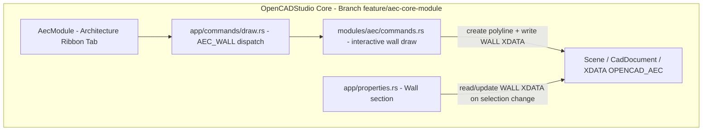

# Requirements

### Overview & Goals
Open CAD Studio soll um AEC-/Architektur-Funktionalität (Building Information Modeling auf Basis-Niveau) erweitert werden: parametrische Wände & Räume, Geschoss-/Etagenverwaltung, Raumbuch/Mengenermittlung und IFC-Export. Nach anfänglicher Umsetzung als externes Plugin wurde die Architekturentscheidung **bewusst revidiert**: Die Funktionalität lebt jetzt als **Core-Modul** (`src/modules/aec/`) direkt im Host, im separaten Branch `feature/aec-core-module`. Grund: voller Zugriff auf `Document`/`Scene`, eigene UI-Dialoge (Storey-Manager) und Material-/Rendering-APIs sind nur im Core möglich (siehe Realisierbarkeitsprüfung in der Session-Historie) — das rechtfertigt den bewussten Verstoß gegen die ursprüngliche "no built-in plugins"-Guideline für dieses Feature.

Dieser Plan-Zyklus wurde **neu priorisiert**: Die größeren AEC-Konzepte (Projektverwaltung, Stile, hybride Objekte, maßstabsabhängige Darstellung) sind noch nicht ausreichend spezifiziert und werden vom Nutzer erst in einer späteren Session vertieft/erläutert. Als nächster, unmittelbar umsetzbarer Schritt wird daher **nur** der interaktive Wand-Zeichen-/Bearbeitungsworkflow angegangen — analog zur bestehenden `LINE`/`PLINE`-Erstellung, jedoch mit der wandspezifischen Zusatzeigenschaft **Höhe** (und Dicke). Persistente Geschoss-Verwaltung sowie Fenster/Türen als neue Bauteiltypen werden zurückgestellt und zu einem späteren Zeitpunkt neu spezifiziert, sobald das übergeordnete Konzept (Projekt/Geschosse/Stile/hybride Darstellung) geklärt ist.

### Scope
**In Scope** (nächster Schritt, Branch `feature/aec-core-module`):
- **Interaktives Wand-Zeichnen**: `AEC_WALL` wird von fester Demo-Geometrie auf echtes Mehrpunkt-Klickzeichnen umgestellt, analog zur bestehenden `LINE`/`PLINE`-Interaktion in `src/app/commands/draw.rs`.
- **Höhen-/Dicken-Eingabe beim Zeichnen**: Da eine Wand (anders als eine reine Linie) zwingend eine Höhe benötigt, wird beim Zeichnen zusätzlich Höhe (und Dicke) über die Kommandozeile abgefragt (mit sinnvollen Defaults, z. B. 0.2/2.8).
- **Nachträgliches Bearbeiten bestehender Wände**: Grip-Editing der Wandgeometrie wie bei Polylinien, sowie Höhe/Dicke/Material nachträglich über das bestehende Properties-Panel (`src/app/properties.rs`, `ui::PropertiesPanel`) änderbar — analog zu anderen Entity-Eigenschaften.
- Kleinere Anpassung der `WALL`-XDATA-Schreib-/Leselogik in `src/modules/aec/commands.rs`, damit sie sowohl beim interaktiven Erzeugen als auch beim nachträglichen Ändern korrekt aktualisiert wird.

**Zurückgestellt** (werden erst nach weiterer Konzept-Klärung durch den Nutzer neu spezifiziert):
- Persistente Geschoss-Verwaltung (weiterhin `static Mutex<Vec<Storey>>`, kein Storey-Manager-Dialog in diesem Schritt).
- Fenster/Türen als neue Bauteiltypen.
- Projektverwaltung (mehrere Zeichnungen/Dateien als ein Projekt), Stil-basierte Erzeugung/Rendering, maßstabsabhängige Darstellung, hybride Mehrfachdarstellung (3D + separate 2D-Grundriss-/Schnitt-/Ansichtsrepräsentation), Kontrollflächen/Bezugsflächen — diese Konzepte sind fachlich noch nicht ausreichend spezifiziert; der Nutzer wird sie in einer Folgesession erläutern, bevor sie geplant werden.

**Out of Scope** (unverändert, siehe frühere Realisierbarkeitsprüfung in der Session-Historie):
- Echte Multi-Dokument-Projektverwaltung — der Host kennt aktuell nur "das aktive Dokument" pro Tab.
- Geometrischer (Boolean-)Durchbruch in der 3D-Wandgeometrie; vollständiger IFC-Parser/Import; BIM-Kollisionserkennung, 4D/5D-Terminplanung, Energieanalyse.

### User Stories
- Als Architekt möchte ich Wände interaktiv per Klick zeichnen (statt Demo-Geometrie), so wie ich es von `LINE`/`PLINE` gewohnt bin, damit ich reale Grundrisse modellieren kann.
- Als Architekt möchte ich beim Zeichnen einer Wand direkt Höhe (und Dicke) angeben können, weil eine Wand — anders als eine reine Linie — diese Eigenschaften zwingend braucht.
- Als Nutzer möchte ich eine bereits gezeichnete Wand nachträglich per Grip verschieben/verlängern und Höhe/Dicke im Properties-Panel ändern können, damit ich Entwürfe iterativ anpassen kann.
- Als Nutzer möchte ich weiterhin ein Raumbuch als Tabelle und mein Modell als IFC-Datei exportieren können (bestehende Funktionalität bleibt unverändert erhalten).

### Functional Requirements
- `AEC_WALL` startet einen interaktiven Mehrpunkt-Zeichenmodus (Klickpunkte wie bei `PLINE`), fragt Höhe/Dicke über die Kommandozeile ab (mit sinnvollen Defaults, z. B. 0.2/2.8) und schreibt pro gezeichnetem Segment eine `WALL`-XDATA an die erzeugte Polylinie.
- Mehrere Wandsegmente können in einem Zug als zusammenhängende Kette gezeichnet werden (wie bei `PLINE`).
- Bestehende Wände können wie andere Polylinien-Entities per Grip editiert werden (Endpunkte verschieben); die Wandgeometrie (`WALL`-XDATA) bleibt dabei an der Entity erhalten.
- Höhe, Dicke und Material einer selektierten Wand können nachträglich über das bestehende Properties-Panel geändert werden; Änderungen werden in die `WALL`-XDATA zurückgeschrieben.
- `AEC_ROOM`, `AEC_ROOMSCHEDULE`, `AEC_IFCEXPORT` bleiben in diesem Schritt unverändert (weiterhin mit In-Memory-Storey `0` als Default, keine Anpassung der Geschoss-Logik).
- Alle AEC-Daten bleiben DWG/DXF-rundtrip-fähig (XDATA bleibt beim Speichern/Öffnen erhalten).

### Non-Functional Requirements
- Core-Modul folgt weiterhin dem bestehenden `CadModule`-/Command-Dispatch-Muster (`src/modules/aec/`, `src/app/commands/draw.rs`).
- Die Properties-Panel-Erweiterung für Wände folgt dem bestehenden Muster in `src/app/properties.rs` (Sections/Felder je Entity-Typ) und darf die Darstellung anderer Entity-Typen nicht beeinflussen.
- Änderungen bleiben auf den Branch `feature/aec-core-module` beschränkt, bis der Nutzer einen Merge nach `main` beauftragt.
- Persistente Geschoss-Verwaltung, Fenster/Türen und die größeren AEC-Konzepte (Projekt, Stile, hybride Objekte, Maßstab) werden explizit nicht in diesem Schritt spezifiziert — sie folgen erst nach weiterer Klärung durch den Nutzer.

# Technical Design

### Current Implementation
- Das AEC-Feature ist bereits als **Core-Modul** implementiert (Branch `feature/aec-core-module`, committet als `33aa92fc`): `src/modules/aec/mod.rs` (`AecModule`, Ribbon-Tab "Architecture", Gruppen Walls/Rooms/Storeys/IFC), `src/modules/aec/engine/{wall,room,storey,geometry,loop_detection,ifc}.rs` (portierte, reine Domain-Logik inkl. Shoelace-Geometrie und graph-/DFS-basierter Wandschleifen-Erkennung), `src/modules/aec/commands.rs` (direkte, sofort ausgeführte Kommando-Implementierungen ohne `HostApi`-Umweg).
- `AEC_WALL`/`AEC_ROOM` erzeugen aktuell noch **Demo-Geometrie** (feste Punkte) statt interaktivem Klick-Zeichnen; `AEC_STOREY` hält Geschosse nur in einem `static Mutex<Vec<Storey>>` (In-Memory, nicht persistent); `AEC_ROOMSCHEDULE` baut bereits eine echte `acadrust::entities::Table`; `AEC_IFCEXPORT` meldet nur die Byte-Länge der erzeugten IFC4-SPF-Ausgabe (kein Datei-Dialog).
- Kommandos sind zentral in `src/app/commands/draw.rs` als neue `match`-Arme (`"AEC_WALL" | "AEC_ROOM" | ... =>`) verdrahtet, analog zu bestehenden Einträgen wie `"ERASE"`, mit direktem Zugriff auf `self.tabs[i].scene`/`self.command_line`/`self.tabs[i].dirty`.
- Bestehende Muster für **interaktive Mehrpunkt-Kommandos** (Vorbild für den neuen Wand-Zeichenworkflow) und für **Manager-Dialoge** (`LAYOUTMANAGER`, `src/ui/window/layout_manager.rs`) existieren bereits im Host und sind das Vorbild für den geplanten Storey-Manager.
- XDATA-Schema bleibt unter APPID `OPENCAD_AEC` (dokumentiert, gekürzt auf Verweis, in `docs/aec-plugin.md`); ausführliche Schema-Referenz liegt im (mittlerweile vom Core-Umbau unabhängigen) externen Repo `~/Dokumente/opencad-aec-plugin/AEC-XDATA-SCHEMA.md`.
- Das externe Plugin-Repo (`~/Dokumente/opencad-aec-plugin`) sowie `crates/ocs_plugin_api`, `docs/plugin-template*`, `plugins/registry.json` existieren weiterhin unverändert, werden aber vom Core-Modul nicht mehr genutzt (bewusst noch nicht bereinigt/entfernt — separater Folgeschritt).

### Key Decisions
- **Core-Modul statt externem Plugin** (unverändert, aus vorherigem Zyklus bestätigt): ermöglicht vollen `Document`/`Scene`-Zugriff und eigene UI-Interaktion — Preis: Verstoß gegen die ursprüngliche "no built-in plugins"-Leitlinie, AEC-Code wird Teil des Host-Bundles (auch WASM/Web).
- **Interaktives Zeichnen nach bestehendem Host-Muster** (Fokus dieses Schritts): `AEC_WALL` nutzt denselben Mehrpunkt-Interaktionsmechanismus wie vorhandene Zeichenkommandos (`LINE`/`PLINE`), keine neue UI-Interaktionsschicht nötig.
- **Höhe/Dicke als Kommandozeilen-Prompt statt eigener Dialog**: Da eine Wand zwingend eine Höhe braucht, wird sie beim Zeichnen wie ein zusätzlicher `PLINE`-Parameter abgefragt (Textprompt mit Default), statt daf��r ein neues UI-Fenster zu bauen — minimaler Aufwand, konsistent mit bestehenden Kommandozeilen-Prompts im Host.
- **Bearbeitung über bestehendes Properties-Panel statt neuer AEC-spezifischer UI**: Höhe/Dicke/Material einer Wand werden wie andere Entity-Eigenschaften über `src/app/properties.rs` editierbar gemacht, statt ein eigenes AEC-Bearbeitungsfenster zu entwickeln — nutzt bestehende, etablierte Infrastruktur.
- **Größere AEC-Konzepte bewusst zurückgestellt**: Persistente Geschoss-Verwaltung, Fenster/Türen sowie Projekt/Stil/hybride-Objekte/Maßstab-Konzepte werden in diesem Zyklus nicht weiter spezifiziert, da sie laut Nutzer noch genauer erläutert werden müssen — vermeidet Design-Entscheidungen auf Basis unvollständiger Anforderungen.

### Proposed Changes
1. **Interaktiver Wand-Zeichenworkflow**: `AEC_WALL` in `src/modules/aec/commands.rs` auf einen Mehrpunkt-Interaktionsmodus umstellen (Klickpunkte sammeln wie bei `PLINE`, Kommandozeilen-Prompt für Höhe/Dicke mit Defaults 0.2/2.8), pro gezeichnetem Segment eine `WALL`-XDATA an die erzeugte Polylinie schreiben.
2. **Grip-Editing für Wände**: sicherstellen, dass die von `AEC_WALL` erzeugte Polylinien-Entity dieselben Grip-Bearbeitungsmechanismen nutzt wie reguläre Polylinien (keine AEC-spezifische Sonderbehandlung nötig, da die Wand eine normale `LwPolyline`-Entity mit zusätzlicher XDATA ist).
3. **Wand-Properties im Properties-Panel**: `src/app/properties.rs` um eine Section für `WALL`-getaggte Entities erweitern (Höhe/Dicke/Material als editierbare Felder), die beim Ändern die `WALL`-XDATA zurückschreibt.
4. Kleinere Anpassung der XDATA-Lese-/Schreiblogik in `commands.rs`, damit sie sowohl beim Erzeugen (neuer Record) als auch beim Properties-Panel-Edit (Update bestehender Record) konsistent funktioniert.

### Data Models / Contracts
```rust
// src/modules/aec/engine — unverändert in diesem Schritt
pub struct Wall { pub thickness: f64, pub height: f64, pub material_ref: Option<String>, pub storey_id: u32 }

// XDATA APPID "OPENCAD_AEC", kind tag "WALL" — Feldreihenfolge bleibt wie in docs/aec-plugin.md dokumentiert
```
```rust
// src/app/commands/draw.rs — dispatch matches command prefix "AEC_"
match cmd.as_str() {
    "AEC_WALL" => aec::commands::start_wall_draw(self, i), // now interactive, multi-point + height/thickness prompt
    "AEC_ROOM" => aec::commands::detect_or_create_room(self, i),      // unchanged
    "AEC_STOREY" => aec::commands::add_storey(self, i),               // unchanged (in-memory)
    "AEC_ROOMSCHEDULE" => aec::commands::build_room_schedule(self, i),// unchanged
    "AEC_IFCEXPORT" => aec::commands::export_ifc(self, i),            // unchanged
    ...
}
```
```rust
// src/app/properties.rs — new section for WALL-tagged entities, mirrors
// existing per-entity-type sections (e.g. line/polyline properties)
fn wall_properties_section(wall: &Wall) -> PropertySection {
    // Height, Thickness, Material fields; on edit, write back into the
    // entity's OPENCAD_AEC/WALL XDATA record.
}
```

### Components
- `src/modules/aec/commands.rs` (bestehend, wird angepasst): `AEC_WALL`-Handler von Demo-Geometrie auf interaktives Mehrpunkt-Zeichnen mit Höhe/Dicke-Prompt umgestellt; Lese-/Schreibhilfsfunktionen für `WALL`-XDATA werden auch vom Properties-Panel wiederverwendet.
- `src/app/properties.rs` (bestehend, wird erweitert): neue Section/Felder für `WALL`-getaggte Entities (Höhe/Dicke/Material editierbar).
- `AecModule`, `src/modules/aec/engine/*` (bestehend, unverändert in diesem Schritt): Ribbon-Struktur und Domain-Modelle (`Room`, `Storey`, Geometrie, IFC) bleiben wie zuletzt implementiert.
- Externes Repo `~/Dokumente/opencad-aec-plugin` und `plugins/registry.json`-Eintrag: weiterhin unangetastet, kein Bezug zu diesem Schritt.

### File Structure
```
OpenCADStudio/src/modules/aec/
├── mod.rs           (unverändert)
├── commands.rs       (geändert — AEC_WALL interaktiv + Höhe/Dicke-Prompt, XDATA-Update-Helper)
└── engine/           (unverändert in diesem Schritt)

OpenCADStudio/src/app/
└── properties.rs     (geändert — neue Section für WALL-Entities)
```

### Architecture Diagram


### Risks
- **Interaktionsmodell-Komplexität**: Ein Mehrpunkt-Zeichenmodus mit zusätzlichem Höhe/Dicke-Prompt muss sauber in den bestehenden `CadCommand`-Interaktionsmechanismus (Klickpunkte + Kommandozeilen-Eingabe kombiniert) eingepasst werden — Vorbild `PLINE` hat aber keinen zusätzlichen numerischen Prompt zwischen den Klicks, das ist neu für dieses Kommando.
- **Properties-Panel-Erweiterung nur für getaggte Entities**: Die neue Wand-Section darf nur erscheinen, wenn die selektierte Entity tatsächlich eine `OPENCAD_AEC`/`WALL`-XDATA trägt — sonst Gefahr, dass reguläre Polylinien fälschlich als Wände angeboten werden.
- **Größere Konzepte bewusst offen**: Da Geschosse weiterhin In-Memory bleiben, hat `storey_id` in neu gezeichneten Wänden vorerst keine dauerhafte Bedeutung — das ist eine bekannte, akzeptierte Einschränkung bis zur späteren Geschoss-Spezifikation.

# Delivery Steps

### ✓ Step 1: Interaktives Mehrpunkt-Zeichnen für Wände implementieren
`AEC_WALL` erzeugt Wände durch echtes Klick-Zeichnen statt fester Demo-Geometrie, analog zu `PLINE`.
- Mehrpunkt-Interaktionsmodus für `AEC_WALL` in `src/modules/aec/commands.rs` ergänzen, angelehnt an das bestehende Muster für `LINE`/`PLINE` in `src/app/commands/draw.rs`.
- Nach Abschluss der Punktkette wird die entstandene Polylinien-Entity erzeugt und im Dokument abgelegt (analog zur bisherigen Demo-Wand-Erzeugung, jetzt mit den tatsächlich geklickten Punkten).
- Mehrere Segmente können in einem Zug wie eine Polylinie gezeichnet werden.

### ✓ Step 2: Höhen-/Dicken-Eingabe in den Zeichenworkflow integrieren
Beim Zeichnen einer Wand werden Höhe und Dicke abgefragt und in der `WALL`-XDATA gespeichert.
- Kommandozeilen-Prompt für Höhe/Dicke mit sinnvollen Defaults (0.2/2.8) nach Abschluss der Punktkette ergänzen.
- `WALL`-XDATA-Record mit den erfassten Werten (statt fester Demo-Werte) an die erzeugte Polylinie schreiben.
- Bestehende `AEC_ROOM`-Wandschleifen-Erkennung gegen die neu interaktiv gezeichneten Wände verifizieren (unverändert, nur zur Absicherung).

### ✓ Step 3: Wand-Bearbeitung im Properties-Panel ergänzen
Eine selektierte Wand zeigt Höhe/Dicke/Material im Properties-Panel an und lässt sie ändern.
- `src/app/properties.rs` um eine neue Section für Entities mit `OPENCAD_AEC`/`WALL`-XDATA erweitern (Höhe, Dicke, Material als editierbare Felder), nach dem bestehenden Muster für andere Entity-Typ-Sections.
- Beim Ändern eines Feldes wird die `WALL`-XDATA der selektierten Entity aktualisiert (gemeinsame Schreiblogik mit dem Zeichenworkflow aus Step 2 wiederverwenden).
- Sicherstellen, dass die Section nur für tatsächlich `WALL`-getaggte Entities erscheint, nicht für reguläre Polylinien.
- Grip-Editing der Wandgeometrie (Endpunkte verschieben) manuell verifizieren, da die Wand eine reguläre `LwPolyline`-Entity ist und die bestehende Grip-Infrastruktur ohne Zusatzcode greifen sollte.