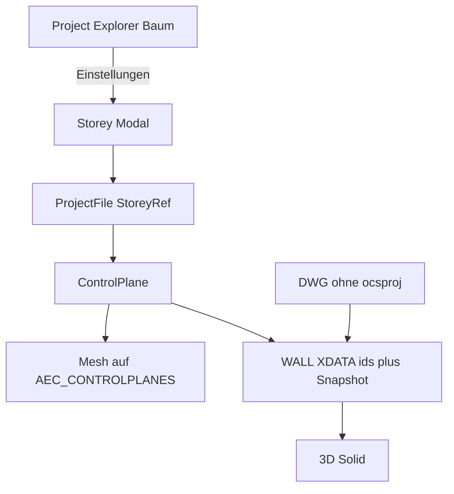

# Requirements

### Overview & Goals
Projektverwaltung so umbauen, dass Geschosse nicht mehr inline in der Liste editiert werden, und **Kontrollflächen** (freie 3D-Ebenen) pro Geschoss einführen. Wände binden Fuß und Kopf an Ebenen plus Offset. Ohne `.ocsproj` bleiben Höhe und Lage über einen **Snapshot in der DWG** korrekt. Preview-Meshes liegen auf Hilfslayer `AEC_CONTROLPLANES`. Schnitte/Ansichten sind **nicht** Teil dieses Schritts, das Ebenen-Modell bleibt dafür offen.

### Scope
#### In Scope
- `ControlPlane` im `.ocsproj` (id, Name, Ursprung, Normale, optionales Face-Handle).
- Pro Geschoss **Pflicht** Boden- und Deckenfläche; beliebig viele weitere Ebenen.
- `StoreyRef.elevation` / `height` abgeleitet aus Boden/Decke (Schnitt bzw. Z am Ursprung der horizontalen Default-Lage).
- Explorer: Baum ohne Inline-Formular; **Storey-Modal** für Felder + Ebenenliste.
- Wand: `base_plane_id` / `top_plane_id` + Offsets; gebackene Ebenengleichung in WALL-XDATA.
- Preview-Mesh (leicht transparent) in der Geschoss-Zeichnung, Layer `AEC_CONTROLPLANES`, Toggle per Explorer und Kommando.
- Aktive Zeichnung ↔ Geschoss; Defaults für neue Wände = Boden/Decke des aktiven Geschosses.

#### Out of Scope
- Schnitt- und Ansichts-Viewports (späterer Consumer derselben Ebenen).
- Picking einer Face in der Zeichnung als Ebenen-Definition (API-Feld `face_handle` vorbereiten, UI-Pick spaeter).
- Geneigte Wand-Extrusion abweichend von Welt-Z (erster Wurf: Achse vertikal, Schnitt mit beliebig geneigten Ebenen).

### GUI-Skizze
Explorer (Dock):
```
[ New | Open | Save | Save As | Migrate ]   pfad.ocsproj
Gebaeude-A          [+] [-]
  EG   drawing.dxf          [Zeichnung] [Einstellungen…]
  OG                        [Zeichnung] [Einstellungen…]
[ + Gebaeude ]  [Name ____]
```

Storey-Modal:
```
Geschoss: [Name        ]   Zeichnung: [pfad] [Browse]
Rolle:    Boden = [EG_OKFF v]   Decke = [EG_UKRD v]
(elevation/height read-only, abgeleitet)

Kontrollflaechen
  * EG_OKFF   origin …  n …   [Boden] [Sichtbarkeit] […]
  * EG_UKRD   …                [Decke]
  * Attika    …
  [ + Ebene ]  Name / Ursprung / Normale (Defaults: Z=elevation, n=(0,0,1))
```

### Functional Requirements
- Neue Geschosse bekommen automatisch zwei horizontale Ebenen (Boden bei `elevation`, Decke bei `elevation+height`); Nutzer kann weitere anlegen, umbenennen, löschen (Boden/Decke nicht löschbar, nur ersetzen).
- Ändert sich eine Ebene, werden Wände mit dieser ID regeneriert und Snapshots neu gebacken.
- DWG ohne Projekt: Extrusion aus Snapshot; IDs werden ignoriert; Höhe numerisch editierbar.
- Kommando z.B. `AEC_CONTROLPLANES` blendet den Hilfslayer bzw. regeneriert Preview-Meshes.

### Non-Functional Requirements
- Alte `.ocsproj` ohne `control_planes`: Migration beim Laden — zwei Default-Ebenen aus `elevation`/`height`.
- Alte WALL-XDATA ohne Ebenen: weiter `height` + impliziter Fuß Z=0 bzw. Entity-Lage.


# Technical Design

### Current Implementation
- `ProjectFile` / `Building` / `StoreyRef` in `src/modules/aec/engine/project.rs` (JSON `.ocsproj`).
- Explorer + Inline-Formulare: `src/ui/window/aec_project_explorer.rs`, Messages in `src/app.rs`.
- `Wall` hat nur `height` + `storey_id` (`wall.rs`); Persistenz `xdata.rs`; 3D `solid.rs`; Draw `wall_command.rs`.

### Key Decisions
- **Master in `.ocsproj`**, DWG trägt Snapshot + optionales Preview-Mesh (standalone-fähig).
- **Freie 3D-Ebenen** (Ursprung + Einheitsnormale); Wandhöhe = vertikale Achse geschnitten mit Basis-/Kopf-Ebene, plus Offset entlang der Ebenen-Normale.
- **GUI: Baum + Modal**, kein Inline-Editor in der Geschossliste.
- **Boden+Decke Pflicht** je Geschoss; `elevation`/`height` abgeleitet.
- Preview auf Layer **`AEC_CONTROLPLANES`** (Default nicht plotbar).

### Data Models
```rust
struct ControlPlane {
    id: Uuid,
    name: String,
    origin: [f64; 3],
    normal: [f64; 3], // unit
    face_handle: Option<u64>, // spaeter: Bindung an DWG-Face
    preview_handle: Option<u64>,
    visible: bool,
}
struct StoreyRef {
    /* bestehend */
    control_planes: Vec<ControlPlane>,
    floor_plane_id: Uuid,
    ceiling_plane_id: Uuid,
}
struct Wall {
    /* bestehend height bleibt Cache */
    base_plane_id: Option<Uuid>,
    top_plane_id: Option<Uuid>,
    base_offset: f64,
    top_offset: f64,
    base_origin: [f64; 3],
    base_normal: [f64; 3],
    top_origin: [f64; 3],
    top_normal: [f64; 3],
}
```
Resolver: Punkt auf Wandachse (Startpunkt XY, Z frei) ∩ Ebene → Basis-/Kopfpunkte; `height = (top - base) · (0,0,1)` für vertikale Extrusion. Parallelität/kein Schnitt → Snapshot beibehalten, Warnung.

### Architecture Diagram


### File Structure
- Neu: `src/modules/aec/engine/control_plane.rs` (Geometrie, Schnitt, Defaults).
- Ändern: `project.rs`, `wall.rs`, `xdata.rs`, `solid.rs`, `wall_command.rs`, `commands.rs`, `aec_project_explorer.rs`, `app.rs` (Modal-State/Messages), `locales/en/main.ftl`.
- Optional neu: `src/ui/window/aec_storey_settings.rs` für das Modal.

### Risks
- Geneigte Ebenen + vertikale Extrusion: Höhe variiert entlang der Wand — erster Wurf nimmt Schnitt am **Startpunkt** der Achse (konstantes `height`); dokumentieren. Spaeter Sweep zwischen zwei Schnittlinien.
- Gelöschte Ebene: Wand fällt auf Snapshot zurück, IDs clearen oder dangling ignorieren.


# Testing

### Validation Approach
Unit-Tests an `control_plane` (Schnitt, Defaults, Migration) und XDATA Roundtrip; Explorer/Modal nicht automatisiert UI-klicken.

### Key Scenarios
- Laden alter Projekte erzeugt Boden/Decke aus elevation/height.
- Wand mit zwei horizontalen Ebenen: height = Abstand + Offsets.
- XDATA ohne Projekt: Snapshot-Felder reichen für `Wall::height`.
- Parallel zur Achse: Resolver Fehler, height unverändert.

### Test Changes
- Tests in `control_plane.rs` und Erweiterung `xdata`/`project` serde tests.


# Delivery Steps

### ✓ Step 1: ControlPlane-Modell und Projekt-Migration
`StoreyRef` trägt Kontrollflächen plus Pflicht Boden/Decke; alte `.ocsproj` werden beim Laden migriert.

- Neue Datei `src/modules/aec/engine/control_plane.rs`: `ControlPlane`, Schnitt Gerade/Ebene, Default-Boden/Decke aus elevation/height.
- `project.rs`: Felder `control_planes`, `floor_plane_id`, `ceiling_plane_id`; `elevation`/`height` als abgeleitete Helpers; serde mit Defaults.
- Unit-Tests Migration und Schnitt.

### ✓ Step 2: Explorer-Baum und Storey-Modal
Kein Inline-Formular mehr in der Geschossliste; Einstellungen öffnen ein Modal.

- `aec_project_explorer.rs`: Baum auf Name/Zeichnung/Aktionen reduzieren.
- Neues `aec_storey_settings.rs` (oder gleichwertig): Name, Zeichnungspfad, Boden/Decke-Dropdown, Ebenenliste (anlegen, umbenennen, Ursprung/Normale, Sichtbarkeit).
- `app.rs`: Modal-State und Messages; Zeichnungs-Zuordnung unverändert über Open-Drawing.

### ✓ Step 3: Preview-Meshes und Hilfslayer
Kontrollflächen erscheinen als transparente Meshes auf `AEC_CONTROLPLANES`.

- Layer anlegen (nicht plotbar); Preview-Rechtecke aus Ursprung/Normale, Handles in `ControlPlane.preview_handle`.
- Kommando `AEC_CONTROLPLANES` plus Explorer-Sichtbarkeit regenerieren/togglen.
- `commands.rs` Registry.

### ✓ Step 4: Wand Fuß/Kopf an Ebenen plus DWG-Snapshot
Neue Wände defaulten auf Boden/Decke; Höhe folgt Ebenen, DWG bleibt standalone.

- `Wall` + `xdata.rs`: plane-ids, Offsets, gebackene origin/normal; alte Records ohne Felder kompatibel.
- `wall_command.rs` / `solid.rs`: Höhe aus Resolver wenn Projekt da, sonst Snapshot.
- Bei Ebenen-Änderung Wände mit passender ID regenerieren.
- Tests Roundtrip und Fallback ohne Projekt.