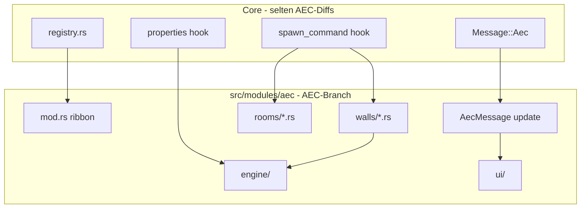

# Requirements

### Overview & Goals
AEC wird auf einem eigenen Branch entwickelt und periodisch mit `main` gemerged. Ziel ist, **Merge-Konflikte zu minimieren**: AEC-Logik soll nicht in Core-Dateien (`src/app/*.rs`, `src/command.rs`, `src/ui/window/*` ohne AEC-Prefix) weiterwachsen. Zweitens soll die **Dateiaufteilung** im AEC-Modul dem Core-Muster folgen (eine Datei pro Tool/Funktion wie `src/modules/draw/`).

Rust-Mittel: **`mod` / Untermodule**, nicht `include!` (das ist C-Stil, bricht rustfmt/IDE und hilft Merges nicht). Eine dünne Core-Grenze (ein `Message`-Arm, ein Registry-Eintrag) bleibt nötig, weil CadCommand, iced und das Dokument im Hauptcrate leben.

### Scope
#### In Scope
- AEC-Code aus großen Core-Dateien (`app/mod.rs`, `app/properties.rs`, `app/command_driver.rs`, `app/commands/draw.rs`, `app/update/*`, `app/view/modal.rs`, `src/command.rs`-Dispatch) nach `src/modules/aec/` ziehen.
- Eine iced-`Message::Aec(AecMessage)`-Fassade statt vieler AEC-Varianten im Core-Enum.
- AEC-UI-Fenster (`src/ui/window/aec_*.rs`) nach `src/modules/aec/ui/`.
- `commands.rs` (sehr große Sammeldatei) aufspalten analog Draw: Gruppe → Unterordner, Tool → Datei mit `tool()` + `CadCommand`.
- `engine/` als Domain-Kernel belassen, intern klarer nach wall/room/ifc gruppieren wo es Merges hilft.

#### Out of Scope
- Eigenes Workspace-Crate / Plugin-Host (würde `ocs_plugin_api` und CadCommand-Grenze sprengen; später möglich).
- Cargo-Feature zum Abschalten von AEC.
- Fachliche AEC-Features (neue Walls/IFC-Logik).
- `include!`-Makros.

### Functional Requirements
- Verhalten von AEC-Befehlen, Ribbon, Properties und Fenstern bleibt gleich.
- Core-Dateien enthalten nach der Umstellung nur noch **stabile Einzeiler-Hooks** (kein AEC-Fachcode).
- Neue AEC-Arbeit passiert fast nur unter `src/modules/aec/**`, sodass `main`-Änderungen an `app/mod.rs` / `properties.rs` selten kollidieren.

# Technical Design

### Current Implementation
- Ribbon: `src/modules/aec/mod.rs` (`CadModule`), Registry `src/modules/registry.rs`.
- Domain: `src/modules/aec/engine/*` (bereits viele Dateien).
- Interaktion: **eine** Datei `src/modules/aec/commands.rs` (tausende Zeilen) plus **starke Kopplung** in Core:
  - `src/app/mod.rs`, `properties.rs`, `command_driver.rs`, `commands/draw.rs`
  - `src/app/update/{mod,command,file}.rs`, `view/modal.rs`, `view/overlay.rs`
  - `src/ui/window/aec_*.rs`
- Core-Muster (Vorbild): `src/modules/draw/` — Gruppen (`draw/`, `modify/`, …), **eine Datei pro Tool** mit `pub fn tool() -> ToolDef` und `impl CadCommand`; Ribbon in `draw/mod.rs` ruft `line::tool()` auf. Commands registrieren Namen via `inventory::submit!(CommandRegistration)` in `src/command.rs` — **kein** zentrales Namensverzeichnis nötig.

### Key Decisions
1. **Kein separates Crate in diesem Schritt.** AEC bleibt `src/modules/aec` im Hauptcrate, weil `CadCommand`, Document, iced-Messages und Properties dort sitzen. Merge-Isolation kommt von Verzeichnisgrenze + dünnen Hooks, nicht von `include!`.
2. **Ein Core-Message-Arm:** `Message::Aec(AecMessage)` in `src/app/mod.rs`; alle AEC-UI-/Update-Varianten leben in `aec::AecMessage`. Update: ein `match` → `aec::update(...)`.
3. **Command-Spawn in AEC:** `aec::spawn_command(name) -> Option<Box<dyn CadCommand>>`; Core-Dispatch hat eine Zeile. Autocomplete bleibt `inventory` in den Tool-Dateien.
4. **Properties/Document-Hooks als Funktionen im AEC-Modul** (`aec::properties::...`, `aec::on_document_loaded`), Core ruft nur auf wenn Selection/XDATA AEC ist — keine Wall-Style-Logik in `properties.rs`.
5. **Dateistruktur wie Draw**, nicht eine Monster-`commands.rs`.

### Target layout
```
src/modules/aec/
  mod.rs              # CadModule, ribbon_groups wie DrawModule
  spawn.rs            # spawn_command / one-shot dispatch
  message.rs          # AecMessage + aec::update
  walls/
    mod.rs, wall.rs, refresh.rs, join.rs, extend.rs, window.rs, door.rs
  rooms/
    mod.rs, room.rs, schedule.rs
  styles/
    mod.rs, material_manager.rs, wall_style_manager.rs, plan_manager.rs
  project/
    mod.rs, explorer.rs, control_planes.rs, storeys.rs
  ifc/
    mod.rs, export.rs
  engine/             # bestehender Kernel (wall, room, junction, ifc, …)
  ui/                 # ehem. src/ui/window/aec_*.rs
  properties.rs       # Property-Panel-Beiträge für AEC-Entities
```

### Core-Hooks (bewusst klein, selten anfassen)
| Core-Datei | Danach |
|---|---|
| `modules/mod.rs` | `pub mod aec;` |
| `modules/registry.rs` | `Box::new(aec::AecModule)` |
| `app/mod.rs` `Message` | nur `Aec(AecMessage)` |
| Command-Dispatch | `if let Some(c) = aec::spawn_command(name)` |
| `properties.rs` | `aec::properties::extend(...)` wenn AEC-XDATA |
| View/Modal | `aec::ui::view(...)` für AEC-Fenster |

### Architecture Diagram


### Risks
- Erster Move erzeugt **einen** großen Diff in Core; danach sollten Folge-Merges ruhig sein. Hooks müssen generisch bleiben (keine neuen AEC-Felder in `CadApp` — State in `AecState` hinter einem Feld `aec: AecState`).
- `app/mod.rs` ist riesig: Message-Enum und `CadApp`-Felder schrittweise extrahieren, sonst unmergbarer Patch.
- Tests/i18n-Keys: Fluent-Keys können in `locales/` bleiben (Merge-Konfliktquelle); keine Umbenennung in diesem Schritt.

# Delivery Steps

### ✓ Step 1: AEC-Fassade in Core: Message, State, Spawn
Core kennt AEC nur noch über drei stabile Hooks; Fachlogik bleibt unter src/modules/aec.

- `AecMessage` + `aec::update` in `src/modules/aec/message.rs` einführen.
- In `src/app/mod.rs` AEC-spezifische `Message`-Varianten zu `Message::Aec(AecMessage)` zusammenziehen; AEC-Felder von `CadApp` nach `AecState` (`aec: AecState`).
- `spawn_command` in `src/modules/aec/spawn.rs`; Core-Dispatch (`command_driver` / `app/commands`) eine Zeile.
- Keine Verhaltensänderung; kompilierbar halten.

### ✓ Step 2: Commands.rs analog Draw aufspalten
AEC-Befehle liegen in Gruppenordnern, eine Datei pro Tool wie draw/line.rs.

- `commands.rs` zerlegen nach Ribbon-Gruppen: `walls/`, `rooms/`, `styles/`, `project/`, `ifc/`.
- Pro Tool: `tool() -> ToolDef`, `impl CadCommand`, `inventory::submit!`.
- `aec/mod.rs` Ribbon wie `draw/mod.rs` über `wall::tool()` etc. verdrahten.
- Engine-Aufrufe bleiben in den Tool-Dateien; `engine/` unverändert lassen außer nötiger `pub use`.

### * Step 3: AEC-UI und Properties aus Core ziehen
Fenster und Property-Beiträge leben unter modules/aec; Core hat nur Aufrufe.

- `src/ui/window/aec_*.rs` nach `src/modules/aec/ui/` verschieben; Modal/Overlay matchen `AecMessage`.
- AEC-Zweige aus `src/app/properties.rs` nach `aec/properties.rs`.
- Document-Load / Refresh / IFC-Export-Hooks aus `document.rs`, `update/file.rs`, `update/mod.rs` nach AEC-Funktionen.
- Restliche `crate::modules::aec` in Core auf die Hook-API reduzieren, damit Folge-Merges mit main fast nur noch `src/modules/aec/**` berühren.