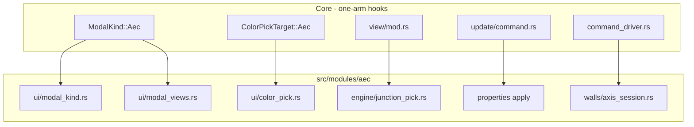

# Requirements

### Overview & Goals
**Core-Split Step 5:** die restlichen AEC-Hooks in Core auf **einen** `ModalKind`-Arm und **einen** `ColorPickTarget`-Arm reduzieren. Neue AEC-Fenster und AEC-Farbfelder ändern Core-Enums nicht mehr.

Step 3 hat Methoden aus `app/update/mod.rs` nach AEC gezogen. Step 4 hat `aec/commands.rs` in `aec/engine/*` zerlegt. Übrig in Core sind UI-/Apply-Reste, keine Domain-Kernel-Datei.

### Scope
#### In Scope
- Nested `ModalKind::Aec(AecModalKind)` — `AecModalKind` lebt in AEC; alle heutigen `ModalKind::Aec*` (inkl. `AecDropWarning`, `AecStylePicker { target }`) werden Varianten davon.
- Nested `ColorPickTarget::Aec(AecColorPickTarget)` — Mapping `target + color → Message::Aec` in AEC.
- Modal-View-Builder und FormState-Packing aus `app/view/modal.rs` nach `aec/ui`.
- Junction-Grip-Override-Farbe in `app/view/mod.rs` → Helfer in `engine/junction_pick.rs`.
- Wand-/Plane-/Phase-/Hatch-Apply aus `app/update/command.rs` → `aec/properties`.
- Ein `aec_on_live_entity_finished` statt der Wall-if-Kette in `command_driver.rs` (single + multi live).

#### Out of Scope
- `DocumentTab`-AEC-Felder nach `AecState` verschieben (Step-3-Entscheidung: Felder + Accessors bleiben).
- Engine-Dateien weiter zerlegen (`wall_regen.rs` etc.).
- Fachfeatures (Öffnungen, dynamische Eingabe, N-Wege-Joins).
- Eigenes Crate, `include!`, Cargo-Feature.
- `Message::Aec` / `aec::update` Dispatch umbauen.

### User Stories
- Als Maintainer will ich ein neues AEC-Modal oder Farbfeld nur unter `src/modules/aec/**` anlegen, ohne `ModalKind` / `ColorPickTarget` in `app/mod.rs` anzufassen.
- Als Entwickler will ich Wand-Property-Apply neben den Property-Sections finden, nicht in Core `update/command.rs`.

### Functional Requirements
- Alle bisherigen AEC-Modals (Manager, Picker, Explorer, Drop-Warning, Copy-Conflict, Project-Required, Display-Profiles als Kind von Wall-Style-Manager) öffnen, schließen und stacken wie heute.
- Farbwahl in Material-/Plan-/Wall-Style-Formularen schreibt dieselben `AecMessage`s.
- Junction-Grips mit Join-Override bleiben gold (`0xDAA520`); andere unverändert.
- Properties-Felder `wall_*`, `control_plane_name` verhalten sich identisch (inkl. Regen + Display-Config).
- Live-Commit einer Wand: Preview-Companions löschen, Regen, Display-Config, last-defaults — Non-Walls unverändert.
- `cargo build` grün; bestehende AEC-Tests kompilieren weiter.

### Non-Functional Requirements
- AEC ≠ Core: keine neuen AEC-Varianten auf Core-Enums.
- `impl OpenCADStudio` in AEC-Dateien bleibt das Muster (kein `AecCtx`).
- Eine Datei pro Thema; `update.rs` bleibt Dispatch-only.

# Technical Design

### Current Implementation
- **Modals:** `ModalKind` in `src/app/mod.rs` hat ~12 `Aec*` Varianten. `app/view/modal.rs` matcht sie mit `sized_flow` + `self.aec_*_view()` (~400 Zeilen Form-Packing). Titel-Match und Drop-Warning-Body liegen ebenfalls dort. Öffnen passiert vor allem in `aec/update.rs`, plus `file.rs` (`AecDropWarning`) und `persist.rs` / `session.rs`.
- **Child modal:** `AecWallStyleDisplayProfiles` — Parent-Geometrie in `AecState`; Restore in `app/update/mod.rs` CloseModal und Sonderfall in `app/view/mod.rs`.
- **Color:** `ColorPickTarget::AecMaterial` … `AecPlanContourHatchColor` (14 Varianten). Mapping in `app/update/style.rs`; Konstruktion in `aec/ui/aec_{material,plan,wall_style}_manager.rs`.
- **Overlay:** `app/view/mod.rs` (~2185 und ~2266) färbt Grips über `read_junction_override` + `join_override_end_key` — Logik doppelt.
- **Properties apply:** `app/update/command.rs` ~2968–3275 (`wall_justification`, Planes, Phase, Höhe/Dicke/Material/Offsets, Hatch-Override).
- **Live finish:** `command_driver.rs` ~4168 und ~4262: `wall_thickness_and_height` → erase companions → regen/display/defaults.

### Key Decisions
1. **Nested kinds, Typ in AEC** — `AecModalKind` / `AecColorPickTarget` unter `aec/ui`, damit neue Fenster/Farben Core-Enums nicht erweitern. Core hält `ModalKind::Aec(...)` und `ColorPickTarget::Aec(...)`.
2. **Weiter `impl OpenCADStudio`** — View-Packing, Property-Apply und Live-Finish als Methoden in AEC-Dateien; Core-Call-Sites Einzeiler.
3. **Child-Modal über `parent_on_close()`** — Core kennt `AecWallStyleDisplayProfiles` nicht namentlich; CloseModal fragt `AecModalKind::parent_on_close()`.
4. **Live-Finish erkennt Wände intern** — Driver importiert kein `wall_thickness_and_height` mehr.

### Proposed Changes
**Nested modal**
- Neu `src/modules/aec/ui/modal_kind.rs`: `AecModalKind` (DropWarning, MaterialManager, WallStyleManager, WallStyleDisplayProfiles, JunctionEditor, ProjectExplorer, StoreySettings, PlanManager, StylePicker { target }, StyleCopyConflict, ProjectRequired) mit `title()`, `size() -> Option<(u16, u16)>`, `parent_on_close()`.
- `ModalKind` in `app/mod.rs`: alle `Aec*` Varianten → `Aec(AecModalKind)`.
- Neu `aec/ui/modal_views.rs` (oder bestehende UI-Dateien): heutige `aec_*_view` / FormState-Builder aus `modal.rs`; `pub fn view_modal(app, kind) -> Element`.
- Core `modal.rs`: ein Arm `ModalKind::Aec(kind) => sized_flow/automatic_flow` über `kind.size()` + `view_modal`. Titel: `kind.title()`.
- Alle `active_modal = Some(ModalKind::AecX)` → `ModalKind::Aec(AecModalKind::X)` (`update.rs`, `file.rs`, `persist.rs`, `session.rs`, CloseModal-Restore).
- Display-Profiles-Sonderfall in `view/mod.rs`: `matches!(active_modal, Some(ModalKind::Aec(k)) if k.parent_on_close() == Some(WallStyleManager))` oder `k == WallStyleDisplayProfiles` über AEC-Helfer, ohne den Variantennamen in Core zu hartcoden wo vermeidbar.

**Nested color**
- Neu `aec/ui/color_pick.rs`: `AecColorPickTarget` + `message_for(target, color) -> Option<Message>` (heutige Arme aus `style.rs`, inkl. Material-Hatch-u32-Pfad).
- `ColorPickTarget` in `app/mod.rs`: 14 `Aec*` Varianten → `Aec(AecColorPickTarget)`.
- `style.rs`: ein Arm `ColorPickTarget::Aec(t) => aec::ui::color_pick::message_for(t, color)`.
- `OpenColorWindow(...)` in den drei AEC-Manager-Dateien auf `ColorPickTarget::Aec(...)`.

**Overlay**
- `engine/junction_pick.rs`: `pub(crate) fn grip_has_join_override(scene, handle, grip_id) -> bool` (Dropdown-Grip → End + `read_junction_override`).
- Beide Overlay-Pfade in `view/mod.rs` rufen nur diesen Helfer auf.

**Property apply**
- `impl OpenCADStudio` in `aec/properties.rs` (oder `properties_apply.rs` falls die Datei zu groß wird): `aec_apply_property_field(&mut self, tab, handle, field, val) -> bool`.
- `update/command.rs`: vor dem generischen Geom-Apply `if self.aec_apply_property_field(...) { /* skip geom */ }` — `true` für bekannte `wall_*` / `control_plane_name`, sonst `false`.

**Live finish**
- `walls/axis_session.rs`: `aec_on_live_entity_finished(&mut self, tab, handle, companions: &[Handle])` — intern Wall-Check, sonst no-op; sonst erase + regen + display-config + `remember_last_wall_defaults`.
- `command_driver.rs` an den zwei Live-Finish-Stellen nur noch dieser Aufruf.

**Docs**
- `src/modules/aec/AGENTS.md`: Core-Enums dürfen nur `ModalKind::Aec` / `ColorPickTarget::Aec` tragen; neue Fenster/Farben nur unter `aec/ui`.

### Data Models / Contracts
```rust
// aec/ui/modal_kind.rs
pub enum AecModalKind {
    DropWarning,
    MaterialManager,
    WallStyleManager,
    WallStyleDisplayProfiles,
    JunctionEditor,
    ProjectExplorer,
    StoreySettings,
    PlanManager,
    StylePicker { target: StylePickerTarget },
    StyleCopyConflict,
    ProjectRequired,
}
impl AecModalKind {
    pub fn title(&self) -> String { /* tr! keys as today */ }
    pub fn size(&self) -> Option<(u16, u16)> { /* None = automatic_flow */ }
    pub fn parent_on_close(&self) -> Option<Self> { /* DisplayProfiles → WallStyleManager */ }
}

// aec/ui/color_pick.rs
pub enum AecColorPickTarget { Material, MaterialHatch, /* … 14 */ }
pub fn message_for(target: AecColorPickTarget, color: acadrust::types::Color) -> Option<Message>;

// Core
enum ModalKind { /* CAD-only */, Aec(AecModalKind) }
enum ColorPickTarget { /* CAD-only */, Aec(AecColorPickTarget) }
```

### Architecture Diagram


### File Structure
**Neu**
- `src/modules/aec/ui/modal_kind.rs`
- `src/modules/aec/ui/modal_views.rs` (Form-Packing + `view_modal`; Drop-Warning-Body hierher)
- `src/modules/aec/ui/color_pick.rs`

**Geändert**
- `src/app/mod.rs` — nested enums
- `src/app/view/modal.rs` — ein AEC-Arm; Builder raus
- `src/app/view/mod.rs` — Overlay-Helfer; Child-Modal-Match
- `src/app/update/style.rs` — ein Color-Arm
- `src/app/update/command.rs` — Apply-Hook
- `src/app/update/mod.rs` — CloseModal über `parent_on_close`
- `src/app/update/file.rs` — `ModalKind::Aec(DropWarning)`
- `src/app/command_driver.rs` — Finish-Hook
- `src/modules/aec/update.rs`, `styles/session.rs`, `project/persist.rs`, `ui/aec_*_manager.rs` — Konstruktion der nested kinds
- `src/modules/aec/ui/mod.rs`, `engine/junction_pick.rs`, `properties.rs`, `walls/axis_session.rs`
- `src/modules/aec/AGENTS.md`

**Unverändert**
- `DocumentTab`-Felder, `engine/{xdata,wall_regen,join_ops,…}.rs` Schnitt, Viewport-Hover/Klick

### Risks
- Exhaustive `ModalKind` / `ColorPickTarget` Matches crate-weit — alle `Aec*` Konstruktionen umstellen, sonst Compile-Fail (gewollt).
- Display-Profiles-Stack: Parent-Offset/Resize darf nicht verloren gehen; `parent_on_close` 1:1 zum heutigen CloseModal.
- Property-Apply muss `true` zurückgeben, sonst fällt `wall_height` in den generischen Geom-Pfad.
- Live-Finish: Non-Walls dürfen keine Regen-Nebenwirkungen bekommen.

### ✓ Step 1: Nested modal kinds and views

- Add `AecModalKind` and move modal view packing out of Core.

### ✓ Step 2: Nested color pick

- Add `AecColorPickTarget` and map colors to `Message::Aec` in AEC.

### ✓ Step 3: Junction grip overlay helper

- Extract join-override grip coloring to `junction_pick`.

### ✓ Step 4: Property apply hook

- Move wall/plane/phase/hatch apply into `aec/properties`.

### ✓ Step 5: Live finish hook

- Replace driver wall-if chains with `aec_on_live_entity_finished`.

### ✓ Step 6: Docs

- Update `aec/AGENTS.md` for nested Core enums.

# Testing

### Validation Approach
- `cargo build --offline` nach jedem Teil-Move (Enums sind crate-weit).
- Bestehende `engine::wall_command_tests` weiter kompilieren; keine neuen UI-Tests (Iced-Modals sind nicht agent-prüfbar).
- Optional kleine Unit-Tests in `color_pick.rs` / `modal_kind.rs` für `parent_on_close` und `message_for` (Material → erwartete `AecMessage`-Variante), wenn ohne Widget-Harness machbar.

### Key Scenarios
- `ModalKind::Aec(_)` rendert; Close auf Display-Profiles stellt Wall-Style-Manager + Parent-Geometrie wieder her.
- `ColorPickTarget::Aec(_)` in `style.rs` erzeugt `Message::Aec(...)`.
- `aec_apply_property_field` für unbekanntes Feld → `false`.
- `aec_on_live_entity_finished` für Non-Wall → no-op.

### Edge Cases
- `AecStylePicker { target }` bleibt `Copy` über `StylePickerTarget`.
- Drop-Warning nach File-Open setzt weiter `aec.aec_drop_count` und öffnet `AecModalKind::DropWarning`.