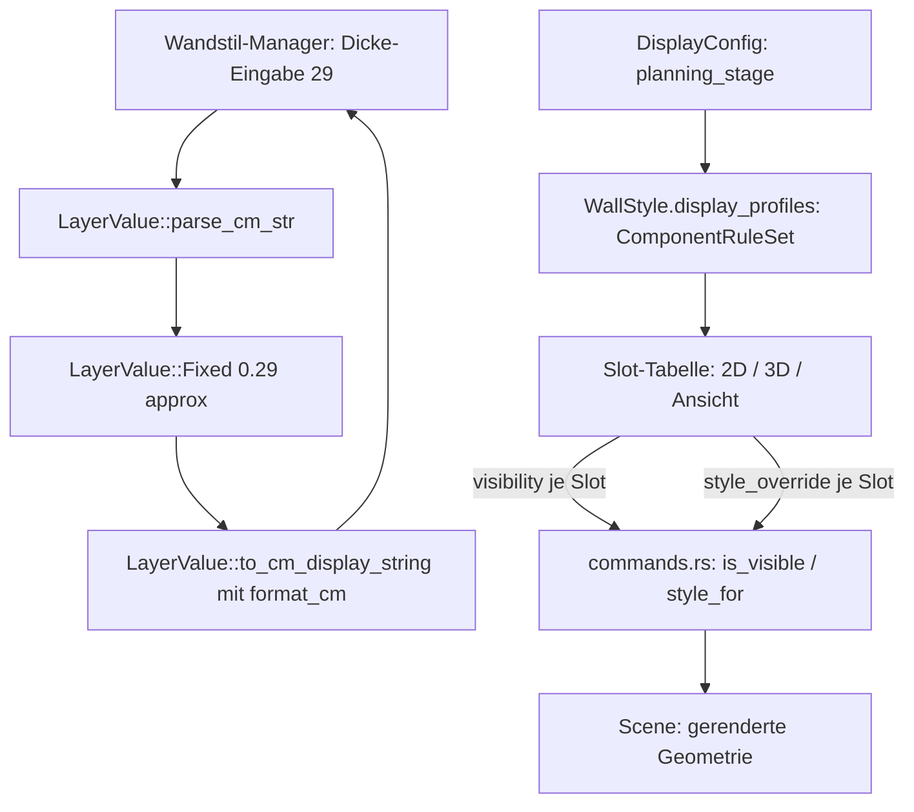

# Requirements

### Overview & Goals
Nachdem die stil-zentrierte Darstellungs-Überarbeitung implementiert wurde, hat der Anwender beim Testen vier konkrete Probleme gefunden, die jetzt korrigiert werden:

1. **Zahlenwerte werden im Wandstil-Manager falsch gespeichert/angezeigt** — Eingabe `29` (cm) wird beim Neuladen als `28.99999...` angezeigt, weil `LayerValue::to_cm_display_string()` das Ergebnis von `v * 100.0` ohne Rundung formatiert (typischer Gleitkomma-Rundungsfehler bei `29.0/100.0*100.0`).
2. **Das Konzept der Darstellungskomponenten ist im UI verloren gegangen** — `ComponentRuleSet` unterstützt weiterhin `visibility`/`style_override` je `WallComponentSlot` (9 Slots: `AxisLine`, `Contour2D`, `ContourHatch2D`, `Layers2D`, `LayerHatch2D`, `Solid3D`, `SurfaceStyle3D`, `SectionRepresentation`, `ElevationRepresentation`), aber die neue "Darstellungs-Profile"-Sektion im Wandstil-Manager (`aec_wall_style_manager.rs`) zeigt nur noch die zwei Layer-Filter (`Contour2D`/`Solid3D`) und einen Hatch-Winkel — es gibt keine Möglichkeit mehr, einzelne Komponenten sichtbar/unsichtbar zu schalten oder ihren Stil zu überschreiben.
3. **Keine Steuerung "nur 2D", "nur 3D" oder "beide"** — dieselbe fehlende Sichtbarkeits-UI verhindert auch, gezielt nur 2D-Slots (`AxisLine`/`Contour2D`/`ContourHatch2D`/`Layers2D`/`LayerHatch2D`) oder nur 3D-Slots (`Solid3D`/`SurfaceStyle3D`) auszublenden; zusätzlich soll die bestehende Slot-Gruppierung erkennbar um eine dritte Kategorie "Ansicht" (`SectionRepresentation`/`ElevationRepresentation`, künftig auch für Fenster) ergänzt werden.
4. **`DisplayConfig.phase` (Bestand/Abbruch/Neubau) ergibt an der Planart keinen Sinn** — dieses Feld beschreibt heute eine Bauphase, obwohl an der Planart eigentlich die *Planungsstufe* ("Genehmigungsplanung", "Entwurfsplanung", "Ausführungsplanung" etc.) gemeint ist, über die sich die Darstellung sinnvoll steuern lässt. `Wall.phase` (Neu/Abbruch/Bestand am Bauteil) ist davon unabhängig und bleibt unverändert korrekt.

### Scope
#### In Scope
- Rundungsfix für die Cm-Anzeige/-Rückkonvertierung von `LayerValue::Fixed` im Wandstil-Manager (Thickness- und ggf. weitere betroffene Zahlenfelder).
- Wiederherstellung einer vollständigen Sichtbarkeits-/Style-Override-UI für alle 9 `WallComponentSlot`s in der "Darstellungs-Profile"-Sektion des Wandstil-Managers, gruppiert nach 2D/3D/Ansicht.
- Neues `PlanningStage`-Enum (`Genehmigungsplanung`/`Entwurfsplanung`/`Ausführungsplanung`, erweiterbar) als Ersatz für `DisplayConfig.phase: PlanPhase` — inkl. Anpassung von Plan-Manager-UI, Persistenz und aller Aufrufstellen/Tests, die bisher `DisplayConfig.phase` lesen.

#### Out of Scope
- Fenster/Türen-Elementtyp selbst (nur die Vorbereitung der Slot-Gruppierung "Ansicht" für spätere Fenster-Komponenten).
- Weitere GUI-Widget-Vereinheitlichung über das in der vorherigen Runde abgeschlossene Maß hinaus.
- Migration alter `.ocsproj`/Bibliotheksdateien mit dem alten `DisplayConfig.phase`-Feld (Anwender legt Planarten laut vorheriger Entscheidung ohnehin bei Bedarf neu an).

### User Stories
- Als Anwender möchte ich, dass eine eingegebene Wandschichtdicke exakt so gespeichert und wieder angezeigt wird, wie ich sie eingegeben habe (z. B. `29` bleibt `29`, nicht `28.99999...`).
- Als Anwender möchte ich im Wandstil-Manager für jede Planart gezielt festlegen können, welche Darstellungskomponenten (Achslinie, Kontur, Kontur-Schraffur, Schichten, Schicht-Schraffur, Volumenkörper, Oberflächenstil, Schnitt-/Ansichtsdarstellung) sichtbar sind und wie sie aussehen.
- Als Anwender möchte ich mit wenigen Klicks nur 2D-Komponenten, nur 3D-Komponenten oder beide gemeinsam rendern lassen.
- Als Anwender möchte ich eine Planart als "Genehmigungsplanung", "Entwurfsplanung" oder "Ausführungsplanung" (statt "Bestand/Abbruch/Neubau") klassifizieren, weil das inhaltlich zur Planart passt und die Darstellung sinnvoll mitsteuert.

### Functional Requirements
- `LayerValue::to_cm_display_string()` (und jede andere Stelle, die `Fixed(v) * 100.0` als Text darstellt) rundet auf eine sinnvolle Anzeigepräzision (z. B. 3 Nachkommastellen mit Trim von trailing Nullen), sodass Roundtrips über `parse_cm_str`/`to_cm_display_string` keine sichtbaren Gleitkomma-Artefakte erzeugen; bestehende Formel-Werte (`LayerValue::Formula`) bleiben unverändert als Text erhalten.
- Die "Darstellungs-Profile"-Sektion im Wandstil-Manager zeigt für das ausgewählte Profil eine Tabelle mit einer Zeile je `WallComponentSlot`, gruppiert in drei Abschnitte "2D", "3D", "Ansicht"; jede Zeile hat eine Sichtbarkeits-Checkbox (schreibt `ComponentRuleSet.visibility`) und einen "Style bearbeiten"-Button, der das bestehende Style-Override-Formular (Linientyp/-farbe, Schraffurmuster/-farbe, Füllfarbe — inkl. der Layer-Manager-Vorschau-Widgets aus der letzten Runde) für genau diesen Slot öffnet und in `ComponentRuleSet.style_override` schreibt.
- Die bisherigen Contour2D-/Solid3D-Layer-Filter-Checklisten und der Hatch-Winkel bleiben als eigener, unveränderter Bereich unterhalb der neuen Slot-Tabelle erhalten (kein Verhaltensverlust der zuletzt gelieferten Funktionalität).
- Ein neues `planning_stage: PlanningStage`-Feld ersetzt `DisplayConfig.phase: PlanPhase` vollständig; der Plan-Manager zeigt statt des "Phase"-Pick-Lists (Bestand/Abbruch/Neubau) ein Pick-List mit den Planungsstufen-Werten; Default beim Anlegen neuer Planarten ist "Entwurfsplanung".
- `Wall.phase` (Bauteil-Phase Neu/Abbruch/Bestand) und der zugehörige `DisplayConfig.phase_filter` (Sichtbarkeit/Zusatzstil je Bauteil-Phase) bleiben unverändert bestehen und funktionsfähig — sie sind von der Umbenennung an `DisplayConfig` nicht betroffen.

### Non-Functional Requirements
- Bestehende Tests für `LayerValue`-Roundtrip, `ComponentRuleSet` und `aec_plan_manager.rs`/`aec_wall_style_manager.rs` müssen nach den Änderungen weiterhin grün sein bzw. auf `PlanningStage` umgestellt werden; `cargo test --lib aec::` bleibt vollständig erfolgreich.
- Keine Persistenz-Migration für alte `DisplayConfig.phase`-Werte nötig (Breaking Change bewusst akzeptiert, analog zu vorherigen Entscheidungen in diesem Projektstrang).

# Technical Design

### Current Implementation
- `src/modules/aec/engine/wall_style.rs`: `LayerValue::to_cm_display_string()` → `format!("{}", v * 100.0)` ohne Rundung; `parse_cm_str()` → `Fixed(v / 100.0)`. Root cause des Bugs 1: `29.0 / 100.0 = 0.29` ist im IEEE-754-`f64` nicht exakt darstellbar, `0.29 * 100.0` liefert `28.999999999999996`.
- `src/ui/window/aec_wall_style_manager.rs`: Layer-Tabelle nutzt bereits gerundetes `format!("{:.1}", ...)` (Zeile ~392, ~402 — dort ist es unkritisch), aber der Editier-Buffer (`buffer.thickness`, befüllt aus `to_cm_display_string()`) zeigt den ungerundeten Wert im `text_input`.
- `src/ui/window/aec_wall_style_manager.rs::display_profiles_section` (Zeilen 655-764): rendert nur Layer-Filter-Checklisten für `Contour2D`/`Solid3D` (`layer_filter_slot_view`) plus Hatch-Winkel/„Relativ zur Wand“ — keine Zeile für Sichtbarkeit/Style je der übrigen 7 `WallComponentSlot`-Werte.
- `src/modules/aec/engine/display_component.rs`: `WallComponentSlot` (9 Varianten), `ComponentRuleSet { visibility: HashMap<String,bool>, style_override: HashMap<String,ComponentStyleOverride>, layer_style_override, layer_filter }`, `is_visible(slot)`, `style_for(slot)` — Datenmodell ist vollständig und ungenutzt für die fehlenden 7 Slots.
- `src/ui/window/aec_plan_manager.rs`: `phase_label`/`phase_from_label` mappen `PlanPhase::{Existing,Demolition,New}` auf "Bestand"/"Abbruch"/"Neubau" für das `DisplayConfig.phase`-Pick-List (Zeilen 25-52, 197-201, 292-296); separat existiert bereits der Zwei-Stufen-`phase_filter`-Editor für `Wall.phase`/`DisplayConfig.phase_filter` (Zeilen 371-388), der unverändert bleibt.
- `src/modules/aec/engine/plan_view.rs`: `DisplayConfig.phase: PlanPhase` (Zeile ~97-98), `PlanPhase` wird sowohl hier (Planart-Klassifikation) als auch an `Wall`/`PhaseFilter` (Bauteil-Phase) verwendet — dieselbe Enum für zwei fachlich unterschiedliche Konzepte ist die Ursache von Bug 4.
- `src/ui/window/aec_ui_util.rs`: `linetype_field`, `acad_color_to_hex` — bereits extrahierte, wiederverwendbare Vorschau-Widgets aus der vorherigen Runde, die für die neue Slot-Style-Override-UI wiederverwendet werden.

### Key Decisions
1. **Rundung statt Formatierungsänderung an der Quelle:** `LayerValue::to_cm_display_string()` rundet auf 3 Nachkommastellen und trimmt trailing Nullen/Punkt (z. B. über `format!("{:.3}", v*100.0)` + Trim), statt z. B. `Decimal`-Typen einzuführen — minimal-invasiv, behält `f64` als Speichertyp bei, behebt aber alle Anzeige-Rundtrips inkl. Achsversatz/Bot.-Spalten, die denselben Formatierungscode nutzen.
2. **Wiederherstellung der vollen Slot-Tabelle statt neuer Datenstruktur:** Kein neues Datenmodell nötig — `ComponentRuleSet.visibility`/`style_override` existieren bereits und werden korrekt aufgelöst (`is_visible`/`style_for`, genutzt in `commands.rs`); es fehlt ausschließlich die UI-Sektion im Wandstil-Manager, die alle 9 Slots abdeckt (aktuell nur 2 Spezialfälle).
3. **Gruppierung 2D/3D/Ansicht (vom Nutzer bestätigt):** Tabelle mit Kategorie-Überschriften: **2D** (`AxisLine`, `Contour2D`, `ContourHatch2D`, `Layers2D`, `LayerHatch2D`), **3D** (`Solid3D`, `SurfaceStyle3D`), **Ansicht** (`SectionRepresentation`, `ElevationRepresentation`) — deckt Fix 2 (Komponentenauswahl) und Fix 3 (2D/3D/Ansicht gezielt schalten) in derselben Sektion ab, da "nur 2D rendern" gleichbedeutend mit "alle 2D-Slot-Checkboxen aus, 3D-Slots an" ist.
4. **`PlanningStage` als eigenständiges Enum statt Wiederverwendung von `PlanPhase` (vom Nutzer bestätigt):** `DisplayConfig.phase: PlanPhase` wird ersetzt durch `DisplayConfig.planning_stage: PlanningStage` mit Werten `Permit` ("Genehmigungsplanung"), `Design` ("Entwurfsplanung"), `Execution` ("Ausführungsplanung") — erweiterbar für weitere Stufen. `Wall.phase: PlanPhase` und `PhaseFilter` (Bauteil-Ebene) bleiben komplett unverändert, weil sie ein anderes Fachkonzept (Baumaßnahme-Status je Bauteil) abbilden.

### Proposed Changes
- `src/modules/aec/engine/wall_style.rs`: `to_cm_display_string()` auf gerundete, getrimmte Darstellung umstellen; neuer Helper `format_cm(f64) -> String` für Wiederverwendung an allen betroffenen Anzeigestellen (Thickness, Achsversatz, Bot.).
- `src/ui/window/aec_wall_style_manager.rs`: neue Funktion `component_slot_table_view(profiles) -> Element` mit den drei Kategorie-Gruppen; State-Erweiterung `DisplayProfileFormState` um `slot_visibility: HashMap<WallComponentSlot, bool>`-Buffer und ein optionales `editing_slot_style: Option<(WallComponentSlot, StyleEditorFormState)>` (wiederverwendet das bestehende `style_editor_form`-Muster aus `aec_plan_manager.rs`, extrahiert als gemeinsamer Helper falls nötig); neue Messages `AecStyleManagerProfileSlotVisibilityToggle(WallComponentSlot, bool)`, `AecStyleManagerProfileSlotStyleOpen(WallComponentSlot)`, `AecStyleManagerProfileSlotStyleApply`.
- `src/modules/aec/engine/plan_view.rs`: neues `pub enum PlanningStage { Permit, Design, Execution }` (mit `Default` = `Design`), `DisplayConfig.planning_stage: PlanningStage` ersetzt `phase: PlanPhase`; Konstruktor-Signatur `DisplayConfig::new(name, planning_stage, view_type)` angepasst.
- `src/ui/window/aec_plan_manager.rs`: `phase_label`/`phase_from_label` durch `planning_stage_label`/`planning_stage_from_label` ersetzt ("Genehmigungsplanung"/"Entwurfsplanung"/"Ausführungsplanung"); Pick-List und Summary-Text (`"{} · {} · {}"`) nutzen `planning_stage_label`; der bereits vorhandene, getrennte `phase_filter`-Editor (Wall-Phase-Sichtbarkeit) bleibt unverändert.
- Alle Aufrufstellen/Tests in `library.rs`, `project.rs`, `plan_view.rs`, die bisher `DisplayConfig::new(..., PlanPhase::New, ...)` aufrufen, auf `PlanningStage::Design` (oder passenden Wert) umgestellt.

### Data Models / Contracts
```rust
// wall_style.rs
impl LayerValue {
    fn format_cm(v: f64) -> String; // rounds to 3 decimals, trims trailing zeros/dot
    pub fn to_cm_display_string(&self) -> String {
        match self { Fixed(v) => Self::format_cm(v * 100.0), Formula(s) => s.clone() }
    }
}

// plan_view.rs
#[derive(Debug, Clone, Copy, PartialEq, Eq, Serialize, Deserialize, Default)]
pub enum PlanningStage {
    Permit,
    #[default]
    Design,
    Execution,
}
pub struct DisplayConfig {
    // was: pub phase: PlanPhase,
    pub planning_stage: PlanningStage,
    pub view_type: ViewType,
    pub phase_filter: Option<PhaseFilter>, // unchanged (Wall-phase visibility)
    // ... unchanged fields
}

// aec_wall_style_manager.rs (state)
pub struct DisplayProfileFormState<'a> {
    // existing fields unchanged ...
    pub slot_visibility: HashMap<WallComponentSlot, bool>,
    pub editing_slot_style: Option<(WallComponentSlot, StyleEditorFormState<'a>)>,
}
```

### Components
- `src/modules/aec/engine/wall_style.rs` (Fix): `LayerValue::to_cm_display_string`/neuer `format_cm`-Helper.
- `src/modules/aec/engine/plan_view.rs` (geändert): `PlanningStage`-Enum, `DisplayConfig.planning_stage` ersetzt `phase`.
- `src/ui/window/aec_wall_style_manager.rs` (erweitert): neue Slot-Tabelle mit Sichtbarkeit + Style-Override-Formular je Slot, gruppiert 2D/3D/Ansicht.
- `src/ui/window/aec_plan_manager.rs` (geändert): `planning_stage_label`/`_from_label`, Pick-List-Beschriftung.
- `src/modules/aec/engine/library.rs`/`project.rs` (angepasst): Konstruktor-Aufrufe und Tests auf `PlanningStage` umgestellt.
- `src/app/mod.rs`/`src/app/view/modal.rs` (erweitert): neue State-Felder/Messages für die Slot-Tabelle verdrahtet.

### Architecture Diagram


### Risks
- Der Rundungsfix darf keine bereits gespeicherten Formel-Strings (`LayerValue::Formula`) beeinflussen — nur `Fixed`-Werte sind betroffen.
- Umbenennung `DisplayConfig.phase` -> `planning_stage` ist ein Breaking Change für bestehende gespeicherte Planarten (bewusst akzeptiert, keine Migration laut vorheriger Entscheidung); alle Serialisierungs-/Deserialisierungs-Tests, die das alte Feld referenzieren, müssen gefunden und angepasst werden.
- Die neue Slot-Tabelle darf nicht mit den bestehenden Contour2D-/Solid3D-Layer-Filtern und dem Hatch-Winkel kollidieren (unterschiedliche Datenfelder in `ComponentRuleSet`, aber gemeinsames UI-Formular) — sorgfältige Trennung der State-Buffer nötig.
- Style-Override-Formular je Slot wiederverwendet das `StyleEditorFormState`-Muster aus `aec_plan_manager.rs`; muss so extrahiert werden, dass keine Regression an den dort bereits funktionierenden Phasenfilter-Formularen entsteht.

# Delivery Steps

### ✓ Step 1: Rundungsfehler bei Wandschichtdicken beheben
Eingegebene Zahlenwerte für Wandschichten (Dicke, Achsversatz, Bot.) werden exakt wie eingegeben angezeigt, ohne Gleitkomma-Artefakte.
- In `wall_style.rs` neuen Helper `LayerValue::format_cm(v: f64) -> String` implementieren (rundet auf 3 Nachkommastellen, trimmt trailing Nullen/Punkt).
- `LayerValue::to_cm_display_string()` auf `format_cm` umstellen.
- Alle weiteren Anzeigestellen im Wandstil-Manager (`aec_wall_style_manager.rs`), die `v * 100.0` direkt formatieren (Thickness-Buffer-Initialisierung, ggf. Achsversatz/Bot.-Felder außerhalb der reinen Tabellenanzeige), auf denselben Helper umstellen.
- Unit-Tests: Roundtrip `parse_cm_str("29")` -> `to_cm_display_string()` liefert exakt `"29"`, inkl. weiterer Werte mit bekannten Gleitkomma-Fallstricken (z. B. 17.5, 0.1).

### ✓ Step 2: PlanningStage-Enum einführen und DisplayConfig.phase ersetzen
Die Planart trägt eine fachlich passende Planungsstufe statt einer Bauteil-Phase.
- Neues `pub enum PlanningStage { Permit, Design, Execution }` mit `Default = Design` in `plan_view.rs`.
- `DisplayConfig.phase: PlanPhase` durch `DisplayConfig.planning_stage: PlanningStage` ersetzen; `DisplayConfig::new(...)`-Signatur entsprechend anpassen.
- Alle Aufrufstellen in `library.rs`, `project.rs`, `plan_view.rs` (Tests und Seed-Daten) von `PlanPhase::New/Existing/...` als Planart-Parameter auf passende `PlanningStage`-Werte umstellen.
- Sicherstellen, dass `Wall.phase`/`PhaseFilter` (Bauteil-Ebene) unverändert bleiben und von der Umbenennung nicht betroffen sind.

### ✓ Step 3: Plan-Manager-UI auf PlanningStage umstellen
Der Plan-Manager zeigt und speichert die neue Planungsstufe statt Bestand/Abbruch/Neubau.
- `phase_label`/`phase_from_label` in `aec_plan_manager.rs` durch `planning_stage_label`/`planning_stage_from_label` ersetzen ("Genehmigungsplanung"/"Entwurfsplanung"/"Ausführungsplanung").
- Pick-List und Zusammenfassungstext (`"{discipline} · {stage} · {view_type}"`) auf die neuen Funktionen umstellen.
- `AecPlanManagerApply`/Select/New/Duplicate-Handler auf `planning_stage` umschreiben.
- Bestehenden, unveränderten Zwei-Stufen-`phase_filter`-Editor (Wall-Phase-Sichtbarkeit) nicht anfassen; Tests (`phase_and_view_type_label_roundtrip` etc.) auf `PlanningStage` umstellen.

### ✓ Step 4: Vollständige Komponenten-Sichtbarkeits-Tabelle im Wandstil-Manager wiederherstellen
Im Wandstil-Manager können alle 9 Darstellungskomponenten pro Planart-Profil einzeln sichtbar geschaltet werden, gruppiert nach 2D/3D/Ansicht.
- Neue Funktion `component_slot_table_view` in `aec_wall_style_manager.rs`: drei Kategorie-Gruppen (2D: AxisLine/Contour2D/ContourHatch2D/Layers2D/LayerHatch2D; 3D: Solid3D/SurfaceStyle3D; Ansicht: SectionRepresentation/ElevationRepresentation), je Slot eine Sichtbarkeits-Checkbox, die `ComponentRuleSet.visibility` befüllt.
- `DisplayProfileFormState` um `slot_visibility: HashMap<WallComponentSlot, bool>`-Buffer erweitern; beim Laden/Speichern eines Profils befüllen/zurückschreiben.
- Tabelle wird oberhalb der bestehenden, unveränderten Contour2D/Solid3D-Layer-Filter-Checklisten und des Hatch-Winkel-Formulars eingefügt.
- Unit-/Integrationstests: Sichtbarkeits-Toggle eines Slots wird korrekt in `WallStyle.display_profiles[config].visibility` persistiert und beim erneuten Öffnen wieder geladen.

### ✓ Step 5: Style-Override je Darstellungskomponente ergänzen
Zu jeder Darstellungskomponente kann zusätzlich zur Sichtbarkeit ein individueller Stil (Linientyp/-farbe, Schraffurmuster/-farbe, Füllfarbe) hinterlegt werden.
- Neue Messages `AecStyleManagerProfileSlotStyleOpen(WallComponentSlot)`/`AecStyleManagerProfileSlotStyleApply`/`AecStyleManagerProfileSlotStyleClose`.
- Pro Zeile der Slot-Tabelle einen "Style bearbeiten"-Button ergänzen, der ein Formular öffnet (wiederverwendet das bestehende `StyleEditorFormState`-Muster inkl. Layer-Manager-Vorschau-Widgets aus `aec_ui_util.rs`) und in `ComponentRuleSet.style_override[slot]` schreibt.
- Bei Slots ohne gesetzten Override zeigt der Button einen neutralen Zustand ("Standard"), bei gesetztem Override einen hervorgehobenen Zustand ("Override"), analog zum bestehenden Planart-Status-Badge.
- Tests für Setzen, Anzeigen und Entfernen eines Style-Overrides je Slot.