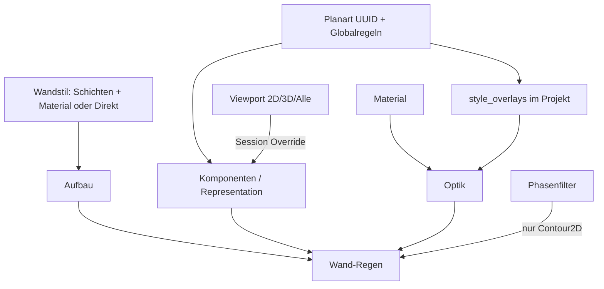

# Requirements

### Overview & Goals
Darstellung von Wänden neu schneiden: **Material** = Optik, **Wandstil** = konstruktiver Schichtaufbau, **Planart** = welche Komponenten/Schichten in welchem Kontext sichtbar sind plus optionale Optik-Overrides. Dieselbe Wand soll in Planart A und B unterschiedlich aussehen, ohne den Aufbau zu ändern. Umschalten der Planart (und optional 2D/3D/Alle) regeneriert die Darstellung.

### Scope
#### In Scope
- UUID an `DisplayConfig` (Umbenennen ohne Broken Links).
- Komponenten-Katalog mit getrennten Geometrie- vs. Schraffur-Slots: Achse; 2D-Schichten und 2D-Schichtschraffur; 2D-Gesamtkontur und Kontur-Schraffur/Füllung; 3D-Schichten/Körper und optionale 3D-Oberflächen-Schraffur/Füllung.
- Planart-globale Regeln + spärliche Stil-Ausnahmen im **Projekt** (nicht in der Standard-Stilbibliothek).
- Override-Kette feldweise: Planart-Layer → Planart-Slot → Schicht-direkt → Material.
- Schraffur-Skalierung (`hatch_scale`) als eigenes Override-Feld (neben Muster, Farbe, Winkel) — pro Schicht/Planart, ohne das Material zu ändern.
- Schicht: Material-Verweis **oder** direkte Optik.
- Viewport-Modus `2D | 3D | Alle` mit Default an der Planart; Sitzungs-Schalter überschreibt.
- Bestand/Abbruch/Neubau nur auf **2D-Gesamtkontur**.
- Migration bestehender `WallStyle.display_profiles` (Name-Keys) → Planart-UUID + Overlays; Copy-on-Write von Stilen kopiert keine Planart-Profile.

#### Out of Scope
- Fenster/Türen/Stützen (Modell so vorbereiten, dass Planart-Regeln spaeter `object_kind` tragen können).
- Neue Maßstabskopplung.
- Schnitt-/Ansichts-Repraesentationen als eigene Geometrie.
- Boolean-Oeffnungen.

### User Stories
- Als Anwender wechsle ich die Planart und sehe andere Schichten, andere Kontur und andere Farben, ohne den Wandstil zu ändern.
- Als Anwender kopiere ich einen Wandstil in die Standardbibliothek, ohne projektfremde Planarten mitzunehmen.
- Als Anwender benenne ich eine Planart um, Overrides bleiben gültig.
- Als Anwender konstruiere ich mit Viewport „Alle“, auch wenn die aktive Planart typischerweise nur 2D zeigt.
- Als Anwender sehe ich Abbruch nur an der 2D-Gesamtkontur (z. B. gestrichelt), nicht schichtweise.

### Functional Requirements
- Planart hat stabile `id: Uuid`; UI zeigt/editiert `name`.
- Globale Planart-Regeln gelten für alle Wände: Komponenten an/aus, Default-Konturpolitik, Default-Representation.
- Abweichungen je Wandstil nur als Overlay keyed by `style.id` + `layer_id`.
- Neue Stile brauchen keine Planart-Pflege, solange die Globalregeln reichen.
- `resolve_effective_rule_set` wird durch eine feldweise Property-/Visibility-Kette ersetzt.
- Copy Standard↔Projekt von `WallStyle` strippt `display_profiles`.

### Non-Functional Requirements
- Alte Projekte laden (Name-Key-Migration, fehlende UUID erzeugen und speichern).
- `cargo test --lib aec` bleibt grün; Resolver-Tests für Kette, Phase-nur-Kontur, Copy ohne Overlays.

# Technical Design

### Current Implementation
- `DisplayConfig` (`plan_view.rs`): Name, Disziplin, `planning_stage`, `view_type`, `phase_filter` — **keine** Slot-Regeln mehr.
- `WallStyle.display_profiles: HashMap<String, ComponentRuleSet>` keyed nach **Planart-Namen** (`wall_style.rs`); Resolver `library.rs::resolve_effective_rule_set`.
- `ComponentRuleSet`: visibility / style_override / layer_style_override / layer_filter über 9 `WallComponentSlot`s (`display_component.rs`).
- Regenerierung: `commands.rs` (`style_for`, `layer_filter_for`, Phasenfilter).
- Stil-Copy: `document-style-library-copy-override` kopiert den ganzen Stil inkl. Profile.

### Key Decisions
1. **Planart-Overlays leben im Projekt an der Planart, nicht am Standard-Stil.** Globalregeln einmal; Stil-Ausnahmen spärlich. Standardbibliothek bleibt aufbau-rein. Vermeidet tote Planart-Refs beim Copy und Wiederholung aller Stile in jeder Planart.
2. **Schlüssel sind UUIDs** (`DisplayConfig.id`, bestehendes `Style.id`, `Layer.layer_id`) — Namen sind Labels.
3. **Hybrid-Sichtbarkeit:** Planart `default_representation: TwoD | ThreeD | All`; Tab/Sitzung `representation_override` überschreibt (Statusleiste).
4. **Schicht-Optik:** Material **oder** direkte Felder am Layer; Planart überschreibt einzelne Felder, nicht den ganzen Stil. Dazu gehört **`hatch_scale`** (positiv, Default aus Material, typisch `1.0`): dieselbe Kette wie Muster/Farbe. `None` = nicht überschreiben. Werte `<= 0` werden beim Regen wie heute auf ein Minimum geklemmt (`0.01`). Winkel (`hatch_angle` / `hatch_angle_relative`) bleiben eigene Felder.
5. **Phase nur Contour2D:** `phase_filter.demolition_style` / `existing_style` gelten ausschließlich auf die 2D-Gesamtkontur.
6. **Komponenten-Katalog: Geometrie und Schraffur getrennt** (nicht Hatch in die Parent-Komponente falten). Sichtbarkeit und Slot-Optik können unabhängig sein (z. B. Schichtkonturen an, Schraffur aus — typisch Statik; Kontur mit Füllung ohne Schichtlinien — typisch Entwurf).
   - `Axis` — Achslinie
   - `Layers2D` — 2D-Schichtkonturen (Linien)
   - `LayerHatch2D` — Schraffur der einzelnen 2D-Schichten
   - `Contour2D` — 2D-Gesamtkontur (Linien); **einziger** Anker für Bestand/Abbruch
   - `ContourHatch2D` — Schraffur/Füllung der Gesamtkontur (Phase greift *nicht* hier)
   - `Layers3D` — 3D-Schichtkörper
   - `SurfaceStyle3D` — 3D-Oberflächen-Schraffur/Farbe (optional, Default an wenn 3D an)
   Legacy-Slots `SectionRepresentation`/`ElevationRepresentation` beim Laden ignorieren (keine Geometrie). Alte Keys 1:1 mappen, wo sie schon existieren (`LayerHatch2D`, `ContourHatch2D`, `SurfaceStyle3D`).

### Proposed Changes
- `DisplayConfig`: `id: Uuid`, `default_representation`, `component_visibility`, optionale `contour_policy`, `style_overlays: HashMap<StyleId, StyleDisplayOverlay>`.
- `StyleDisplayOverlay`: Layer-Sichtbarkeit 2D/3D, optionale Kontur-`layer_id`-Liste, `HashMap<layer_id, PropertyOverride>`.
- `Layer`: weiter `material_id` plus optionale Direktfelder; Resolver merged.
- `WallStyle.display_profiles` nach Migration entfernen bzw. nur noch Legacy-Deserialize.
- Copy-on-Write: Profile nicht mitkopieren.
- UI: Plan-Manager (Global + Ausnahmen); Wandstil-Manager ohne Planart-Inline-Tabelle; Statusleiste Planart + 2D/3D/Alle.
- Regen: Modus filtert 2D/3D-Komponenten, dann Planart-Visibility, dann Overlay, dann Optik-Kette, Phase nur Contour2D.

### Data Models / Contracts
```rust
pub enum RepresentationMode { TwoD, ThreeD, All }
pub enum WallComponentKind {
    Axis,
    Layers2D,
    LayerHatch2D,
    Contour2D,
    ContourHatch2D,
    Layers3D,
    SurfaceStyle3D,
}

pub struct PropertyOverride {
    pub line_type: Option<String>,
    pub line_color: Option<AcadColor>,
    pub hatch_pattern: Option<String>,
    pub hatch_color: Option<AcadColor>,
    pub hatch_scale: Option<f64>,
    pub hatch_angle: Option<f64>,
    pub hatch_angle_relative: Option<bool>,
    pub fill_color: Option<AcadColor>,
    pub cad_layer: Option<String>,
}

pub struct StyleDisplayOverlay {
    pub layer_visibility: HashMap<Uuid, LayerVis>, // default visible
    pub contour_layers: Option<Vec<Uuid>>,
    pub layer_props: HashMap<Uuid, PropertyOverride>,
}

// DisplayConfig additions
pub id: Uuid,
pub default_representation: RepresentationMode,
pub component_visibility: HashMap<WallComponentKind, bool>,
pub style_overlays: HashMap<String /* style.id */, StyleDisplayOverlay>,
```

Optik-Kette (pro Feld): `overlay.layer_props` → Layer-direkt → Material → Default.

`hatch_scale` läuft in derselben Kette. Regen schreibt den aufgelösten Wert in `HatchModel.scale` (wie `Material.hatch_scale` heute in `commands.rs`). UI: Zahlenfeld im Plan-Manager-Overlay (leer = erben).

### Architecture Diagram


### Risks
- Migration Name→UUID muss eindeutige Planarten erzeugen; Duplikatnamen zusammenführen.
- Bestehende 9-Slot-Profile auf 7 Kinds mappen: Hatch-Slots bleiben eigenständig; Schnitt/Ansicht entfallen.
- Große Overlay-Maps in der Planart: UI muss Global vs. Ausnahme klar trennen.

# Delivery Steps

### ✓ Step 1: Planart-Modell (UUID, Representation, Overlays)
`DisplayConfig` trägt `id`, `default_representation`, `component_visibility` und `style_overlays`.

### ✓ Step 2: Feldweise Optik-Kette inkl. `hatch_scale`
Resolver `resolve_layer_property_override`; Regen schreibt `HatchModel.scale`.

### ✓ Step 3: Migration und Copy-on-Write
`migrate_display_profiles_into_planarts` beim Projektladen; Standard-Copy strippt Profile.

### ✓ Step 4: Sichtbarkeit 2D/3D/Alle und Phase nur Contour2D
`component_is_visible` / `effective_representation` / `phase_style_for_slot`.

### ✓ Step 5: Plan-Manager-UI (Global + Stil-Ausnahmen)
Plan-Manager zeigt Default-Representation, Komponenten-Sichtbarkeit und feldweise Overlay-Felder inkl. `hatch_scale` (leer = erben).

# Testing

### Validation Approach
Resolver-Unit-Tests plus Migration/Copy-Tests; `cargo test --lib aec`.

### Key Scenarios
- Zwei Planarten, gleiche Wand: unterschiedliche sichtbare Schichten und Kontur.
- Feld-Override Farbe an einer Schicht, restliche Optik aus Material.
- Feld-Override `hatch_scale` an einer Schicht: Muster/Farbe aus Material, Skalierung aus Overlay; Regen setzt `HatchModel.scale`.
- Planart umbenennen, Overlay bleibt.
- Stil in Standardbibliothek kopieren: keine `style_overlays` / keine `display_profiles`.
- Viewport „3D“ blendet alle 2D-Komponenten (Linien *und* Hatch) aus trotz 2D-lastiger Planart.
- Abbruch ändert nur `Contour2D` (Linien), nicht `ContourHatch2D` und nicht Schicht-Slots.
- Planart kann `Layers2D` an und `LayerHatch2D` aus schalten (und umgekehrt).

### Edge Cases
- Overlay für unbekannten `layer_id` ignorieren.
- Schicht ohne Material und ohne Direktfelder: CAD-Default.
- Legacy JSON ohne `id` / mit `display_profiles`.