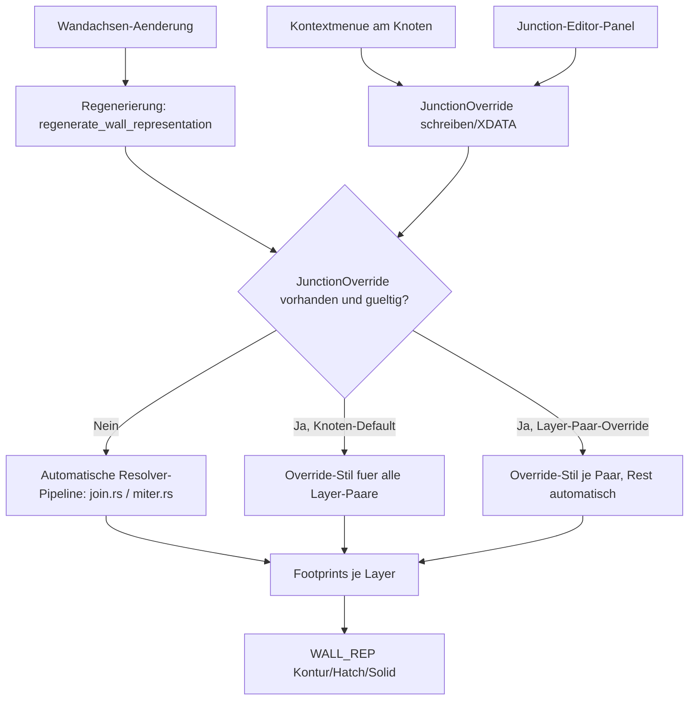

# Requirements (Join Constraints: manuelle Wandverbindungs-Overrides)

### Overview & Goals
Die automatische Junction-Auflösung (`src/modules/aec/engine/join.rs`, `src/modules/aec/engine/miter.rs`) berechnet für L-, T- und N-Way-Wandknoten deterministisch **eine** geometrisch plausible Lösung (Miter, T-Butt-Verlängerung, oder `corner_override`-Fallback). Bei unterschiedlichen Schichtaufbauten, mehrdeutigen Materialzuordnungen oder Design-Entscheidungen, die nicht rein aus der Geometrie ableitbar sind, reicht das nicht aus — es gibt keine Möglichkeit, eine Junction manuell zu korrigieren, ohne dass die nächste Regenerierung den Override wieder verwirft.

Diese Erweiterung führt **Join Constraints** ein: pro Wandknoten (Junction) und optional pro Materialschicht-Paar persistierbare, manuelle Overrides, die die automatische Resolver-Logik gezielt ersetzen — additiv, ohne das bestehende Composite-Wand-Modell (Achse + `WALL_REP`-Darstellungskinder) oder die automatische Auflösung für den Regelfall zu verändern.

### Scope
#### In Scope
- Neues Datenmodell für Junction-Overrides: ein Knoten-Default-Override (z. B. "Bevorzuge Miter"/"Bevorzuge Butt"/"Bis Außenkante") plus optionale, feingranulare Layer-Paar-Overrides ("Schicht X von Wand A ↔ Schicht Y von Wand B", "Schicht X bis Außenkante", "Schicht X nicht verlängern").
- Persistenz der Overrides analog zum bestehenden `corner_override`-Mechanismus (XDATA an der betroffenen Wandachse bzw. am Junction-Knoten), sodass sie Speichern/Laden und Regenerierung überstehen.
- Integration in die bestehende Resolver-Pipeline (`join.rs`/`miter.rs`): Overrides werden vor der automatischen Berechnung geprüft und ersetzen diese gezielt für den betroffenen Knoten bzw. das betroffene Layer-Paar; alle nicht überschriebenen Knoten/Paare laufen weiterhin durch die automatische Logik.
- UI zum Setzen/Bearbeiten von Overrides: Kontextmenü am Junction-Knoten für schnelle Standardfälle (Knoten-Default) plus ein Junction-Editor-Panel für detaillierte Layer-Paar-Kontrolle bei komplexen/mehrschichtigen bzw. N-Way-Knoten.
- Automatische Invalidierung: wird ein Override durch eine strukturelle Änderung (Layer entfernt, Material getauscht, Wand gelöscht) ungültig, fällt das System automatisch auf die reguläre Regel-Logik zurück und informiert den Nutzer (Warnung/Hinweis), statt die Regenerierung fehlschlagen zu lassen.

#### Out of Scope
- Änderungen an der automatischen Default-Logik selbst (L-Miter, T-Butt, N-Way-Fallback) — sie bleibt für alle nicht überschriebenen Knoten exakt wie bisher.
- Neue Materialstil-/Wandstil-Attribute (bereits in vorherigen Etappen ausgeliefert).
- "Planarten"/"Darstellungsvarianten"-Backlog (separat vorgemerkt, siehe unten) — bleibt unverändert unspezifiziert und ist nicht Teil dieser Lieferung.
- Vollautomatische Erkennung/Vorschlag "welche Knoten brauchen wahrscheinlich einen Override" (z. B. Ambiguitäts-Scoring) — kann Folgearbeit sein, ist hier nicht im Scope.

### User Stories
- Als Planer öffne ich per Rechtsklick auf einen T- oder N-Way-Knoten ein Kontextmenü und wähle eine alternative Verbindungsart (z. B. "Bis Außenkante verlängern" statt der automatisch gewählten Lösung), die danach bei jeder Regenerierung erhalten bleibt.
- Als Planer öffne ich für einen komplexen N-Way-Knoten mit mehreren, materiell unterschiedlichen Wänden ein Detail-Panel, in dem ich jede Schicht-Paarung einzeln festlege oder als "nicht verlängern" markiere.
- Als Planer ändere ich später die Wandstärke oder das Material einer beteiligten Wand; wird dadurch ein bestehender Override ungültig, werde ich informiert und das System fällt automatisch auf eine sinnvolle automatische Lösung zurück, statt die Wand kaputt aussehen zu lassen.
- Als Planer sehe ich an einem Knoten mit Override eine visuelle Kennzeichnung (z. B. Icon/Farbe), die ihn von automatisch aufgelösten Knoten unterscheidet.

### Functional Requirements
- Ein Junction-Knoten ohne Override verhält sich exakt wie heute (keine Regression an bestehenden Miter-/Join-Tests).
- Ein Knoten-Default-Override wirkt auf alle Layer-Paare des Knotens, sofern sie nicht zusätzlich einen eigenen Layer-Paar-Override besitzen (Layer-Paar-Override hat Vorrang vor Knoten-Default).
- Overrides werden beim Speichern/Laden der Zeichnung korrekt persistiert (Roundtrip) und bleiben nach einer reinen Geometrieänderung (Achse verschoben, ohne Layer-/Materialänderung) erhalten und weiterhin gültig.
- Wird ein Override durch eine strukturelle Änderung ungültig (referenzierte Schicht/Wand existiert nicht mehr oder Material stimmt nicht mehr), wird er automatisch entfernt, der betroffene Knoten/das betroffene Paar fällt auf die automatische Logik zurück, und der Nutzer erhält einen sichtbaren Hinweis (z. B. Statusleiste/Log).
- Kontextmenü am Knoten bietet die gängigsten Override-Optionen (Miter/Butt/Außenkante/Automatisch-zurücksetzen) für den Standardfall ohne das Panel öffnen zu müssen.
- Junction-Editor-Panel zeigt bei Auswahl eines Knotens alle beteiligten Wände/Schichten und erlaubt das Setzen, Ändern und Zurücksetzen einzelner Layer-Paar-Overrides sowie des Knoten-Defaults.
- Ein zurückgesetzter (gelöschter) Override führt sofort wieder zur automatischen Lösung für den betroffenen Knoten/das betroffene Paar.

# Technical Design

### Current Implementation
- **Automatische Junction-Auflösung:** `join.rs`/`miter.rs` unterscheiden bereits L- (`end_b = Some`) von T-Joins (`end_b = None`, seit der T-Butt-Erweiterung) und lösen N-Way-Knoten über `mitered_junction_layer_footprints` auf. Für nicht eindeutig matchbare Schichten liefert `match_layer_indices` `None`, und der Caller fällt auf `corner_override: Option<(usize, DVec3)>` zurück — ein einzelner, den Achs-Vertex verschiebender Fallback-Wert, der bereits an `regenerate_wall_representation_with_corner`/`regenerate_wall_representation_with_precomputed_miters` (`commands.rs` ~1020-1057) durchgereicht wird.
- **Kein persistenter, editierbarer Override:** `corner_override` wird pro Regenerierungsaufruf frisch berechnet (Bevel-Fallback), nicht als expliziter, vom Nutzer gesetzter und über Regenerierungen hinweg persistenter Zustand behandelt. Es gibt keinen UI-Weg, eine Junction manuell zu bearbeiten.
- **XDATA-Persistenzmuster:** Bestehende Wand-Metadaten (Layer-Rollen, `WALL_REP`/`WALL_DERIVED`-Tags, Material-/Stilreferenzen) werden bereits konsistent über eine `read_aec_record`/`write_...`-XDATA-Konvention auf Entities abgelegt (siehe `is_wall_display_child_entity`, `wall_from_entity` in `commands.rs`). Dieses Muster ist die naheliegende Grundlage für die Persistenz neuer Junction-Overrides.
- **Kontextmenüs am Grip existieren bereits konzeptionell** (siehe vorgemerkter Plan `aec-wall-preview-join-context-menu.md`) — die Join-Constraints-UI kann auf demselben Interaktionsmuster (Rechtsklick auf einen Wandknoten/Grip) aufbauen.

### Key Decisions
1. **Zwei Override-Ebenen: Knoten-Default + Layer-Paar-Override.** Jede Junction kann einen Default-Stil (Miter/Butt/Außenkante) tragen, der für alle Layer-Paare gilt, sofern kein spezifischerer Layer-Paar-Override existiert. Das deckt den einfachen Fall (ganzer Knoten) ab, ohne komplexe N-Way-Fälle mit gemischten Materialien zu blockieren, die feinere Kontrolle brauchen.
2. **Additiv zur bestehenden Resolver-Pipeline, kein Ersatz.** `join.rs`/`miter.rs` bleiben die einzige Berechnungsquelle für den Regelfall; Join Constraints greifen als vorgeschalteter Override-Check, der bei Vorhandensein eines gültigen Overrides die automatische Berechnung für den betroffenen Knoten/das betroffene Paar überspringt bzw. ihr Ergebnis ersetzt.
3. **Persistenz als XDATA an der Wandachse, analog zu bestehenden Tags.** Ein Override wird an der/den beteiligten Wandachse(n) gespeichert (Junction-Identität ergibt sich aus den an einem gemeinsamen Achs-Endpunkt beteiligten Handles), nicht in einer separaten globalen Tabelle — folgt dem etablierten additiven `#[serde(default)]`/XDATA-Muster und überlebt Speichern/Laden ohne neues Dateiformat.
4. **Automatischer Fallback statt Blockade bei Invalidierung.** Wird ein Override durch eine strukturelle Änderung ungültig (referenzierte Schicht/Wand entfällt), wird er beim nächsten Regenerierungslauf automatisch entfernt und durch die reguläre Automatik ersetzt, statt die Regenerierung zu blockieren oder einen Fehlerzustand zu erzeugen — konsistent mit dem bestehenden, fehlertoleranten `WallRegenError`-Verhalten.
5. **UI: Kontextmenü + Panel, keine dritte Variante.** Das Kontextmenü deckt die häufigen Standardfälle (Default-Stil setzen/zurücksetzen) ab; das Junction-Editor-Panel ist nur für die detaillierte Layer-Paar-Kontrolle bei komplexen/N-Way-Knoten nötig — beide bedienen dieselbe zugrunde liegende Override-Datenstruktur.

### Proposed Changes
- **Datenmodell (`join.rs`, neues Modul-internes Typ):** `JunctionOverride { default_style: Option<JoinOverrideStyle>, layer_pairs: Vec<LayerPairOverride> }`, wobei `JoinOverrideStyle` die Varianten Miter/Butt/Außenkante/Nicht-verlängern abbildet und `LayerPairOverride` ein Schicht-Paar (Material-ID oder Index je Wand) auf einen `JoinOverrideStyle` abbildet.
- **Persistenz:** neue XDATA-Schreib-/Lesefunktionen (analog zu bestehenden Tag-Helfern in `commands.rs`) an der/den Wandachse(n), die einen `JunctionOverride` serialisieren/deserialisieren; additiv, alte Zeichnungen ohne diese XDATA verhalten sich unverändert.
- **Resolver-Integration:** `join_two_walls_in_document`/`resolve_junction_at_point`-artige Einstiegspunkte (bestehende Aufrufer der Miter-Pipeline in `commands.rs`) prüfen vor dem automatischen Aufruf von `mitered_layer_footprints`/`mitered_junction_layer_footprints`, ob ein gültiger `JunctionOverride` existiert, und liefern dessen Ergebnis statt (oder als Override für einzelne Layer-Paare über) der Automatik.
- **Invalidierung:** bei jeder Regenerierung wird ein vorhandener Override gegen die aktuelle Layer-/Material-Struktur der beteiligten Wände validiert (referenzierte Schicht/Material muss noch existieren); ungültige Einträge werden entfernt und ein Hinweis (Statusleiste/Log, analog zu bestehenden Nutzerwarnungen im Projekt) ausgegeben.
- **UI — Kontextmenü:** Rechtsklick auf einen Junction-Knoten (Grip an einem geteilten Achs-Endpunkt) öffnet ein kleines Menü mit den Default-Stil-Optionen plus "Zurücksetzen auf Automatisch".
- **UI — Junction-Editor-Panel:** neues Fenster/Panel (analog zum bestehenden `aec_material_manager.rs`-Aufbau: Auswahlliste + Detailformular) zeigt bei Klick auf einen Knoten alle beteiligten Wände und deren Layer, erlaubt das Setzen einzelner Layer-Paar-Overrides und des Knoten-Defaults, inkl. "Zurücksetzen"-Aktion pro Paar/Knoten.
- **Visuelle Kennzeichnung:** Knoten mit aktivem Override erhalten ein kleines Marker-Overlay in der Szene (z. B. andersfarbiger Grip-Indikator), analog zu bestehenden Grip-Zustandsdarstellungen.

### Data Models / Contracts
```rust
#[derive(Clone, Debug, PartialEq, Serialize, Deserialize)]
pub enum JoinOverrideStyle {
    Miter,
    Butt,
    OuterFace,
    NoExtend,
}

#[derive(Clone, Debug, PartialEq, Serialize, Deserialize)]
pub struct LayerPairOverride {
    pub layer_a: LayerRef,   // material/function-based reference, not raw index
    pub layer_b: Option<LayerRef>, // None = through-wall side / outer face
    pub style: JoinOverrideStyle,
}

#[derive(Clone, Debug, Default, PartialEq, Serialize, Deserialize)]
pub struct JunctionOverride {
    pub default_style: Option<JoinOverrideStyle>,
    pub layer_pairs: Vec<LayerPairOverride>,
}
```

### Components
- `src/modules/aec/engine/join.rs` / `src/modules/aec/engine/miter.rs`: neue Override-Typen, Integration in die bestehende Resolver-Pipeline vor dem automatischen Miter-/Butt-Pfad.
- `src/modules/aec/commands.rs`: XDATA-Lese-/Schreibfunktionen für `JunctionOverride`, Invalidierungslogik bei Regenerierung, Aufrufstellen in den bestehenden Join-/Regenerierungsfunktionen.
- Neues UI-Fenster (Arbeitstitel `src/ui/window/aec_junction_editor.rs`, nach dem Muster von `aec_material_manager.rs`): Detail-Panel für Layer-Paar-Overrides.
- Kontextmenü-Erweiterung an bestehender Grip-/Selektions-Interaktion (`src/app/update/viewport.rs` bzw. bestehender Kontextmenü-Code) für den Knoten-Default.
- `src/app/mod.rs` / `src/app/update/mod.rs`: neue `Message`-Varianten für Override setzen/zurücksetzen, Panel-Zustand.

### Architecture Diagram


### File Structure
- Ändern: `src/modules/aec/engine/join.rs`, `src/modules/aec/engine/miter.rs`, `src/modules/aec/commands.rs`, `src/app/mod.rs`, `src/app/update/mod.rs`, `src/app/update/viewport.rs`.
- Neu: `src/ui/window/aec_junction_editor.rs` (Panel für Layer-Paar-Overrides).

### Risks
- Layer-Paar-Referenzierung per Index ist bei Struktur-Änderungen fragil → `LayerRef` referenziert Material-ID/Funktion statt nackten Index, damit Overrides Layer-Umsortierungen überleben, solange das Material erhalten bleibt.
- Zusätzliche UI-Komplexität (zwei Bearbeitungswege: Kontextmenü + Panel) könnte Nutzer verwirren, wenn beide denselben Zustand unterschiedlich darstellen → beide UIs greifen auf dieselbe zugrunde liegende `JunctionOverride`-Struktur zu, Kontextmenü ist bewusst eine Teilmenge der Panel-Funktionalität.
- Invalidierungslogik muss bei jeder Regenerierung laufen, ohne die Performance bei häufigen Achs-Edits (Grip-Drag) merklich zu verschlechtern → Validierung bleibt auf einen einfachen Struktur-Check (Material/Schicht existiert noch) beschränkt, kein teurer Neuberechnungs-Vergleich.
- Rückwärtskompatibilität mit bestehenden `corner_override`-Fallback-Pfaden muss erhalten bleiben, damit Knoten ohne Constraint sich exakt wie bisher verhalten (keine Regression an den erst kürzlich gehärteten L-/T-/N-Way-Tests).

# Testing

### Validation Approach
Jede neue Funktionalität wird durch automatisierte Tests (`cargo test --lib`) abgesichert: Datenmodell-Roundtrip, Resolver-Integration (Override ersetzt/ergänzt Automatik korrekt), Invalidierung bei struktureller Änderung; UI-Verhalten wird zusätzlich manuell im Debug-Build geprüft.

### Key Scenarios
- Knoten-Default-Override "Bis Außenkante" an einem T-Knoten setzen → Regenerierung nutzt den Override statt der automatischen T-Butt-Logik, bleibt nach erneuter Regenerierung (z. B. nach Grip-Drag ohne Strukturänderung) erhalten.
- Layer-Paar-Override an einem N-Way-Knoten mit gemischten Materialien setzen → nur das überschriebene Paar weicht vom Automatik-Ergebnis ab, alle anderen Paare verhalten sich weiterhin automatisch.
- Zeichnung mit gesetzten Overrides speichern und neu laden → Overrides bleiben erhalten (Roundtrip) und werden weiterhin angewendet.
- Material einer beteiligten Wand ändern, sodass ein Layer-Paar-Override sein Ziel verliert → Override wird automatisch entfernt, Knoten fällt auf Automatik zurück, Hinweis wird angezeigt.
- Override über Kontextmenü setzen und über das Junction-Editor-Panel wieder anpassen (und umgekehrt) → beide Wege operieren konsistent auf derselben Datenstruktur, keine widersprüchlichen Zustände.
- Override zurücksetzen ("Automatisch") → Knoten verhält sich exakt wie ein nie überschriebener Knoten (Vergleich gegen bestehende Automatik-Tests).

### Edge Cases
- Override an einem Knoten, der durch nachträgliches Löschen einer beteiligten Wand komplett wegfällt → keine verwaisten XDATA-Reste auf verbleibenden Wänden, kein Absturz bei nächster Regenerierung.
- Widersprüchlicher Zustand: Knoten-Default gesetzt, aber alle Layer-Paare zusätzlich einzeln überschrieben → Layer-Paar-Overrides haben klar dokumentierten Vorrang, Default wird ignoriert, aber nicht gelöscht.
- Sehr viele Layer-Paar-Overrides an einem großen N-Way-Knoten → Panel bleibt bedienbar (Scroll/Liste), keine Performance-Probleme bei der Anzeige.
- Bestehende Zeichnungen ohne jegliche Override-XDATA → verhalten sich exakt wie vor dieser Erweiterung (reiner Automatik-Pfad), keine Migration nötig.

# Backlog: Planarten & Darstellungsvarianten (vorgemerkt, unspezifiziert)

> **Status:** Auf Wunsch nur vorgemerkt, unabhängig von dieser Join-Constraints-Erweiterung. Die genaue Bedeutung von "Planart" (z.B. Zeichnungsmaßstab/LOD, Planungsphase Bestand/Abbruch/Neu, oder Ansichtstyp Grundriss/Schnitt/Ansicht) und "Darstellungsvariante" (z.B. alternative Hatch-/Farbschemata, Sichtbarkeits-Overrides je Layer, oder vereinfachte vs. detaillierte Kontur) ist noch **nicht** festgelegt.

# Delivery Steps

### ✓ Step 1: Datenmodell und Persistenz für Junction-Overrides
Goal: `JunctionOverride`/`LayerPairOverride`/`JoinOverrideStyle` existieren, werden per XDATA an der Wandachse gespeichert/geladen und überstehen einen Roundtrip, ohne bestehende Zeichnungen zu beeinflussen.
Scope: `src/modules/aec/engine/join.rs`, `src/modules/aec/commands.rs`.
- Neue Typen `JoinOverrideStyle`, `LayerPairOverride`, `JunctionOverride` (material-/funktionsbasierte `LayerRef`, nicht roher Index) definieren.
- XDATA-Lese-/Schreibfunktionen analog zum bestehenden Tag-Muster (`is_wall_display_child_entity`, `wall_from_entity`) implementieren.
- Roundtrip-Tests (Serialisieren/Deserialisieren, altes Format ohne die neue XDATA lädt unverändert).

### ✓ Step 2: Resolver-Integration — Overrides ersetzen/ergänzen die Automatik
Goal: Ein gültiger Knoten-Default- oder Layer-Paar-Override wird bei der Regenerierung statt bzw. zusätzlich zur automatischen `join.rs`/`miter.rs`-Logik angewendet; Knoten ohne Override verhalten sich unverändert.
Scope: `src/modules/aec/engine/join.rs`, `src/modules/aec/engine/miter.rs`, `src/modules/aec/commands.rs`.
- Vor dem automatischen Aufruf von `mitered_layer_footprints`/`mitered_junction_layer_footprints` einen Override-Check einbauen, der bei Vorhandensein das Override-Ergebnis liefert (Layer-Paar-Override hat Vorrang vor Knoten-Default).
- Regressionstests, die zeigen, dass ein L-/T-/N-Way-Knoten ohne Override exakt das bisherige Ergebnis liefert, und dass ein gesetzter Override das automatische Ergebnis gezielt ersetzt.

### ✓ Step 3: Automatische Invalidierung bei struktureller Änderung
Goal: Wird ein Override durch Layer-/Material-/Wand-Änderungen ungültig, wird er beim nächsten Regenerierungslauf automatisch entfernt, der Knoten fällt auf Automatik zurück, und es erscheint ein Hinweis für den Nutzer.
Scope: `src/modules/aec/commands.rs` (Regenerierungspfad), Hinweis-/Statusleisten-Mechanismus.
- Validierungsschritt, der bei jeder Regenerierung prüft, ob referenzierte Layer/Materialien noch existieren.
- Ungültige Overrides entfernen (XDATA bereinigen) statt die Regenerierung fehlschlagen zu lassen.
- Tests für Wand-Material-Wechsel, Layer-Entfernung und Wand-Löschung mit vorhandenem Override.

### ✓ Step 4: Kontextmenü für Knoten-Default-Override
Goal: Rechtsklick auf einen Junction-Knoten öffnet ein Kontextmenü mit Miter/Butt/Außenkante/Zurücksetzen, das den Knoten-Default setzt und sofort eine Regenerierung auslöst.
Scope: `src/app/update/viewport.rs` (Grip-/Knoten-Interaktion), `src/app/mod.rs`/`src/app/update/mod.rs` (neue `Message`-Varianten).
- Kontextmenü-Einträge für die vier Override-Stile plus "Automatisch (zurücksetzen)".
- Sofortige Regenerierung nach Auswahl, visuelle Kennzeichnung des Knotens mit aktivem Override in der Szene.

### ✓ Step 5: Junction-Editor-Panel für Layer-Paar-Overrides
Goal: Ein neues Panel (`aec_junction_editor.rs`) zeigt bei Auswahl eines Knotens alle beteiligten Wände/Schichten und erlaubt das Setzen, Ändern und Zurücksetzen einzelner Layer-Paar-Overrides sowie des Knoten-Defaults.
Scope: neues `src/ui/window/aec_junction_editor.rs` (nach dem Muster von `aec_material_manager.rs`), `src/app/mod.rs`/`src/app/update/mod.rs`.
- Liste der beteiligten Wände/Layer je Knoten, Auswahl-/Dropdown-UI für Layer-Paar-Zuordnung und Stil.
- Speichern schreibt die vollständige `JunctionOverride`-Struktur; Zurücksetzen entfernt einzelne Paare oder den gesamten Override.
- Konsistenzprüfung mit dem Kontextmenü aus Step 4 (beide bedienen dieselbe Datenstruktur, kein widersprüchlicher Zustand).