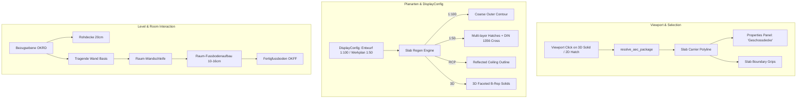

# Requirements

### Overview & Goals
Implement the next refinement phase and architectural enhancements for **Geschossdecken (Slabs), Deckenöffnungen (Slab Openings) and Floor Finishes (Fußbodenaufbauten)**. This phase focuses on:
1. **Interactive Selection & Entity Unit:** Ensuring selecting any derived 2D or 3D element of a slab selects the slab as a complete unit (analogous to walls), displaying the proper title "Geschossdecke" / "Slab" in the properties panel and activating boundary polygon grips.
2. **Plan-Type & Scale-Dependent Representation (Planart / Maßstab):** Granular display configurations for Entwurf 1:100 (coarse composite boundary or structural core only), Werkplan 1:50 (detailed multi-layer hatching and DIN 1356 breakthrough symbols), Reflected Ceiling Plan (Deckenspiegel), and 3D BIM.
3. **Concept & Architectural Strategy for Structural Slab (Rohdecke) vs. Floor Finishes (Fußbodenaufbau):** Integrating structural slab levels (OKRD) and finished floor levels (OKFF), supporting both structural slab styles, composite slab styles, and room-specific floor finish overrides (`RoomFinish`) from closed wall perimeters.

### Scope
- **In Scope:**
  - Viewport selection & hit resolution unification: clicking any 2D contour, ceiling line, sectional hatch, or 3D solid collapses selection to the slab carrier polyline (`resolve_aec_package`).
  - Properties panel & grip display: correctly resolving localized titles ("Geschossdecke" / "Slab"), property sections, and displaying corner/edge vertex grips on the host carrier polyline.
  - Scale & Plan-Type representation rules: configuring `SlabComponentSlot` display rules for Entwurf (1:100), Werkplan (1:50), Deckenspiegel (RCP), and 3D Model.
  - Layer function filtering: supporting display modes for "Nur Rohdecke" (`Structural`), "Gesamtkontur", and "Vollständiger Schichtaufbau".
  - Architectural foundation for Rohdecke (OKRD) vs. Fußbodenaufbau (OKFF) with room-specific floor build-ups.
- **Out of Scope:**
  - Full room scheduling / DIN 277 / WoFlV room area calculation (handled in the dedicated Rooms module phase).
  - Rebar and structural FEA calculations.

### User Stories
- **As an Architect**, I want to click any 2D line, hatch, or 3D body of a slab in the viewport and have the whole slab selected as a single entity, so that I can immediately view its properties and edit its boundary grips.
- **As a Draftsman**, I want the 1:100 floor plan to show a clean, simplified slab contour without confusing internal hatch lines, while the 1:50 section or detail view shows all individual layers and material hatches.
- **As a BIM Modeler**, I want structural walls to stand on the structural slab level (OKRD) while rooms can define room-specific floor build-ups (e.g. wet room tiles vs. living room parquet) without cutting up the main structural slab.

### Functional Requirements
- **Unified Selection & Grips:**
  - Viewport pick hit resolution maps derived child handles (`SLAB_REP`) to the slab carrier handle.
  - Localization strings for slab titles and properties use proper `tr!("aec", ...)` compound message resolution.
  - Selecting a slab displays vertex and edge grips directly on the boundary polygon.
- **Plan-Type & Scale Display Rules:**
  - Entwurf (1:100 / Coarse): Displays outer slab contour, suppresses or simplifies internal sectional layer hatches.
  - Werkplan (1:50 / Fine): Displays all individual layer boundaries, material hatches, and DIN 1356 opening breakthrough crosses.
  - Deckenspiegel (Reflected Ceiling Plan): Displays soffit boundary (UKD) and opening cutouts with dashed ceiling finish lines.
  - 3D Model: Generates accurate 3D faceted B-Rep solids per layer.
- **Rohdecke & Fußbodenaufbau Architecture:**
  - Clear level reference: OKRD (Oberkante Rohdecke) as the primary base level for structural walls and structural slabs; OKFF (Oberkante Fertigfußboden) for finished floor levels.
  - Slabs support both pure structural styles (Rohdecke) and multi-layer styles.
  - Room integration hooks: rooms can supply a `floor_finish_override` to customize floor build-up thickness and material per room.

# Technical Design

### Current Implementation Context
- **AEC Isolation & Guidelines:** All AEC domain logic resides strictly under `src/modules/aec/**`. Core CAD infrastructure (`src/scene/**`, `src/io/**`) interacts only via stable hooks.
- **Entity Architecture Pattern:** Walls and slabs use the carrier-derived entity pattern. The primary `LwPolyline` carries `OPENCAD_AEC` `SLAB` XDATA, and regeneration produces derived child entities (2D contours, hatches, and 3D solids) indexed via `CHILD_HANDLES` and `OWNER_HANDLE`.
- **Viewport Hit Resolution:** Viewport click selection previously only mapped wall packages; slab children were treated as raw individual polylines or solids.
- **Control Planes & Storeys:** Storeys provide floor-to-floor elevations (OKFF/OKRD); `ControlPlaneFacet` provides 3D plane definitions with `z_at_xy` and `z_offset_at_xy`.

### Key Architecture Decisions
- **Unified AEC Package Selection:** Replace wall-only package resolution in `src/app/update/viewport.rs` and `src/app/properties.rs` with unified `resolve_aec_package` that collapses any wall, opening, slab, or slab-opening derived child to its carrier entity, enabling proper property inspection and grip display.
- **Scale- & Plan-Type Dependent Layer Filtering:** In `slab_regen.rs` and `build_effective_slab_rule_set`, filter layer rendering based on active `DisplayConfig` and scale:
  - 1:100 (Entwurf): Outer boundary contour (`Contour2D`), suppressed internal hatches, or single structural core contour.
  - 1:50 (Werkplan): Full layer stack with individual layer borders and material hatches (`LayerHatch2D`).
  - Reflected Ceiling Plan (Deckenspiegel): Reflected soffit outlines and opening contours (`CeilingOutline2D`).
- **Two-Tier Floor Architecture (Rohdecke vs. Raum-Fußbodenaufbau):**
  - Geschossdecke (`Slab`) represents the primary structural slab (Rohdecke, reference OKRD).
  - Room Module (`Room`) automatically detects closed room perimeters and generates room-specific floor finish solids (`RoomFinish`) from OKRD to OKFF, allowing bathrooms, living rooms, and terraces to have varying build-up heights and materials.

### Proposed Architecture & Data Flow


### Data Models & Contracts
```rust
#[derive(Debug, Clone, PartialEq)]
pub struct Slab {
    pub style_id: String,
    pub storey_id: u32,
    pub layers: Vec<SlabLayer>,
    pub derived_handles: Vec<Handle>,
    pub opening_handles: Vec<Handle>,
    pub justification: SlabJustification,
    pub phase: PlanPhase,
    pub base_plane_id: Option<Uuid>,
    pub top_plane_id: Option<Uuid>,
    pub base_offset: f64,
    pub top_offset: f64,
}

#[derive(Debug, Clone, Copy, PartialEq, Eq)]
pub enum SlabJustification {
    Top,           // OKFF (Oberkante Fertigfußboden)
    StructuralTop, // OKRD (Oberkante Rohdecke)
    Bottom,        // UKD  (Unterkante Decke)
}

#[derive(Debug, Clone, PartialEq)]
pub struct SlabLayer {
    pub material: String,
    pub thickness: f64,
    pub function: LayerFunction,
    pub vertical_offset: f64,
    pub layer_override: Option<String>,
    pub hatch_override: Option<String>,
    pub layer_id: Uuid,
}

#[derive(Debug, Clone, Copy, PartialEq, Eq)]
pub enum LayerFunction {
    Structural,
    Insulation,
    Finish,
    Other,
}
```

### File Structure & Affected Components
- `src/app/update/viewport.rs`: Viewport hit resolution to map any AEC derived entity (slab, opening, wall) to its carrier.
- `src/app/properties.rs`: Single slab grip resolution and selection aggregation.
- `src/modules/aec/properties.rs`: Compound localization fixes (`tr!("aec", ...)`) and package collapse helpers.
- `src/modules/aec/engine/slab_regen.rs`: Plan-type- and scale-aware layer filtering (coarse vs. detailed multi-layer).
- `src/modules/aec/engine/library.rs`: `build_effective_slab_rule_set` tuning for planning stages (Entwurf 1:100 vs. Werkplan 1:50).
- `src/modules/aec/engine/room.rs`: Foundation for room-specific floor finish overrides.

# Testing

### Validation Approach
Automated unit and integration tests validate the refined selection, display rules, and domain models:
1. **Selection & Package Collapse Tests:** Validate that clicking a slab's 2D contour, ceiling line, sectional hatch, or 3D solid resolves to the carrier handle and returns the title "Geschossdecke" / "Slab".
2. **Grip Activation Tests:** Validate that selecting a slab carrier or any of its derived children yields boundary vertex grips.
3. **Plan-Type Display Tests:** Validate that switching between Entwurf 1:100 and Werkplan 1:50 dynamically toggles simplified vs. multi-layer hatching and outlines.
4. **Level & Offset Validation:** Validate that `StructuralTop` (OKRD) and `Top` (OKFF) justifications correctly offset the structural core and finish layers in 3D.

### Key Scenarios
- **Unit Selection:** Click on the 3D solid of a screed layer -> verify that the carrier `LwPolyline` is selected, the properties panel shows "Geschossdecke", and vertex grips appear around the slab boundary.
- **Scale Switching:** Switch active plan config from Werkplan 1:50 to Entwurf 1:100 -> verify that internal layer hatching is suppressed while outer boundary remains visible.
- **Reflected Ceiling Plan:** Switch to RCP -> verify that ceiling outline is drawn and opening cutouts are outlined.
- **Room Floor Finish Integration:** Verify that walls with base on OKRD cleanly sit on top of the structural slab core.

# Implementation Steps

### ✓ Step 1: Unified Selection and Viewport Hit Resolution for Slabs and Openings
- Unify `resolve_aec_package` across `src/app/update/viewport.rs` and `src/app/properties.rs` to map clicks on any 2D contour, ceiling line, sectional hatch, or 3D solid to its carrier entity.
- Wire `apply_aec_slab_grip` and `apply_aec_slab_opening_grip` into viewport grip handling and commit loops.
- Support single-slab and single-slab-opening grip resolution and ignore derived child entities when building grips.

### ✓ Step 2: Properties Panel and Localized Title Resolution
- Ensure selection collapse in `src/modules/aec/properties.rs` correctly resolves single slab and slab opening entities.
- Verify `tr!("aec", ...)` resolution for `"Geschossdecke"` / `"Slab"` and `"Deckenöffnung"` / `"Slab Opening"` in properties panel headers and section inspectors.
- Ensure properties inspection and grip editing are activated simultaneously upon selecting any derived element.

### ✓ Step 3: Plan-Type and Scale-Dependent Representation Rules
- Extend `build_effective_slab_rule_set` in `src/modules/aec/engine/library.rs` to support Entwurf 1:100 (coarse outer boundary, suppressed internal hatches), Werkplan 1:50 (full multi-layer hatching), and Reflected Ceiling Plan (Deckenspiegel).
- Implement layer function filtering (`LayerFunction::Structural` core vs finish/insulation) in `src/modules/aec/engine/slab_regen.rs` for 2D hatching and 3D solids.

### ✓ Step 4: Two-Tier Floor Architecture (Rohdecke vs. Room Floor Finish Override)
- Add domain models `RoomFinish` and `FloorFinishOverride` to `src/modules/aec/engine/room.rs` for room-specific floor finish overrides.
- Provide calculation helpers for structural slab top elevation (OKRD) and finished floor level (OKFF) with room-specific finish build-up heights.

### ✓ Step 5: Testing and End-to-End Validation
- Run and add unit/integration tests for selection package collapse, grip activation on slab components, scale/plan-type switching, and floor finish models.
- Validate that all AEC tests pass with `cargo test --lib modules::aec`.