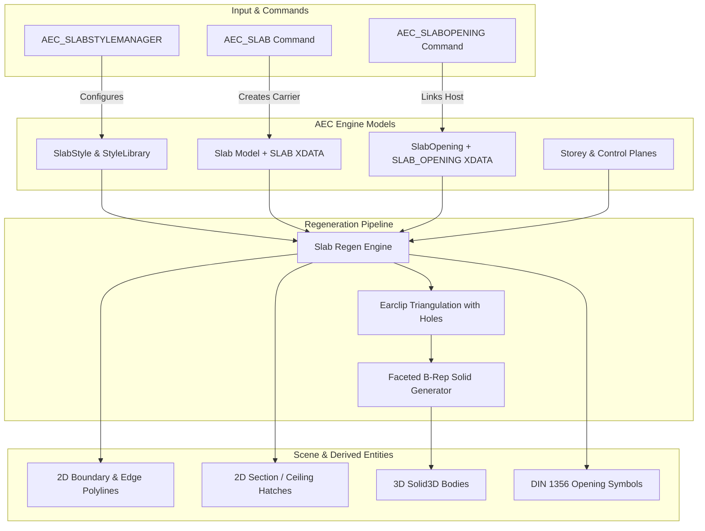

# Requirements

### Overview & Goals
Implement a comprehensive, parametric **Geschossdecken und Deckenöffnungen (Slabs & Slab Openings)** subsystem in OpenCADStudio's AEC module. The feature provides multi-layer floor, ceiling, and roof slabs with associative cutouts (stairwells, service shafts, skylights), plan-type-dependent 2D/3D representations, a dedicated Slab Style Manager, interactive drawing and grip tools, Properties panel integration, XREF synchronization, and IFC4 BIM export.

### Scope
- **In Scope:**
  - Multi-layer parametric slabs (`Slab`) with customizable layer compositions (material, thickness, function, offsets, hatch overrides).
  - Associative slab openings (`SlabOpening`) for through-holes (stairwells, shafts) and recessed depressions with DIN 1356 opening symbols.
  - Height binding to Storey elevations and 3D Control Planes (sloped roof planes, ramps) with standard justifications (OKFF, OKRD, UKD).
  - 2D representation (floor plan edge outlines, reflected ceiling plan / Deckenspiegel, 2D sectional hatches) and 3D faceted B-Rep solids (`Solid3D`).
  - Slab Style Manager dialog with hierarchical library management and 2D/3D preview modes.
  - Interactive commands: `AEC_SLAB` (points, rectangle, polyline conversion, wall loop auto-detect) and `AEC_SLABOPENING`.
  - Properties panel inspection and live style switching.
  - XREF dynamic regeneration and IFC4 `IfcSlab` export.
- **Out of Scope:**
  - Structural finite element analysis (FEA / FEM calculation of load distributions).
  - Parametric reinforcement bars (rebar modeling).

### User Stories
- **As an Architect**, I want to draw multi-layer floor and ceiling slabs interactively or derive them automatically from closed wall perimeters so that floor plates are accurately represented in 2D drawings and 3D models.
- **As a Draftsman**, I want to place stairwell openings and service shaft cutouts into slabs with standard DIN 1356 symbols so that floor plans and section details comply with drafting standards.
- **As a BIM Coordinator**, I want slab styles to carry material layers and export seamlessly to IFC4 (`IfcSlab`, `IfcRelVoidsElement`) so that the model can be used in coordination workflows.
- **As a User**, I want to adjust slab elevations via Storey settings or attach sloped slabs to roof control planes so that complex building geometries remain associative.

### Functional Requirements
- **Slab Data Model & Styles:**
  - Multi-layer composition with layer functions (`Structural`, `Insulation`, `Finish`, `Other`), variable/fixed thicknesses, and hatch overrides.
  - Justification options: `Top` (OKFF - Oberkante Fertigfußboden), `StructuralTop` (OKRD - Oberkante Rohdecke), and `Bottom` (UKD - Unterkante Decke).
  - Elevation binding to Storey Z-level and optional attachment to 3D Control Planes (`ControlPlaneFacet`).
- **Slab Openings:**
  - Parametric cutouts referencing host slab handles with boundary polygons (rectangular, polygonal, circular).
  - Modes: Through-cut (`ThroughHole`) and recessed niche (`Recess`).
  - DIN 1356 diagonal cross (`X`) symbol generation for 2D floor plans.
- **Interactive Tools & Grips:**
  - `AEC_SLAB`: Draw by picking polygon vertices, pick rectangular corners, select existing closed `LwPolyline`, or auto-detect from wall loops via `find_closed_loop`.
  - `AEC_SLABOPENING`: Select host slab and draw opening geometry.
  - Grips for boundary vertices (move, add edge, offset) and opening locations/dimensions.
- **Representation & Display Configurations:**
  - 2D Floor Plan: Outer boundary contour lines, hidden dashed outlines under walls, opening symbols.
  - 2D Section / Ceiling Plan: Planarten-dependent layer hatching according to `DisplayConfig`.
  - 3D Model: Faceted B-Rep solids per layer with subtracted openings, registered in `Scene.solid_models` and cached in `Scene.meshes` / `Scene.block_meshes`.
- **Management & Integration:**
  - Dedicated Slab Style Manager modal dialog with Standard, Project, and Session library tiers.
  - Properties panel integration for Slabs and Slab Openings.
  - Dynamic XREF regeneration across active `DisplayConfig` changes.
  - IFC4 export: `IfcSlab` with `IfcRelContainedInSpatialStructure` and `IfcOpeningElement` with `IfcRelVoidsElement`.

# Technical Design

### Current Implementation Context
- **AEC Isolation & Guidelines:** All AEC domain logic resides strictly under `src/modules/aec/**`. Core CAD infrastructure (`src/scene/**`, `src/io/**`) interacts only via stable hooks.
- **Entity Architecture Pattern:** Walls and openings use the carrier-derived entity pattern. A primary CAD entity (`LwPolyline`) carries `OPENCAD_AEC` XDATA, and regeneration creates/updates derived child entities (2D contours, hatches, and 3D solids) indexed via `CHILD_HANDLES` and `OWNER_HANDLE`.
- **3D B-Rep Modeling:** Solid bodies use direct faceted 2-Manifold B-Rep solid construction (`cadkernel::brep::make::faceted_solid`) or extruded profiles, providing instant tessellation without expensive boolean operations.
- **Control Planes & Storeys:** Storeys provide floor-to-floor elevations; `ControlPlaneFacet` provides 3D plane definitions with `z_at_xy` and `z_offset_at_xy`.

### Key Architecture Decisions
- **Carrier & Derived Children:** Slabs will use a closed `LwPolyline` carrier entity with `SLAB` XDATA. Regeneration dynamically produces 2D boundary contours, sectional layer hatches, and 3D B-Rep solids (`Solid3D`) registered under the carrier handle.
- **Associative Opening Entities:** Slab openings are represented by child entities with `SLAB_OPENING` XDATA referencing the host slab handle. Modifying or moving an opening automatically regenerates the host slab's 2D/3D cutouts.
- **Storey & Control Plane Attachment:** Slabs can bind to fixed storey elevations or interpolate across 3D control plane facets for sloped slabs and roofs, applying layer vertical offsets and justification (OKFF, OKRD, UKD).

### Proposed Architecture & Data Flow


### Data Models & Contracts
```rust
#[derive(Debug, Clone, PartialEq)]
pub struct Slab {
    pub style_id: String,
    pub storey_id: u32,
    pub layers: Vec<SlabLayer>,
    pub derived_handles: Vec<Handle>,
    pub opening_handles: Vec<Handle>,
    pub justification: SlabJustification,
    pub phase: PlanPhase,
    pub base_plane_id: Option<Uuid>,
    pub top_plane_id: Option<Uuid>,
    pub base_offset: f64,
    pub top_offset: f64,
}

#[derive(Debug, Clone, Copy, PartialEq, Eq)]
pub enum SlabJustification {
    Top,           // OKFF (Oberkante Fertigfußboden)
    StructuralTop, // OKRD (Oberkante Rohdecke)
    Bottom,        // UKD  (Unterkante Decke)
}

#[derive(Debug, Clone, PartialEq)]
pub struct SlabLayer {
    pub material: String,
    pub thickness: f64,
    pub function: LayerFunction,
    pub vertical_offset: f64,
    pub layer_override: Option<String>,
    pub hatch_override: Option<String>,
    pub layer_id: Uuid,
}

#[derive(Debug, Clone, PartialEq)]
pub struct SlabOpening {
    pub host_slab: Handle,
    pub kind: SlabOpeningKind,
    pub depth: SlabOpeningDepth,
    pub derived_handles: Vec<Handle>,
}

#[derive(Debug, Clone, Copy, PartialEq, Eq)]
pub enum SlabOpeningKind {
    Stairwell,
    Shaft,
    Duct,
    Chimney,
    Skylight,
    Custom,
}

#[derive(Debug, Clone, Copy, PartialEq)]
pub enum SlabOpeningDepth {
    ThroughHole,
    Recess(f64),
}
```

### File Structure & Affected Components
- `src/modules/aec/engine/slab.rs`: Slab entity domain model and layer calculations.
- `src/modules/aec/engine/slab_style.rs`: SlabStyle schema, formulas, and display rules.
- `src/modules/aec/engine/slab_opening.rs`: SlabOpening domain model and DIN 1356 symbol generators.
- `src/modules/aec/engine/slab_xdata.rs`: `SLAB` and `SLAB_OPENING` XDATA parser and serializer.
- `src/modules/aec/engine/slab_regen.rs` & `slab_package.rs`: 2D/3D geometry regeneration and derived child lifecycle.
- `src/modules/aec/engine/library.rs`: Integration of `slab_styles` into `StyleLibrary` and standard templates.
- `src/modules/aec/styles/slab_style_manager.rs`: Ribbon tool and manager state dispatch.
- `src/modules/aec/ui/aec_slab_style_manager.rs`: Modal UI for slab style management.
- `src/modules/aec/slabs/mod.rs`: Slabs module and tool exports.
- `src/modules/aec/slabs/slab.rs`: `AEC_SLAB` command.
- `src/modules/aec/slabs/slab_opening.rs`: `AEC_SLABOPENING` command.
- `src/modules/aec/slabs/slab_grip.rs`: Interactive grip handlers.
- `src/modules/aec/properties.rs`: Property panel sections for Slabs and Slab Openings.
- `src/modules/aec/engine/ifc.rs`: IFC4 `IfcSlab` and `IfcOpeningElement` serialization.
- `src/modules/aec/mod.rs`: Module registration and ribbon integration.
- `locales/`: Localization strings (German/English).

# Testing

### Validation Approach
Automated unit tests and integration tests will validate all layers of the Slab subsystem:
1. **Domain & XDATA Tests:** Unit tests validating XDATA serialization, round-trip fidelity, layer offsets, and style resolution.
2. **Geometry & B-Rep Tests:** Validation of 2D boundary generation, polygon ear-clipping with holes, 3D B-Rep manifold validity (`Solid3D`), and sloped control plane intersection.
3. **Interactive Commands & Grip Tests:** Simulation of point-by-point drawing, polyline conversion, wall loop auto-detection, and grip modifications.
4. **Integration & Display Switching Tests:** Multi-plan display switching (`DisplayConfig`), multi-layer hatching in sections, XREF propagation, and IFC4 file generation.

### Key Scenarios
- **Multi-layer Slab Creation:** Draw a closed polygon slab with 5 layers (Tiles, Screed, Insulation, Reinforced Concrete, Plaster) -> verify total thickness, layer offsets, 2D boundary, and 3D solid heights.
- **Slab Opening Insertion:** Insert a stairwell opening into a slab -> verify 2D DIN 1356 diagonal cross symbol and that all 3D solid layers contain a clean cutout.
- **Auto-Detect from Wall Loop:** Execute `AEC_SLAB` with auto-detect mode on 4 connected walls -> verify that the slab outer perimeter matches the outer/center wall polygon.
- **Control Plane Attachment:** Attach a slab to a sloped roof control plane -> verify that top and bottom surfaces incline correctly and calculate varying Z heights.
- **DisplayConfig Switching:** Switch from 1:100 Entwurf (single composite contour) to 1:50 Werkplan (detailed layer hatches) -> verify dynamic regeneration.
- **IFC4 Export:** Export drawing containing slabs and openings -> verify valid SPF syntax with `#...=IFCSLAB(...)`, `#...=IFCOPENINGELEMENT(...)`, and `#...=IFCRELVOIDSELEMENT(...)`.

### Edge Cases
- **Self-intersecting / Degenerate Polygons:** Gracefully reject or clean non-simple boundary polygons with clear command-line feedback.
- **Openings Outside / Exceeding Slab Boundary:** Detect and clamp openings that extend beyond the host slab perimeter.
- **Recessed Openings (Niches):** Verify that recesses subtract only up to the specified depth and preserve the remaining slab thickness.
- **Zero-Thickness Layers:** Handle zero-thickness membrane layers gracefully in 3D solid generation.
- **Multiple Openings in Close Proximity:** Verify triangulation stability when multiple holes or nested cutouts exist.

# Delivery Steps

### ✓ Step 1: Implement Slab and SlabOpening domain models, styles, and XDATA persistence
Slab and SlabOpening domain data models, style schemas, standard library presets, and XDATA round-trip serialization are fully functional.

- Create `src/modules/aec/engine/slab.rs` defining `Slab`, `SlabLayer`, `SlabJustification` (Top/OKFF, StructuralTop/OKRD, Bottom/UKD), and boundary geometry types.
- Create `src/modules/aec/engine/slab_style.rs` defining `SlabStyle`, multi-layer composition with `LayerValue` formula support, and display profiles.
- Create `src/modules/aec/engine/slab_opening.rs` defining `SlabOpening`, `SlabOpeningKind` (Stairwell, Shaft, Duct, Chimney, Skylight, Custom), and depth modes (ThroughHole, Recess).
- Create `src/modules/aec/engine/slab_xdata.rs` implementing `SLAB` and `SLAB_OPENING` XDATA read/write under `OPENCAD_AEC` APPID with layer snapshotting and derived handles index.
- Extend `src/modules/aec/engine/library.rs` with `slab_styles` in `StyleLibrary` and seed 10+ standard slab styles (e.g. Reinforced Concrete 20cm, Timber Joist 24cm, Floor Screed EG/OG 14cm, Insulated Flat Roof, Foundation Slab 30cm).

### ✓ Step 2: Implement 2D and 3D B-Rep geometry regeneration for multi-layer Slabs and Openings
2D floor plan outlines, sectional material hatches, and faceted 3D B-Rep solids with subtracted opening cutouts are generated across all plan types.

- Create `src/modules/aec/engine/slab_regen.rs` and `slab_package.rs` for multi-layer 2D/3D derived entity management.
- Implement 2D floor plan generation with visible outer boundaries, ceiling finish outlines (Deckenspiegel), and DIN 1356 diagonal cross symbols for openings.
- Implement 2D multi-layer sectional hatch generation respecting `DisplayConfig` scale and material hatching.
- Implement 3D multi-layer faceted B-Rep solid generation (`Solid3D`) using direct polygon ear-clipping triangulation with hole subtraction and sloped control plane elevation projection.
- Register generated 3D solids in `Scene.solid_models` and cache display meshes in `Scene.meshes` / `Scene.block_meshes`.

### ✓ Step 3: Implement Slab Style Manager UI with multi-mode preview and standard style templates
A dedicated Slab Style Manager modal dialog enables visual creation, multi-layer table editing, and 2D/3D previews of slab styles.

- Create `src/modules/aec/styles/slab_style_manager.rs` providing the `AEC_SLABSTYLEMANAGER` ribbon command, slot buffers, and manager state dispatch.
- Create `src/modules/aec/ui/aec_slab_style_manager.rs` implementing the modal UI with style hierarchy tree, layer stack editor (Material, Thickness, Function, Hatch, Layer), and multi-mode preview (Cross-Section, Reflected Ceiling Plan, 3D Isometric).
- Extend `src/modules/aec/state.rs` and `src/modules/aec/ui/modal_kind.rs` with `AecModalKind::SlabStyleManager`, `AecSlabPreviewMode`, and style picker targets.
- Integrate copy/duplicate/delete workflows between Global (Standard) and Project `.ocsproj` libraries.

### ✓ Step 4: Implement interactive drawing commands, grip editing, and wall loop auto-detection
Users can interactively draw slabs, insert opening cutouts, auto-detect boundaries from wall loops, and edit vertices via grips.

- Create `src/modules/aec/slabs/mod.rs` and register the new "Slabs" ribbon group in `src/modules/aec/mod.rs`.
- Create `src/modules/aec/slabs/slab.rs` implementing the `AEC_SLAB` command with interactive polygon drawing, rectangle placement, "Select Polyline" mode, and "Auto-Detect from Wall Loop" mode via `find_closed_loop`.
- Create `src/modules/aec/slabs/slab_opening.rs` implementing the `AEC_SLABOPENING` command for interactive insertion of rectangular, polygonal, and circular cutouts into existing slabs.
- Create `src/modules/aec/slabs/slab_grip.rs` providing interactive grip affordances for moving boundary vertices, adding edge points, and adjusting opening positions/sizes.

### ✓ Step 5: Integrate Properties panel, DisplayConfig plan switching, XREF sync, and IFC export
Slabs and openings seamlessly integrate with Properties inspection, DisplayConfig plan switching, external references (XREF), and IFC4 export.

- Update `src/modules/aec/properties.rs` to display slab properties (Style, Storey, Reference Plane, Offset, Justification, Layer Summary, Area, Perimeter, Volume) and opening properties.
- Update `src/modules/aec/engine/display_apply.rs` to dynamically regenerate slab representations when changing `DisplayConfig` (Entwurf 1:100, Werkplan 1:50, 3D BIM).
- Support dynamic slab regeneration across XREFs with handle remapping and epoch invalidation in `src/io/xref.rs`.
- Extend `src/modules/aec/engine/ifc.rs` to export `IfcSlab` (with `IfcSlabTypeEnum`), spatial structure containment, and `IfcOpeningElement` with `IfcRelVoidsElement`.
- Add German and English localization keys in `locales/` for all slab tools, manager labels, and prompts.