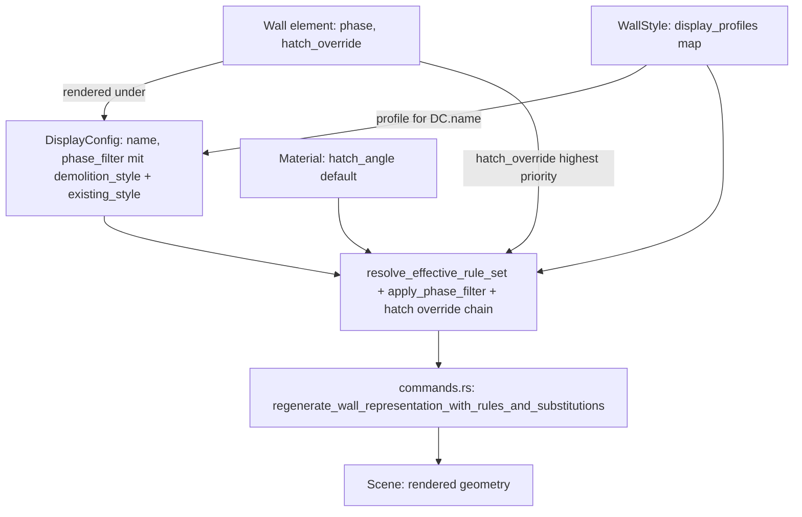

# Requirements

### Overview & Goals
Dieser Task überarbeitet das AEC-Darstellungssystem (Planarten/`DisplayConfig`, Darstellungskomponenten/`ComponentRuleSet`, Wandstile, Projekt- und Standardbibliothek), um es für den echten Büroalltag intuitiver zu machen. Kernproblem heute: Darstellungs-Overrides (welcher Slot ist sichtbar, welche Linie/Schraffur/Farbe gilt) hängen an der `DisplayConfig` (Planart) und sind dort pro Elementtyp (`ElementTypeId`) organisiert — wer wissen will "wie sieht Wandstil X in Planart Y aus", muss durch alle Planarten klicken. Zusätzlich lässt sich Schraffur/Linienfarbe eines Materials aktuell nicht je Planart/Maßstab variieren, und es gibt kein Attribut am Bauteil selbst, das "Neubau/Abbruch/Bestand" kennzeichnet (nur die Planart trägt heute eine `phase`).

Ziel: Overrides werden **stil-zentriert** verwaltet (pro Wandstil eine Liste von Darstellungs-Profilen, eines je `DisplayConfig`), Bauteile erhalten ein eigenes `phase`-Attribut, das automatisch mit der Planart abgeglichen wird (z. B. Abbruch-Bauteile automatisch anders dargestellt/gefiltert, ebenso Bestand), und Projekt-/Standardbibliothek-Handling wird an das neue Modell angepasst. Zusätzlich werden alle Linienart-/Linienfarbe-Auswahlfelder im AEC-Bereich auf die im Layer-Manager etablierten Vorschau-Widgets vereinheitlicht.

### Scope
#### In Scope
- Neues `phase: PlanPhase`-Feld direkt am `Wall`-Element, inkl. Property-Panel-Eingabe (einfaches Dropdown, konsistent mit bestehenden Property-Feldern).
- Automatischer Abgleich über `DisplayConfig.phase_filter: Option<PhaseFilter>`: sichtbare Phasen sowie je ein eigener optionaler Zusatzstil für "Abbruch" (`demolition_style`) UND "Bestand" (`existing_style`) — beide an derselben Stelle im Plan-Manager definierbar.
- Inversion der Override-Struktur: `WallStyle` bekommt `display_profiles: HashMap<DisplayConfigRef, ComponentRuleSet>`. Die alten Felder `DisplayConfig.component_rules`/`style_substitutions` werden ersatzlos gestrichen (kein Migrationscode) — bestehende Stile/Planarten werden bei Bedarf neu angelegt, bestehende Wände können gelöscht/neu gezeichnet werden.
- Neues Hatch-Override `hatch_angle`/`hatch_angle_relative` ("Schraffur relativ zum Bauteil") zusätzlich in `ComponentStyleOverride` (stil-/planartbezogen) sowie als optionales Feld direkt an `Wall` (Einzelwand-Override); Auflösung: Wand-Override > Stil-Profil-Override > Material-Default.
- Neue "Stil-Sicht" im Wandstil-Manager (`aec_wall_style_manager.rs`) als Tabellenliste + Detailformular: pro Wandstil Liste aller Planarten mit Status (Standard/Override), Klick öffnet granulares Formular.
- Plan-Manager verliert die pro-Elementtyp-Slot-Tabelle, behält Stammdaten und bekommt einen neuen Phasenfilter-Editor als Zwei-Stufen-Dialog (1. Sichtbarkeit je Phase, 2. optional Abbruch- und Bestand-Stil).
- Anpassung der Resolver-Kette in `commands.rs`: Datenquelle wechselt von `DisplayConfig.component_rules[element_type]` auf `WallStyle.display_profiles[display_config_ref]`.
- Vereinheitlichung aller Linienart-/Linienfarbe-Auswahlfelder im AEC-Bereich auf die Layer-Manager-Vorschau-Widgets (`combo_box`+`LinetypeItem`, `color_selector`).

#### Out of Scope
- Fenster/Türen oder andere neue Elementtypen (weiterhin nur Wände).
- Freies Multi-Storey-Geschossmodell (Datenmodell `Storey` existiert bereits, wird hier nicht erweitert).
- Weiterer Ausbau des Projekt-/Standardbibliothek-Copy-Mechanismus über die Anpassung an `display_profiles` hinaus.
- Migrationscode für alte `component_rules`/`style_substitutions` (bewusst gestrichen, vom Nutzer bestätigt).

### User Stories
- Als Planer möchte ich Gebäudemodelle mit mehreren Geschossen erstellen und die Eigenschaften der architektonischen Elemente über Stile steuern.
- Als Anwender möchte ich Stile primär aus einer Standard-/Büro-Bibliothek verwenden und einfach zwischen Standard- und Projektbibliothek kopieren/synchronisieren.
- Als Anwender möchte ich die tatsächliche Darstellung über Planarten und Darstellungskomponenten möglichst einfach umschalten, z. B. "Ausführungsplan 1:50" zeigt Wandschichten + Schraffuren, "Genehmigungsplan 1:100" zeigt nur den Gesamtumriss mit einer Schraffur.
- Als Anwender möchte ich, dass 3D-Ansichten unabhängig konfigurierbar sind (welche Schichten/Komponenten oder nur der Gesamtkörper gerendert werden).
- Als Anwender möchte ich Bauteile als "Neubau", "Abbruch" oder "Bestand" kennzeichnen können, damit Genehmigungspläne sie automatisch mit abweichender Darstellung (z. B. Bestand grau/dünn, Abbruch gestrichelt/rot) rendern.
- Als Anwender möchte ich Darstellungs-Overrides (Schraffur/Linienfarbe je Planart) pro Stil statt pro Planart/Elementtyp pflegen.
- Als Anwender möchte ich in allen Auswahlfeldern für Linienart/-farbe im AEC-Bereich dieselbe Vorschau wie im Layer-Manager sehen.

### Functional Requirements
- Eine Wand hat ein `phase`-Attribut (Neubau/Abbruch/Bestand), editierbar über eine Pick-Liste im Wand-Eigenschaften-Panel, Default "Neu".
- Eine `DisplayConfig` kann optional einen Phasenfilter definieren: sichtbare Phasen sowie je ein eigener Zusatzstil für Abbruch und für Bestand; ohne Filter verhält sich eine `DisplayConfig` wie heute (alle Phasen normal sichtbar) — keine Regression.
- Der Phasenfilter-Editor im Plan-Manager ist ein Zwei-Stufen-Dialog: Schritt 1 wählt sichtbare Phasen per Checkbox, Schritt 2 (nur erreichbar wenn Abbruch bzw. Bestand aktiviert ist) zeigt je Phase ein eigenes Formular für den jeweiligen Zusatzstil (Linienart/-farbe/Schraffur), mit Zurück/Übernehmen-Navigation.
- Im Wandstil-Manager kann der Anwender für den aktuell bearbeiteten Stil eine Tabelle aller `DisplayConfig`s (Status Standard/Override) sehen, per Klick ein Detailformular öffnen und darin Sichtbarkeit/Style-Override/Layer-Filter je Slot inkl. "Relativ zur Wand"-Option anlegen, bearbeiten oder entfernen.
- Der Plan-Manager zeigt weiterhin Name/Discipline/Scale/Phase/ViewType je Planart, aber keine Slot-Tabelle mehr — stattdessen einen Hinweis, dass Darstellungs-Overrides jetzt im Wandstil-Manager gepflegt werden.
- Eine einzelne Wand kann "Schraffur relativ zum Bauteil" (`hatch_angle_relative`) sowie einen zusätzlichen Winkel (`hatch_angle`) explizit überschreiben; ohne Override gilt die Vorrangkette Stil-Profil > Material.
- Alle Auswahlfelder für Linienart im AEC-Bereich (Material-Manager, Plan-Manager-Phasenfilter, Wandstil-Manager-Profil-Formular, Wand-Eigenschaften-Panel) rendern die Linienart als Vorschau (Name + ASCII-Art-Muster), analog zum `LinetypeItem`/`combo_box`-Muster im Layer-Manager.
- Alle Auswahlfelder für Linienfarbe im AEC-Bereich rendern eine Farb-Vorschau mit benanntem Farbnamen (Swatch + Name/Index), analog zum `color_selector`-Widget im Layer-Manager.

### Non-Functional Requirements
- Bestehende Tests für `regenerate_wall_representation_with_rules_and_substitutions` und verwandte Funktionen müssen nach dem Umbau weiterhin grün sein (ggf. angepasst auf neue Resolver-Signatur); Tests, die sich ausschließlich auf `component_rules`/`style_substitutions` stützen, werden entfernt oder auf `display_profiles` umgestellt.
- Konsistente UX: Linienart-/Linienfarbe-Auswahlfelder verwenden im gesamten AEC-Bereich dieselben Vorschau-fähigen Widgets wie der bestehende Layer-Manager (`layers.rs`), statt einfacher Text-/Hex-Eingabefelder.

# Technical Design

### Current Implementation
- `src/modules/aec/engine/plan_view.rs`: `DisplayConfig { name, discipline, scale, phase: PlanPhase, view_type: ViewType, component_rules: HashMap<ElementTypeId, ComponentRuleSet>, style_substitutions: HashMap<WallStyleRef, WallStyleRef> }`. `PlanPhase` (Existing/Demolition/New) beschreibt heute **die Planart selbst**, nicht ein einzelnes Bauteil.
- `src/modules/aec/engine/display_component.rs`: `WallComponentSlot`, `ComponentStyleOverride` (line_type/line_color/hatch_pattern/hatch_color/fill_color), `ComponentRuleSet { visibility, style_override, layer_style_override, layer_filter }`.
- `src/modules/aec/engine/wall_style.rs`: `WallStyle { style: Style, layers: Vec<Layer>, ... }`, kein `display_profiles`-Feld bisher.
- `src/modules/aec/engine/wall.rs`: `Wall`-Struct hat aktuell **kein** Phase-Feld und keinen Hatch-Override.
- `src/modules/aec/engine/library.rs`: `StyleLibrary { materials, wall_styles }`, `DisplayConfigLibrary`, `combined_material_entries`/`combined_wall_style_entries`.
- `src/modules/aec/commands.rs`: `regenerate_wall_representation_with_rules_and_substitutions(...)` und `_corner_`/`_precomputed_miters_`-Varianten; effektive `ComponentRuleSet` wird heute aus `display_config.component_rules.get(WALL_ELEMENT_TYPE_ID)` gezogen.
- `src/ui/window/aec_plan_manager.rs`: Formular mit Slot-Tabelle, Layer-Filter-Sektion, Style-Substitutions-Sektion; Linienart/-farbe aktuell als `text_input`.
- `src/ui/window/aec_wall_style_manager.rs`: bearbeitet bisher nur `WallStyle.layers`/Basiseigenschaften, keine Darstellungs-Profile.
- `src/ui/window/layers.rs`: etabliertes Vorbild für Vorschau-Widgets — `lt_cell`/`linetype_field` (Linienart mit ASCII-Vorschau über `combo_box`+`LinetypeItem`), `color_cell` (Farbe über `crate::ui::color_select::color_selector`, Swatch + benannter Wert).

### Key Decisions
1. **Stil-zentrierte Overrides:** `WallStyle.display_profiles: HashMap<String, ComponentRuleSet>` (Key = `DisplayConfig.name`). Der Wandstil-Manager wird primäre Editier-Oberfläche für "wie sieht dieser Stil in Planart X aus".
2. **Keine Migration:** `DisplayConfig.component_rules`/`style_substitutions` werden ersatzlos entfernt, kein Rücklesepfad; Anwender legt betroffene Stile/Planarten/Wände neu an.
3. **Resolver-Funktion:** `resolve_effective_rule_set(wall_style: &WallStyle, display_config_name: &str) -> Option<&ComponentRuleSet>` ersetzt den bisherigen Direktzugriff an allen Aufrufstellen in `commands.rs`.
4. **Phase als Bauteil-Attribut + Phasenfilter inkl. "Bestand"-Darstellung:** `Wall.phase: PlanPhase` (Default `New`); `DisplayConfig.phase_filter: Option<PhaseFilter>` mit `PhaseFilter { visible_phases: Vec<PlanPhase>, demolition_style: Option<ComponentStyleOverride>, existing_style: Option<ComponentStyleOverride> }`. "Abbruch" und "Bestand" bekommen damit symmetrisch je einen eigenen optionalen Zusatzstil an derselben Stelle (Plan-Manager-Phasenfilter-Dialog), statt an Material oder Stil verankert zu sein.
5. **Plan-Manager schlanker, Wandstil-Manager mächtiger:** Slot-/Layer-Filter-/Substitutions-Sektionen wandern vom Plan-Manager in den Wandstil-Manager; Plan-Manager behält Stammdaten + neuen Phasenfilter-Editor.
6. **Hatch-Relative-Override-Kette (Material -> Stil-Profil -> Wand-Instanz):** `hatch_angle: Option<f64>`/`hatch_angle_relative: Option<bool>` zusätzlich in `ComponentStyleOverride` sowie als eigenständiges `Wall.hatch_override: Option<ComponentStyleOverride>`. Auflösung: `Wall.hatch_override` > `WallStyle.display_profiles[config].style_override[slot]` > `Material`-Default.
7. **Konsistente Linienart-/Linienfarbe-Vorschau:** alle betroffenen Formulare ersetzen `text_input`/Hex-Feld durch die im Layer-Manager etablierten Widgets (`combo_box`+`LinetypeItem`, `color_select::color_selector`) — keine neue Widget-Implementierung, nur Wiederverwendung.

### GUI-Vorschlag für Abbruch/Bestand-Darstellung
**Plan-Manager – Phasenfilter, Zwei-Stufen-Dialog:**
```
Schritt 1: Sichtbarkeit
 [x] Neu sichtbar
 [x] Abbruch sichtbar
 [x] Bestand sichtbar
                              [Weiter >]

Schritt 2: Zusatzstile (nur für aktivierte Phasen)
 --- Abbruch ---
 Linienart:  [ ---- ---- ---- ▾ ]  (Vorschau wie Layer-Manager)
 Linienfarbe: [■ Rot (1) ▾]
 Schraffur:   [ ANSI31 ▾ ]  Winkel: [45°] [x] relativ zur Wand
 --- Bestand ---
 Linienart:  [ ________ ▾ ]  (durchgezogen, dünn)
 Linienfarbe: [■ Grau (8) ▾]
 Schraffur:   [ (keine) ▾ ]
           [< Zurück]              [Übernehmen]
```
**Wandstil-Manager – Darstellung je Planart (Tabellenliste + Detailformular):**
```
Planart-Liste                     Detailformular (bei Klick auf Zeile)
┌─────────────────────┬────────┐  Slot: Layers2D         [x] sichtbar
│ Ausführungsplan 1:50 │Override│  Linienart: [___ ▾]  Farbe: [■ ▾]
│ Genehmigungsplan 1:100│Override│  Schraffur: [ANSI31▾] Winkel: [30°]
│ Schalplan 1:50       │Standard│  [x] relativ zur Wand
└─────────────────────┴────────┘  [Speichern]  [Entfernen]
```
Beide Dialoge nutzen durchgängig `combo_box`+`LinetypeItem` und `color_selector` statt Text-/Hex-Feldern (siehe `layers.rs::lt_cell`/`color_cell`).

### Proposed Changes
- `src/modules/aec/engine/wall_style.rs`: `WallStyle` um `#[serde(default)] pub display_profiles: HashMap<String, ComponentRuleSet>` erweitern.
- `src/modules/aec/engine/wall.rs`: `Wall` um `#[serde(default)] pub phase: PlanPhase` sowie `#[serde(default)] pub hatch_override: Option<ComponentStyleOverride>` erweitern, inkl. XDATA-Persistenz.
- `src/modules/aec/engine/plan_view.rs`: neue Structs `PhaseFilter`, Feld `DisplayConfig.phase_filter: Option<PhaseFilter>`; `PlanPhase` erhält `Default`-Impl (`New`); `component_rules`/`style_substitutions` werden entfernt.
- `src/modules/aec/engine/display_component.rs`: `ComponentStyleOverride` um `hatch_angle`/`hatch_angle_relative` erweitern.
- `src/modules/aec/engine/library.rs`: `resolve_effective_rule_set(&WallStyle, &str) -> Option<&ComponentRuleSet>` implementieren.
- `src/modules/aec/commands.rs`: Aufrufstellen umstellen auf `resolve_effective_rule_set`; neue Hilfsfunktion `apply_phase_filter`; Hatch-Winkel-Berechnung nutzt neue Override-Kette.
- `src/ui/window/aec_wall_style_manager.rs`: neue Sektion "Darstellung je Planart" (Tabelle + Detailformular), Style-Override-Formular um "Relativ zur Wand"-Checkbox + Winkel-Feld.
- `src/ui/window/aec_plan_manager.rs`: Slot-/Layer-Filter/Substitutions-Sektionen entfernen; neuer Zwei-Stufen-Phasenfilter-Editor (Abbruch- UND Bestand-Stil).
- Wand-Eigenschaften-Panel: neues `phase`-Dropdown sowie optionale "Schraffur-Override"-Sektion.
- Alle Linienart-/Linienfarbe-Felder in den drei genannten Formularen auf Layer-Manager-Widgets umstellen; `linetype_field`-Muster aus `aec_material_manager.rs` als gemeinsamer Helper extrahiert.
- `src/app/mod.rs`/`src/app/update/mod.rs`: State/Message-Anpassungen für neue Sektionen, Combo-/Color-Picker-States.

### Data Models / Contracts
```rust
// wall_style.rs
pub struct WallStyle {
    #[serde(flatten)] pub style: Style,
    pub layers: Vec<Layer>,
    #[serde(default)] pub display_profiles: HashMap<String, ComponentRuleSet>, // key = DisplayConfig.name
}

// wall.rs
pub struct Wall {
    // ...
    #[serde(default)] pub phase: PlanPhase, // default: New
    #[serde(default)] pub hatch_override: Option<ComponentStyleOverride>,
}

// display_component.rs
pub struct ComponentStyleOverride {
    // existing fields (line_type, line_color, hatch_pattern, hatch_color, fill_color) ...
    #[serde(default)] pub hatch_angle: Option<f64>,
    #[serde(default)] pub hatch_angle_relative: Option<bool>,
}

// plan_view.rs
pub struct PhaseFilter {
    pub visible_phases: Vec<PlanPhase>,
    #[serde(default)] pub demolition_style: Option<ComponentStyleOverride>,
    #[serde(default)] pub existing_style: Option<ComponentStyleOverride>,
}
pub struct DisplayConfig {
    // component_rules/style_substitutions removed
    #[serde(default)] pub phase_filter: Option<PhaseFilter>,
}

// library.rs
pub fn resolve_effective_rule_set<'a>(style: &'a WallStyle, display_config_name: &str) -> Option<&'a ComponentRuleSet>;
```

### Components
- `src/modules/aec/engine/wall_style.rs` (erweitert): `display_profiles`.
- `src/modules/aec/engine/wall.rs` (erweitert): `phase`, `hatch_override`, XDATA read/write.
- `src/modules/aec/engine/display_component.rs` (erweitert): `hatch_angle`/`hatch_angle_relative`.
- `src/modules/aec/engine/plan_view.rs` (erweitert, alte Felder entfernt): `PhaseFilter`, `phase_filter`.
- `src/modules/aec/engine/library.rs` (erweitert): Resolver.
- `src/modules/aec/commands.rs` (erweitert): Resolver-Aufruf, Phasenfilter, Hatch-Override-Kette.
- `src/ui/window/aec_wall_style_manager.rs` (erweitert): Tabellenliste + Detailformular für Planart-Profile.
- `src/ui/window/aec_plan_manager.rs` (verschlankt + erweitert): Zwei-Stufen-Phasenfilter-Editor (Abbruch + Bestand).
- Wand-Eigenschaften-Panel (erweitert): `phase`-Dropdown, Schraffur-Override-Sektion.
- `src/ui/window/layers.rs` (Referenz, unverändert): Quelle der wiederzuverwendenden Vorschau-Widgets.
- `src/app/mod.rs`/`src/app/update/mod.rs`/`src/app/view/modal.rs` (erweitert): State/Message-Wiring.

### Architecture Diagram


### Risks
- Entfernen von `DisplayConfig.component_rules`/`style_substitutions` ohne Migration ist ein bewusster Breaking Change (vom Nutzer akzeptiert).
- `commands.rs` hat sehr viele Aufrufstellen der betroffenen Funktionen — Umstellung des Resolver-Aufrufs muss vollständig sein.
- Phasenfilter darf bestehende Konfigurationen ohne `phase_filter` nicht verändern (muss `None` = "wie heute" sein).
- Die Hatch-Override-Kette muss konsistent in allen `_corner_`/`_precomputed_miters_`-Varianten eingebaut werden.
- Die Umstellung auf `combo_box`/`color_selector` erhöht die Anzahl benötigter State-Felder an mehreren Stellen gleichzeitig; muss konsistent mit dem Muster aus `aec_material_manager.rs`/`layers.rs` umgesetzt werden.

# Delivery Steps

###   Step 1: Bauteil-Phase am Wall-Element und Phasenfilter auf DisplayConfig
Wände tragen ein eigenes Neubau/Abbruch/Bestand-Attribut, das eine Planart automatisch berücksichtigen kann.
- `PlanPhase` in `plan_view.rs` um `Default`-Impl (`New`) erweitern.
- `Wall` in `wall.rs` um `#[serde(default)] pub phase: PlanPhase` erweitern, inkl. XDATA-Persistenz.
- Neue Structs `PhaseFilter { visible_phases, demolition_style, existing_style }` und Feld `DisplayConfig.phase_filter: Option<PhaseFilter>` in `plan_view.rs`.
- Hilfsfunktion `apply_phase_filter` (rein, testbar) in `commands.rs`/`display_component.rs`, die Sichtbarkeit/Zusatzstil je Wand-Phase gegen einen `PhaseFilter` auflöst; `None`-Filter verhält sich wie heute.
- Property-Panel-Eingabe für `Wall.phase` ergänzen: einfaches Dropdown neben den bestehenden Wand-Eigenschaften.

###   Step 2: Stil-zentrierte Darstellungs-Overrides im Datenmodell und Resolver, alte Felder entfernen
Darstellungs-Overrides sind ab jetzt ausschließlich am Wandstil gespeichert und werden über eine zentrale Resolver-Funktion aufgelöst.
- `WallStyle` um `#[serde(default)] pub display_profiles: HashMap<String, ComponentRuleSet>` erweitern.
- `DisplayConfig.component_rules`/`style_substitutions` sowie ausschließlich darauf angewiesene Hilfsfunktionen entfernen — keine Migration.
- `resolve_effective_rule_set(style: &WallStyle, display_config_name: &str) -> Option<&ComponentRuleSet>` in `library.rs` implementieren.
- Unit-Tests, die bisher `component_rules`/`style_substitutions` direkt befüllt haben, auf `WallStyle.display_profiles` umstellen.

###   Step 3: commands.rs auf Resolver umstellen und Phasenfilter/Hatch-Override-Kette anwenden
Die Wand-Regenerierung nutzt die neue Datenquelle, den Phasenfilter und die Hatch-Override-Kette.
- Aufrufstellen in `src/app/update/mod.rs`/`src/app/commands/draw.rs` auf `resolve_effective_rule_set(wall_style, display_config.name)` umstellen.
- `apply_phase_filter` an den relevanten Regenerierungspfaden einhängen.
- `ComponentStyleOverride` um `hatch_angle`/`hatch_angle_relative` erweitern, `Wall` um `hatch_override: Option<ComponentStyleOverride>` (inkl. XDATA); Hatch-Winkel-Berechnung auf Vorrangkette `Wall.hatch_override` > Stil-Profil-Override > `Material` umstellen, konsistent in allen `_corner_`/`_precomputed_miters_`-Varianten.
- Bestehende und neue Unit-Tests (Phasenfilter, Override-Vorrangkette) grün stellen.

###   Step 4: Darstellungs-Profile-Editor im Wandstil-Manager
Anwender pflegen "wie sieht dieser Stil in Planart X aus" direkt im Wandstil-Manager statt im Plan-Manager.
- Neue Sektion `display_profile_section_view` in `aec_wall_style_manager.rs` nach dem Muster "Tabellenliste + Detailformular": Tabelle aller Planarten mit Status-Spalte ("Standard"/"Override"), Klick öffnet darunter das granulare Formular inkl. "Relativ zur Wand"-Checkbox + Winkel-Feld.
- State/Message-Erweiterungen analog zum bestehenden `PlanConfigFormState`-Muster.
- Speichern schreibt `WallStyle.display_profiles` über die kombinierte Standard-/Projektbibliothek-Logik (Copy-on-Write bleibt erhalten).

###   Step 5: Plan-Manager verschlanken und Zwei-Stufen-Phasenfilter-Editor ergänzen
Der Plan-Manager verwaltet nur noch Stammdaten und den neuen Phasenfilter inkl. Bestand- und Abbruch-Darstellung.
- In `aec_plan_manager.rs`: Slot-Tabelle, Layer-Filter-Sektion und Style-Substitutions-Sektion entfernen.
- Neuer Phasenfilter-Editor als Zwei-Stufen-Dialog: Schritt 1 Checkboxen je Phase (Neu/Abbruch/Bestand); Schritt 2 (bei aktivierter Abbruch- bzw. Bestand-Sichtbarkeit) je Phase ein eigenes Formular für `demolition_style` bzw. `existing_style`, mit Zurück/Übernehmen-Navigation.
- `AecPlanManagerApply` schreibt `phase_filter` aus dem neuen Edit-Buffer.
- Hinweistext, dass Darstellungs-Overrides jetzt im Wandstil-Manager gepflegt werden.

###   Step 6: Wand-Instanz-Override für Hatch-Winkel im Eigenschaften-Panel
Einzelne Wände können den Hatch-Winkel-Default aus Material/Stil-Profil gezielt überschreiben.
- Neue optionale Sektion im Wand-Eigenschaften-Panel: "Relativ zur Wand"-Checkbox + Winkel-Feld, die `Wall.hatch_override` befüllt/leert.
- State/Message-Erweiterung analog zum `phase`-Dropdown-Muster.
- Anzeige des aktuell effektiven Werts (aus welcher Ebene der Override-Kette er stammt), rein informativ.

###   Step 7: Linienart-/Linienfarbe-Vorschau in allen AEC-Formularen vereinheitlichen
Alle Linienart- und Linienfarbe-Auswahlfelder im AEC-Bereich zeigen dieselbe Vorschau wie der Layer-Manager.
- `linetype_field`-Muster aus `aec_material_manager.rs` als gemeinsamer Helper extrahieren.
- In `aec_plan_manager.rs` (Phasenfilter-Formulare) `text_input` für `line_type` durch `combo_box` mit `LinetypeItem` ersetzen (Muster aus `layers.rs::lt_cell`).
- In denselben Formularen, im Wandstil-Manager-Profil-Formular und im Wand-Eigenschaften-Panel (Hatch-Override) das Linienfarbe-Feld durch `color_select::color_selector` ersetzen (Muster aus `layers.rs::color_cell`).
- Sichtprüfung, dass alle betroffenen Formulare konsistent Vorschau statt Text-Eingabe zeigen.