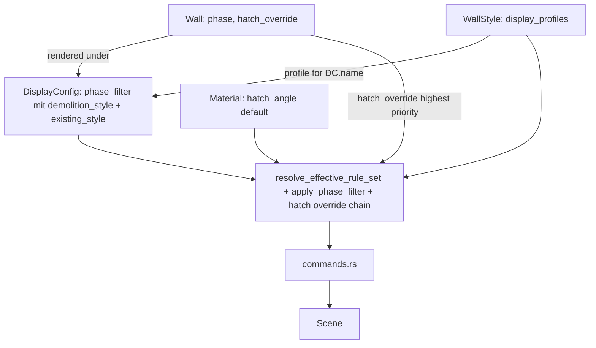

# Requirements

### Overview & Goals
Dieser Task überarbeitet das AEC-Darstellungssystem (Planarten/`DisplayConfig`, Darstellungskomponenten/`ComponentRuleSet`, Wandstile, Projekt- und Standardbibliothek), um es für den echten Büroalltag intuitiver zu machen. Kernproblem heute: Darstellungs-Overrides (welcher Slot ist sichtbar, welche Linie/Schraffur/Farbe gilt) hängen an der `DisplayConfig` (Planart) und sind dort pro Elementtyp (`ElementTypeId`) organisiert — wer wissen will "wie sieht Wandstil X in Planart Y aus", muss durch alle Planarten klicken. Zusätzlich lässt sich Schraffur/Linienfarbe eines Materials aktuell nicht je Planart/Maßstab variieren, und es gibt kein Attribut am Bauteil selbst, das "Neubau/Abbruch/Bestand" kennzeichnet (nur die Planart trägt heute eine `phase`).

Ziel: Overrides werden **stil-zentriert** verwaltet (pro Wandstil eine Liste von Darstellungs-Profilen, eines je `DisplayConfig`), Bauteile erhalten ein eigenes `phase`-Attribut, das automatisch mit der Planart abgeglichen wird, und Projekt-/Standardbibliothek-Handling wird an das neue Modell angepasst. Zusätzlich werden alle Linienart-/Linienfarbe-Auswahlfelder im AEC-Bereich auf die im Layer-Manager etablierten Vorschau-Widgets vereinheitlicht.

### Scope
#### In Scope
- Neues `phase: PlanPhase`-Feld direkt am `Wall`-Element, inkl. Property-Panel-Eingabe (Dropdown).
- `DisplayConfig.phase_filter: Option<PhaseFilter>`: sichtbare Phasen sowie je ein eigener optionaler Zusatzstil für "Abbruch" (`demolition_style`) UND "Bestand" (`existing_style`), an derselben Stelle im Plan-Manager definierbar.
- Inversion der Override-Struktur: `WallStyle` bekommt `display_profiles: HashMap<DisplayConfigRef, ComponentRuleSet>`. Alte Felder `DisplayConfig.component_rules`/`style_substitutions` werden ersatzlos gestrichen (kein Migrationscode).
- Neues Hatch-Override `hatch_angle`/`hatch_angle_relative` in `ComponentStyleOverride` sowie als optionales Feld direkt an `Wall`; Auflösung: Wand-Override > Stil-Profil-Override > Material-Default.
- Neue "Stil-Sicht" im Wandstil-Manager als Tabellenliste + Detailformular.
- Plan-Manager verliert die Slot-Tabelle, bekommt Zwei-Stufen-Phasenfilter-Editor.
- Resolver-Kette in `commands.rs` wechselt von `DisplayConfig.component_rules[element_type]` auf `WallStyle.display_profiles[display_config_ref]`.
- Vereinheitlichung aller Linienart-/Linienfarbe-Auswahlfelder im AEC-Bereich auf Layer-Manager-Vorschau-Widgets.

#### Out of Scope
- Fenster/Türen oder andere neue Elementtypen.
- Freies Multi-Storey-Geschossmodell.
- Weiterer Ausbau des Projekt-/Standardbibliothek-Copy-Mechanismus über `display_profiles` hinaus.
- Migrationscode für alte `component_rules`/`style_substitutions`.

### User Stories
- Als Planer möchte ich Gebäudemodelle mit mehreren Geschossen erstellen und die Eigenschaften der architektonischen Elemente über Stile steuern.
- Als Anwender möchte ich Stile primär aus einer Standard-/Büro-Bibliothek verwenden und einfach zwischen Standard- und Projektbibliothek kopieren/synchronisieren.
- Als Anwender möchte ich die Darstellung über Planarten und Darstellungskomponenten einfach umschalten (Ausführungsplan zeigt Schichten+Schraffuren, Genehmigungsplan nur Gesamtumriss).
- Als Anwender möchte ich, dass 3D-Ansichten unabhängig konfigurierbar sind.
- Als Anwender möchte ich Bauteile als "Neubau", "Abbruch" oder "Bestand" kennzeichnen, damit Genehmigungspläne sie automatisch abweichend darstellen (Bestand grau/dünn, Abbruch gestrichelt/rot).
- Als Anwender möchte ich Darstellungs-Overrides pro Stil statt pro Planart/Elementtyp pflegen.
- Als Anwender möchte ich in allen Linienart-/-farbe-Auswahlfeldern dieselbe Vorschau wie im Layer-Manager sehen.

### Functional Requirements
- Wand hat `phase`-Attribut, Dropdown im Eigenschaften-Panel, Default "Neu".
- `DisplayConfig.phase_filter` steuert sichtbare Phasen sowie Zusatzstile für Abbruch und Bestand; ohne Filter keine Regression.
- Phasenfilter-Editor im Plan-Manager: Zwei-Stufen-Dialog (1. Sichtbarkeit je Phase, 2. je Phase eigenes Zusatzstil-Formular mit Vorschau-Widgets).
- Wandstil-Manager: Tabelle aller `DisplayConfig`s (Standard/Override), Klick öffnet Detailformular mit Slot-Sichtbarkeit/Style-Override/Layer-Filter inkl. "Relativ zur Wand"-Option.
- Plan-Manager zeigt nur noch Stammdaten + Hinweistext, dass Overrides im Wandstil-Manager gepflegt werden.
- Einzelne Wand kann `hatch_angle`/`hatch_angle_relative` explizit überschreiben.
- Alle Linienart-Auswahlfelder im AEC-Bereich zeigen Vorschau (Name + ASCII-Muster) analog `LinetypeItem`/`combo_box` aus dem Layer-Manager.
- Alle Linienfarbe-Auswahlfelder zeigen Swatch + benannten Farbwert analog `color_selector` aus dem Layer-Manager.

### Non-Functional Requirements
- Bestehende Tests für `regenerate_wall_representation_with_rules_and_substitutions` müssen nach dem Umbau weiterhin grün sein (angepasst auf neue Resolver-Signatur); Tests, die nur auf entfallenden Feldern beruhen, werden entfernt/umgestellt.
- Konsistente UX: alle Linienart-/-farbe-Felder im AEC-Bereich nutzen dieselben Vorschau-Widgets wie `layers.rs`.

# Technical Design

### Current Implementation
- `src/modules/aec/engine/plan_view.rs`: `DisplayConfig { name, discipline, scale, phase, view_type, component_rules, style_substitutions }`.
- `src/modules/aec/engine/display_component.rs`: `WallComponentSlot`, `ComponentStyleOverride` (line_type/line_color/hatch_pattern/hatch_color/fill_color), `ComponentRuleSet`.
- `src/modules/aec/engine/wall_style.rs`: `WallStyle { style, layers, ... }`, kein `display_profiles`.
- `src/modules/aec/engine/wall.rs`: kein Phase-Feld, kein Hatch-Override.
- `src/modules/aec/engine/library.rs`: `StyleLibrary`, `DisplayConfigLibrary`, `combined_material_entries`/`combined_wall_style_entries`.
- `src/modules/aec/commands.rs`: `regenerate_wall_representation_with_rules_and_substitutions(...)`, effektive `ComponentRuleSet` kommt heute aus `display_config.component_rules.get(WALL_ELEMENT_TYPE_ID)`.
- `src/ui/window/aec_plan_manager.rs`: Formular mit Slot-Tabelle, Layer-Filter, Substitutions-Sektion; Linienart/-farbe aktuell als `text_input`.
- `src/ui/window/aec_wall_style_manager.rs`: bearbeitet bisher nur `layers`/Basiseigenschaften.
- `src/ui/window/layers.rs`: Referenz-Widgets — `lt_cell`/`linetype_field` (`combo_box`+`LinetypeItem`, ASCII-Vorschau), `color_cell` (`color_select::color_selector`, Swatch + Name).

### Key Decisions
1. **Stil-zentrierte Overrides:** `WallStyle.display_profiles: HashMap<String, ComponentRuleSet>` (Key = `DisplayConfig.name`).
2. **Keine Migration:** `component_rules`/`style_substitutions` werden ersatzlos entfernt.
3. **Resolver-Funktion:** `resolve_effective_rule_set(wall_style, display_config_name) -> Option<&ComponentRuleSet>`.
4. **Phase als Bauteil-Attribut + Phasenfilter inkl. "Bestand"-Darstellung:** `Wall.phase` (Default `New`); `PhaseFilter { visible_phases, demolition_style, existing_style }` — Abbruch und Bestand symmetrisch je ein Zusatzstil an derselben Stelle.
5. **Plan-Manager schlanker, Wandstil-Manager mächtiger.**
6. **Hatch-Override-Kette:** `Wall.hatch_override` > Stil-Profil-Override > Material-Default.
7. **Konsistente Linienart-/Linienfarbe-Vorschau:** Wiederverwendung der Layer-Manager-Widgets statt Text-/Hex-Feldern.

### GUI-Vorschlag für Darstellung
**Plan-Manager – Phasenfilter, Zwei-Stufen-Dialog:**
```
Schritt 1: Sichtbarkeit
 [x] Neu sichtbar
 [x] Abbruch sichtbar
 [x] Bestand sichtbar
                              [Weiter >]

Schritt 2: Zusatzstile (nur für aktivierte Phasen)
 --- Abbruch ---
 Linienart:  [ ---- ---- ---- ▾ ]  (Vorschau wie Layer-Manager)
 Linienfarbe: [■ Rot (1) ▾]
 Schraffur:   [ ANSI31 ▾ ]  Winkel: [45°] [x] relativ zur Wand
 --- Bestand ---
 Linienart:  [ ________ ▾ ]  (durchgezogen, dünn)
 Linienfarbe: [■ Grau (8) ▾]
 Schraffur:   [ (keine) ▾ ]
           [< Zurück]              [Übernehmen]
```
**Wandstil-Manager – Darstellung je Planart (Tabellenliste + Detailformular):**
```
Planart-Liste                      Detailformular (bei Klick auf Zeile)
┌───────────────────────┬────────┐  Slot: Layers2D         [x] sichtbar
│ Ausführungsplan 1:50  │Override│  Linienart: [___ ▾]  Farbe: [■ ▾]
│ Genehmigungsplan 1:100│Override│  Schraffur: [ANSI31▾] Winkel: [30°]
│ Schalplan 1:50        │Standard│  [x] relativ zur Wand
└───────────────────────┴────────┘  [Speichern]  [Entfernen]
```
**Wand-Eigenschaften-Panel – Phase + Hatch-Override:**
```
Wandstil:   [ Außenwand 300 ▾ ]
Phase:      [ Neu ▾ ]   (Neu / Abbruch / Bestand)
--- Schraffur-Override (optional) ---
[ ] Override aktiv
 Winkel: [__°]   [ ] relativ zur Wand
 Effektiv aus: Stil-Profil "Ausführungsplan 1:50"  (informativ)
```
Alle drei Dialoge nutzen durchgängig `combo_box`+`LinetypeItem` und `color_selector` statt Text-/Hex-Feldern (siehe `layers.rs::lt_cell`/`color_cell`).

### Proposed Changes
- `wall_style.rs`: `display_profiles` ergänzen.
- `wall.rs`: `phase`, `hatch_override` ergänzen, XDATA-Persistenz.
- `plan_view.rs`: `PhaseFilter`, `phase_filter`; `component_rules`/`style_substitutions` entfernen.
- `display_component.rs`: `ComponentStyleOverride` um `hatch_angle`/`hatch_angle_relative` erweitern.
- `library.rs`: `resolve_effective_rule_set` implementieren.
- `commands.rs`: Resolver-Aufruf statt Direktzugriff; `apply_phase_filter`; Hatch-Override-Kette in Winkelberechnung.
- `aec_wall_style_manager.rs`: neue Sektion "Darstellung je Planart" (Tabelle+Detailformular).
- `aec_plan_manager.rs`: Slot-/Layer-Filter/Substitutions-Sektionen entfernen; Zwei-Stufen-Phasenfilter-Editor.
- Wand-Eigenschaften-Panel: `phase`-Dropdown, Hatch-Override-Sektion.
- Linienart-/-farbe-Felder in allen drei Formularen auf Layer-Manager-Widgets umstellen; `linetype_field` als gemeinsamer Helper extrahiert.
- `src/app/mod.rs`/`src/app/update/mod.rs`: State/Message-Anpassungen.

### Data Models / Contracts
```rust
// wall_style.rs
pub struct WallStyle {
    #[serde(flatten)] pub style: Style,
    pub layers: Vec<Layer>,
    #[serde(default)] pub display_profiles: HashMap<String, ComponentRuleSet>,
}

// wall.rs
pub struct Wall {
    #[serde(default)] pub phase: PlanPhase,
    #[serde(default)] pub hatch_override: Option<ComponentStyleOverride>,
}

// display_component.rs
pub struct ComponentStyleOverride {
    #[serde(default)] pub hatch_angle: Option<f64>,
    #[serde(default)] pub hatch_angle_relative: Option<bool>,
}

// plan_view.rs
pub struct PhaseFilter {
    pub visible_phases: Vec<PlanPhase>,
    #[serde(default)] pub demolition_style: Option<ComponentStyleOverride>,
    #[serde(default)] pub existing_style: Option<ComponentStyleOverride>,
}
pub struct DisplayConfig {
    #[serde(default)] pub phase_filter: Option<PhaseFilter>,
}

// library.rs
pub fn resolve_effective_rule_set<'a>(style: &'a WallStyle, display_config_name: &str) -> Option<&'a ComponentRuleSet>;
```

### Architecture Diagram


### Risks
- Entfernen der alten Felder ohne Migration ist bewusster Breaking Change (akzeptiert).
- Sehr viele Aufrufstellen in `commands.rs` — Umstellung muss vollständig sein.
- Phasenfilter darf `None`-Fall nicht verändern.
- Hatch-Override-Kette muss in allen `_corner_`/`_precomputed_miters_`-Varianten konsistent sein.
- Mehr State-Felder durch `combo_box`/`color_selector`-Umstellung — konsistent mit `aec_material_manager.rs`/`layers.rs` halten.

# Delivery Steps

###   Step 1: Bauteil-Phase am Wall-Element und Phasenfilter auf DisplayConfig
Wände tragen ein eigenes Neubau/Abbruch/Bestand-Attribut, das eine Planart automatisch berücksichtigen kann.
- `PlanPhase` in `plan_view.rs` um `Default`-Impl (`New`) erweitern.
- `Wall` in `wall.rs` um `#[serde(default)] pub phase: PlanPhase` erweitern, inkl. XDATA-Persistenz.
- Neue Structs `PhaseFilter { visible_phases, demolition_style, existing_style }` und Feld `DisplayConfig.phase_filter: Option<PhaseFilter>`.
- Hilfsfunktion `apply_phase_filter` in `commands.rs`, die Sichtbarkeit/Zusatzstil je Wand-Phase gegen einen `PhaseFilter` auflöst; `None`-Filter verhält sich wie heute.
- Property-Panel-Dropdown für `Wall.phase` ergänzen.

###   Step 2: Stil-zentrierte Darstellungs-Overrides im Datenmodell und Resolver, alte Felder entfernen
Darstellungs-Overrides sind ab jetzt ausschließlich am Wandstil gespeichert und werden über eine zentrale Resolver-Funktion aufgelöst.
- `WallStyle` um `#[serde(default)] pub display_profiles: HashMap<String, ComponentRuleSet>` erweitern.
- `DisplayConfig.component_rules`/`style_substitutions` entfernen — keine Migration.
- `resolve_effective_rule_set(style, display_config_name)` in `library.rs` implementieren.
- Bestehende Unit-Tests auf `display_profiles` umstellen.

###   Step 3: commands.rs auf Resolver umstellen und Phasenfilter/Hatch-Override-Kette anwenden
Die Wand-Regenerierung nutzt die neue Datenquelle, den Phasenfilter und die Hatch-Override-Kette.
- Aufrufstellen in `src/app/update/mod.rs`/`src/app/commands/draw.rs` auf `resolve_effective_rule_set` umstellen.
- `apply_phase_filter` an den Regenerierungspfaden einhängen.
- `ComponentStyleOverride` um `hatch_angle`/`hatch_angle_relative` erweitern, `Wall` um `hatch_override` (inkl. XDATA); Hatch-Winkel-Berechnung auf Vorrangkette `Wall.hatch_override` > Stil-Profil > `Material` umstellen, konsistent in allen `_corner_`/`_precomputed_miters_`-Varianten.
- Neue Unit-Tests für Phasenfilter und Override-Vorrangkette.

###   Step 4: Darstellungs-Profile-Editor im Wandstil-Manager
Anwender pflegen 'wie sieht dieser Stil in Planart X aus' direkt im Wandstil-Manager.
- Neue Sektion in `aec_wall_style_manager.rs` als Tabellenliste (Planart-Status Standard/Override) + Detailformular bei Klick, inkl. 'Relativ zur Wand'-Checkbox + Winkel-Feld.
- State/Message-Erweiterungen analog `PlanConfigFormState`.
- Speichern schreibt `display_profiles` über die Standard-/Projektbibliothek-Logik (Copy-on-Write bleibt erhalten).

###   Step 5: Plan-Manager verschlanken und Zwei-Stufen-Phasenfilter-Editor ergänzen
Der Plan-Manager verwaltet nur noch Stammdaten und den neuen Phasenfilter inkl. Bestand- und Abbruch-Darstellung.
- Slot-Tabelle, Layer-Filter- und Substitutions-Sektion aus `aec_plan_manager.rs` entfernen.
- Zwei-Stufen-Phasenfilter-Dialog: Schritt 1 Checkboxen je Phase, Schritt 2 je Phase eigenes Formular für `demolition_style`/`existing_style` mit Zurück/Übernehmen-Navigation.
- `AecPlanManagerApply` schreibt `phase_filter`.
- Hinweistext, dass Overrides im Wandstil-Manager gepflegt werden.

###   Step 6: Wand-Instanz-Override für Hatch-Winkel im Eigenschaften-Panel
Einzelne Wände können den Hatch-Winkel-Default gezielt überschreiben.
- Neue optionale Sektion im Wand-Eigenschaften-Panel: 'Relativ zur Wand'-Checkbox + Winkel-Feld für `Wall.hatch_override`.
- State/Message-Erweiterung analog zum `phase`-Dropdown.
- Anzeige des effektiven Werts inkl. Herkunftsebene, rein informativ.

###   Step 7: Linienart-/Linienfarbe-Vorschau in allen AEC-Formularen vereinheitlichen
Alle Linienart- und Linienfarbe-Auswahlfelder im AEC-Bereich zeigen dieselbe Vorschau wie der Layer-Manager.
- `linetype_field`-Muster aus `aec_material_manager.rs` als gemeinsamer Helper extrahieren.
- In `aec_plan_manager.rs` (Phasenfilter-Formulare), `aec_wall_style_manager.rs` (Profil-Formular) und im Wand-Eigenschaften-Panel Linienart-`text_input` durch `combo_box`+`LinetypeItem` ersetzen.
- Linienfarbe-Felder in denselben Formularen durch `color_select::color_selector` ersetzen.
- Sichtprüfung, dass alle betroffenen Formulare konsistent Vorschau statt Text-Eingabe zeigen.