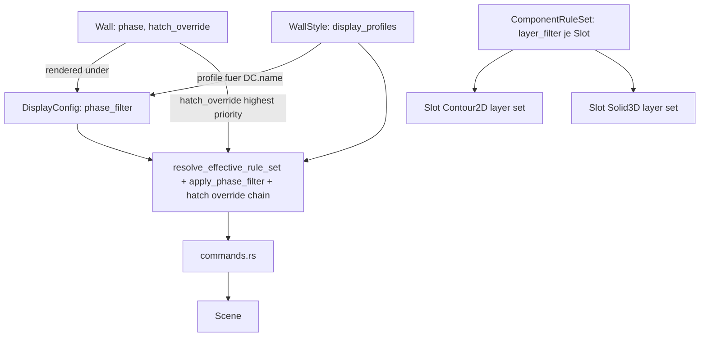

# Requirements

### Overview & Goals
Dieser Task überarbeitet das AEC-Darstellungssystem (Planarten/`DisplayConfig`, Darstellungskomponenten/`ComponentRuleSet`, Wandstile, Projekt- und Standardbibliothek). Kernproblem heute: Darstellungs-Overrides hängen an der `DisplayConfig` und sind pro Elementtyp organisiert; Schraffur/Linienfarbe eines Materials lässt sich nicht je Planart/Maßstab variieren; es gibt kein `phase`-Attribut am Bauteil; und die Auswahl, welche Wandschichten in die "Gesamtkontur" (2D) bzw. den "Gesamtkörper" (3D) einfließen, ist aktuell **ein einziger gemeinsamer Filter** für beide Slots (`ComponentRuleSet.layer_filter: LayerSelection`), kann also nicht wie gefordert je Slot (2D-Kontur vs. 3D-Körper) unterschiedlich sein.

Ziel: Overrides werden **stil-zentriert** verwaltet (`WallStyle.display_profiles`, ein Profil je `DisplayConfig`), Bauteile erhalten ein `phase`-Attribut mit automatischem Planart-Abgleich, und die Schicht-Auswahl für kontur-/körper-bildende Slots wird **pro Slot** (`Contour2D` unabhängig von `Solid3D`) und damit automatisch pro Planart/Maßstab konfigurierbar (weil jedes `display_profiles`-Profil bereits an eine konkrete `DisplayConfig` gebunden ist).

### Scope
#### In Scope
- Neues `phase: PlanPhase`-Feld am `Wall`-Element (Dropdown im Eigenschaften-Panel), `DisplayConfig.phase_filter` mit Zusatzstilen für Abbruch UND Bestand.
- Inversion der Override-Struktur: `WallStyle.display_profiles: HashMap<DisplayConfigRef, ComponentRuleSet>`. Alte Felder `DisplayConfig.component_rules`/`style_substitutions` werden ersatzlos gestrichen (keine Migration).
- **Layer-Filter wird slot-spezifisch:** `ComponentRuleSet.layer_filter` wechselt von einem einzigen `LayerSelection`-Feld auf `HashMap<String, LayerSelection>` (Slot-Key wie bei `visibility`/`style_override`), sodass `Contour2D` (2D-Gesamtkontur) und `Solid3D` (3D-Gesamtkörper) unabhängig konfiguriert werden können — z. B. 5-schalige Wand: im "Ausführungsplan 1:50" beide Slots `All`, im "M1:100" `Contour2D = Explicit([Mauerwerk, Dämmung])`, im "M1:200" `Contour2D = Explicit([Mauerwerk])`, im "Schalplan 1:50" `Contour2D = Explicit([Mauerwerk])` während `Solid3D` unverändert `All` bleiben kann.
- Hatch-Override-Kette (`hatch_angle`/`hatch_angle_relative`): Material -> Stil-Profil -> Wand-Instanz.
- Neue "Stil-Sicht" im Wandstil-Manager (Tabellenliste + Detailformular je Planart), inkl. je-Slot-Schichtauswahl (Checkboxen je Wandschicht) für `Contour2D` und `Solid3D` getrennt.
- Plan-Manager verliert Slot-Tabelle, bekommt Zwei-Stufen-Phasenfilter-Editor.
- Resolver-Kette in `commands.rs` wechselt auf `WallStyle.display_profiles`.
- Vereinheitlichung aller Linienart-/Linienfarbe-Auswahlfelder im AEC-Bereich auf Layer-Manager-Vorschau-Widgets.

#### Out of Scope
- Fenster/Türen oder andere neue Elementtypen.
- Freies Multi-Storey-Geschossmodell.
- Weiterer Ausbau des Projekt-/Standardbibliothek-Copy-Mechanismus über `display_profiles` hinaus.
- Migrationscode für alte `component_rules`/`style_substitutions`/altes `layer_filter`-Format.

### User Stories
- Als Planer möchte ich Gebäudemodelle mit mehreren Geschossen erstellen und die Eigenschaften der architektonischen Elemente über Stile steuern.
- Als Anwender möchte ich Stile primär aus einer Standard-/Büro-Bibliothek verwenden und einfach zwischen Standard- und Projektbibliothek kopieren/synchronisieren.
- Als Anwender möchte ich die Darstellung über Planarten und Darstellungskomponenten einfach umschalten.
- Als Anwender möchte ich, dass 3D-Ansichten unabhängig konfigurierbar sind.
- Als Anwender möchte ich Bauteile als "Neubau", "Abbruch" oder "Bestand" kennzeichnen.
- Als Anwender möchte ich Darstellungs-Overrides pro Stil statt pro Planart/Elementtyp pflegen.
- **Als Planer möchte ich je Planart/Maßstab getrennt festlegen können, welche Wandschichten die 2D-Gesamtkontur bilden und welche den 3D-Gesamtkörper**, damit z. B. eine 5-schalige Wand im Ausführungsplan 1:50 mit allen Schichten, im Übersichtsplan 1:200 nur mit dem Mauerwerk als Kontur erscheint, unabhängig davon wie der 3D-Körper dargestellt wird.
- Als Anwender möchte ich in allen Linienart-/-farbe-Auswahlfeldern dieselbe Vorschau wie im Layer-Manager sehen.

### Functional Requirements
- Wand hat `phase`-Attribut, Dropdown im Eigenschaften-Panel, Default "Neu".
- `DisplayConfig.phase_filter` steuert sichtbare Phasen sowie Zusatzstile für Abbruch und Bestand.
- Phasenfilter-Editor im Plan-Manager: Zwei-Stufen-Dialog.
- Wandstil-Manager: Tabelle aller `DisplayConfig`s (Standard/Override), Klick öffnet Detailformular mit Slot-Sichtbarkeit/Style-Override/Layer-Filter inkl. "Relativ zur Wand"-Option.
- **Layer-Filter je Slot:** Im Detailformular kann der Anwender für `Contour2D` und für `Solid3D` jeweils unabhängig zwischen "Alle Schichten" und einer expliziten Checkbox-Auswahl der Wandschichten wählen; die getroffene Auswahl gilt nur für das aktuell bearbeitete `display_profiles`-Profil (also nur für die eine Planart/Maßstab).
- Ein Profil ohne explizite Angabe für einen der beiden Slots verhält sich wie heute (`All`, alle Schichten) — keine Regression für bestehende, noch nicht bearbeitete Profile.
- Plan-Manager zeigt nur noch Stammdaten + Hinweistext, dass Overrides im Wandstil-Manager gepflegt werden.
- Einzelne Wand kann `hatch_angle`/`hatch_angle_relative` explizit überschreiben.
- Alle Linienart-Auswahlfelder im AEC-Bereich zeigen Vorschau (Name + ASCII-Muster) analog `LinetypeItem`/`combo_box` aus dem Layer-Manager.
- Alle Linienfarbe-Auswahlfelder zeigen Swatch + benannten Farbwert analog `color_selector`.

### Non-Functional Requirements
- Bestehende Tests für `regenerate_wall_representation_with_rules_and_substitutions` und für `layer_filter_to_ui_state`/`layer_filter_from_selection` müssen nach dem Umbau auf die neue `HashMap<String, LayerSelection>`-Form angepasst weiterhin grün sein.
- Konsistente UX: alle Linienart-/-farbe-Felder im AEC-Bereich nutzen dieselben Vorschau-Widgets wie `layers.rs`.

# Technical Design

### Current Implementation
- `src/modules/aec/engine/plan_view.rs`: `DisplayConfig { name, discipline, scale, phase, view_type, component_rules, style_substitutions }`.
- `src/modules/aec/engine/display_component.rs`: `ComponentRuleSet { visibility: HashMap<String,bool>, style_override: HashMap<String,ComponentStyleOverride>, layer_style_override: Vec<LayerStyleOverride>, layer_filter: LayerSelection }` — **`layer_filter` ist heute EIN Feld für den ganzen Rule-Set**, nicht je Slot; `LayerSelection::{All, Explicit(Vec<LayerRef>)}`; Helfer `layer_filter_to_ui_state`/`layer_filter_from_selection` bereits vorhanden für die Checkbox-UI.
- `src/modules/aec/engine/wall_style.rs`: `WallStyle { style, layers, ... }`, kein `display_profiles`.
- `src/modules/aec/engine/wall.rs`: kein Phase-Feld, kein Hatch-Override.
- `src/modules/aec/commands.rs`: `regenerate_wall_representation_with_rules_and_substitutions(...)`, liest `rules.layer_filter` einmal und wendet es sowohl für `Contour2D`- als auch `Solid3D`-Geometrie an (gemeinsame Quelle).
- `src/ui/window/aec_plan_manager.rs` / `aec_wall_style_manager.rs` / `layers.rs`: siehe vorherige Runden (Slot-Tabelle, Vorschau-Widgets `lt_cell`/`color_cell`).

### Key Decisions
1. **Stil-zentrierte Overrides:** `WallStyle.display_profiles: HashMap<String, ComponentRuleSet>` (Key = `DisplayConfig.name`).
2. **Keine Migration:** `component_rules`/`style_substitutions` sowie das alte einheitliche `layer_filter`-Feld werden ersatzlos entfernt/ersetzt.
3. **Resolver-Funktion:** `resolve_effective_rule_set(wall_style, display_config_name) -> Option<&ComponentRuleSet>`.
4. **Phase als Bauteil-Attribut + Phasenfilter inkl. "Bestand"-Darstellung.**
5. **Plan-Manager schlanker, Wandstil-Manager mächtiger.**
6. **Hatch-Override-Kette:** `Wall.hatch_override` > Stil-Profil-Override > Material-Default.
7. **Layer-Filter wird slot-spezifisch (neue Entscheidung):** `ComponentRuleSet.layer_filter` wechselt von `LayerSelection` auf `HashMap<String, LayerSelection>` mit denselben Slot-Keys wie `visibility`/`style_override` (in der Praxis nur für `Contour2D`/`Solid3D` relevant, aber generisch gehalten für zukünftige aggregierende Slots). Ein fehlender Eintrag bedeutet weiterhin `All` (non-breaking Default). Weil `layer_filter` bereits Teil von `ComponentRuleSet` ist und `ComponentRuleSet` jetzt pro `WallStyle.display_profiles`-Eintrag (= pro Planart) existiert, ist "Layer-Filter abhängig von Planart/Maßstab" bereits durch die Stil-zentrierte Struktur aus Entscheidung 1 automatisch erfüllt — es fehlte nur die Trennung zwischen `Contour2D` und `Solid3D` innerhalb desselben Profils, die diese Entscheidung ergänzt.
8. **Konsistente Linienart-/Linienfarbe-Vorschau:** Wiederverwendung der Layer-Manager-Widgets statt Text-/Hex-Feldern.

### Proposed Changes
- `display_component.rs`: `ComponentRuleSet.layer_filter: LayerSelection` -> `layer_filter: HashMap<String, LayerSelection>`; neue Helfer `layer_filter_for(&self, slot) -> &LayerSelection` (Default `All` wenn kein Eintrag) analog zu `is_visible`/`style_for`; `layer_filter_to_ui_state`/`layer_filter_from_selection` bleiben unverändert nutzbar, werden aber pro Slot aufgerufen statt einmal global.
- `wall_style.rs`: `display_profiles` ergänzen.
- `wall.rs`: `phase`, `hatch_override` ergänzen, XDATA-Persistenz.
- `plan_view.rs`: `PhaseFilter`, `phase_filter`; `component_rules`/`style_substitutions` entfernen.
- `library.rs`: `resolve_effective_rule_set` implementieren.
- `commands.rs`: Resolver-Aufruf statt Direktzugriff; bei Aufbau der `Contour2D`-Geometrie `rules.layer_filter_for(WallComponentSlot::Contour2D)`, bei `Solid3D`-Geometrie `rules.layer_filter_for(WallComponentSlot::Solid3D)` verwenden (statt eines gemeinsamen Felds); `apply_phase_filter`; Hatch-Override-Kette.
- `aec_wall_style_manager.rs`: Detailformular bekommt **zwei** Schicht-Auswahl-Abschnitte ("Schichten für 2D-Gesamtkontur", "Schichten für 3D-Gesamtkörper"), jeweils Checkbox-Liste der Wandschichten (Muster `layer_filter_to_ui_state`), unabhängig voneinander editierbar.
- `aec_plan_manager.rs`: Slot-/Layer-Filter/Substitutions-Sektionen entfernen; Zwei-Stufen-Phasenfilter-Editor.
- Wand-Eigenschaften-Panel: `phase`-Dropdown, Hatch-Override-Sektion.
- Linienart-/-farbe-Felder auf Layer-Manager-Widgets umstellen.

### Data Models / Contracts
```rust
// display_component.rs
pub struct ComponentRuleSet {
    pub visibility: HashMap<String, bool>,
    pub style_override: HashMap<String, ComponentStyleOverride>,
    pub layer_style_override: Vec<LayerStyleOverride>,
    // was: pub layer_filter: LayerSelection,
    #[serde(default)]
    pub layer_filter: HashMap<String, LayerSelection>, // key = WallComponentSlot::key(), e.g. "Contour2D" / "Solid3D"
}
impl ComponentRuleSet {
    pub fn layer_filter_for(&self, slot: WallComponentSlot) -> &LayerSelection; // defaults to &LayerSelection::All
}

// wall_style.rs
pub struct WallStyle {
    #[serde(flatten)] pub style: Style,
    pub layers: Vec<Layer>,
    #[serde(default)] pub display_profiles: HashMap<String, ComponentRuleSet>,
}

// wall.rs
pub struct Wall {
    #[serde(default)] pub phase: PlanPhase,
    #[serde(default)] pub hatch_override: Option<ComponentStyleOverride>,
}

// plan_view.rs
pub struct PhaseFilter {
    pub visible_phases: Vec<PlanPhase>,
    #[serde(default)] pub demolition_style: Option<ComponentStyleOverride>,
    #[serde(default)] pub existing_style: Option<ComponentStyleOverride>,
}
pub struct DisplayConfig {
    #[serde(default)] pub phase_filter: Option<PhaseFilter>,
}
```

### GUI-Vorschlag: Layer-Filter je Slot im Wandstil-Manager-Detailformular
```
Detailformular fuer Planart "Genehmigungsplan 1:100"
--- Slot: Contour2D (2D-Gesamtkontur) ---
[ ] Alle Schichten            (aktuell: Explicit)
  [x] Mauerwerk   [x] Daemmung   [ ] Putz aussen   [ ] Putz innen   [ ] Vorsatzschale
--- Slot: Solid3D (3D-Gesamtkoerper) ---
[x] Alle Schichten
           [Speichern]  [Entfernen]
```
Beide Abschnitte nutzen dieselbe Checkbox-Liste (Muster `layer_filter_to_ui_state`), aber getrennte State-Buffer je Slot.

### Architecture Diagram


### Risks
- Entfernen der alten Felder inkl. altem `layer_filter`-Format ohne Migration ist bewusster Breaking Change (akzeptiert, analog zu den anderen Feldern).
- Sehr viele Aufrufstellen in `commands.rs` — Umstellung auf `layer_filter_for(slot)` muss an allen Stellen erfolgen, an denen bisher das einzelne `layer_filter`-Feld gelesen wurde.
- Phasenfilter darf `None`-Fall nicht verändern.
- Zwei getrennte Checkbox-Abschnitte im Detailformular erhöhen die State-Komplexität (zwei `(bool, Vec<LayerRef>)`-Buffer statt einem) — konsistent mit dem bestehenden `layer_filter_to_ui_state`-Muster halten.
- Hatch-Override-Kette muss in allen `_corner_`/`_precomputed_miters_`-Varianten konsistent sein.

# Delivery Steps

### ✓ Step 1: Bauteil-Phase am Wall-Element und Phasenfilter auf DisplayConfig
Wände tragen ein eigenes Neubau/Abbruch/Bestand-Attribut, das eine Planart automatisch berücksichtigen kann.
- `PlanPhase` in `plan_view.rs` um `Default`-Impl (`New`) erweitern.
- `Wall` in `wall.rs` um `#[serde(default)] pub phase: PlanPhase` erweitern, inkl. XDATA-Persistenz.
- Neue Structs `PhaseFilter { visible_phases, demolition_style, existing_style }` und Feld `DisplayConfig.phase_filter: Option<PhaseFilter>`.
- Hilfsfunktion `apply_phase_filter` in `commands.rs`.
- Property-Panel-Dropdown für `Wall.phase` ergänzen.

### ✓ Step 2: Stil-zentrierte Overrides und slot-spezifischer Layer-Filter im Datenmodell
Darstellungs-Overrides liegen jetzt am Wandstil, und die Schicht-Auswahl für Kontur/Körper ist pro Slot getrennt konfigurierbar.
- `WallStyle` um `#[serde(default)] pub display_profiles: HashMap<String, ComponentRuleSet>` erweitern.
- `ComponentRuleSet.layer_filter` von `LayerSelection` auf `HashMap<String, LayerSelection>` umstellen (Slot-Key wie bei `visibility`); neue Methode `layer_filter_for(&self, slot) -> &LayerSelection` mit `All`-Default.
- `DisplayConfig.component_rules`/`style_substitutions` entfernen — keine Migration.
- `resolve_effective_rule_set(style, display_config_name)` in `library.rs` implementieren.
- Bestehende Unit-Tests für `layer_filter_to_ui_state`/`layer_filter_from_selection` und `ComponentRuleSet` auf die neue `HashMap`-Form und `display_profiles` umstellen.

### ✓ Step 3: commands.rs auf Resolver, Phasenfilter, Hatch- und Layer-Filter-Kette pro Slot umstellen
Die Wand-Regenerierung nutzt die neue Datenquelle, wendet den Phasenfilter an und liest Layer-Filter getrennt für Contour2D und Solid3D.
- Aufrufstellen in `src/app/update/mod.rs`/`src/app/commands/draw.rs` auf `resolve_effective_rule_set` umstellen.
- Beim Aufbau der `Contour2D`-Geometrie `layer_filter_for(Contour2D)`, beim Aufbau der `Solid3D`-Geometrie `layer_filter_for(Solid3D)` verwenden statt eines gemeinsamen Felds.
- `apply_phase_filter` an den Regenerierungspfaden einhängen.
- `ComponentStyleOverride` um `hatch_angle`/`hatch_angle_relative` erweitern, `Wall` um `hatch_override` (inkl. XDATA); Hatch-Winkel-Vorrangkette `Wall.hatch_override` > Stil-Profil > `Material` konsistent in allen `_corner_`/`_precomputed_miters_`-Varianten.
- Neue Unit-Tests: unterschiedliche Layer-Filter für Contour2D vs. Solid3D im selben Profil, Phasenfilter, Override-Vorrangkette.

### ✓ Step 4: Darstellungs-Profile-Editor im Wandstil-Manager mit getrennter Schichtauswahl je Slot
Anwender pflegen 'wie sieht dieser Stil in Planart X aus' inklusive getrennter Schichtauswahl für 2D-Kontur und 3D-Körper direkt im Wandstil-Manager.
- Neue Sektion in `aec_wall_style_manager.rs` als Tabellenliste (Planart-Status Standard/Override) + Detailformular bei Klick.
- Zwei unabhängige Checkbox-Abschnitte im Detailformular: 'Schichten für 2D-Gesamtkontur' und 'Schichten für 3D-Gesamtkörper', je mit eigenem `(bool, Vec<LayerRef>)`-State-Buffer nach dem `layer_filter_to_ui_state`-Muster.
- 'Relativ zur Wand'-Checkbox + Winkel-Feld für Hatch-Override ergänzen.
- Speichern schreibt `display_profiles` (inkl. beider Layer-Filter-Slots) über die Standard-/Projektbibliothek-Logik (Copy-on-Write bleibt erhalten).

### ✓ Step 5: Plan-Manager verschlanken und Zwei-Stufen-Phasenfilter-Editor ergänzen
Der Plan-Manager verwaltet nur noch Stammdaten und den neuen Phasenfilter inkl. Bestand- und Abbruch-Darstellung.
- Slot-Tabelle, Layer-Filter- und Substitutions-Sektion aus `aec_plan_manager.rs` entfernen.
- Zwei-Stufen-Phasenfilter-Dialog: Schritt 1 Checkboxen je Phase, Schritt 2 je Phase eigenes Formular für `demolition_style`/`existing_style`.
- `AecPlanManagerApply` schreibt `phase_filter`.
- Hinweistext, dass Overrides (inkl. Layer-Filter je Slot) im Wandstil-Manager gepflegt werden.

### ✓ Step 6: Wand-Instanz-Override für Hatch-Winkel im Eigenschaften-Panel
Einzelne Wände können den Hatch-Winkel-Default gezielt überschreiben.
- Neue optionale Sektion im Wand-Eigenschaften-Panel: 'Relativ zur Wand'-Checkbox + Winkel-Feld für `Wall.hatch_override`.
- State/Message-Erweiterung analog zum `phase`-Dropdown.
- Anzeige des effektiven Werts inkl. Herkunftsebene, rein informativ.

### ✓ Step 7: Linienart-/Linienfarbe-Vorschau in allen AEC-Formularen vereinheitlichen
Alle Linienart- und Linienfarbe-Auswahlfelder im AEC-Bereich zeigen dieselbe Vorschau wie der Layer-Manager.
- `linetype_field`-Muster aus `aec_material_manager.rs` als gemeinsamer Helper extrahieren.
- In `aec_plan_manager.rs`, `aec_wall_style_manager.rs` und im Wand-Eigenschaften-Panel Linienart-`text_input` durch `combo_box`+`LinetypeItem` ersetzen.
- Linienfarbe-Felder in denselben Formularen durch `color_select::color_selector` ersetzen.
- Sichtprüfung, dass alle betroffenen Formulare konsistent Vorschau statt Text-Eingabe zeigen.