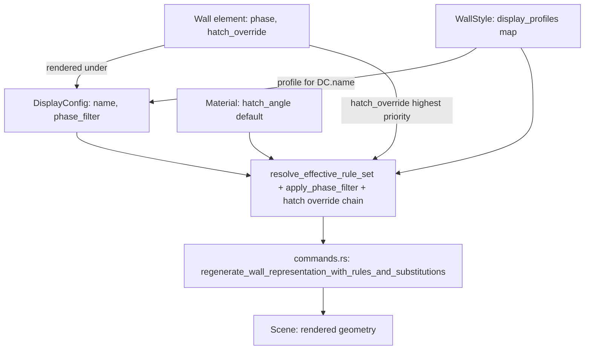

# Requirements

### Overview & Goals
Dieser Task überarbeitet das AEC-Darstellungssystem (Planarten/`DisplayConfig`, Darstellungskomponenten/`ComponentRuleSet`, Wandstile, Projekt- und Standardbibliothek), um es für den echten Büroalltag intuitiver zu machen. Kernproblem heute: Darstellungs-Overrides (welcher Slot ist sichtbar, welche Linie/Schraffur/Farbe gilt) hängen an der `DisplayConfig` (Planart) und sind dort pro Elementtyp (`ElementTypeId`) organisiert — wer wissen will "wie sieht Wandstil X in Planart Y aus", muss durch alle Planarten klicken. Zusätzlich lässt sich Schraffur/Linienfarbe eines Materials aktuell nicht je Planart/Maßstab variieren, und es gibt kein Attribut am Bauteil selbst, das "Neubau/Abbruch/Bestand" kennzeichnet (nur die Planart trägt heute eine `phase`).

Ziel: Overrides werden **stil-zentriert** verwaltet (pro Wandstil eine Liste von Darstellungs-Profilen, eines je `DisplayConfig`), Bauteile erhalten ein eigenes `phase`-Attribut, das automatisch mit der Planart abgeglichen wird (z. B. Abbruch-Bauteile automatisch anders dargestellt/gefiltert), und Projekt-/Standardbibliothek-Handling (bereits weitgehend vorhanden: kombinierte Ansicht, Copy-on-Write, Badges) wird an das neue Modell angepasst.

### Scope
#### In Scope
- Neues `phase: PlanPhase`-Feld direkt am `Wall`-Element (zusätzlich zum bestehenden `DisplayConfig.phase`), inkl. Property-Panel-Eingabe.
- Automatischer Abgleich: `DisplayConfig` bekommt eine Phasenfilter-Regel (z. B. "zeige Bestand+Neu, blende Abbruch aus" oder "zeige Abbruch gestrichelt/rot"), die beim Rendern automatisch angewendet wird — keine manuelle Slot-Konfiguration pro Wand nötig.
- Inversion der Override-Struktur: `WallStyle` bekommt eine neue `display_profiles: HashMap<DisplayConfigRef, ComponentRuleSet>`-Map (ein Eintrag je Planart, in der der Stil abweicht). Die alten Felder `DisplayConfig.component_rules`/`style_substitutions` werden ersatzlos gestrichen (kein Migrationscode) — bestehende Stile/Planarten werden bei Bedarf neu angelegt, bestehende Wände können gelöscht/neu gezeichnet werden.
- Neues Hatch-Override `hatch_angle`/`hatch_angle_relative` ("Schraffur relativ zum Bauteil", analog zum bestehenden `Material.hatch_angle_relative`) wird zusätzlich in `ComponentStyleOverride` (stil-/planartbezogen) sowie als optionales Feld direkt an `Wall` (Einzelwand-Override) ergänzt; Auflösung: Wand-Override > Stil-Profil-Override > Material-Default.
- Neue "Stil-Sicht" im Wandstil-Manager (`aec_wall_style_manager.rs`): pro Wandstil Liste aller Planarten mit ggf. abweichendem Profil, editierbar mit denselben granularen Feldern (Sichtbarkeit je Slot, Linie/Schraffur/Farbe je Slot, Layer-Filter) wie heute im Plan-Manager.
- Anpassung `aec_plan_manager.rs`: Planart-Formular verliert die pro-Elementtyp-Slot-Tabelle (jetzt am Stil editiert), behält Name/Discipline/Scale/Phase/ViewType und den neuen Phasenfilter.
- Anpassung der Resolver-Kette in `commands.rs`, sodass sie weiterhin dieselbe effektive `ComponentRuleSet` erhält — Datenquelle wechselt von `DisplayConfig.component_rules[element_type]` auf `WallStyle.display_profiles[display_config_ref]`.

#### Out of Scope
- Fenster/Türen oder andere neue Elementtypen (weiterhin nur Wände, wie im bestehenden System).
- Freies Multi-Storey-Geschossmodell (Datenmodell `Storey` existiert bereits und wird hier nicht erweitert).
- Weiterer Ausbau von Projekt-/Standardbibliothek-Copy-Mechanismus (kombinierte Liste, Copy-on-Write, Badges — bereits umgesetzt in vorherigen Runden) über die Anpassung an das neue `display_profiles`-Feld hinaus.
- Neue Persistenz-Dateiformate (TOML/JSON-Struktur bleibt kompatibel, nur die Editier-UX und die interne Zuordnung ändern sich).

### User Stories
- Als Planer möchte ich Gebäudemodelle mit mehreren Geschossen erstellen und die Eigenschaften der architektonischen Elemente über Stile steuern.
- Als Anwender möchte ich Stile primär aus einer Standard-/Büro-Bibliothek verwenden und einfach zwischen Standard- und Projektbibliothek kopieren/synchronisieren.
- Als Anwender möchte ich die tatsächliche Darstellung über Planarten und Darstellungskomponenten möglichst einfach umschalten, z. B. "Ausführungsplan 1:50" zeigt Wandschichten + Schraffuren, "Genehmigungsplan 1:100" zeigt nur den Gesamtumriss mit einer Schraffur.
- Als Anwender möchte ich, dass 3D-Ansichten unabhängig konfigurierbar sind (welche Schichten/Komponenten oder nur der Gesamtkörper gerendert werden).
- Als Anwender möchte ich Bauteile als "Neubau", "Abbruch" oder "Bestand" kennzeichnen können, damit Genehmigungspläne sie automatisch mit abweichender Darstellung rendern.
- Als Anwender möchte ich Darstellungs-Overrides (Schraffur/Linienfarbe je Planart) pro Stil statt pro Planart/Elementtyp pflegen, weil das intuitiver ist und auch unterschiedliche Schraffuren desselben Materials je Maßstab ermöglicht.

### Functional Requirements
- Eine Wand hat ein `phase`-Attribut (Neubau/Abbruch/Bestand), editierbar im Wand-Eigenschaften-Panel, mit sinnvollem Default ("Neu") für Bestandsdaten ohne dieses Feld.
- Eine `DisplayConfig` kann optional einen Phasenfilter definieren (welche Phasen sichtbar sind, ob eine Phase abweichend dargestellt wird, z. B. Abbruch gestrichelt); ohne Filter verhält sich eine `DisplayConfig` wie heute (alle Phasen normal sichtbar) — keine Regression.
- Im Wandstil-Manager kann der Anwender für den aktuell bearbeiteten Stil alle vorhandenen `DisplayConfig`s sehen und für einzelne davon ein Profil (Sichtbarkeit/Style-Override/Layer-Filter je Slot) anlegen, bearbeiten oder entfernen.
- Der Plan-Manager zeigt weiterhin Name/Discipline/Scale/Phase/ViewType je Planart, aber keine Slot-Tabelle mehr — stattdessen einen Hinweis/Link, dass Darstellungs-Overrides jetzt im Wandstil-Manager gepflegt werden.
- Eine einzelne Wand kann "Schraffur relativ zum Bauteil" (`hatch_angle_relative`) sowie einen zusätzlichen Winkel (`hatch_angle`) explizit überschreiben, unabhängig vom Material- oder Stil-Profil-Default; ohne Override gilt die Vorrangkette Stil-Profil > Material.

- Die Darstellung für die Phase "Bestand" wird analog zu "Abbruch" über `PhaseFilter` definiert: `PhaseFilter` erhält neben `demolition_style` ein zweites optionales Feld `existing_style: Option<ComponentStyleOverride>` je `DisplayConfig`; damit bleibt die Definition an derselben Stelle (Plan-Manager, Zwei-Stufen-Dialog) wie der bereits geplante Abbruch-Stil, statt an Material oder Stil.
- Alle Auswahlfelder für Linienart im gesamten AEC-Bereich (Material-Manager, Plan-Manager-Slot-Formular, Wandstil-Manager-Profil-Formular, Phasenfilter-Dialog, Wand-Eigenschaften-Panel) rendern die Linienart als Vorschau (Name + ASCII-Art-Muster), analog zum bestehenden `LinetypeItem`/`combo_box`-Muster im Layer-Manager.
- Alle Auswahlfelder für Linienfarbe im gesamten AEC-Bereich rendern eine Farb-Vorschau mit benanntem Farbnamen (Swatch + Name/Index), analog zum bestehenden `color_selector`-Widget im Layer-Manager — kein reines Hex-/Index-Textfeld mehr.

### Non-Functional Requirements
- Bestehende Tests für `regenerate_wall_representation_with_rules_and_substitutions` und verwandte Funktionen müssen nach dem Umbau weiterhin grün sein (ggf. angepasst auf neue Resolver-Signatur, ansonsten ohne Verhaltensänderung); Tests, die sich ausschließlich auf die entfallenden `component_rules`/`style_substitutions`-Felder stützen, werden entfernt oder auf `display_profiles` umgestellt.
- Konsistente UX: Linienart- und Linienfarbe-Auswahlfelder verwenden im gesamten AEC-Bereich dieselben Vorschau-fähigen Widgets wie der bestehende Layer-Manager (`layers.rs`), statt einfacher Text-Eingabefelder (z. B. aktuell `text_input("z. B. Continuous", ...)` im Plan-Manager-Slot-Formular).

# Technical Design

### Current Implementation
- `src/modules/aec/engine/plan_view.rs`: `DisplayConfig { name, discipline, scale, phase: PlanPhase, view_type: ViewType, component_rules: HashMap<ElementTypeId, ComponentRuleSet>, style_substitutions: HashMap<WallStyleRef, WallStyleRef> }`. `PlanPhase` (Existing/Demolition/New) beschreibt heute **die Planart selbst**, nicht ein einzelnes Bauteil.
- `src/modules/aec/engine/display_component.rs`: `WallComponentSlot` (AxisLine, Contour2D, ContourHatch2D, Layers2D, LayerHatch2D, Solid3D, SurfaceStyle3D, SectionRepresentation, ElevationRepresentation), `ComponentStyleOverride` (line_type/line_color/hatch_pattern/hatch_color/fill_color), `ComponentRuleSet { visibility, style_override, layer_style_override, layer_filter }`, `validate_style_substitution`.
- `src/modules/aec/engine/wall_style.rs`: `WallStyle { style: Style, layers: Vec<Layer>, ... }`, kein `display_profiles`-Feld bisher.
- `src/modules/aec/engine/wall.rs`: `Wall`-Struct hat aktuell **kein** Phase-Feld.
- `src/modules/aec/engine/library.rs`: `StyleLibrary { materials, wall_styles }`, `DisplayConfigLibrary`, `combined_material_entries`/`combined_wall_style_entries` (Standard+Projekt, Herkunfts-Badge, bereits umgesetzt), `load_or_seed`, `load_or_seed_display_config_library`.
- `src/modules/aec/commands.rs`: `regenerate_wall_representation_with_rules_and_substitutions(scene, wall_handle, rules: Option<&ComponentRuleSet>, style_substitutions: Option<&HashMap<WallStyleRef, WallStyleRef>>, library_override)` und mehrere `_corner_`/`_precomputed_miters_`-Varianten — die effektive `ComponentRuleSet` wird heute aus `display_config.component_rules.get(WALL_ELEMENT_TYPE_ID)` gezogen, bevor sie hier übergeben wird (Aufrufstellen in `src/app/update/mod.rs`/`src/app/commands/draw.rs`).
- `src/ui/window/aec_plan_manager.rs`: Formular mit Slot-Tabelle (`config_form_view`), Layer-Filter-Sektion, Style-Substitutions-Sektion (alle drei bereits implementiert).
- `src/ui/window/aec_wall_style_manager.rs`: bearbeitet bisher nur `WallStyle.layers`/Basiseigenschaften, keine Darstellungs-Profile.

### Key Decisions
1. **Stil-zentrierte Overrides (vom Nutzer bestätigt):** Neues Feld `WallStyle.display_profiles: HashMap<DisplayConfigRef, ComponentRuleSet>` (`DisplayConfigRef = String`, Name der `DisplayConfig`, analog zu `WallStyleRef`). Der Wandstil-Manager wird zur primären Editier-Oberfläche für "wie sieht dieser Stil in Planart X aus", inkl. der granularen Linien-/Schraffur-Overrides je Slot (löst zugleich das "Material-Schraffur variiert nicht je Planart"-Problem, weil `ComponentStyleOverride` bereits `hatch_pattern`/`hatch_color`/`line_color` je Slot trägt).
2. **Keine Migration, Felder werden ersatzlos gestrichen (vom Nutzer bestätigt):** `DisplayConfig.component_rules`/`style_substitutions` werden aus dem Datenmodell entfernt statt übernommen; es gibt keinen Rücklese-/Migrationspfad. Bestehende Projekte/Bibliotheken mit diesen Feldern werden vom Anwender bewusst neu angelegt (Stile, Planarten, ggf. Wände neu zeichnen).
3. **Resolver-Funktion statt direkter Feldzugriff:** neue Funktion `resolve_effective_rule_set(wall_style: &WallStyle, display_config_name: &str) -> Option<&ComponentRuleSet>` ersetzt `display_config.component_rules.get(WALL_ELEMENT_TYPE_ID)` an allen Aufrufstellen — `commands.rs`-Signaturen (`regenerate_wall_representation_with_rules_and_substitutions` etc.) bleiben unverändert, nur der Caller in `src/app/update/mod.rs` liefert die `ComponentRuleSet` jetzt aus dem Stil statt aus der Planart.
4. **Phase als Bauteil-Attribut + Phasenfilter auf `DisplayConfig`, inkl. "Bestand"-Darstellung:** neues `Wall.phase: PlanPhase` (Default `New`); `DisplayConfig` bekommt ein neues Feld `phase_filter: Option<PhaseFilter>` mit `PhaseFilter { visible_phases: Vec<PlanPhase>, demolition_style: Option<ComponentStyleOverride>, existing_style: Option<ComponentStyleOverride> }` — sowohl "Abbruch" als auch "Bestand" bekommen damit an derselben Stelle (Plan-Manager-Phasenfilter-Dialog) einen eigenen optionalen Zusatzstil; beim Rendern wird zusätzlich zur stilbasierten `ComponentRuleSet` diese Phasenregel angewendet (Sichtbarkeit/Zusatzstil), ohne die bestehende Slot-Logik zu duplizieren.
5. **Plan-Manager wird schlanker, Wandstil-Manager wird mächtiger:** `aec_plan_manager.rs` verliert Slot-Tabelle/Layer-Filter-Sektion/Substitutions-Sektion (dorthin migriert), behält Stammdaten + neuen Phasenfilter-Editor; `aec_wall_style_manager.rs` bekommt eine neue "Darstellung je Planart"-Sektion nach demselben UI-Muster (Tabelle + Formular + Validierung), das bereits im Plan-Manager erprobt ist.
6. **Hatch-Relative-Override-Kette (vom Nutzer bestätigt, Vorbild Material -> View Override -> Element Override):** `hatch_angle: Option<f64>`/`hatch_angle_relative: Option<bool>` werden zusätzlich zu `ComponentStyleOverride` (stil-/planartbezogen, in `display_profiles`) sowie als eigenständiges optionales Feld `Wall.hatch_override: Option<ComponentStyleOverride>` (Einzelwand-Override) ergänzt. Auflösungsreihenfolge bei fehlenden Overrides: `Wall.hatch_override` > `WallStyle.display_profiles[config].style_override[slot]` > `Material.hatch_angle`/`hatch_angle_relative`-Default — bestehende `Material`-Felder bleiben unverändert die Basis, nichts wird dort entfernt.
7. **Konsistente Linienart-/Linienfarbe-Vorschau statt Text-Eingabe:** alle betroffenen Formulare (Plan-Manager-Slot-/Phasenfilter-Formular, Wandstil-Manager-Profil-Formular, Wand-Eigenschaften-Panel) ersetzen bisherige `text_input`-Felder für Linienart/-farbe durch die bereits im Layer-Manager (`layers.rs`) etablierten Widgets: `combo_box` mit `crate::ui::properties::LinetypeItem` (Name + ASCII-Art-Vorschau, siehe `lt_cell`/`linetype_field`) und `crate::ui::color_select::color_selector` (Swatch + benannter Farbwert, siehe `color_cell`) — keine neue Widget-Implementierung, nur Wiederverwendung an neuen Stellen.

### Proposed Changes
- `src/modules/aec/engine/wall_style.rs`: `WallStyle` um `#[serde(default)] pub display_profiles: HashMap<String, ComponentRuleSet>` erweitern.
- `src/modules/aec/engine/wall.rs`: `Wall` um `#[serde(default)] pub phase: PlanPhase` sowie `#[serde(default)] pub hatch_override: Option<ComponentStyleOverride>` erweitern, inkl. XDATA-Persistenz analog zu bestehenden Feldern.
- `src/modules/aec/engine/plan_view.rs`: neue Structs `PhaseFilter`, Feld `DisplayConfig.phase_filter: Option<PhaseFilter>`; `PlanPhase` erhält `Default`-Impl (`New`); Felder `component_rules`/`style_substitutions` werden aus `DisplayConfig` entfernt (kein Migrationscode, keine Fallback-Lesepfade).
- `src/modules/aec/engine/display_component.rs`: `ComponentStyleOverride` um `#[serde(default)] pub hatch_angle: Option<f64>` und `#[serde(default)] pub hatch_angle_relative: Option<bool>` erweitern.
- `src/modules/aec/engine/library.rs`: `resolve_effective_rule_set(&WallStyle, &str) -> Option<&ComponentRuleSet>` implementieren (kein Migrationscode).
- `src/modules/aec/commands.rs`: Aufrufstellen der Regenerations-Funktionen bekommen die `ComponentRuleSet` aus `resolve_effective_rule_set` statt `component_rules.get(...)`; Phasenfilter-Anwendung als zusätzlicher Schritt vor dem Rendern (neue kleine Hilfsfunktion `apply_phase_filter`); Hatch-Winkel-Berechnung (aktuell direkter `material.hatch_angle`/`hatch_angle_relative`-Zugriff) liest neu die Override-Kette `Wall.hatch_override` > Stil-Profil-`style_override` > `Material`.
- `src/ui/window/aec_wall_style_manager.rs`: neue Sektion "Darstellung je Planart" (Liste vorhandener Profile + Formular, wiederverwendet die bestehenden Slot-/Layer-Filter-/Style-Override-Widgets aus `aec_plan_manager.rs` als gemeinsame Helper), Style-Override-Formular um "Relativ zur Wand"-Checkbox + Winkel-Feld ergänzt.
- `src/ui/window/aec_plan_manager.rs`: Slot-Tabelle/Layer-Filter/Substitutions-Sektionen entfernen; neuer Phasenfilter-Editor (Checkboxen je Phase + optionaler Abbruch-Stil).
- Wand-Eigenschaften-Panel: neue optionale Sektion "Schraffur-Override" mit "Relativ zur Wand"-Checkbox + Winkel-Feld, analog zum Phase-Dropdown.
- Alle Linienart-/Linienfarbe-Felder in `aec_plan_manager.rs`, `aec_wall_style_manager.rs` und dem Wand-Eigenschaften-Panel werden von `text_input`/Hex-Feld auf die Layer-Manager-Widgets (`combo_box`+`LinetypeItem`, `color_select::color_selector`) umgestellt.
- `src/app/mod.rs`/`src/app/update/mod.rs`: State/Message-Anpassungen für neue Manager-Sektion (analog zu bestehenden `PlanConfigFormState`-Mustern), für den Wand-Hatch-Override sowie für die neuen Combo-/Color-Picker-States (`linetype_combo`, Color-Picker-Toggle) an den betroffenen AEC-Formularen.

### Data Models / Contracts
```rust
// wall_style.rs
pub struct WallStyle {
    #[serde(flatten)] pub style: Style,
    pub layers: Vec<Layer>,
    #[serde(default)] pub display_profiles: HashMap<String, ComponentRuleSet>, // key = DisplayConfig.name
}

// wall.rs
pub struct Wall {
    // ...
    #[serde(default)] pub phase: PlanPhase, // default: New
    #[serde(default)] pub hatch_override: Option<ComponentStyleOverride>, // per-instance override
}

// display_component.rs
pub struct ComponentStyleOverride {
    // ... existing fields (line_type, line_color, hatch_pattern, hatch_color, fill_color) ...
    #[serde(default)] pub hatch_angle: Option<f64>,
    #[serde(default)] pub hatch_angle_relative: Option<bool>,
}

// plan_view.rs
pub struct PhaseFilter {
    pub visible_phases: Vec<PlanPhase>,
    #[serde(default)] pub demolition_style: Option<ComponentStyleOverride>,
    #[serde(default)] pub existing_style: Option<ComponentStyleOverride>,
}
pub struct DisplayConfig {
    // component_rules/style_substitutions removed (no migration)
    #[serde(default)] pub phase_filter: Option<PhaseFilter>,
}

// library.rs
pub fn resolve_effective_rule_set<'a>(style: &'a WallStyle, display_config_name: &str) -> Option<&'a ComponentRuleSet>;
```

### Components
- `src/modules/aec/engine/wall_style.rs` (erweitert): `display_profiles`.
- `src/modules/aec/engine/wall.rs` (erweitert): `phase`-Feld und `hatch_override`-Feld inkl. XDATA read/write.
- `src/modules/aec/engine/display_component.rs` (erweitert): `ComponentStyleOverride` um `hatch_angle`/`hatch_angle_relative`.
- `src/modules/aec/engine/plan_view.rs` (erweitert, `component_rules`/`style_substitutions` entfernt): `PhaseFilter`, `phase_filter`.
- `src/modules/aec/engine/library.rs` (erweitert): Resolver (keine Migration).
- `src/modules/aec/commands.rs` (erweitert): Resolver-Aufruf statt Direktzugriff, Phasenfilter-Anwendung, Hatch-Override-Kette in der Winkelberechnung.
- `src/ui/window/aec_wall_style_manager.rs` (erweitert): neue Profil-Sektion als "Tabellenliste + Detailformular" (Planart-Liste mit Standard/Override-Status, Klick öffnet Slot-Formular darunter, inkl. "Relativ zur Wand"-Checkbox).
- `src/ui/window/aec_plan_manager.rs` (verschlankt + erweitert): Slot-Sektionen entfernt, neuer Phasenfilter-Editor als Zwei-Stufen-Dialog (Sichtbarkeit je Phase, dann optional Abbruch-Stil UND Bestand-Stil).
- Wand-Eigenschaften-Panel (erweitert): neues `phase`-Dropdown (`pick_list`) sowie neue optionale "Schraffur-Override"-Sektion ("Relativ zur Wand"-Checkbox + Winkel) neben den bestehenden Wand-Feldern, ohne zusätzliches Badge/Rendering im Viewport.
- `src/app/mod.rs`/`src/app/update/mod.rs`/`src/app/view/modal.rs` (erweitert): State/Message-Wiring für beide Manager und den Wand-Hatch-Override.

### Architecture Diagram


### Risks
- Entfernen von `DisplayConfig.component_rules`/`style_substitutions` ohne Migration ist ein bewusster Breaking Change: bestehende `.ocsproj`-/Library-Dateien mit diesen Feldern verlieren beim Speichern die alten Overrides ersatzlos (vom Nutzer akzeptiert).
- `commands.rs` hat sehr viele Aufrufstellen der betroffenen Funktionen (>70 Treffer für die Rules/Substitutions-Parameter) — Umstellung des Resolver-Aufrufs muss vollständig sein, sonst bleiben einzelne Codepfade auf der alten Datenquelle.
- Phasenfilter darf bestehende Konfigurationen ohne `phase_filter` nicht verändern (muss `None` = "wie heute" sein), sonst Regression für alle heute gespeicherten `DisplayConfig`s.
- Die Hatch-Override-Kette (Wand > Stil-Profil > Material) muss an der einzigen bestehenden Berechnungsstelle in `commands.rs` konsistent eingebaut werden, sonst wirkt der neue Override nur teilweise (z. B. nicht in allen `_corner_`/`_precomputed_miters_`-Varianten).
- Die Umstellung auf `combo_box`/`color_selector` in mehreren AEC-Formularen erhöht die Anzahl der benötigten State-Felder (Combo-States, Picker-Toggle-Flags) an mehreren Stellen gleichzeitig; muss konsistent mit dem bereits etablierten Muster aus `aec_material_manager.rs`/`layers.rs` umgesetzt werden, um Divergenzen zu vermeiden.

# Delivery Steps

###   Step 1: Bauteil-Phase am Wall-Element und Phasenfilter auf DisplayConfig
Wände tragen ein eigenes Neubau/Abbruch/Bestand-Attribut, das eine Planart automatisch berücksichtigen kann.
- `PlanPhase` in `plan_view.rs` um `Default`-Impl (`New`) erweitern.
- `Wall` in `wall.rs` um `#[serde(default)] pub phase: PlanPhase` erweitern, inkl. XDATA-Persistenz (Lesen/Schreiben in der `WALL`-Record).
- Neue Structs `PhaseFilter { visible_phases, demolition_style }` und Feld `DisplayConfig.phase_filter: Option<PhaseFilter>` in `plan_view.rs`.
- Hilfsfunktion `apply_phase_filter` (rein, testbar) in `commands.rs`/`display_component.rs`, die Sichtbarkeit/Zusatzstil je Wand-Phase gegen einen `PhaseFilter` auflöst; `None`-Filter verhält sich wie heute (keine Regression).
- Property-Panel-Eingabe für `Wall.phase` ergänzen: einfaches Dropdown (`pick_list`) neben den bestehenden Wand-Eigenschaften (Stil, Höhe, ...), konsistent mit bisherigen Property-Feldern, ohne farbiges Badge/Sonder-Rendering.

###   Step 2: Stil-zentrierte Darstellungs-Overrides im Datenmodell und Resolver, alte Felder entfernen
Darstellungs-Overrides sind ab jetzt ausschließlich am Wandstil gespeichert und werden über eine zentrale Resolver-Funktion aufgelöst; die alten Planart-Felder entfallen komplett.
- `WallStyle` um `#[serde(default)] pub display_profiles: HashMap<String, ComponentRuleSet>` erweitern (Key = `DisplayConfig.name`).
- `DisplayConfig.component_rules`/`style_substitutions` sowie ausschließlich darauf angewiesene Hilfsfunktionen entfernen — keine Migration, keine Fallback-Lesepfade.
- `resolve_effective_rule_set(style: &WallStyle, display_config_name: &str) -> Option<&ComponentRuleSet>` in `library.rs` implementieren.
- Unit-Tests, die bisher `component_rules`/`style_substitutions` direkt befüllt haben, auf `WallStyle.display_profiles` umstellen; Resolver liefert `None` für Stile ohne Profil.

###   Step 3: commands.rs auf Resolver umstellen und Phasenfilter anwenden
Die Wand-Regenerierung nutzt die neue Datenquelle und den Phasenfilter, ohne bestehende Funktionssignaturen zu brechen.
- Aufrufstellen in `src/app/update/mod.rs`/`src/app/commands/draw.rs`, die bisher `display_config.component_rules.get(WALL_ELEMENT_TYPE_ID)` an `regenerate_wall_representation_with_rules_and_substitutions`/-Varianten übergeben, auf `resolve_effective_rule_set(wall_style, display_config.name)` umstellen.
- `apply_phase_filter` (aus Stage 1) an den relevanten Regenerierungspfaden einhängen, sodass die Wand-Phase zusammen mit dem stilbasierten Regelwerk in die effektive Darstellung einfließt.
- Bestehende Tests für `regenerate_wall_representation_with_rules_and_substitutions` und verwandte Funktionen anpassen/erweitern, sodass sie weiterhin grün sind und zusätzlich die neue Phasenfilter-Logik abdecken.

###   Step 3b: Hatch-Relative-Override-Kette (Material -> Stil-Profil -> Wand-Instanz)
Die Hatch-Winkel-Berechnung berücksichtigt zusätzlich zum Material-Default auch stil- und wandbezogene Overrides.
- `ComponentStyleOverride` in `display_component.rs` um `hatch_angle: Option<f64>` und `hatch_angle_relative: Option<bool>` erweitern.
- `Wall` in `wall.rs` um `#[serde(default)] pub hatch_override: Option<ComponentStyleOverride>` erweitern, inkl. XDATA-Persistenz.
- Die bestehende Hatch-Winkel-Berechnung in `commands.rs` (aktuell `material.hatch_angle`/`hatch_angle_relative` direkt) auf die Vorrangkette `Wall.hatch_override` > `resolve_effective_rule_set(...).style_for(slot)` > `Material` umstellen, konsistent in allen betroffenen `_corner_`/`_precomputed_miters_`-Varianten.
- Unit-Tests für die neue Vorrangkette (Wand-Override gewinnt, Stil-Profil-Override gewinnt bei fehlendem Wand-Override, Material-Default bei fehlenden Overrides).

###   Step 4: Darstellungs-Profile-Editor im Wandstil-Manager
Anwender pflegen "wie sieht dieser Stil in Planart X aus" direkt im Wandstil-Manager statt im Plan-Manager.
- Neue Sektion `display_profile_section_view` in `aec_wall_style_manager.rs` nach dem Muster "Tabellenliste + Detailformular": oben eine Tabelle aller Planarten mit Status-Spalte ("Standard"/"Override"), Klick auf eine Zeile öffnet darunter das granulare Formular (Slot-Sichtbarkeit/Style-Override/Layer-Filter-Widgets wiederverwendet aus den bestehenden `aec_plan_manager.rs`-Helpern, ergänzt um "Relativ zur Wand"-Checkbox + Winkel-Feld für `hatch_angle`/`hatch_angle_relative`); "Speichern" im Formular aktualisiert die Statusspalte der Liste, ohne die Seite zu wechseln.
- State/Message-Erweiterungen in `src/app/mod.rs`/`src/app/update/mod.rs` analog zum bestehenden `PlanConfigFormState`-Muster (Select/New/Duplicate/Apply befüllen bzw. schreiben `display_profiles`).
- Speichern schreibt `WallStyle.display_profiles` über die kombinierte Standard-/Projektbibliothek-Logik (Copy-on-Write bei Bearbeitung eines Standard-Stils bleibt unverändert erhalten).

###   Step 5: Plan-Manager verschlanken und Phasenfilter-Editor ergänzen
Der Plan-Manager verwaltet nur noch Stammdaten und den neuen Phasenfilter; die alte Slot-/Substitutions-Bearbeitung entfällt dort.
- In `aec_plan_manager.rs`: Slot-Tabelle, Layer-Filter-Sektion und Style-Substitutions-Sektion entfernen (Funktionalität ist nach Stage 4 im Wandstil-Manager verfügbar).
- Neuer Phasenfilter-Editor als Zwei-Stufen-Dialog: Schritt 1 zeigt drei Checkboxen je Phase (Neu/Abbruch/Bestand) für `visible_phases`; Schritt 2 (erreichbar, wenn "Abbruch" bzw. "Bestand" sichtbar ist) zeigt je Phase ein eigenes Formular für `demolition_style` bzw. `existing_style` (`ComponentStyleOverride`-Widgets wiederverwendet, Navigation "Zurück"/"Übernehmen" zwischen den Schritten) — damit ist die "Bestand"-Darstellung an derselben Stelle definierbar wie "Abbruch".
- `AecPlanManagerApply` schreibt `phase_filter` aus dem neuen Edit-Buffer; die entfernten Felder `component_rules`/`style_substitutions` existieren ab Stage 2 nicht mehr im Datenmodell.
- Hinweistext im Formular, dass Darstellungs-Overrides jetzt im Wandstil-Manager gepflegt werden.

###   Step 6: Wand-Instanz-Override für "Schraffur relativ zum Bauteil" im Eigenschaften-Panel
Einzelne Wände können den Hatch-Winkel-Default aus Material/Stil-Profil gezielt überschreiben.
- Neue optionale Sektion im Wand-Eigenschaften-Panel: "Relativ zur Wand"-Checkbox + Winkel-Feld, die `Wall.hatch_override` befüllt/leert (leer = kein Override, es gilt die Kette aus Stage 3b).
- State/Message-Erweiterung in `src/app/mod.rs`/`src/app/update/mod.rs` analog zum bestehenden `phase`-Dropdown-Muster (aus Stage 1).
- Property-Panel-Anzeige des aktuell effektiven Werts (aus welcher Ebene der Override-Kette er stammt), rein informativ, kein zusätzliches Badge/Rendering im Viewport.

###   Step 7: Linienart-/Linienfarbe-Vorschau in allen AEC-Formularen vereinheitlichen
Alle Linienart- und Linienfarbe-Auswahlfelder im AEC-Bereich zeigen dieselbe Vorschau wie der bestehende Layer-Manager, statt reiner Text-/Hex-Eingabe.
- In `aec_plan_manager.rs` (Phasenfilter-Formulare für `demolition_style`/`existing_style`) das bisherige `text_input("z. B. Continuous", ...)`-Feld für `line_type` durch einen `combo_box` mit `crate::ui::properties::LinetypeItem` ersetzen (Muster aus `layers.rs::lt_cell` bzw. `aec_material_manager.rs::linetype_field`), inkl. neuem `linetype_combo`-State im zugehörigen Formular-State.
- In denselben Formularen sowie im neuen Wandstil-Manager-Profil-Formular (Stage 4) und im Wand-Eigenschaften-Panel (Hatch-Override, Stage 6) das Linienfarbe-Feld durch `crate::ui::color_select::color_selector` ersetzen (Muster aus `layers.rs::color_cell`), inkl. neuem Picker-Open-Flag je Formular.
- Im Material-Manager (`aec_material_manager.rs`) bereits vorhandenes `linetype_field`-Muster als gemeinsamer Helper extrahieren und von den neuen AEC-Formularen wiederverwendet, um Duplikation zu vermeiden.
- Sichtprüfung, dass alle betroffenen Formulare (Plan-Manager, Wandstil-Manager, Wand-Eigenschaften-Panel) konsistent Vorschau statt Text-Eingabe zeigen.