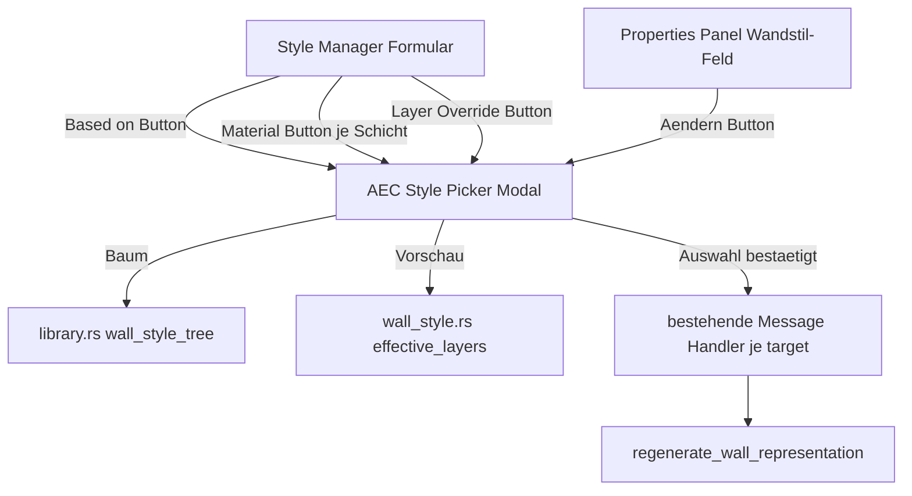

# Requirements

### Overview & Goals
Statt der ursprünglich geplanten `combo_box`-Auswahl (Text tippen zum Filtern) für Wandstile/Materialien wird ein **eigener Auswahl-Modal-Dialog** ("Style Picker") eingeführt. Dieser zeigt alle verfügbaren Stile **hierarchisch** (Eltern-Kind-Baum entsprechend der Stil-Vererbung) und erlaubt zusätzlich eine Textsuche — der Nutzer muss also nicht den Namen kennen, sondern kann browsen und gleichzeitig sehen, welche anderen Stile existieren und wie sie zueinander in Beziehung stehen.

### Scope
**In Scope:**
- Neuer Modal-Dialog "AEC Style Picker" mit:
  - Baumansicht aller Wandstile (Eltern direkt über ihren Kindern, wie bereits die vorhandene `ordered_wall_styles(Hierarchy)`-Sortierlogik im Style Manager liefert), inkl. Einrückung je Vererbungsebene.
  - Suchfeld oben, das die Baumansicht live filtert (Treffer + deren Elternkette bleiben sichtbar, damit der Kontext erhalten bleibt).
  - Klick auf einen Eintrag wählt ihn aus und schließt den Dialog (mit Bestätigen/Abbrechen-Buttons als Alternative).
  - Vorschau-Bereich (z. B. rechte Spalte oder unterer Bereich) zeigt die aufgelösten `effective_layers()` des unter dem Mauszeiger/aktuell markierten Stils, damit der Nutzer vor der Auswahl den tatsächlichen Schichtaufbau sieht.
- Wiederverwendung dieses einen Picker-Dialogs an allen 4 relevanten Stellen (Parent-Stil im Style-Manager-Formular, Material je Schicht — vereinfachte/flache Variante ohne Hierarchie, da Materialien keine Vererbung haben, Layer-Override — flache Liste der Dokument-Layer, Properties-Panel-Wandstil-Feld).
- Im `AEC_WALL`-Kommandozeilen-Workflow bleibt der reine Text-Prompt bestehen (kein Popup mitten im Zeichenvorgang), ergänzt um Teilstring-Suche wie bereits zuvor geplant.

**Out of Scope:**
- `combo_box`-Ansatz wird zugunsten dieses Modal-Ansatzes verworfen (ersetzt den vorherigen Plan `aec-searchable-style-pickers`).
- Drag&Drop im Picker-Baum, Mehrfachauswahl.
- Persistente Geschoss-Verwaltung, Fenster/Türen (weiterhin zurückgestellt).

### User Stories
- Als Planer möchte ich beim Zuweisen eines Eltern-Stils den kompletten Stil-Baum sehen, damit ich verstehe, welche Stile es gibt und wie sie voneinander erben, bevor ich einen auswähle.
- Als Nutzer möchte ich im Picker nach einem Teilnamen suchen können, aber trotzdem den Baumkontext (Eltern/Geschwister) nicht verlieren.
- Als Planer möchte ich vor der Auswahl eines Stils dessen Schichtaufbau als Vorschau sehen, damit ich nicht erst nach der Zuweisung merke, dass es der falsche Stil war.
- Als Nutzer möchte ich einer bestehenden Wand über die Properties-Palette per Picker-Dialog einen neuen Stil zuweisen, statt nur eine ID abzulesen.

### Functional Requirements
- Neuer `ModalKind`-Wert (z. B. `AecStylePicker { target: StylePickerTarget }`) mit Enum `StylePickerTarget { WallStyleParent, LayerMaterial(usize), LayerOverride(usize), WallPropertiesStyle(Handle) }`, damit ein einziger Dialog-Code für alle 4 Aufrufstellen wiederverwendet wird und beim Schließen weiß, wohin das Ergebnis geschrieben werden muss.
- Baumaufbau nutzt die bestehende `resolve_chain`/Parent-Kind-Logik (bereits für `ordered_wall_styles(Hierarchy)` im Style Manager vorhanden) — kein neuer Vererbungs-Auflösungscode.
- Live-Suche filtert Knoten per Teilstring (case-insensitive), behält aber die Elternkette sichtbarer Treffer sichtbar (aufgeklappt), damit die Hierarchie nachvollziehbar bleibt.
- Für Materialien (keine Hierarchie) und Layer-Override (Dokument-Layer, keine Hierarchie) wird derselbe Dialog in einer flachen (nicht-eingerückten) Listen-Variante genutzt.
- Auswahl-Bestätigung schreibt das Ergebnis über die jeweils passende, bereits vorhandene `Message`-Handler-Logik zurück (Parent-Stil-Änderung, Material-Änderung, Layer-Override-Änderung, bzw. den neuen Properties-Panel-Wandstil-Commit-Handler).

### Non-Functional Requirements
- Der Dialog folgt bestehenden Modal-Konventionen des Projekts (`src/app/view/modal.rs`, ähnliche Größen-/Layout-Patterns wie `layer_state_manager.rs`/der bereits vergrößerte AEC Style Manager).
- Kein Host-/externes-Plugin-Umbau nötig; alles bleibt im Core-Modul `src/modules/aec/` bzw. `src/ui/window/`.

# Technical Design

### Current Implementation (Ausgangspunkt dieser Planänderung)
- Der vorherige Plan `aec-searchable-style-pickers` sah `iced::widget::combo_box` an 4 Stellen vor (Parent-Stil, Material je Schicht, Layer-Override, Properties-Panel-Wandstil) — dieser Plan wird durch den vorliegenden Modal-Ansatz **ersetzt**, da der Nutzer den fehlenden Gesamtüberblick über verfügbare Stile bei reiner Text-Filterung als Nachteil identifiziert hat.
- `src/ui/window/aec_style_manager.rs` hat bereits eine funktionierende Hierarchie-Sortierfunktion `ordered_wall_styles(Hierarchy)` (Eltern direkt vor ihren Kindern, Geschwister alphabetisch gruppiert, verwaiste Elternverweise als Wurzel) — das ist die Grundlage für die Baumdarstellung im neuen Picker, keine neue Sortierlogik nötig.
- `src/modules/aec/engine/style.rs::resolve_chain` liefert bereits die vollständige Elternkette eines Stils inkl. Zyklus-Erkennung — wird für die "Elternkette sichtbar halten beim Filtern"-Logik wiederverwendet.
- `src/app/properties.rs` hat aktuell ein `ro_prop(...)`-Feld für den Wandstil (rohe ID, read-only) — dieser bekannte Bug wird im Zuge dieser Änderung durch einen Picker-Button ersetzt ("Stil ändern..." öffnet den neuen Modal statt eines Dropdowns).
- `src/app/mod.rs::ModalKind` ist die bestehende Erweiterungsstelle für neue Dialoge (siehe `AecStyleManager` als Vorbild).

### Key Decisions
- **Ein Modal-Dialog statt vier `combo_box`-Instanzen** (Antwort auf Nutzer-Feedback): löst das Kernproblem, dass der Nutzer bei reiner Text-Filterung keinen Überblick über existierende Stile hat und deren Namen kennen muss — der Baum zeigt immer die volle Struktur, Suche ist nur eine Zusatzfunktion, kein Ersatz für Browsing.
- **Ein generischer Picker mit `target`-Parameter statt 4 separaten Dialogen**: vermeidet Code-Duplikation; der Dialog selbst kennt nur "Baum oder flache Liste + optionale Vorschau", die Rückschreiblogik wird über den bereits vorhandenen `Message`-Mechanismus der jeweiligen Aufrufstelle erledigt.
- **Kommandozeilen-Workflow (`AEC_WALL`) bleibt Text-Prompt**: ein Popup mitten im Klick-Zeichenfluss würde den etablierten Workflow stören; hier bleibt es bei Teilstring-Suche über die Kommandozeile (wie im vorherigen Plan vorgesehen), nur die GUI-Formulare wechseln auf den neuen Picker.
- **Wiederverwendung von `ordered_wall_styles`/`resolve_chain` statt neuer Baum-Logik**: das Datenmodell für Hierarchie existiert bereits vollständig im Style Manager und muss nur in eine wiederverwendbare Funktion extrahiert werden (z. B. nach `src/modules/aec/engine/library.rs` oder einem neuen kleinen Hilfsmodul), damit sowohl Style Manager als auch der neue Picker dieselbe Quelle nutzen.

### Proposed Changes
1. **Baum-Hilfsfunktion extrahieren**: `ordered_wall_styles`-Logik aus `aec_style_manager.rs` in eine wiederverwendbare, testbare Funktion verschieben (z. B. `engine::library::wall_style_tree(&StyleLibrary) -> Vec<TreeNode>`), die Style Manager und neuer Picker gemeinsam nutzen.
2. **Neuer `ModalKind::AecStylePicker { target: StylePickerTarget }`** in `src/app/mod.rs`, mit `StylePickerTarget`-Enum für die 4 Aufrufkontexte.
3. **Neue View-Datei `src/ui/window/aec_style_picker.rs`**: Baum-/Listen-Rendering (eingerückt für Wandstile, flach für Material/Layer), Suchfeld oben mit Live-Filterung + Elternketten-Sichtbarkeit, Vorschau-Bereich für `effective_layers()` bei markiertem Wandstil.
4. **Aufruf-Integration**: Der "Based on"-Parent-Feld-Button, das Material-Feld je Schicht, das Layer-Override-Feld und das Properties-Panel-Wandstil-Feld öffnen jeweils `ModalKind::AecStylePicker` mit passendem `target` statt eines `pick_list`/`combo_box`.
5. **Properties-Panel-Anbindung**: Der bereits als Bug bekannte `ro_prop`-Wandstil wird durch einen Button ("aktueller Stilname — Ändern...") ersetzt, der den Picker öffnet; Auswahl schreibt `style_id` + `effective_layers()` in die `WALL_V2`-XDATA und ruft `regenerate_wall_representation` auf (identische Schreiblogik wie im vorherigen Plan vorgesehen, nur der Eingabeweg ändert sich von Dropdown zu Modal).

### Components
- `src/ui/window/aec_style_picker.rs` (neu): der eigentliche Picker-Dialog.
- `src/modules/aec/engine/library.rs` (geändert): extrahierte, wiederverwendbare Baum-Funktion.
- `src/app/mod.rs` (geändert): neuer `ModalKind`, `StylePickerTarget`-Enum.
- `src/app/view/modal.rs` (geändert): Rendering-Anbindung des neuen Modals.
- `src/ui/window/aec_style_manager.rs` (geändert): Parent-Stil-/Material-/Layer-Override-Felder rufen den Picker statt `pick_list`/`combo_box` auf.
- `src/app/properties.rs` (geändert): Wandstil-Feld wird zum Picker-Öffner-Button.

### Architecture Diagram

### Risks
- **Baum-Performance bei sehr vielen Stilen**: bei mehreren hundert Stilen könnte eine ungefilterte Baumdarstellung unübersichtlich werden — Mitigation: Suchfeld bleibt immer aktiv nutzbar, Standard-Ansicht kann bei Bedarf initial eingeklappt starten.
- **Migrationsaufwand vom vorherigen `combo_box`-Plan**: da noch keine `combo_box`-Umsetzung existiert (nur geplant), entsteht kein Rückbauaufwand — dieser Plan ersetzt den vorherigen vollständig, ohne dass Code weggeworfen werden muss.

# Delivery Steps

###   Step 1: Wiederverwendbare Stilbaum-Funktion und Modal-Grundgerüst schaffen
Eine testbare Funktion liefert die hierarchische Stilstruktur, und ein leeres Modal kann geöffnet/geschlossen werden.
- `ordered_wall_styles`-Hierarchie-Logik aus `aec_style_manager.rs` nach `src/modules/aec/engine/library.rs` als `wall_style_tree(&StyleLibrary) -> Vec<TreeNode>` extrahieren, mit Unit-Tests (Kette, verwaister Elternverweis, mehrere Geschwister).
- Neuer `ModalKind::AecStylePicker { target: StylePickerTarget }` in `src/app/mod.rs` mit `StylePickerTarget`-Enum (WallStyleParent, LayerMaterial(usize), LayerOverride(usize), WallPropertiesStyle(Handle)).
- Neue Datei `src/ui/window/aec_style_picker.rs` mit leerem `view_window(...)`-Grundgerüst; Registrierung in `src/app/view/modal.rs`; Escape-to-close analog zu bestehenden Modalen.

###   Step 2: Baum-/Listen-Rendering mit Suchfeld implementieren
Der Picker zeigt Wandstile hierarchisch eingerückt (bzw. Materialien/Layer flach) an und filtert live per Suchfeld, ohne den Elternkontext zu verlieren.
- Rendering der Baumknoten mit Einrückung je Ebene für `StylePickerTarget::WallStyleParent`; flache Liste für `LayerMaterial`/`LayerOverride`.
- Suchfeld filtert per Teilstring (case-insensitive); Treffer-Elternkette (via `resolve_chain`) bleibt sichtbar/aufgeklappt.
- Klick auf einen Knoten markiert ihn als aktuelle Auswahl (visuell hervorgehoben), Bestätigen-/Abbrechen-Buttons am unteren Rand.

###   Step 3: Schichtaufbau-Vorschau für markierten Wandstil ergänzen
Beim Markieren eines Wandstils im Picker wird dessen aufgelöster Schichtaufbau angezeigt, bevor der Nutzer bestätigt.
- Vorschau-Bereich (z.B. rechte Spalte) zeigt `effective_layers()` des aktuell markierten Wandstils (Material, Dicke, Funktion, Gap/Offsets) unter Wiederverwendung der bereits vorhandenen Vorschau-Darstellung aus dem Style Manager.
- Für `LayerMaterial`/`LayerOverride`-Target entfällt die Vorschau (keine Layer-Struktur) oder zeigt stattdessen die Material-Attribute (Schraffur/Farbe) analog zur bestehenden Material-Formular-Vorschau.

###   Step 4: Picker in Style-Manager-Formular integrieren (Parent, Material, Layer Override)
Die drei bestehenden Auswahlfelder im Wandstil-Formular öffnen den neuen Picker statt eines Dropdowns.
- `aec_style_manager.rs`: "Based on"-Feld, Material-Feld je Schicht-Zeile und Layer-Override-Feld werden zu Buttons, die `ModalKind::AecStylePicker` mit passendem `target` öffnen.
- Bestehende `Message`-Handler (`AecStyleManagerWallStyleParentChanged`/`LayerMaterialChanged`/`LayerOverrideChanged`) werden vom Picker-Bestätigen-Button ausgelöst statt von `on_select`.
- Tests/Verifikation: Auswahl im Picker aktualisiert den erwarteten Formular-State korrekt für alle drei Zielkontexte.

###   Step 5: Picker im Properties-Panel für Wandstil-Zuweisung anbinden und XDATA-Schreiblogik verdrahten
Eine selektierte Wand kann über die Properties-Palette per Picker-Dialog einen neuen Stil erhalten, der sofort sichtbar angewendet wird.
- `src/app/properties.rs`: bisheriges `ro_prop`-Feld für den Wandstil durch einen Button (aktueller Stilname + "Ändern...") ersetzt, der `ModalKind::AecStylePicker { target: WallPropertiesStyle(handle) }` öffnet.
- Neuer Commit-Handler in `src/app/update/command.rs`: liest den im Picker bestätigten `style_id`, löst `effective_layers()` über die geladene `StyleLibrary` auf, schreibt Stil-ID + Schicht-Snapshot in die `WALL_V2`-XDATA (bestehende `wall_v2_record`-Logik) und ruft `regenerate_wall_representation` auf.
- Tests: simulierte Stiländerung über den Picker-Bestätigen-Pfad aktualisiert Stil-ID/Layer-Snapshot korrekt; bestehende Properties-Panel-Tests bleiben grün.