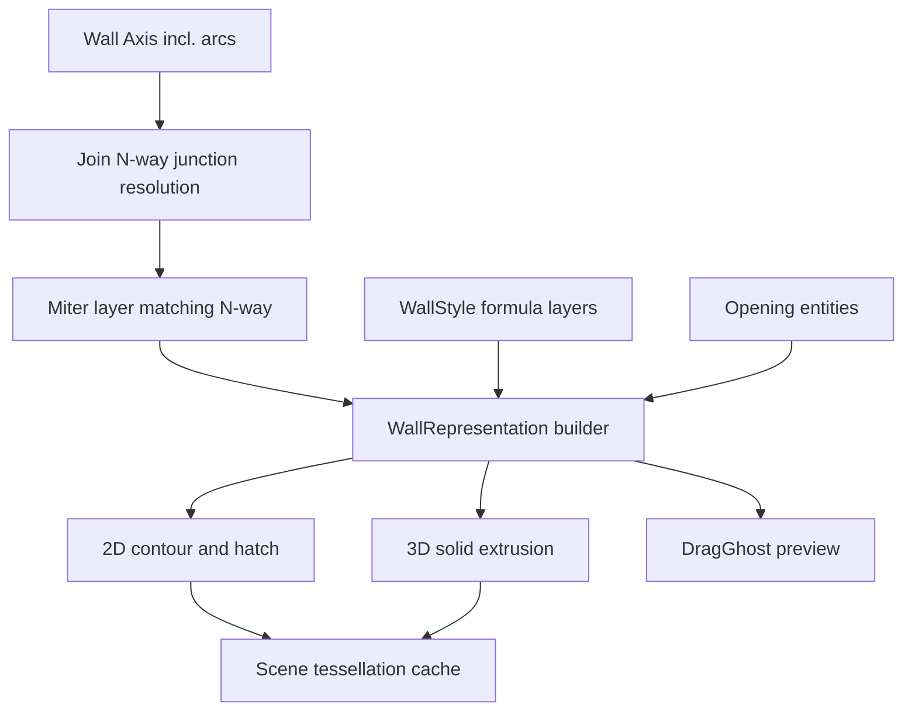

# Requirements

### Overview & Goals
Follow-up to the completed `aec-wall-architecture-deep-dive` explainer session. Based on the architecture discussion and decisions made there, this plan now implements a coherent set of wall-engine improvements: (1) an N-wall-node join fix (correct T/X/multi-wall intersections, including multi-layer walls), (2) bulge/arc support for wall axes, (3) a "Darstellungskomponenten" (display representation) refactor that gives each wall one shared geometry source feeding Axis/Outline/Layers/Hatch/DragGhost representations, (4) wall openings (windows/doors) as first-class entities that cut wall contours and solids, and (5) formula-capable variables in wall style layer thickness (e.g. a layer thickness defined as `BB * 0.5` where `BB` is read from the wall's own properties).

### Scope
**In Scope:**
1. N-wall-node join fix: `engine/join.rs`/`engine/miter.rs` extended to resolve 3+ walls meeting at one point (X-crossings, T with a third wall), not just pairwise L/T.
2. Bulge/arc support: wall axis can contain arc segments; `engine/contour.rs`, `engine/miter.rs`, `engine/join.rs`, and the 3D extrusion path (`sweep_model`) are updated to offset/intersect/extrude arcs correctly. Splines and polygon/area-based wall bases are explicitly **out of scope** (deferred).
3. Display-components refactor: introduce a per-wall `WallRepresentation` structure computed once per geometry change, from which Axis, Outer Contour (2D/3D), Layer Contours (2D/3D), Hatches, and a lightweight DragGhost are all derived — replacing today's two independent 2D/contour and 3D/extrusion recomputation paths.
4. Wall openings (windows/doors): new `Opening` entity (own `Handle`, referencing a host wall + position along its axis + width/height/sill height) that is subtracted from the host wall's contour/hatch/solid representations.
5. Formula variables in wall styles: `Layer.thickness` (and similar numeric layer fields) can optionally hold a simple expression referencing wall-level variables (e.g. `BB`) combined with +, -, *, / and numeric literals; resolved per-wall at layer-effective-geometry time.

**Out of Scope (explicitly deferred per prior discussion):**
- Spline wall axes.
- Polygon/area-based wall bases (trapezoidal/wavy walls defined by an outline instead of axis+thickness).
- Full general-purpose expression language (functions, nested expressions) — only variable + basic arithmetic is targeted now.

### User Stories
- As a user drawing floor plans, I want walls that meet at a T or X junction (including multi-layer walls) to join cleanly so the drawing looks correct without manual cleanup.
- As a user, I want to draw curved (arced) wall segments and have miters/contours/3D solids follow the curve correctly.
- As a user, I want to place windows and doors in a wall and see the wall's 2D plan and 3D model correctly cut open at that location.
- As a wall-style author, I want to define a layer's thickness as a formula based on the wall's own base width, so one style adapts automatically to different wall thicknesses instead of needing many near-duplicate styles.

### Functional Requirements
- Joining 3+ walls at a shared point must produce a single consistent set of layer footprints for all participating walls, not per-pair overwrites.
- Arced wall axis segments must offset (per layer), miter at joints, and extrude in 3D without visible gaps/overlaps at the arc-to-line transition.
- An `Opening` placed on a wall must visibly cut the wall's outer contour, layer contours/hatches, and 3D solid at the correct position/size; moving/resizing the wall must keep the opening's relative position consistent.
- A `Layer.thickness` (or other numeric field marked as formula-capable) must accept either a plain number (existing behavior, unchanged) or an expression string referencing supported wall variables; invalid/unresolvable expressions must fall back safely (e.g. to 0 or a validation error) rather than panic.
- All of the above must keep passing the existing `cargo test --lib aec` suite; new behavior gets new regression tests.

# Technical Design

### Current Implementation (verified via code search)
- **Wall data model**: `Wall`/`WallLayer` in `src/modules/aec/commands.rs` (runtime) with axis as `Vec<DVec3>`; **wall style** definitions live separately in `src/modules/aec/engine/wall_style.rs` (`WallStyle`, `Layer { material_id, thickness: f64, function, gap_before, bottom_offset, top_offset, layer_override }`) with single-parent inheritance resolved by `effective_layers()`/`resolve_chain()` (`src/modules/aec/engine/style.rs`).
- **Join/Miter**: `engine/join.rs` (`join_two_walls_in_document`, `join_wall_axes`, lines ~35-154) only models exactly two walls and two cases (L end-to-end, T end-on-segment); `engine/miter.rs` (`match_layer_indices`, `mitered_layer_footprints`) matches layers via material/function then cumulative offset, falls back to single-vertex extension when ambiguous/unmatched. No node with 3+ walls is modeled.
- **Contour/Extrusion**: `engine/contour.rs::layer_contours()`/`outer_contour()` offset axis vertices via averaged normals (`get_offset_directions`), operating purely on straight segments; 3D solids come from `scene::model::sweep_model::extruded`/`solid_model::edge_wires`, run independently from the 2D contour path (two parallel, synchronized-but-separate pipelines, per prior discussion decision to keep them separate).
- **Openings/Windows**: none exist today — confirmed via search, no `Opening`/`Window`/`Door` type or cutting logic anywhere in `src/modules/aec`.
- **Style/formula support**: `Style`/`WallStyle` currently store only plain `f64` numeric fields; no expression/variable evaluation exists anywhere in the project (`Cargo.toml` has no expression-evaluator crate).
- **Rendering/caching**: `Scene` (`src/scene/mod.rs`) already caches tessellated wire/hatch/mesh output per entity, keyed by `geometry_epoch`, invalidated via `bump_entities()` — this caching layer will host the new `WallRepresentation` output without further cache-architecture changes.

### Key Decisions
- **Multi-wall node resolution**: replace pairwise `join_wall_axes` calls with a node-based pass — group wall endpoints within tolerance into "junctions", then resolve all layer footprints meeting at a junction together (extends `engine/miter.rs`'s matching to N wall-ends instead of 2).
- **Arc support strategy**: axis segments gain an optional bulge (matching `acadrust::LwPolyline`'s existing bulge field, so persistence needs no format change); offset/intersection math in `contour.rs`/`miter.rs`/`join.rs` gets arc-aware variants (arc-arc, arc-line intersection) alongside the existing line-line case; 3D extrusion follows the same arc segments.
- **Display components as a shared source**: introduce `WallRepresentation { axis, outer_contour_2d, outer_solid_3d, layer_contours_2d, layer_solids_3d, hatches, drag_ghost }` computed once per wall per geometry epoch; existing call sites (2D render, 3D extrusion, drag preview) are switched to read from it instead of recomputing independently.
- **Opening modeling**: dedicated `Opening` entity with its own `Handle` and a `host_wall: Handle` + `distance_along_axis`/`width`/`height`/`sill_height` fields (per user's chosen "standalone entity" option), looked up when building a wall's `WallRepresentation` so the host wall's contour/hatch/solid get the opening subtracted.
- **Formula variables**: introduce `LayerValue::{Fixed(f64), Formula(String)}`, with formulas evaluated via the `evalexpr` crate (new dependency in `Cargo.toml`) restricted to numeric variable lookups and `+ - * /`, resolved against a `HashMap<String, f64>` of wall variables (starting with `BB` = wall base width); resolution happens in a new `effective_layers_for_wall()` that wraps today's `effective_layers()`.

### Data Models / Contracts
```rust
// engine/wall_style.rs — new formula-capable field variant, additive/backward-compatible
#[derive(Debug, Clone, PartialEq, Serialize, Deserialize)]
#[serde(untagged)]
pub enum LayerValue {
    Fixed(f64),
    Formula(String), // e.g. "BB * 0.5"
}

// new: openings.rs
pub struct Opening {
    pub handle: Handle,
    pub host_wall: Handle,
    pub distance_along_axis: f64,
    pub width: f64,
    pub height: f64,
    pub sill_height: f64,
    pub kind: OpeningKind, // Window | Door
}

// new: representation.rs
pub struct WallRepresentation {
    pub axis: Vec<AxisSegment>,       // AxisSegment { start, end, bulge: Option<f64> }
    pub outer_contour_2d: Vec<(f64, f64)>,
    pub layer_contours_2d: Vec<Vec<(f64, f64)>>,
    pub hatches_2d: Vec<HatchRegion>,
    pub solid_3d: Solid3D,
    pub drag_ghost: Vec<(f64, f64)>,
}
```

### Components
- `src/modules/aec/engine/join.rs` — extended with junction/node grouping (multi-wall resolution).
- `src/modules/aec/engine/miter.rs` — layer matching generalized from 2-way to N-way at a junction; arc-aware footprint clipping.
- `src/modules/aec/engine/contour.rs` — arc-aware offsetting; refactored to feed the new `WallRepresentation` instead of being called ad hoc.
- `src/modules/aec/engine/wall_style.rs` — `Layer.thickness` (and similarly relevant fields) migrated to `LayerValue`; new `expr.rs` for the minimal formula parser/evaluator.
- New `src/modules/aec/engine/openings.rs` — `Opening`/`OpeningKind`, cutting logic against contours/solids.
- New `src/modules/aec/engine/representation.rs` — `WallRepresentation` builder, wired into `Scene`'s existing cache invalidation (`bump_entities`).
- `src/modules/aec/commands.rs` — new `WallOpeningCommand`/context-menu entry to place windows/doors; wall style editor UI updated to accept formula strings for layer thickness.

### Architecture Diagram


### Risks
- N-way junction resolution and arc support both touch `join.rs`/`miter.rs`/`contour.rs` simultaneously — sequencing (node-fix first, arcs second) reduces the chance of compounding regressions, per the agreed delivery order.
- Introducing `WallRepresentation` as a shared source is a refactor of working code paths; existing tests must keep passing at each step, not just at the end.
- Formula evaluation must fail safely (e.g. unknown variable, division by zero) without breaking existing wall styles that don't use formulas at all.

# Delivery Steps

### ✓ Step 1: Fix multi-wall (N-way) junction joining
Walls meeting 3+ at a point (X-crossings, T with a third wall) join into one consistent set of layer footprints instead of pairwise-overwriting.
- Add junction detection to `engine/join.rs`: group wall axis endpoints within tolerance into a shared junction structure instead of calling `join_wall_axes` purely pairwise.
- Extend `engine/miter.rs`'s layer matching (`match_layer_indices`, `mitered_layer_footprints`) to resolve all walls at a junction together, reusing the existing material/offset matching heuristic per pair but applying it consistently across all participants.
- Keep the existing single-vertex-extension fallback for genuinely unmatched/ambiguous layers.
- Add regression tests covering X-crossings and T-junctions with multi-layer walls (2+ layers per wall).

### ✓ Step 2: Introduce the WallRepresentation display-components refactor
Each wall's Axis, Outer Contour (2D/3D), Layer Contours (2D/3D), Hatches, and DragGhost are derived from one shared per-wall geometry structure instead of two independent recomputation paths.
- Add `WallRepresentation` (new `src/modules/aec/engine/representation.rs`) built from the (now junction-aware) axis + effective layers.
- Route existing 2D contour rendering (`contour.rs` callers) and the 3D extrusion path (`sweep_model`/`solid_model` callers) to read from `WallRepresentation` instead of computing independently.
- Wire `WallRepresentation` invalidation into `Scene`'s existing `bump_entities`/`geometry_epoch` cache mechanism (`src/scene/mod.rs`), so no new cache architecture is introduced.
- Add a lightweight `drag_ghost` variant (reduced geometry, no full miter) used by draw/move/grip-edit previews.

### ✓ Step 3: Add bulge/arc support to wall axes
Wall axes can contain arc segments, and join/miter/contour/extrusion all handle them correctly.
- Extend the axis representation with an optional bulge per segment (`AxisSegment { start, end, bulge }`), matching `acadrust::LwPolyline`'s existing bulge field for persistence compatibility.
- Add arc-aware offset logic to `engine/contour.rs` (replacing/augmenting the current averaged-normal vertex offset for arc segments) and arc-aware intersection (arc-line, arc-arc) to `engine/miter.rs`/`engine/join.rs`.
- Extend the 3D extrusion path (`scene::model::sweep_model::extruded`) to sweep arc segments.
- Add regression tests for curved single walls, curved-to-straight joins, and curved multi-layer walls.

### ✓ Step 4: Implement wall openings (windows/doors)
Users can place a window or door on a wall, and the wall's 2D contour/hatch and 3D solid are correctly cut open at that location.
- Add `Opening`/`OpeningKind` (new `src/modules/aec/engine/openings.rs`) with `handle`, `host_wall`, `distance_along_axis`, `width`, `height`, `sill_height`.
- Extend `WallRepresentation` building (Step 2) to look up openings referencing the wall and subtract their footprint from `outer_contour_2d`/`layer_contours_2d`/`hatches_2d` and from `solid_3d`.
- Add a `WallOpeningCommand` in `src/modules/aec/commands.rs` plus a context-menu/toolbar entry to place a window or door on a picked wall at a picked point.
- Add regression tests: opening cuts a straight wall, an opening near a wall end/junction, and wall-edit (extend/join) keeping the opening's relative position.

### ✓ Step 5: Add formula-capable variables to wall style layers
A wall style layer's thickness can be defined as an expression referencing the wall's own properties (e.g. `BB * 0.5`) instead of only a fixed number.
- Add `LayerValue::{Fixed(f64), Formula(String)}` to `src/modules/aec/engine/wall_style.rs`, replacing the plain `f64` on `Layer.thickness` in a backward-compatible way (existing numeric styles keep working unchanged).
- Add the `evalexpr` crate as a new dependency (`Cargo.toml`) and a thin wrapper (new `src/modules/aec/engine/expr.rs`) that evaluates formula strings against a `HashMap<String, f64>` of wall variables (starting with `BB` = wall base width), restricted to arithmetic (no arbitrary function calls exposed).
- Add `effective_layers_for_wall()` wrapping the existing `effective_layers()` to resolve `LayerValue::Formula` entries per-wall before they reach `WallRepresentation`.
- Update the wall style editor UI to accept and validate formula strings for layer thickness, with safe fallback (e.g. flagged as invalid, not a panic) for unresolvable expressions.
- Add regression tests: fixed-value styles unaffected, `BB`-based formula resolves correctly for different wall base widths, invalid formula falls back safely.