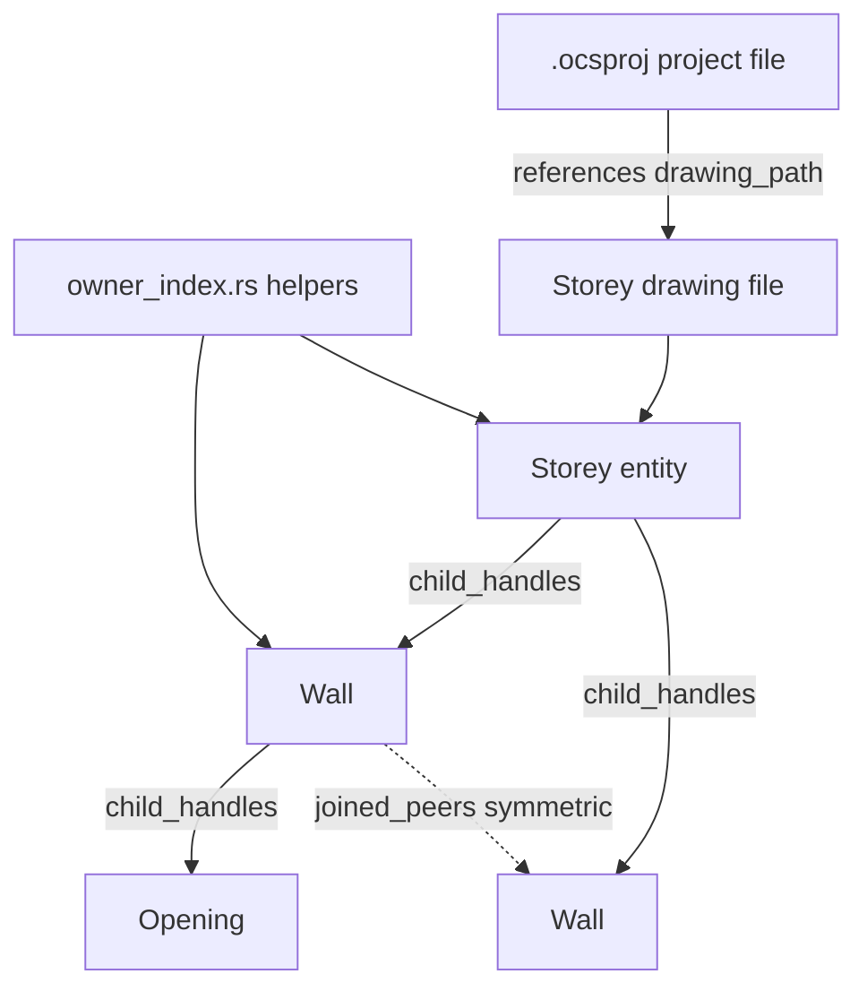

# Requirements

### Overview & Goals
New follow-up plan (the previous `aec-wall-architecture-deep-dive` delivery — N-way joins, `WallRepresentation`, arcs, openings, formula layers — is already fully implemented and committed). This plan introduces a generic **owner-index model**: an explicit, persisted parent/child relationship mechanism so a `Storey` knows its member entities (walls, and future columns/slabs/beams/stairs/rooms), a `Wall` knows its `Opening`s, and joined walls know their **peer** neighbors — replacing today's "scan all entities and filter by a foreign-key field" approach (`openings_for_host_wall()`, `storey_id` filtering) confirmed during the prior investigation session. It also introduces a new **project file** (`.ocsproj`) living outside the drawing file(s), since Building/Storey will move from an in-drawing concept to "one drawing = one storey", with the project file tying storeys (and their drawing files) together into a building.

**New decision (this update): no backward compatibility for old files.** Existing drawing files do not need to keep working unchanged — there is no lazy-rebuild/migration requirement for files saved before this change. This also means the legacy, superseded single-layer `Wall`/`WALL` XDATA model (`src/modules/aec/engine/wall.rs`, `wall_record()`/`wall_from_entity()` in `commands.rs`) can be deleted outright instead of kept for old-file support, and the current `WallV2`/`WALL_V2` model (the only one actually used by all current wall commands) is renamed to simply `Wall`/`WALL` now that nothing else needs disambiguating from it.

### Scope
**In Scope:**
1. **Remove the legacy v1 `Wall`/`WALL` model and rename `WallV2`/`WALL_V2` to `Wall`/`WALL`**: delete `src/modules/aec/engine/wall.rs`'s single-layer `Wall` struct, `wall_record()`, `wall_from_entity()`, and every `kind == "WALL"` / dual-format branch that exists only for the old format; rename `WallV2` to `Wall`, `wall_v2_from_entity` to `wall_from_entity`, and the `"WALL_V2"` XDATA tag to `"WALL"` everywhere. No dual-format reading/writing remains.
2. A generic, persisted **owner-index** inside a drawing: any owner entity (currently `Storey`, `Wall`) stores an explicit ordered list of its children's `Handle`s as XDATA, kept in sync on create/delete/reparent, replacing linear-scan lookups. No fallback for pre-existing drawings is required — the index is simply required to be present and correct going forward.
3. **Wall -> Opening**: existing `Opening`/`host_wall` relation is complemented by the wall carrying its own `child_handles` list (owner side), so `openings_for_host_wall()` becomes an O(1) index lookup instead of a full-document scan.
4. **Storey -> members**: `Storey` gains the same generic `child_handles` index for its current member type (`Wall`) and any handle-bearing entity going forward (columns/slabs/beams/stairs/rooms are *not* implemented now, but the index is entity-type-agnostic so adding them later needs no index rework).
5. **Wall <-> Wall peer links**: joined walls (from `join.rs`/`miter.rs`) record a symmetric peer-neighbor list (not owner/child) so "which walls is this wall connected to" is an index lookup instead of a geometric axis-intersection recheck.
6. New **project file** (`.ocsproj`, JSON) living next to (not inside) the drawing files: lists buildings and, per building, its storeys with each storey's drawing file path — the Building/Storey-level hierarchy moves here since a drawing will represent exactly one storey going forward.

**Out of Scope (explicitly deferred per this session's decisions):**
- Any new physical entity type (columns, slabs, beams, stairs, rooms) — only the index infrastructure that will later host them.
- Migrating the *existing* in-drawing `Storey` concept away from today's `storey_id` field — this plan adds the index alongside it, it does not remove/replace the current storey model within a single drawing.
- A **full** project-management UI (editing building/storey metadata beyond name/elevation, multi-user/versioning workflows) — only a minimal Project Explorer (view tree + open storey drawing + add storey) is in scope, per the GUI addition below.
- "Fensterbestandteile" (opening sub-parts like frame/sash/glass) as a concrete data model — only confirmed that the generic owner-index would support adding such a level later without rework.
- Any backward-compatibility/migration path for files created before this plan (both for the old `Wall`/`WALL` v1 model and for the new owner-index) — explicitly not required.

### User Stories
- As a developer, I want a wall's openings looked up in O(1) instead of scanning every entity in the document, so opening-heavy drawings stay responsive.
- As a developer, I want to ask "which walls does this wall connect to" directly from an index, instead of recomputing axis intersections.
- As a user working across floors, I want my building's storeys (each its own drawing file) organized by a project file, so I can navigate/open the right storey drawing without manually tracking file paths.
- As a future contributor adding a new storey member type (e.g. a column), I want to reuse the existing owner-index mechanism without inventing a new persistence pattern.
- As a maintainer, I want the codebase to only carry one wall data model (`Wall`/`WALL`), so I don't have to reason about a dead legacy format when reading `commands.rs`.

### Functional Requirements
- Every occurrence of the legacy v1 `Wall`/`WALL` model (struct, XDATA tag, parsing/writing functions, dual-format branches) is removed; `WallV2`/`WALL_V2` is renamed to `Wall`/`WALL` throughout (types, functions, XDATA tag string, doc comments).
- Every owner/child relationship change (add/remove/reparent an `Opening` on a `Wall`, add/remove a `Wall` on a `Storey`) must update the owner's persisted `child_handles` XDATA and be undo/redo-safe like other document edits.
- `openings_for_host_wall()` and the storey-membership lookup must use the new index and produce identical results to today's scan-based implementations (verified by tests running both and comparing).
- Wall join/miter must record and update peer links symmetrically: if wall A lists B as a peer, B must list A, and disconnecting (un-join / delete) must remove both sides.
- No fallback/migration path for old files is implemented: a wall/storey without `child_handles` XDATA simply has an empty child list (not a scan-derived one), and no old-format `WALL` XDATA is parsed anymore.
- The `.ocsproj` project file must be loadable/saveable independently of any single drawing, listing buildings, storeys, and each storey's drawing file path, and must not be required for a drawing to open standalone.
- All of the above must keep passing `cargo test --lib aec` (167 baseline) with new regression tests added, not replaced; tests that only existed to cover the legacy `Wall`/`WALL` v1 path are removed along with that code.

# Technical Design

### Current Implementation (verified via prior investigation session)
- **Legacy dual wall model**: the codebase currently carries two wall XDATA formats side by side: the old single-layer `Wall` struct + `"WALL"` tag (`src/modules/aec/engine/wall.rs`, `wall_record()`/`wall_from_entity()` in `commands.rs`) and the current, actually-used multi-layer `WallV2` struct + `"WALL_V2"` tag (`commands.rs`). Call sites like `is_wall_axis_entity()` and the pick-filter in `commands.rs` explicitly check both, purely for old-format compatibility. Since old files no longer need support, this dual path is collapsed to a single `Wall`/`WALL` model.
- **Wall style persistence**: `StyleLibrary` (`src/modules/aec/engine/library.rs`) is a **global, out-of-drawing** JSON file at `config_dir().join("aec_styles.toml")`; a drawing only stores a `style_id` string reference in `WALL_V2` XDATA. Unrelated to owner-index but confirms the project already mixes in-drawing and out-of-drawing persistence.
- **Opening -> Wall reference (owner side missing)**: `Opening` is a standalone `POINT` entity carrying `OPENING` XDATA (`src/modules/aec/commands.rs`, `opening_record()`/`opening_from_entity()`): `host_wall: Handle`, `distance_along_axis`, `width`, `height`, `sill_height`, `kind`. The **reverse** direction (wall -> its openings) is *not* stored: `openings_for_host_wall()` does a full linear scan of all document entities, checking each one's `host_wall` handle.
- **Storey -> Wall (owner side missing)**: `Storey` (`src/modules/aec/engine/storey.rs`) is its own entity/index; a `Wall`/`WallV2` references its storey only via a scalar `storey_id: u32` in XDATA. Storey membership (storey -> its walls) is likewise obtained by scanning all walls and filtering by `storey_id`, with no list kept on the `Storey` side.
- **Wall <-> Wall join (no persisted link at all)**: `join.rs`/`miter.rs` compute intersections/miters from axis geometry at edit time; there is no stored notion of "these two walls are joined" — it is fully re-derived geometrically every time, confirmed via code search (no `peers`/`joined_with` field anywhere).
- **XDATA persistence mechanism available for reuse**: `acadrust` XDATA already supports `Handle` values and repeated records (used today for the `derived_handles` list on `WallV2` and for `OPENING`'s `host_wall`), so a `child_handles: Vec<Handle>` list is a natural, format-compatible extension — no new persistence primitive is required for the in-drawing part.
- **No project-level concept exists**: there is no `.ocsproj`-like file or building/multi-storey-drawing concept anywhere in the codebase; each drawing is currently self-contained and storey-agnostic beyond the in-drawing `storey_id` field.

### Key Decisions
- **Legacy model removal & rename**: the old v1 `Wall`/`WALL` struct/XDATA/parsing code is deleted (not deprecated), and `WallV2`/`WALL_V2` is renamed to `Wall`/`WALL` in the same pass, since it is now the only wall model — done as its own delivery step *before* the owner-index work so the owner-index code is written directly against the final `Wall` name instead of `WallV2`.
- **No backward-compatibility fallback**: since old files don't need to keep working, `children_of()`/storey-membership lookups do **not** need a scan-based fallback for missing `child_handles` — a missing/empty index is simply treated as "no children".
- **Owner-index storage**: persisted as an explicit **XDATA child-handle list** on the owner entity (`Wall.child_handles` for openings, `Storey.child_handles` for members), analogous to the existing `derived_handles` pattern — not a separate sidecar index and not a pure runtime scan, per the user's explicit choice.
- **Genericity**: the index mechanism itself is **entity-type-agnostic** (`Vec<Handle>` with no type tag) so it can later host columns/slabs/beams/stairs/rooms as `Storey` children without changing the index format — only infrastructure is built now, no new entity types.
- **Peer links for wall joins**: modeled separately from owner/child as a **symmetric peer list** (`Wall.joined_peers: Vec<Handle>`) updated by `join.rs`/`miter.rs` whenever a join is created/removed, kept consistent on both sides in the same document edit/undo step.
- **Project-level hierarchy**: Building/Storey move to a **new project file format** (`.ocsproj`, JSON) stored next to the drawing files, independent of any single drawing's own persistence; a drawing remains fully self-contained/openable without a project file, per the requirement that a drawing = one storey going forward.

### Data Models / Contracts
```rust
// Generic owner-index, additive XDATA on existing owner entities.
// Reuses the existing Handle-list XDATA pattern already used for `derived_handles`.
struct OwnerChildIndex {
    // Present on Wall (children = Opening handles) and Storey (children = member handles,
    // today only Wall, later columns/slabs/beams/stairs/rooms without format changes).
    child_handles: Vec<Handle>,
}

// Symmetric, non-owning peer relation for wall joins (not part of OwnerChildIndex).
struct WallPeerLinks {
    joined_peers: Vec<Handle>, // kept symmetric: A lists B iff B lists A
}

// new: src/modules/aec/engine/owner_index.rs — shared helpers, not a new document structure
fn add_child(doc: &mut CadDocument, owner: Handle, child: Handle);
fn remove_child(doc: &mut CadDocument, owner: Handle, child: Handle);
fn children_of(doc: &CadDocument, owner: Handle) -> Vec<Handle>; // index lookup only, no scan fallback
fn link_peers(doc: &mut CadDocument, a: Handle, b: Handle);
fn unlink_peers(doc: &mut CadDocument, a: Handle, b: Handle);

// new project file format, e.g. project.ocsproj (JSON)
struct ProjectFile {
    buildings: Vec<Building>,
}
struct Building {
    name: String,
    storeys: Vec<StoreyRef>,
}
struct StoreyRef {
    name: String,
    elevation: f64,
    drawing_path: String, // relative path to the storey's own drawing file
}
```

### Components
- `src/modules/aec/engine/wall.rs` — legacy single-layer `Wall` struct removed entirely (file deleted or emptied if nothing else lives there).
- `src/modules/aec/commands.rs` — `wall_record()`/`wall_from_entity()` (v1) deleted; `WallV2` renamed to `Wall`, `wall_v2_from_entity` renamed to `wall_from_entity`, XDATA tag string `"WALL_V2"` renamed to `"WALL"`; every dual-format check collapsed to the single new path. The renamed `Wall` then gains the new `child_handles` (openings) XDATA field; opening placement/deletion (`WallOpeningCommand`) calls `owner_index::add_child`/`remove_child` instead of only writing `host_wall` on the opening.
- New `src/modules/aec/engine/owner_index.rs` — generic `add_child`/`remove_child`/`children_of`/`link_peers`/`unlink_peers` helpers operating on XDATA child-handle lists (no scan-fallback path, per the no-backward-compatibility decision).
- `src/modules/aec/engine/storey.rs` — `Storey` gains `child_handles` XDATA field; wall create/delete/reassign-storey commands call `owner_index` helpers to keep it in sync.
- `src/modules/aec/engine/join.rs`/`miter.rs` — join/un-join now also call `owner_index::link_peers`/`unlink_peers` on the two walls involved, alongside the existing geometric join logic (which is unchanged).
- New `src/modules/aec/engine/project.rs` — `ProjectFile`/`Building`/`StoreyRef` model plus JSON load/save (serde), independent of `CadDocument`.
- `openings_for_host_wall()`/storey-membership lookups refactored to call `owner_index::children_of()` directly, with no scan-based fallback.

### Architecture Diagram


### Risks
- Renaming `WallV2`/`WALL_V2` to `Wall`/`WALL` touches a very large number of call sites in `commands.rs` (~90+ references per the earlier investigation) — mitigated by doing the rename as its own isolated, mechanical delivery step with a full `cargo build`/`cargo test --lib aec` pass before any owner-index code is added on top.
- Deleting the legacy v1 `Wall`/`WALL` path removes the ability to open any drawing file that was only ever saved with that old format; this is an accepted, explicit trade-off per this session's decision, not an oversight.
- Keeping XDATA child-lists in sync on every create/delete/reparent is easy to miss at one call site (e.g. a delete path that removes an `Opening` without calling `owner_index::remove_child` on its wall) — mitigated by centralizing all mutation through the new `owner_index.rs` helpers rather than editing XDATA ad hoc at each command site.
- Symmetric peer-link maintenance (`joined_peers`) must survive undo/redo of join/un-join operations without drifting out of sync on one side.
- The `.ocsproj` schema (buildings/storeys/drawing paths) must stay forward-compatible enough not to require a breaking format change once the now-planned Project Explorer GUI (Step 7) and later fuller project-management workflows are added.
- Adding read-only GUI rows sourced directly from `owner_index::children_of()` must not silently mask index bugs (e.g. an empty list rendering identically to "not yet loaded") — mitigated by covering the same scenarios with the backend regression tests from Steps 3/4/5 before wiring the GUI in Step 8.

# Delivery Steps

### ✓ Step 1: Remove the legacy v1 `Wall` model and rename `WallV2` to `Wall`
The codebase has exactly one wall data model, named `Wall`/`WALL`, with no old-format compatibility code left.
- Delete the legacy single-layer `Wall` struct from `src/modules/aec/engine/wall.rs`, and `wall_record()`/`wall_from_entity()` (v1) from `commands.rs`.
- Rename `WallV2` to `Wall`, `wall_v2_from_entity` to `wall_from_entity`, and the XDATA tag string `"WALL_V2"` to `"WALL"` across `src/modules/aec/` and all call sites in `src/app/`.
- Collapse every dual-format check (e.g. in `is_wall_axis_entity()` and the pick-filter in `commands.rs`) down to the single new path.
- Update/remove tests that only existed to cover the old v1 format; verify with `cargo build --bin OpenCADStudio` and `cargo test --lib aec`.

### ✓ Step 2: Build the generic owner-index infrastructure
A reusable, entity-type-agnostic mechanism exists for maintaining and querying persisted child-handle lists on any owner entity, with no legacy-file fallback.
- Add `src/modules/aec/engine/owner_index.rs` with `add_child`/`remove_child`/`children_of`/`link_peers`/`unlink_peers`, operating on a new `child_handles`/`joined_peers` XDATA record type shared by any owner entity.
- `children_of()`/peer lookups simply return an empty list when no index XDATA is present, per the no-backward-compatibility decision.
- Add regression tests for `owner_index.rs` directly (add/remove/reparent child, symmetric peer link/unlink, empty-index behavior) using an in-memory `CadDocument`.

### ✓ Step 3: Wire Wall -> Opening through the owner index
`openings_for_host_wall()` and opening placement/deletion use the index instead of a full-document scan.
- Add `child_handles` XDATA to the (now renamed) `Wall` (`src/modules/aec/commands.rs`).
- Update `WallOpeningCommand` (place) and opening deletion paths to call `owner_index::add_child`/`remove_child` on the host wall alongside the existing `host_wall` XDATA write on the `Opening`.
- Refactor `openings_for_host_wall()` to call `owner_index::children_of()` directly, removing the old full-document scan implementation entirely.
- Add regression tests: placing/removing an opening keeps the host wall's `child_handles` correct and `openings_for_host_wall()` matches.

### ✓ Step 4: Wire Storey -> members through the owner index
Storey membership lookups use the index instead of scanning and filtering all walls by `storey_id`.
- Add `child_handles` XDATA to `Storey` (`src/modules/aec/engine/storey.rs`).
- Update wall create/delete/storey-reassignment commands to call `owner_index::add_child`/`remove_child` on the affected storeys.
- Refactor the storey-membership lookup to use `owner_index::children_of()`, removing the old `storey_id`-filter scan implementation.
- Add regression tests: adding/removing/moving a wall between storeys keeps both storeys' indices correct.

### ✓ Step 5: Add symmetric wall-to-wall peer links for joins
Joined walls carry a queryable, always-symmetric list of the walls they are connected to.
- Extend `join.rs`/`miter.rs` so every successful join calls `owner_index::link_peers` on both participating walls, and every un-join/disconnect (including wall delete) calls `owner_index::unlink_peers`.
- Ensure peer-link updates participate in the same undo/redo transaction as the geometric join change, so undo restores both the geometry and the index consistently.
- Add regression tests: join two/three walls at a junction and verify all pairwise peer links exist symmetrically; delete one wall and verify it is removed from all former peers' lists; undo a join removes the peer links again.

### ✓ Step 6: Introduce the `.ocsproj` project file for Building -> Storey
A building's storeys (each represented by its own drawing file) can be described, saved, and loaded via a new project file independent of any single drawing.
- Add `src/modules/aec/engine/project.rs` with `ProjectFile { buildings: Vec<Building> }`, `Building { name, storeys: Vec<StoreyRef> }`, `StoreyRef { name, elevation, drawing_path }`, serialized as JSON.
- Implement `ProjectFile::load(path)`/`save(path)` with graceful handling of a missing/absent project file (a drawing must remain fully usable standalone).
- Add regression tests: round-trip save/load of a multi-building, multi-storey `ProjectFile`; loading a drawing with no associated project file does not error.

### ✓ Step 7: Add the Project Explorer GUI for `.ocsproj`
Users can open a `.ocsproj` file, browse its Buildings/Storeys tree, and open a storey's drawing directly from the UI.
- Add `src/ui/window/aec_project_explorer.rs` rendering the Building -> StoreyRef tree from a loaded `ProjectFile`, with an "Open" action per storey row that opens `drawing_path` in a new tab.
- Wire a new `AEC_PROJECTEXPLORER` command/ribbon entry and `ModalKind`/`Message` variants (following the existing manager-modal pattern, e.g. `AecMaterialManagerOpen`) to open/close the panel and drive load/save of the `ProjectFile`.
- Add "New Project"/"Add Storey" buttons that call `ProjectFile::save(path)` after mutating the in-memory tree.

### ✓ Step 8: Add Wall "Linked Openings"/"Joined Walls" and Storey "Members" GUI sections
The Wall properties palette shows its openings and joined-peer walls, and the Storey UI shows its member count/list, all backed by the owner index.
- In `src/app/properties.rs`/`src/ui/properties.rs`, add a read-only "Linked Openings" rows section to the Wall property sections, sourced from `owner_index::children_of(wall)`, with click-to-select/zoom per row.
- Add a read-only "Joined Walls" rows section next to it, sourced from the wall's `joined_peers`, with the same click-to-select behavior.
- In the existing Storey list/editor UI, add a "Members: N" label plus expandable rows sourced from `owner_index::children_of(storey)`, replacing any prior scan-based member display.
- Add lightweight UI-level tests/checks (or manual verification via `cargo build --bin OpenCADStudio`) confirming the new sections render and update when openings/joins/storey membership change.