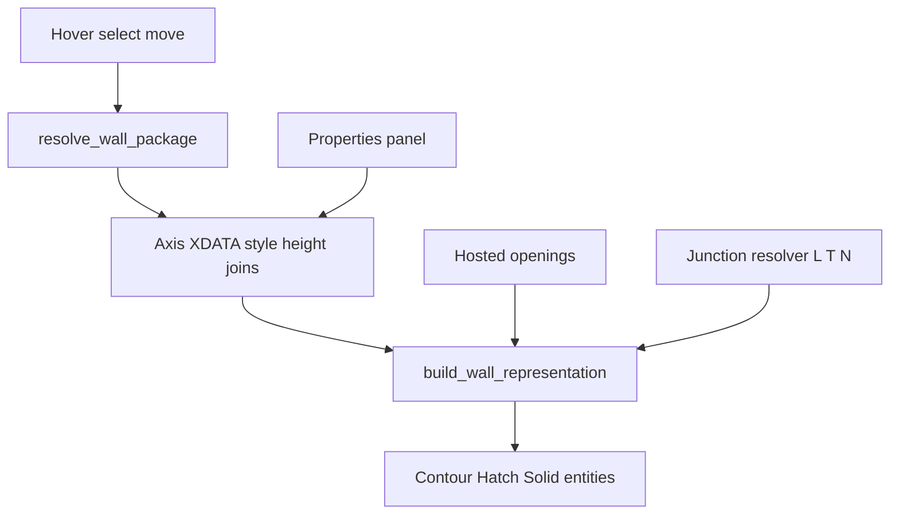
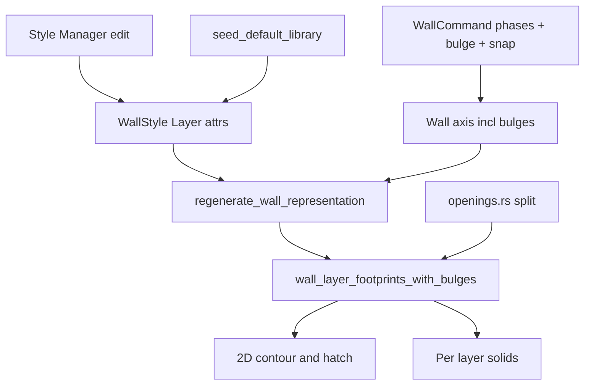

# Requirements

> **Etappe 1 (abgeschlossen):** Composite-Owner, Selektion/Properties, L/T-Härtung — siehe Delivery Steps 1–3, alle ✓ und verifiziert.
> **Etappe 2 (diese Planung):** Wandstil, Wand-Erzeugung und Rendering der Wand-Komponenten überarbeiten — siehe Delivery Steps 4–6 und die Zusätze in den Abschnitten unten.

### Overview & Goals — Etappe 1 (Referenz)
Wände werden als **ein Composite-Bauteil** behandelt: Definition (Achse + Stil + Höhe + Joins) plus **Darstellungskomponenten** (2D-Kontur, Hatch, 3D-Solid), die aus der Definition regeneriert werden. Hover, Selektion, Move und Properties wirken immer auf die ganze Wand. L- und T-Verbindungen werden durch Härtung des bestehenden Junction-Resolvers zuverlässig.

DXF/DWG bleibt Standard-Entities + XDATA — keine Custom Entity. Öffnungen sind im Regenerierungs-Interface vorgesehen, volle Fenster-/Tür-GUI ist Folgearbeit.

### Scope
#### In Scope
- Composite-Owner: Achse mit `WALL`/`WALL_V2`-XDATA als Owner; Kinder (Kontur, Hatch, Solid) immer über `resolve_wall_package`.
- Einheitliches `WallRepresentation` für 2D **und** Anbindung 3D (heute getrennt).
- Hover/Selektion/Move als Paket; keine einzelne Hatch als alleiniges Ziel.
- Live-Properties: Stil, Höhe, Justification, Layer-Offsets.
- L- und T-Verbindungen: bestehenden Resolver in `join.rs`/`miter.rs` härten, nach Grip/Join/Extend neu auflösen.
- Regenerierung löscht alte Display-Handles und schreibt Komponenten neu; Slots für Öffnungs-Cuts (`build_wall_representation_with_openings`).

#### Out of Scope
- Eigenes BIM-Bauteil-Store oder Custom `WALL`-Entity.
- Persistenter Join-Constraint-Graph.
- Vollständige Fenster-/Tür-Werkzeuge und 3D-Boolean der Leibung.
- Geschosse, Räume, IFC.

### User Stories
- Als Planer sehe ich im Grundriss Schichtkonturen/Schraffur und im 3D die extrudierten Schichten derselben Wand.
- Als Planer picke, hebe und verschiebe ich die Wand als Ganzes.
- Als Planer ändere ich Stil/Höhe im Properties-Panel und die Darstellung aktualisiert sich sofort.
- Als Planer erzeuge ich L- und T-Stöße, die schichtgerecht verschnitten bleiben, auch nach Grip-Edit.

### Functional Requirements
- Klick auf beliebige Display-Komponente selektiert den Owner; Hover-Highlight umfasst das Paket.
- Regeneration nach Stil-, Höhen-, Achs- oder Join-Änderung aktualisiert 2D und 3D gemeinsam.
- L-Join: beide Enden auf gemeinsamen Schnitt, Miter je Schicht.
- T-Join: Stoßwand endet an der durchlaufenden Wand; durchlaufende Kontur wird ausgeschnitten/angestoßen, nicht fälschlich als L behandelt.
- Properties bleiben während `AEC_WALL` und nach Selektion editierbar.
- DXF speichert weiterhin nur Standard-Entities + XDATA-Handles der Kinder.

### Overview & Goals — Etappe 2 (neu)
Drei zusammengehörige Baustellen werden überarbeitet, ohne das Composite-Owner-Modell aus Etappe 1 zu brechen:
1. **Wandstil** (`wall_style.rs`, `library.rs`, Style Manager): Vererbungskette klarer editierbar machen, Layer-Aufbau um sinnvolle Attribute erweitern, Default-Bibliothek überarbeiten.
2. **Wand-Erzeugung** (`WallCommand` in `commands.rs`): Zeichen-Workflow (Phasen/Prompts) vereinfachen, Snapping robuster machen, gebogene (Bulge-)Achsen beim Zeichnen unterstützen.
3. **Rendering** (`representation.rs`, `openings.rs`, Solid-Erzeugung): 2D-Kontur/Hatch-Qualität, 3D-Solid-Qualität/Performance je Schicht, und robustere Öffnungs-Cuts.

### Scope — Etappe 2
#### In Scope
- `Layer`/`WallStyle`: neue/klarere Attribute (z. B. Layer-Rolle sichtbar im Manager, Musterzuordnung je Funktion), Style-Manager-UX für Vererbung.
- `library.rs`: überarbeitete Default-Stile/Materialien, die die neuen Layer-Attribute nutzen.
- `WallCommand`: Prompt-/Phasenfluss (`WallPhase`) vereinfachen; Snap-Radius/-Logik (`WALL_JOIN_SNAP_RADIUS`, `snapped_wall_at_point`) robuster gegen Fehlklicks; Bulge-fähige Achspunkte beim Zeichnen (Vorschau + finale Kontur).
- `WallLayerFootprint`/Solid-Pfad-Erzeugung: Qualität/Performance der Extrusion je Schicht (weniger Tessellationsartefakte, schnellere Regeneration bei vielen Wänden).
- 2D-Darstellung: Schraffurmuster/Linienstärken je Layer-Funktion konsistent aus dem Stil ableiten.
- `openings.rs`: 2D-Split robuster (Randfälle: Öffnung nahe Wandende, mehrere Öffnungen pro Segment, Öffnung über Layer-Gap).

#### Out of Scope
- 3D-Boolean-Cut der Öffnungs-Leibung (bleibt zurückgestellt wie in Etappe 1).
- Neues Bauteil-Store-Modell oder Custom Entity (Composite-Owner aus Etappe 1 bleibt Basis).
- Geschosse, Räume, IFC, volle Fenster-/Tür-GUI.

### User Stories — Etappe 2
- Als Planer sehe ich im Style Manager die Vererbungskette eines Wandstils und kann Layer-Rolle/Muster/Material direkt bearbeiten.
- Als Planer zeichne ich eine gebogene Wandachse und die Vorschau/Kontur folgt dem Bogen sofort.
- Als Planer verbinde ich beim Zeichnen zuverlässig an vorhandene Wandenden, ohne versehentlich falsch zu snappen.
- Als Planer sehe ich sauberere Schraffuren/3D-Solids auch bei vielen Wänden, ohne spürbaren Performance-Einbruch.
- Als Planer platziere ich eine Öffnung nahe einem Wandende oder über mehrere Layer-Gaps hinweg, und der 2D-Schnitt bleibt korrekt.

### Functional Requirements — Etappe 2
- Style Manager zeigt Eltern-Kind-Kette und erlaubt Layer-Attribute (Funktion, Muster/Layer-Override, Gap) inline zu bearbeiten; Änderungen regenerieren betroffene Wände.
- Default-Bibliothek (`seed_default_library`) enthält Stile, die die neuen Layer-Attribute demonstrieren.
- `AEC_WALL` unterstützt Bulge-Eingabe pro Segment (z. B. Tastenkürzel/Prompt analog `PLINE`-Bogenmodus) und rendert die Vorschau entsprechend.
- Snap während des Zeichnens bevorzugt eindeutige Endpunkte/Achsen im `WALL_JOIN_SNAP_RADIUS` und vermeidet Snap auf sich selbst oder weit entfernte Segmente.
- Regeneration erzeugt für gebogene Achsen weiterhin geschlossene, gültige Schichtkonturen (Bulge in `wall_layer_footprints_with_bulges` respektiert).
- Öffnungs-Cuts bleiben stabil, wenn eine Öffnung nahe einem Wandende, über einer Gap-Schicht oder neben einer weiteren Öffnung liegt.

# Technical Design

### Current Implementation
- Modul: `src/modules/aec/`.
- Owner + Kinder: `resolve_wall_package` und `regenerate_wall_representation*` in `commands.rs`.
- 2D-Zwischenmodell: `engine/representation.rs` (`WallRepresentation` — Achse, Außen-/Schichtkontur, Drag-Ghost, Opening-Cuts). **3D** (`sweep_model` / `solid_model`) ist bewusst **nicht** darin.
- Joins: `engine/join.rs`, `engine/miter.rs`, `join_junction_in_document` / `join_two_walls_in_document`.
- Öffnungen: `engine/openings.rs` (2D-Split; 3D-Cut zurückgestellt).
- Persistenz: XDATA `WALL`/`WALL_V2` auf der Achsen-Entity, Kinder-Handles in der Record.

### Key Decisions
1. **Composite-Owner** (kein separates Part-Store, keine Custom Entity) — DWG-Roundtrip und bestehendes Undo/Document bleiben gültig.
2. **Junction-Resolver härten** statt Constraint-Graph — L/T als Spezialfälle von `join_junction_in_document`.
3. **Darstellungskomponenten** sind das öffentliche Modell; später Fenster/Türen nutzen dasselbe Schema (Host + Display-Kinder).
4. Scope dieser Lieferung: **nur Wände**; Opening-API wird mitregeneriert, wenn Host-Öffnungen schon im Document liegen.

### Proposed Changes
- `WallRepresentation` um 3D-Schichtpfade erweitern oder eine dünne `WallDisplaySet { rep2d, solids }` darüberlegen, sodass `regenerate_wall_representation_inner` nur noch **eine** Quelle hat.
- Display-Kinder einheitlich taggen (XDATA `WALL_REP` + Owner-Handle + Rolle: `axis|contour|hatch|solid`).
- Hover/Select/Move: alle Pick-Pfade durch `resolve_wall_package`; Highlight aller Kinder.
- Properties: Änderungen rufen dieselbe Regen-Funktion inkl. Junction-Re-Resolve der betroffenen Endpunkte.
- L/T: Klassifikation (2 Wände, End-End vs. End-Mid); T darf die durchlaufende Achse nicht kürzen; Miter nur am Stoß; nach Grip am Junction immer `join_junction_in_document`.

### File Structure
- Ändern: `engine/representation.rs`, `engine/join.rs`, `engine/miter.rs`, `commands.rs` (regen, package, join entry points).
- Anbinden: Scene-Hover/Select (bestehende AEC-Hooks), Properties-Panel für `WALL_V2`.
- Kaum neue Dateien; optional `engine/display.rs` wenn 2D+3D-Bundle die Representation sprengt.

### Risks — Etappe 1
- Verwaiste Kinder nach fehlgeschlagener Regen → immer erst löschen nach erfolgreichem Build, oder transaktional über Document-Undo.
- T vs. L-Verwechslung bei fast-koinzidenten Endpunkten → Toleranz + explizite End-vs-Mid-Klassifikation.
- 3D ohne Opening-Cut bleibt visuell geschlossen — dokumentieren, nicht in dieser Etappe Boolean bauen.

### Current Implementation — Etappe 2 (Ausgangslage)
- Stil: `engine/wall_style.rs` (`WallStyle`, `Layer`, `LayerValue`, `effective_layers`/`effective_layers_for_wall_bb`), `engine/style.rs` (generische Vererbung `resolve_chain`), `engine/library.rs` (`seed_default_library`, `load_or_seed`), GUI `aec_wall_style_manager.rs` / Style-Picker-Modal.
- Erzeugung: `WallCommand` in `commands.rs` (Zeilen ~1310–1700+), `WallPhase` (Drawing/AskStyle/AskHeight/AskThickness), `WALL_JOIN_SNAP_RADIUS = 0.3`, `snapped_wall_at_point`.
- Rendering: `engine/representation.rs` (`WallRepresentation`, `WallLayerSolidPath`), `wall_layer_footprints_with_bulges` in `commands.rs` (2D-Footprints inkl. Bulge), Solid-Erzeugung je Schicht (Extrusion), `engine/openings.rs` (2D-Split der Kontur an Öffnungen).

### Key Decisions — Etappe 2
1. **Stil-Erweiterung additiv**: neue `Layer`-Felder mit `#[serde(default)]`, damit bestehende Bibliotheken/Zeichnungen ohne Migration weiterladen (Muster analog zu `layer_override`/`gap_before`).
2. **Bulge-Achsen nur im Zeichen-Workflow neu, Geometrie-Pfad existiert schon**: `wall_layer_footprints_with_bulges` verarbeitet Bulges bereits für die Regeneration; die Lücke ist die interaktive Eingabe/Vorschau in `WallCommand`, nicht das Kontur-Modell.
3. **Snap-Härtung ohne neues Datenmodell**: bestehenden `WALL_JOIN_SNAP_RADIUS`-Mechanismus verfeinern (Priorität, Ausschluss der eigenen im Bau befindlichen Wand), kein neues Snap-Subsystem.
4. **Öffnungs-Robustheit bleibt 2D**: `openings.rs` wird für Randfälle gehärtet, 3D-Boolean bleibt explizit außerhalb dieser Etappe.

### Proposed Changes — Etappe 2
- **Stil**: `Layer` um Anzeige-relevante Felder ergänzen (z. B. Hatch-Muster-Hinweis, sichtbarer Rollen-Tag); `aec_wall_style_manager.rs` zeigt Vererbungskette (Eltern-Liste aus `resolve_chain`) und erlaubt Inline-Edit je Layer-Zeile; Speichern löst Regeneration betroffener Wände aus (bestehender Pfad aus Etappe 1, Step 2).
- **Bibliothek**: `seed_default_library` um 1–2 zusätzliche realistische Wandstile erweitern, die die neuen Layer-Attribute zeigen.
- **Erzeugung**: `WallPhase`/Prompts vereinfachen (z. B. weniger Pflicht-Prompts, wenn Stil/Höhe schon live gesetzt sind — Grundmechanik existiert via `height_live_set`); Bulge-Eingabe pro Segment ergänzen (Taste/Prompt, Vorschau-Polyline mit Bulge); Snap-Auswahl in `snapped_wall_at_point`/Punkt-Erfassung nach Priorität (exakter Endpunkt > Achse) und Selbst-Ausschluss härten.
- **Rendering**: Schicht-Footprint/Solid-Erzeugung auf Tessellationsartefakte prüfen (insbesondere an Bulge-Segmenten und Layer-Gaps) und ggf. Kontur-Vereinfachung/Toleranzen anpassen; Hatch-Zuordnung konsistent aus Layer-Funktion/Muster ableiten statt hartkodiert.
- **Öffnungen**: `openings.rs`-Split für Randfälle (Öffnung nahe Ende, mehrere Öffnungen, Öffnung über Gap) mit gezielten Regressionstests härten.

### File Structure — Etappe 2
- Ändern: `engine/wall_style.rs`, `engine/library.rs`, `aec_wall_style_manager.rs` (Style/Layer-Edit), `commands.rs` (`WallCommand`, `wall_layer_footprints_with_bulges`, Solid-Erzeugung), `engine/representation.rs`, `engine/openings.rs`.
- Keine neuen Module erwartet; ggf. kleine Helper in `commands.rs` für Snap-Priorität und Bulge-Prompt-Parsing.

### Risks — Etappe 2
- Neue Layer-Attribute dürfen bestehende gespeicherte Bibliotheken/Zeichnungen nicht brechen → additive Felder mit Defaults, Roundtrip-Test.
- Bulge-Eingabe beim Zeichnen darf bestehende gerade Wände/Tests nicht regressieren → Bulge default `0.0`, bestehende Tests unverändert grün halten.
- Snap-Härtung könnte legitime, aber knappe Klicks unterdrücken → Priorität statt harter Ablehnung, manuell an Kanten-Fällen testen.
- Öffnungs-Randfälle sind kombinatorisch (Ende, Gap, mehrere Öffnungen) → gezielte Tests statt Versuch, alle Fälle formal zu beweisen.

# Testing

### Validation Approach
Bestehende AEC-Unit-Tests um Composite- und L/T-Fälle erweitern; manuell: zeichnen, picken, Properties, 2D/3D-Viewport.

### Key Scenarios
- Wand zeichnen → Kontur+Hatch+Solid, ein Owner.
- Klick auf Hatch selektiert Achse; Move verschiebt alle Kinder.
- Stil/Höhe ändern → 2D und 3D aktualisieren sich.
- Zwei Wände L; eine Wand T gegen die Mitte der anderen; nach Grip am Knoten bleibt Verschnitt korrekt.

### Edge Cases — Etappe 1
- Klick auf verwaiste Display-Entity (Owner gelöscht) → kein Crash, Entity unverändert oder aufräumen.
- N-way (3+ Wände) darf durch L/T-Härtung nicht regressieren.
- Wand ohne Stil: sinnvolle Preview/Defaults wie bisher.

### Key Scenarios — Etappe 2
- Wandstil im Style Manager bearbeiten (Layer-Funktion/Muster ändern) → betroffene Wände regenerieren mit neuer Darstellung.
- Wand mit gebogenem Achssegment zeichnen → Vorschau und finale 2D/3D-Darstellung folgen dem Bogen.
- Beim Zeichnen nahe an ein bestehendes Wandende klicken → zuverlässiger Snap, kein Snap auf die eigene im Bau befindliche Wand.
- Öffnung nahe Wandende bzw. über einer Gap-Schicht platzieren → 2D-Kontur bleibt korrekt geteilt.

### Edge Cases — Etappe 2
- Bibliothek ohne die neuen Layer-Attribute (alte Datei) lädt weiterhin korrekt (Serde-Defaults).
- Bulge nahe `0` (Rundungsfehler) darf nicht fälschlich als Bogen behandelt werden.
- Zwei Öffnungen sehr nahe beieinander im selben Segment → kein doppelter/fehlerhafter Split.
- Viele Wände gleichzeitig regenerieren (Performance) → keine sichtbare Verzögerung im Vergleich zu vorher messen.

# Delivery Steps

### ✓ Step 1: Composite-Owner und Display-Komponenten vereinheitlichen
Eine Wand ist ein Owner plus getaggte Darstellungskinder; 2D- und 3D-Regen teilen eine Quelle.

- `WallRepresentation` / optionales Display-Bundle so erweitern, dass `regenerate_wall_representation_inner` in `commands.rs` 2D-Kontur, Hatch und Solids aus derselben Geometrie schreibt.
- Kinder mit Owner-Handle und Rolle in XDATA taggen; `resolve_wall_package` als einzigen Einstieg belassen.
- Vorhandene Opening-Cuts aus `representation.rs` / `openings.rs` in denselben Regen-Pfad legen (kein neues Fenster-UI).

### ✓ Step 2: Hover, Selektion und Properties auf das Wand-Paket legen
Pick, Highlight, Move und Property-Edits treffen immer die ganze Wand.

- Hover/Select/Move durch `resolve_wall_package` führen und alle Kinder highlighten.
- Properties (Stil, Höhe, Justification) schreiben XDATA und rufen dieselbe Regeneration auf.
- Sicherstellen, dass Live-Panel während `AEC_WALL` und nach Selektion dieselben Felder nutzen.

### ✓ Step 3: L- und T-Verbindungen im Junction-Resolver härten
L (End-End) und T (End-Mid) werden korrekt klassifiziert und nach jedem Edit neu aufgelöst.

- In `join.rs` / `miter.rs` End-End vs. End-Mid unterscheiden; T kürzt die durchlaufende Achse nicht.
- Nach Grip, Join-Befehl und Extend `join_junction_in_document` aufrufen, damit Schicht-Miter nicht von paarweisem Überschreiben zerlegt werden.
- Bestehende N-way-Tests behalten und L/T-Fälle ergänzen.

### ✓ Step 4: Wandstil-Vererbung, Layer-Attribute und Default-Bibliothek überarbeiten
`Layer`/`WallStyle` bekommen klarere, editierbare Attribute; der Style Manager zeigt die Vererbungskette; die Default-Bibliothek nutzt die neuen Attribute.

- `engine/wall_style.rs`: `Layer` um zusätzliche Anzeige-/Rollen-Attribute erweitern (additiv, `#[serde(default)]`), Roundtrip-Tests ergänzen.
- `aec_wall_style_manager.rs`: Eltern-Kind-Kette (`resolve_chain`) sichtbar machen, Layer-Zeilen inline editierbar machen; Speichern löst bestehende Regenerations-Pipeline aus.
- `engine/library.rs`: `seed_default_library` um Stile erweitern, die die neuen Attribute demonstrieren.

### ✓ Step 5: Wand-Erzeugung — Zeichen-Workflow, Snapping und Bogen-Achsen
`AEC_WALL` bietet einen einfacheren Prompt-Fluss, zuverlässigeres Snapping und Bulge-fähige Achspunkte beim Zeichnen.

- `WallCommand`/`WallPhase` in `commands.rs`: Prompt-Reihenfolge vereinfachen, wenn Stil/Höhe bereits live gesetzt sind.
- Snap-Logik (`WALL_JOIN_SNAP_RADIUS`, `snapped_wall_at_point`) härten: Priorität exakter Endpunkte, Ausschluss der eigenen im Bau befindlichen Wand.
- Bulge-Eingabe pro Segment ergänzen (Vorschau-Polyline inkl. Bogen), Achse mit Bulge finalisieren; nutzt den bestehenden `wall_layer_footprints_with_bulges`-Pfad für die Regeneration.

### ✓ Step 6: Rendering der Wand-Komponenten härten — 2D/3D-Qualität und Öffnungs-Cuts
2D-Kontur/Hatch und 3D-Solids je Schicht sind konsistenter und performanter; Öffnungs-Splits sind robust gegen Randfälle.

- `engine/representation.rs` / Solid-Erzeugung: Tessellationsartefakte an Bulge-Segmenten und Layer-Gaps prüfen und beheben; Hatch-Zuordnung konsistent aus Layer-Funktion/Muster ableiten.
- `engine/openings.rs`: 2D-Split für Randfälle härten (Öffnung nahe Wandende, mehrere Öffnungen pro Segment, Öffnung über Gap-Schicht) mit gezielten Regressionstests.
- Performance-Check bei vielen Wänden (Regeneration nach Stil-/Achs-Änderung) gegen den Stand aus Etappe 1 vergleichen.