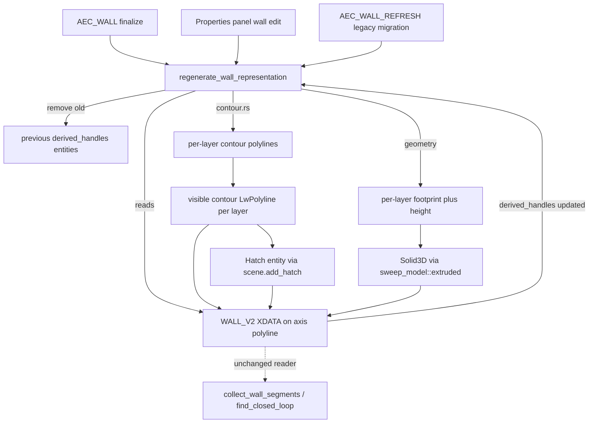

# Requirements

### Overview & Goals
Wände im AEC-Core-Modul (`src/modules/aec/`, Branch `feature/aec-core-module`) werden bisher nur als einfache, unsichtbare Mittellinien-Polylinie mit `WALL`/`WALL_V2`-XDATA gespeichert. Die Schicht-Geometrie (Kontur, Footprint, Höhe je Material-Schicht) wird bereits berechnet (`wall_layer_contour_polylines`/`wall_layer_extrusions` in `src/modules/aec/commands.rs`), aber nie als sichtbare Entity im Dokument erzeugt. Dieses Vorhaben macht Wände tatsächlich sichtbar: im Grundriss als schraffierte Schichtkonturen (2D), im 3D-Viewport als echte extrudierte Solid3D-Körper je Schicht.

### Scope
**In Scope:**
- Für jede Wand werden pro Material-Schicht eine geschlossene 2D-Kontur-Polylinie plus eine Hatch-Entity (Schraffurmuster/Farbe aus dem zugewiesenen `Material`) erzeugt.
- Für jede Wand werden pro Material-Schicht echte `Solid3D`-Körper via der bestehenden `sweep_model::extruded`-Funktion erzeugt.
- Automatische Erzeugung/Aktualisierung dieser abgeleiteten Entities bei jedem Abschluss von `AEC_WALL` (Zeichnen) und bei jeder Wand-Änderung über das Properties-Panel.
- Die bisherige Mittellinien-Polylinie bleibt als unsichtbare Referenzgeometrie (eigener Nicht-Druck-Layer o. ä.) erhalten — sie bleibt Trägerin der XDATA und wird weiterhin von `AEC_ROOM`/`collect_wall_segments`/`find_closed_loop` genutzt.
- Aufräumen (Entfernen) alter abgeleiteter Entities einer Wand vor dem Neuerzeugen, damit sich bei wiederholtem Bearbeiten keine Geister-Entities ansammeln.

**Out of Scope:**
- Fenster-/Tür-Durchbrüche in der Wandgeometrie.
- Persistente Geschoss-Verwaltung, Kontrollflächen.
- Automatische Neuberechnung bei Änderung eines referenzierten `WallStyle`/`Material` in der Bibliothek (nur Neuberechnung bei direkter Wand-Bearbeitung).
- Materialbasiertes 3D-Rendering (echte Textur/PBR-Material) — nur Solid-Geometrie, keine Material-Zuweisung im Renderer.

### User Stories
- Als Planer möchte ich nach dem Zeichnen einer Wand sofort ihre Schichten im Grundriss sehen (mit passender Schraffur je Material), damit ich den Wandaufbau visuell nachvollziehen kann.
- Als Nutzer möchte ich dieselbe Wand im 3D-Viewport als geschichtetes Volumenmodell sehen, damit Grundriss und 3D-Ansicht konsistent auf demselben Wandaufbau basieren.
- Als Nutzer möchte ich, dass beim Ändern der Höhe/Dicke/des Stils einer Wand über das Properties-Panel die Darstellung automatisch aktualisiert wird, ohne manuell alte Geometrie löschen zu müssen.
- Als Nutzer möchte ich, dass `AEC_ROOM` weiterhin korrekt funktioniert, auch wenn Wände jetzt zusätzliche sichtbare Kontur-/Solid-Entities besitzen.

### Functional Requirements
- Beim Abschluss von `AEC_WALL` werden pro Schicht: eine geschlossene Kontur-Polylinie, eine Hatch-Entity (Pattern/Farbe aus `Material`) und ein extrudiertes `Solid3D` erzeugt.
- Jede abgeleitete Entity wird per Handle-Referenz in der Wand-XDATA (`WALL_V2`) mit der Mutterwand verknüpft, damit sie bei erneuter Bearbeitung wiedergefunden und ersetzt werden kann.
- Bei Properties-Panel-Änderungen (Höhe/Dicke/Material/Stil) werden alle referenzierten abgeleiteten Entities entfernt und mit den neuen Werten neu erzeugt.
- Die Mittellinien-Polylinie bleibt unverändert Trägerin der Haupt-XDATA und ist weiterhin die einzige Geometrie, die `collect_wall_segments`/`find_closed_loop` liest.
- Löschen einer Wand (Mittellinie) entfernt auch alle ihre abgeleiteten Kontur-/Hatch-/Solid-Entities.

### Non-Functional Requirements
- Kein Host-API-Umbau nötig: alle genutzten Bausteine (`sweep_model::extruded`, `HatchModel`/`scene.add_hatch`, XDATA read/write) sind bereits im Core vorhanden und werden nur aus dem AEC-Modul heraus verwendet.
- Performance: Neuerzeugung soll auf die tatsächlich betroffene Wand beschränkt bleiben (kein globales Neu-Tessellieren aller Wände bei einer Einzeländerung).
- Bestehende XDATA-Rundtrip-Fähigkeit (DWG/DXF) darf nicht brechen; alte Wände ohne abgeleitete Entities (aus früheren Sessions) müssen weiterhin ladbar bleiben und beim nächsten Bearbeiten migriert werden.

# Technical Design

### Current Implementation
- `src/modules/aec/commands.rs`: `WallCommand` (Mehrpunkt-Zeichnen wie `PLINE`), `wall_record`/`wall_from_entity`/`wall_v2_from_entity` (XDATA-Lese-/Schreib-Helfer für `WALL`/`WALL_V2`), sowie bereits vorhandene reine Geometriefunktionen `wall_layer_contour_polylines(...)` (liefert `Vec<Vec<(f64,f64)>>`, eine Kontur je Schicht, per Normalenversatz/Miter-Ecken aus `engine/contour.rs`) und `wall_layer_extrusions(...)` (liefert Footprint+Höhe je Schicht) — beide bisher **nur Datenberechnung ohne Host-Entity-Erzeugung**.
- `src/scene/model/sweep_model.rs`: `sweep_model::extruded(&entity, height)` erzeugt aus einer geschlossenen Profil-Entity ein echtes `Solid3D` — bereits genutzt in `command_driver.rs` für andere Extrusionsbefehle (z. B. `EXTRUDE`).
- `src/modules/draw/draw/hatch.rs` + `command_driver.rs::CommitHatch`: `HatchModel`/`scene.add_hatch()` erzeugen echte Hatch-Entities mit Muster/Farbe — bereits genutztes, produktionsreifes Muster im Host.
- `src/app/properties.rs`: bestehende Wand-Sektionen ("Wall" für Single-Layer-Fallback, "Wall Layers" read-only für `WALL_V2`) schreiben Änderungen über `write_wall_properties`/die gemeinsame XDATA-Logik zurück — aktuell ohne jegliche Nachführung abgeleiteter Darstellungs-Entities.
- `AEC_ROOM` (`collect_wall_segments`/`find_closed_loop`, `engine/loop_detection.rs`) liest ausschließlich die Mittellinien-`LwPolyline` der Wände — muss durch neue abgeleitete Entities unberührt bleiben.

### Key Decisions
- **2D: Kontur + Hatch-Schraffur nach Material** (vom Nutzer bestätigt): pro Schicht eine geschlossene Kontur-Polylinie plus eine echte Hatch-Entity mit dem Material-Pattern/-Farbe, nicht nur reine Umrisslinien.
- **3D: echte Solid3D-Extrusion je Schicht** (vom Nutzer bestätigt): jede Schicht wird einzeln über `sweep_model::extruded` zu einem eigenen Solid extrudiert (kein einzelnes Gesamt-Solid für die ganze Wand) — ermöglicht spätere schichtweise Materialdarstellung.
- **Automatische Erzeugung bei Erstellung/Änderung** (vom Nutzer bestätigt): kein separates "Render"-Kommando; die abgeleiteten Entities werden direkt beim Abschluss von `AEC_WALL` sowie bei jeder Properties-Panel-Änderung neu erzeugt.
- **Mittellinie bleibt unsichtbare Referenzgeometrie** (vom Nutzer bestätigt): die bestehende `LwPolyline` bleibt alleinige Trägerin der `WALL`/`WALL_V2`-XDATA und wird nicht durch die Kontur ersetzt; sie wird auf einen eigenen, nicht druckbaren Hilfs-Layer (z. B. `AEC_WALL_AXIS`) verschoben/erzeugt, damit sie im Grundriss nicht zusätzlich zur Kontur sichtbar ist.
- **Verknüpfung über Handle-Liste in der XDATA statt separatem Index**: die Mittellinie speichert die Handles ihrer abgeleiteten Entities (Konturen, Hatches, Solids) direkt in einem erweiterten `WALL_V2`-Record-Feld, analog zum bereits etablierten Handle-Referenz-Muster (z. B. `storey_id`) — kein neuer globaler Abhängigkeits-Store nötig.
- **Neuerzeugung per "Delete-and-Recreate"** statt inkrementellem Diff/Update: bei jeder Änderung werden zuerst alle bekannten abgeleiteten Handles der Wand entfernt (`HostApi`-analoge `remove_entity`-Aufrufe im Core direkt über `Scene`/`CadDocument`), danach alle Entities aus den aktuellen Werten neu erzeugt — einfacher und robuster als partielles Patchen, auf Kosten etwas mehr Tessellierungsaufwand pro Änderung (als für den erwarteten Modellumfang akzeptabel eingestuft).

### Proposed Changes
1. **XDATA-Erweiterung um Kind-Handle-Liste** (`src/modules/aec/commands.rs`): `WALL_V2`-Record um ein Feld `derived_handles: Vec<Handle>` (oder String-serialisierte Handle-Liste) erweitern; `wall_v2_from_entity`/`wall_record` entsprechend angepasst; alte Records ohne dieses Feld werden mit leerer Liste interpretiert (Rückwärtskompatibilität).
2. **Hilfs-Layer für die Mittellinie**: beim Erzeugen/Migrieren einer Wand wird sichergestellt, dass die Mittellinien-Polylinie auf einem dedizierten, nicht-druckbaren Layer (`AEC_WALL_AXIS`, angelegt falls nicht vorhanden) liegt.
3. **Neue Funktion `regenerate_wall_representation(scene, doc, wall_handle)`** in `src/modules/aec/commands.rs`: liest die Mittellinie + `WALL_V2`-Daten, entfernt alle in `derived_handles` gelisteten Entities, berechnet über die bereits vorhandenen `wall_layer_contour_polylines`/`wall_layer_extrusions` die Geometrie je Schicht, erzeugt:
   - je Schicht eine geschlossene Kontur-`LwPolyline` (normaler, sichtbarer Layer, z. B. `AEC_WALL_CONTOUR` oder der aktuelle Zeichnungslayer),
   - je Schicht eine `HatchModel`/`scene.add_hatch()`-Entity mit Pattern/Farbe aus dem referenzierten `Material`,
   - je Schicht ein `Solid3D` über `sweep_model::extruded(contour_entity, layer_height)`,
   aktualisiert danach `derived_handles` in der Wand-XDATA.
4. **Aufruf-Integration**: `WallCommand::finalize()` (Abschluss des Zeichnens) und der Properties-Panel-Schreibpfad (`write_wall_properties` in `src/app/properties.rs`) rufen nach dem Schreiben der Basiswerte `regenerate_wall_representation` auf.
5. **Lösch-Integration**: der bestehende Entity-Lösch-Pfad für Wände (z. B. `ERASE`/`DELETE`-Kommando, sofern es Wand-Handles generisch behandelt) wird um eine Prüfung erweitert: wird eine Entity mit `WALL`/`WALL_V2`-XDATA gelöscht, werden zuvor auch ihre `derived_handles` entfernt (Cleanup-Hook, analog zu bestehenden Lösch-Kaskaden im Host, falls vorhanden — sonst als expliziter Vorher-Check in der Lösch-Kommando-Logik ergänzt).
6. **Migration alter Wände**: existiert eine Wand mit `WALL`/`WALL_V2`-XDATA aber ohne `derived_handles` (aus früheren Sessions), wird beim ersten Aufruf von `regenerate_wall_representation` (z. B. ausgelöst durch einmaliges Öffnen des Properties-Panels oder ein neues Hilfskommando `AEC_WALL_REFRESH`) die Darstellung nachträglich erzeugt.

### Data Models / Contracts
```rust
// erweitert: src/modules/aec/commands.rs, WALL_V2 XDATA record shape
// ["WALL_V2", style_id, height, storey_id, layer_count,
//  (material_name, thickness, function) * layer_count,
//  derived_handle_count: Integer32,
//  (handle: Handle) * derived_handle_count]

pub fn regenerate_wall_representation(
    scene: &mut Scene,
    doc: &mut CadDocument,
    wall_handle: Handle,
) -> Result<(), WallRenderError> {
    // 1. read axis polyline + WALL_V2 data
    // 2. remove entities listed in derived_handles
    // 3. for each layer: build contour polyline, hatch, extrude solid
    // 4. write updated derived_handles back into WALL_V2 XDATA
}
```

### Components
- `src/modules/aec/commands.rs` (geändert): neue Funktion `regenerate_wall_representation`, erweiterte `WALL_V2`-Lese-/Schreib-Helfer um `derived_handles`, Aufruf-Integration in `WallCommand::finalize()`.
- `src/app/properties.rs` (geändert): Wand-Schreibpfad ruft nach dem Speichern `regenerate_wall_representation` auf.
- `src/scene/model/sweep_model.rs` (unverändert, nur genutzt): Extrusions-Baustein.
- `src/modules/draw/draw/hatch.rs`/`command_driver.rs` (unverändert, nur genutzt): Hatch-Erzeugungs-Baustein.
- Ggf. neues, kleines Hilfskommando `AEC_WALL_REFRESH` zur manuellen Migration/Neuerzeugung bestehender Alt-Wände ohne abgeleitete Geometrie.

### Architecture Diagram


### Risks
- **Entity-Ansammlung bei fehlerhaftem Cleanup**: falls `derived_handles` nicht vollständig gepflegt wird (z. B. bei Absturz zwischen Löschen und Neuerzeugen), können verwaiste Kontur-/Hatch-/Solid-Entities im Dokument verbleiben — Mitigation: Delete-first-then-create-Reihenfolge, defensive Prüfung auf existierende Handles vor dem Entfernen.
- **Performance bei vielen Wänden**: Delete-and-Recreate bei jeder Änderung erzeugt mehr Tessillierungsaufwand als inkrementelles Update — für den aktuellen AEC-Funktionsumfang (Einzelgebäude, keine Massenbearbeitung) als akzeptabel eingestuft, könnte bei großen Projekten später optimiert werden.
- **Eckenverschneidung bei Wandkreuzungen**: `wall_layer_contour_polylines` nutzt bereits vereinfachte Miter-Ecken (aus früherem Plan bekannt) — bei spitzen Winkeln/T-Stößen können sich Konturen mehrerer Wände optisch überlappen/Lücken zeigen; das ist eine bekannte, bewusst nicht behobene Einschränkung dieser Iteration.
- **Migrationskomplexität für Altbestand**: Wände aus vorherigen Sessions ohne `derived_handles`-Feld müssen zuverlässig als "noch nicht gerendert" erkannt werden, um nicht versehentlich mit einer leeren Liste "nichts zu löschen" zu interpretieren, obwohl bereits Darstellung fehlt — Mitigation: Feld-Präsenz statt Listenlänge prüfen, dediziertes `AEC_WALL_REFRESH`-Kommando für expliziten Nachzug.

# Delivery Steps

###   Step 1: WALL_V2-Schema um Handle-Referenzen für abgeleitete Entities erweitern
Die Wand-XDATA kann eine Liste von Handles ihrer abgeleiteten Kontur-/Hatch-/Solid-Entities speichern und lesen, rückwärtskompatibel zu bestehenden Alt-Wänden.
- `WALL_V2`-Record-Layout in `src/modules/aec/commands.rs` um ein Feld `derived_handles: Vec<Handle>` erweitern.
- `wall_v2_from_entity`/`wall_record`-Helfer entsprechend anpassen; fehlt das Feld (Alt-Record), wird eine leere/„nicht initialisiert"-Markierung zurückgegeben statt eines Parse-Fehlers.
- Dedizierter Hilfs-Layer `AEC_WALL_AXIS` wird bei Bedarf angelegt und die Mittellinien-Polylinie beim Erzeugen/Migrieren dorthin verschoben.
- Unit-Tests: Schreiben/Lesen eines Records mit mehreren Handles; Lesen eines Alt-Records ohne das Feld liefert das erwartete Fallback-Verhalten.

###   Step 2: Funktion zur Erzeugung der 2D-Schichtkontur mit Material-Hatch implementieren
Aus einer Wand mit Schichtdaten werden pro Schicht eine sichtbare Kontur-Polylinie und eine passend schraffierte Hatch-Entity erzeugt.
- Neue Funktion (z.B. `create_wall_layer_2d(scene, doc, contour, material)`) in `src/modules/aec/commands.rs`, die aus den bereits vorhandenen `wall_layer_contour_polylines`-Daten je Schicht eine geschlossene, sichtbare `LwPolyline` erzeugt.
- Für jede Kontur wird über die bestehende Hatch-Infrastruktur (`src/modules/draw/draw/hatch.rs`, `command_driver.rs::CommitHatch`) eine Hatch-Entity mit dem `hatch_pattern`/`line_color` des referenzierten `Material` erzeugt.
- Rückgabe der erzeugten Handles (Kontur + Hatch je Schicht) zur weiteren Verknüpfung mit der Wand-XDATA.
- Tests: für eine Beispielwand mit 3 Schichten werden die erwartete Anzahl Kontur-/Hatch-Entities mit korrekten Materialattributen erzeugt.

###   Step 3: 3D-Solid-Extrusion je Schicht über sweep_model::extruded implementieren
Aus derselben Wand werden pro Schicht echte Solid3D-Körper mit korrekter Höhe erzeugt.
- Neue Funktion (z.B. `create_wall_layer_solid(scene, doc, contour, height)`) in `src/modules/aec/commands.rs`, die die bereits berechneten Footprint-Daten aus `wall_layer_extrusions` je Schicht über `sweep_model::extruded` zu einem eigenständigen `Solid3D` extrudiert.
- Erzeugte Solids werden dem Dokument hinzugefügt und ihre Handles zurückgegeben.
- Tests: für eine Beispielwand mit mehreren Schichten wird die erwartete Anzahl Solids mit der jeweils korrekten Extrusionshöhe erzeugt (Volumen-/Bounding-Box-Prüfung als Sanity-Check).

###   Step 4: regenerate_wall_representation als zentrale Orchestrierungsfunktion implementieren
Eine einzelne Funktion entfernt die alte Darstellung einer Wand und erzeugt sie konsistent aus den aktuellen Werten neu.
- Neue Funktion `regenerate_wall_representation(scene, doc, wall_handle)` in `src/modules/aec/commands.rs`: liest Mittellinie + `WALL_V2`-Daten, entfernt alle in `derived_handles` gelisteten Entities, ruft die Kontur/Hatch- und Solid-Erzeugungsfunktionen aus den vorherigen Schritten für jede Schicht auf, schreibt die neuen `derived_handles` zurück in die Wand-XDATA.
- Fehlerbehandlung: fehlende/inkonsistente Wanddaten führen zu einer kontrollierten Fehlermeldung statt Panic.
- Tests: Aufruf auf einer frisch erzeugten Wand liefert die erwartete Anzahl neuer Entities; ein zweiter Aufruf (Re-Regenerierung) entfernt zuvor erzeugte Entities korrekt, bevor neue erzeugt werden (keine Verdopplung).

###   Step 5: Automatische Regenerierung bei Wand-Erstellung und Properties-Panel-Änderung verdrahten
Wände zeigen unmittelbar nach dem Zeichnen und nach jeder Properties-Panel-Änderung die aktuelle Schicht-Darstellung.
- `WallCommand::finalize()` in `src/modules/aec/commands.rs` ruft nach dem Schreiben der Basis-XDATA `regenerate_wall_representation` auf.
- Der Wand-Schreibpfad in `src/app/properties.rs` (Höhe/Dicke/Material/Stil-Änderung) ruft nach dem Zurückschreiben ebenfalls `regenerate_wall_representation` auf.
- `AEC_ROOM`/`collect_wall_segments`/`find_closed_loop` werden gegen die neue Mittellinien-Layer-Verschiebung (`AEC_WALL_AXIS`) getestet, um sicherzustellen, dass die Raumerkennung unverändert funktioniert.
- Tests: Zeichnen einer neuen Wand erzeugt sichtbare Kontur/Solids; Ändern der Höhe über die Properties-Sektion aktualisiert die Solid-Höhe ohne alte Geister-Entities zu hinterlassen; bestehende `AEC_ROOM`-Tests bleiben grün.

###   Step 6: Migrationskommando für bestehende Alt-Wände ohne abgeleitete Darstellung ergänzen
Wände aus früheren Sessions ohne Schicht-Darstellung können nachträglich sichtbar gemacht werden, und das Löschen einer Wand entfernt auch ihre abgeleitete Geometrie.
- Neues Kommando `AEC_WALL_REFRESH`, das für alle Wand-Entities im Dokument ohne vorhandene `derived_handles` `regenerate_wall_representation` aufruft.
- Lösch-Pfad für Wand-Entities (z.B. bestehendes `ERASE`/`DELETE`-Kommando) erweitert: beim Löschen einer Entity mit `WALL`/`WALL_V2`-XDATA werden zuvor auch ihre `derived_handles` entfernt.
- Tests: eine simulierte Alt-Wand (Record ohne `derived_handles`) wird durch `AEC_WALL_REFRESH` korrekt migriert; Löschen einer vollständig gerenderten Wand entfernt auch alle zugehörigen Kontur-/Hatch-/Solid-Entities.