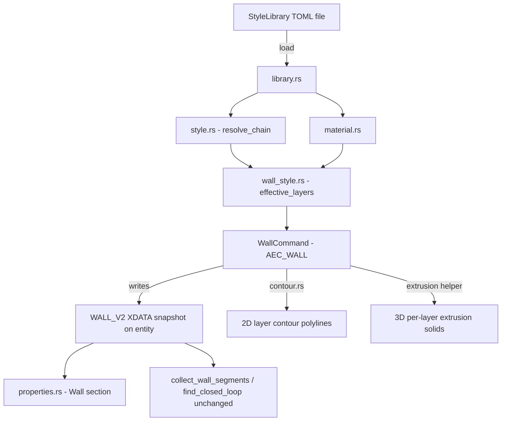

# Requirements

### Overview & Goals
Erweiterung des bestehenden AEC-Core-Moduls (`src/modules/aec/`, Branch `feature/aec-core-module`) um ein **generisches, hierarchisches Stil-System** für alle architektonischen Objekttypen sowie einen **mehrschaligen Wandaufbau** (Layer-Komposition mit Material-Referenzen). Wände erhalten dadurch eine echte Grundriss-Darstellung (Schichtkontur) und eine 3D-Darstellung (Solid je Schicht) statt der bisherigen reinen Mittellinien-Polylinie.

### Scope
**In Scope:**
- Generisches Stil-Datenmodell mit **Einzel-Elternvererbung** (`parent_style_id`), anwendbar auf beliebige AEC-Objekttypen (zunächst nur für Wände konkret genutzt, aber Datenmodell nicht wandspezifisch).
- **Material-Bibliothek**: benannte Materialien mit Darstellungsattributen (Schraffur-Pattern, Linienfarbe/-typ) und einem optionalen 3D-Render-Material-Verweis (Platzhalterfeld, ohne Host-API-Anbindung).
- **Wandstil mit Schichtaufbau**: geordnete Liste von Schichten (Material-Referenz, Dicke, Funktion wie "tragend"/"Dämmung"/"Putz"), von außen nach innen.
- **Speicherung**: Stile + Materialien primär in einer Bibliotheksdatei (TOML), zusätzlich ein aufgelöster XDATA-Snapshot je Wand-Entity für DWG/DXF-Rundtrip.
- **Darstellung**: 2D-Schichtkontur (parallele Linien je Schicht mit Material-Hatch) für den Grundriss **und** 3D-Extrusion je Schicht (separates Solid) für den 3D-Viewport — beides im selben Umsetzungsschritt.
- Integration in bestehenden `AEC_WALL`-Zeichenworkflow (Stil-Auswahl statt/zusätzlich zu Höhe-/Dicke-Prompt) und ins Properties-Panel (Stil-Zuweisung, Schicht-Übersicht).

**Out of Scope** (bewusst zurückgestellt, laut vorherigen Session-Entscheidungen):
- Persistente Geschoss-Verwaltung (bleibt In-Memory).
- Automatische Nachführung aller Wände bei Stiländerung (kein Abhängigkeitsgraph in dieser Iteration).
- Fenster/Türen und weitere Bauteiltypen (Stil-System wird generisch entworfen, aber nur für Wände konkret befüllt).
- Projektverwaltung (Mehrdokument), maßstabsabhängige Darstellung, echte hybride Multi-View-Objekte.
- Tatsächliche 3D-Material-/Renderzuweisung über eine Host-API (existiert laut vorheriger Analyse nicht für Plugins/Core-Module in dieser Form; Feld wird nur als Datenmodell-Platzhalter vorgesehen).

### User Stories
- Als Planer möchte ich einen Wandstil (z. B. "Wand Stahlbeton 20cm") aus einer Bibliothek auswählen, damit ich nicht bei jeder Wand Dicke/Material einzeln eingeben muss.
- Als Planer möchte ich, dass ein Wandstil mehrere Materialschichten (Putz/Dämmung/Tragschicht/Putz) mit je eigenem Material definiert, damit reale Wandaufbauten abgebildet werden.
- Als Nutzer möchte ich, dass jede Schicht automatisch die Schraffur/Linienfarbe des zugewiesenen Materials im Grundriss zeigt, damit ich keine manuelle Grafik-Formatierung vornehmen muss.
- Als Nutzer möchte ich dieselbe Wand im 3D-Viewport als geschichtetes Volumenmodell sehen, damit Grundriss und 3D-Ansicht konsistent auf demselben Wandaufbau basieren.
- Als Nutzer möchte ich, dass beim Öffnen/Speichern der DWG/DXF-Datei der aufgelöste Wandaufbau erhalten bleibt, auch wenn die Stilbibliotheksdatei gerade fehlt.

### Functional Requirements
- `Style`-Datenmodell: `id`, `name`, `object_kind` (z. B. `"wall"`, generisch erweiterbar), `parent_style_id: Option<StyleId>`, typ-spezifische überschreibbare Felder.
- Stil-Auflösung: effektive Werte eines Stils = rekursiv aufgelöste Elternwerte, überschrieben durch die im Stil selbst gesetzten Felder (linearer Kettenalgorithmus, keine Zyklen zulässig — Validierung nötig).
- `Material`: `id`, `name`, `hatch_pattern`, `line_color`, `line_type`, `render_material_ref: Option<String>` (Platzhalter).
- `WallStyle` (Spezialisierung von `Style` für `object_kind == "wall"`): geordnete `Vec<Layer { material_id, thickness, function }>`.
- Bibliotheksdatei (z. B. `~/.config/OpenCADStudio/aec_styles.toml` oder projektlokal, TOML): enthält alle `Style`/`Material`-Einträge.
- Neue XDATA-Struktur (Erweiterung von `OPENCAD_AEC`/`WALL`): referenziert den verwendeten `style_id` **und** enthält einen aufgelösten Layer-Snapshot (Material-Name, Dicke, Funktion je Schicht) für Rundtrip-Sicherheit ohne Bibliotheksdatei.
- `AEC_WALL`-Workflow: nach dem Punkt-Zeichnen wird statt/zusätzlich zum Höhe-/Dicke-Prompt ein Stil aus der Bibliothek gewählt (mit Fallback auf die bisherigen Default-Werte, falls keine Bibliothek vorhanden).
- 2D-Darstellung: pro Schicht wird eine parallele Kontur-Polylinie mit dem Material-Hatch/Farbe erzeugt.
- 3D-Darstellung: pro Schicht wird ein extrudiertes Solid (Höhe × Schichtdicke) erzeugt.
- Properties-Panel: zeigt zugewiesenen Stil und Schicht-Liste (read-only in dieser Iteration, kein Inline-Schicht-Editor).

### Non-Functional Requirements
- Stil-Auflösung muss Zyklen in der Elternkette erkennen und ablehnen (keine Panics/Endlosschleifen).
- Alle neuen Domain-Typen (`Style`, `Material`, `WallStyle`, `Layer`) bleiben `std`-only und testbar ohne UI/Host-Abhängigkeit, analog zu `Wall`/`Room`/`Storey` in `src/modules/aec/engine/`.
- Bestehende XDATA-Kompatibilität: Wände ohne Stil (alte Version) müssen weiterhin lesbar bleiben (Migration/Fallback auf Single-Layer-Wand).

# Technical Design

### Current Implementation
- AEC-Funktionalität ist ein **Core-Modul** (`src/modules/aec/`), nicht mehr ein externes Plugin (siehe frühere Session-Entscheidung, Branch `feature/aec-core-module`).
- `src/modules/aec/engine/`: reine `std`-only Domain-Typen — `wall.rs` (`Wall { thickness, height, material_ref: Option<String>, storey_id }`), `room.rs`, `storey.rs`, `geometry.rs` (Shoelace-Formeln), `loop_detection.rs` (Wandschleifen-Erkennung), `ifc.rs`.
- `src/modules/aec/commands.rs`: `WallCommand` implementiert `CadCommand` analog zu `PlineCommand` (`src/modules/draw/draw/polyline.rs`) — Mehrpunkt-Klick-Zeichnen, danach Höhe-/Dicke-Prompt (`WallPhase::Drawing → AskHeight → AskThickness`), `wall_record(&Wall)`/`wall_from_entity(&EntityType)` als XDATA-Lese-/Schreib-Helfer, `write_wall_properties` für das Properties-Panel.
- `src/app/properties.rs`: Wand-Sektion im Single-Entity-Properties-Zweig (Höhe/Dicke/Material editierbar), schreibt über `write_wall_properties` zurück.
- Wände sind aktuell reine `EntityType::LwPolyline` mit `OPENCAD_AEC`/`WALL`-XDATA (5 Werte: Tag, Dicke, Höhe, Material-String, Storey-ID) — **keine** parallele Kontur, **keine** 3D-Extrusion; Grip-Editing funktioniert automatisch, da es eine Standard-Polylinie ist.
- `AEC_ROOM` liest über `collect_wall_segments()`/`find_closed_loop()` die Mittellinien aller `WALL`-Entities — diese Funktion darf durch die neue Schicht-Logik nicht beeinträchtigt werden (Mittellinie bleibt die primäre Geometrie der Entity).

### Key Decisions
- **Stil-Vererbung als lineare Einzel-Eltern-Kette** (vom Nutzer bestätigt): jeder Stil hat höchstens einen `parent_style_id`; Auflösung ist ein einfacher Kettendurchlauf mit Zyklus-Erkennung — keine Mehrfachvererbung/Mixins in dieser Iteration.
- **Schichtaufbau als geordnete Liste direkt im Wandstil** (vom Nutzer bestätigt): kein separates "Schicht-Stil"-Zwischenobjekt; jede Schicht referenziert direkt ein `Material` per ID.
- **Speicherung: Bibliotheksdatei + XDATA-Snapshot** (vom Nutzer bestätigt): Stile/Materialien leben in einer TOML-Bibliotheksdatei (wiederverwendbar über Projekte hinweg), aber jede Wand-Entity trägt zusätzlich einen vollständig aufgelösten Layer-Snapshot in ihrer XDATA — die Zeichnung bleibt auch ohne Bibliotheksdatei korrekt lesbar/darstellbar (kein "leerlaufender" Verweis).
- **Material bestimmt Darstellungsattribute inkl. 3D-Platzhalter** (vom Nutzer bestätigt): `Material` trägt Schraffur/Linienfarbe (sofort nutzbar) plus ein `render_material_ref`-Feld für spätere 3D-Materialzuweisung (aktuell ohne Host-API-Anbindung, reines Datenfeld).
- **Darstellung: 2D-Kontur und 3D-Extrusion gleichzeitig** (vom Nutzer bestätigt): höherer Umsetzungsaufwand in einem Schritt, aber vermeidet einen Zwischenzustand mit inkonsistenter Grundriss-/3D-Darstellung.
- **Generisches `Style`-Datenmodell, aber nur `WallStyle` konkret befüllt**: `object_kind`-Feld und rekursive Auflösung sind bewusst nicht wand-spezifisch, damit spätere Fenster-/Tür-Stile ohne Modelländerung andocken können — Umsetzung selbst bleibt in dieser Iteration auf Wände beschränkt.

### Proposed Changes
1. **Generisches Stil-Kernmodell** (`src/modules/aec/engine/style.rs`, neu): `StyleId`, `Style { id, name, object_kind, parent_style_id }` als Basis-Trait/Struct-Kombination, plus `resolve_chain(styles: &HashMap<StyleId, Style>, id: StyleId) -> Result<Vec<StyleId>, StyleError>` mit Zyklus-Erkennung.
2. **Material-Bibliothek** (`src/modules/aec/engine/material.rs`, neu): `MaterialId`, `Material { id, name, hatch_pattern, line_color, line_type, render_material_ref }`.
3. **Wandstil & Schichtaufbau** (`src/modules/aec/engine/wall_style.rs`, neu): `Layer { material_id: MaterialId, thickness: f64, function: LayerFunction }`, `WallStyle { style: Style, layers: Vec<Layer> }`, `effective_layers(&WallStyle, &StyleLibrary) -> Vec<Layer>` (löst Elternkette auf, wendet Feld-Überschreibungen an — zunächst: fehlende `layers` im Kind erben die des nächsten Vorfahren mit gesetzten Layern; explizite Override-Semantik pro Feld wird beim Parsen der Bibliotheksdatei entschieden).
4. **Bibliotheksdatei-Format & Laden** (`src/modules/aec/engine/library.rs`, neu): TOML-(De-)Serialisierung von `StyleLibrary { materials: Vec<Material>, wall_styles: Vec<WallStyle> }`; Default-Pfad analog zu bestehenden Config-Konventionen des Hosts.
5. **XDATA-Schema-Erweiterung** (`src/modules/aec/commands.rs`): neuer Record-Layout `WALL_V2` (Tag, `style_id`, Höhe, Storey-ID, dann N × `[material_name, thickness, function]` als Layer-Snapshot); `wall_from_entity`/`wall_record` werden um Layer-Snapshot-Lese-/Schreiblogik erweitert; alter `WALL`-Record (Single-Layer, Material-String) bleibt als Fallback lesbar und wird beim ersten Speichern in eine 1-Layer-`WALL_V2`-Struktur migriert.
6. **`AEC_WALL`-Workflow-Erweiterung**: neue Prompt-Phase `AskStyle` (vor/statt `AskHeight`/`AskThickness`), listet verfügbare `WallStyle`-Namen aus der geladenen Bibliothek über die Kommandozeile; bei Auswahl werden `effective_layers()` aufgelöst und in die Wand-XDATA geschrieben; ohne Bibliothek Fallback auf bisherigen Höhe-/Dicke-Prompt (Kompatibilität).
7. **2D-Schichtkontur-Erzeugung** (`src/modules/aec/engine/contour.rs`, neu, `std`-only): reine Funktion, die aus Mittellinie + `Vec<Layer>` parallele Offset-Polylinien pro Schicht berechnet (Normalenversatz je Segment, einfache Miter-Ecken — keine komplexe Bogen-Behandlung in dieser Iteration); Rückgabe als `Vec<Vec<(f64,f64)>>` (eine Kontur je Schicht).
8. **3D-Extrusion je Schicht**: neue Hilfsfunktion in `src/modules/aec/commands.rs`, die je Schicht ein separates `EntityType::Solid3D`-artiges Extrusions-Ergebnis über die bereits im Host vorhandene Extrusions-/Tessellierungs-Pipeline (`src/scene/convert/`) erzeugt und als Kind-Entities neben der Mittellinien-Polylinie einfügt (Handle-Referenz in der Wand-XDATA, analog zum bestehenden Muster für Wirtsbeziehungen).
9. **Properties-Panel-Erweiterung** (`src/app/properties.rs`): Wand-Sektion zeigt zusätzlich zugewiesenen Stilnamen und eine read-only Schicht-Tabelle (Material/Dicke/Funktion).

### Data Models / Contracts
```rust
// engine/style.rs
pub type StyleId = String;
pub struct Style {
    pub id: StyleId,
    pub name: String,
    pub object_kind: String, // "wall", later "window", "door", ...
    pub parent_style_id: Option<StyleId>,
}

// engine/material.rs
pub type MaterialId = String;
pub struct Material {
    pub id: MaterialId,
    pub name: String,
    pub hatch_pattern: String,
    pub line_color: u32,
    pub line_type: String,
    pub render_material_ref: Option<String>, // placeholder, no host API yet
}

// engine/wall_style.rs
pub enum LayerFunction { Structural, Insulation, Finish, Other(String) }
pub struct Layer { pub material_id: MaterialId, pub thickness: f64, pub function: LayerFunction }
pub struct WallStyle { pub style: Style, pub layers: Vec<Layer> } // layers: None-if-inherited handled at resolution time

// XDATA WALL_V2 record shape (APPID OPENCAD_AEC)
// ["WALL_V2", style_id: String, height: Distance, storey_id: Integer32,
//  layer_count: Integer32,
//  (material_name: String, thickness: Distance, function: String) * layer_count]
```

### Components
- `src/modules/aec/engine/style.rs`, `material.rs`, `wall_style.rs`, `library.rs`, `contour.rs` (alle neu, `std`-only, unit-testbar ohne Host).
- `src/modules/aec/commands.rs` (geändert): `WallCommand` erhält Stil-Auswahl-Phase, Layer-Snapshot-Schreiblogik, 3D-Extrusions-Erzeugung je Schicht.
- `src/app/properties.rs` (geändert): erweiterte Wand-Sektion mit Stil-/Schicht-Anzeige.
- `src/modules/aec/engine/wall.rs` (geändert oder abgelöst): bestehendes Single-Layer-`Wall`-Modell bleibt als Fallback-Typ für Altbestand/Migration erhalten.

### Architecture Diagram


### Risks
- **Migrationsrisiko**: bestehende Wände mit dem alten Single-Layer-`WALL`-Record müssen weiterhin funktionieren (Fallback-Pfad) — Mitigation: `wall_from_entity` unterstützt beide Record-Layouts, Migration erfolgt nur beim expliziten Speichern/Bearbeiten.
- **Kontur-/Extrusionskomplexität an Wandecken**: einfache Miter-Offsets können bei spitzen Winkeln/Kreuzungen visuell unschön werden — bewusst vereinfachtes Verhalten in dieser Iteration, keine vollständige Ecken-Verschneidung wie in ausgereiften BIM-Tools.
- **Bibliotheksdatei-Fehlen**: wenn die Stilbibliothek beim Öffnen einer Zeichnung fehlt, muss der XDATA-Snapshot allein für korrekte Darstellung/Bearbeitung ausreichen — Mitigation: Snapshot ist bewusst vollständig (keine reinen ID-Verweise ohne aufgelöste Werte).
- **Zyklen in der Stilkette**: müssen beim Laden der Bibliothek erkannt und mit klarer Fehlermeldung abgelehnt werden, statt zur Laufzeit in eine Endlosschleife zu laufen.

# Delivery Steps

###   Step 1: Generisches Stil-Kernmodell mit Einzel-Elternvererbung implementieren
Ein wiederverwendbares Stil-Datenmodell löst Elternketten korrekt auf und erkennt Zyklen.
- Neues Modul `src/modules/aec/engine/style.rs` mit `StyleId`, `Style { id, name, object_kind, parent_style_id }`.
- Funktion `resolve_chain(styles, id)` implementiert lineare Kettenauflösung mit Zyklus-Erkennung (`Result<Vec<StyleId>, StyleError>`).
- Unit-Tests: einfache 2-3-stufige Kette, Zyklus wird korrekt als Fehler erkannt, unbekannte `parent_style_id` wird als Fehler erkannt.

###   Step 2: Material-Bibliothek implementieren
Materialien mit Darstellungsattributen sind als eigenständiges, testbares Datenmodell verfügbar.
- Neues Modul `src/modules/aec/engine/material.rs` mit `MaterialId`, `Material { id, name, hatch_pattern, line_color, line_type, render_material_ref }`.
- Unit-Tests für Material-Erzeugung und Default-Werte (z.B. `render_material_ref: None`).

###   Step 3: Wandstil mit Schichtaufbau und Bibliotheksdatei-Format umsetzen
Ein Wandstil kann eine geordnete Materialschicht-Liste per Vererbungskette auflösen und aus einer TOML-Bibliotheksdatei geladen werden.
- Neues Modul `src/modules/aec/engine/wall_style.rs` mit `Layer { material_id, thickness, function }`, `WallStyle { style, layers }`, `effective_layers()`.
- Neues Modul `src/modules/aec/engine/library.rs`: TOML-(De-)Serialisierung von `StyleLibrary { materials, wall_styles }`, Standard-Ladepfad.
- Unit-Tests: Kind-Wandstil ohne eigene Layer erbt Layer des nächsten Vorfahren; Kind mit eigenen Layern überschreibt vollständig; Bibliotheksdatei-Roundtrip (serialisieren → parsen → gleiche Struktur).

###   Step 4: WALL_V2-XDATA-Schema mit Layer-Snapshot und Rückwärtskompatibilität einführen
Wände speichern einen vollständig aufgelösten Layer-Snapshot in der XDATA und bleiben mit dem alten Single-Layer-Record lesbar.
- `wall_record`/`wall_from_entity` in `src/modules/aec/commands.rs` um `WALL_V2`-Layout (`style_id`, Höhe, Storey-ID, Layer-Anzahl, je Layer Material-Name/Dicke/Funktion) erweitert.
- Fallback-Leselogik: alter `WALL`-Record (Single-Layer) wird weiterhin korrekt als 1-Layer-`WallStyle`-Äquivalent interpretiert.
- Unit-Tests: Schreiben/Lesen eines `WALL_V2`-Records mit mehreren Schichten; Lesen eines alten `WALL`-Records liefert korrektes Fallback-Ergebnis; `collect_wall_segments`/`find_closed_loop` funktionieren unverändert mit beiden Record-Typen.

###   Step 5: Stil-Auswahl in den AEC_WALL-Zeichenworkflow integrieren
Beim Zeichnen einer Wand kann ein Wandstil aus der Bibliothek gewählt werden, dessen aufgelöste Schichten in die WALL_V2-XDATA geschrieben werden.
- Neue Prompt-Phase `AskStyle` in `WallCommand` (vor/statt der bisherigen `AskHeight`/`AskThickness`-Phasen), listet verfügbare Wandstil-Namen über die Kommandozeile.
- Bei Auswahl: `effective_layers()` wird aufgelöst und über die erweiterte `wall_record`-Logik geschrieben; ohne verfügbare Bibliothek greift der bisherige Höhe-/Dicke-Prompt als Fallback.
- Tests: Stilauswahl schreibt korrekten Layer-Snapshot; fehlende Bibliothek löst den bestehenden Fallback-Pfad aus, ohne den Draw-Workflow zu unterbrechen.

###   Step 6: 2D-Schichtkontur und 3D-Extrusion je Schicht erzeugen
Eine gezeichnete Wand zeigt im Grundriss eine materialgerechte Schichtkontur und im 3D-Viewport ein extrudiertes Volumen je Schicht.
- Neues Modul `src/modules/aec/engine/contour.rs`: reine Funktion, die aus Mittellinie + Layer-Liste parallele Offset-Konturen je Schicht berechnet (Normalenversatz, einfache Miter-Ecken).
- Erweiterung in `src/modules/aec/commands.rs`: je Schicht wird eine Kontur-Polylinie mit Material-Hatch/Farbe sowie ein extrudiertes Solid (Höhe × Schichtdicke) über die bestehende Host-Extrusions-/Tessellierungs-Pipeline erzeugt und per Handle-Referenz mit der Wand-Entity verknüpft.
- Tests: Kontur-Berechnung für ein einfaches Rechteck-Segment mit 3 Schichten liefert erwartete Offset-Linien; Extrusionshelfer erzeugt die erwartete Anzahl Solids mit korrekter Höhe/Dicke.

###   Step 7: Properties-Panel um Stil- und Schichtanzeige erweitern
Das Properties-Panel zeigt für eine selektierte Wand den zugewiesenen Stil und eine read-only Übersicht aller Materialschichten.
- Erweiterung der bestehenden Wand-Sektion in `src/app/properties.rs`: Anzeige von Stilname und einer Tabelle (Material/Dicke/Funktion) aus dem `WALL_V2`-Layer-Snapshot.
- Bestehende editierbare Felder (Höhe/Dicke/Material) bleiben für Alt-Wände (Single-Layer-Fallback) funktionsfähig.
- Tests: Properties-Ableitung liefert für eine `WALL_V2`-Wand die korrekte Schicht-Liste; für eine Alt-Wand (Single-Layer) bleibt das bisherige Verhalten unverändert.