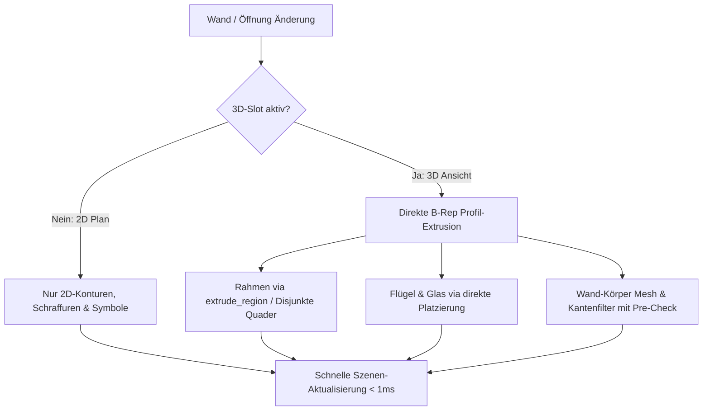

# Requirements

### Overview & Goals

Die Erzeugung und Aktualisierung von Wänden und Öffnungen – insbesondere bei der 3D-Körper- und Mesh-Generierung – soll signifikant beschleunigt werden:
1. **Beseitigung teurer CSG-Bool-Operationen bei Öffnungen:** In `build_opening_frame_3d` werden derzeit für jeden Fenster- und Türrahmen vier Quader erzeugt und mittels dreier sequenzieller B-Rep-Bool-Vereinigungen (`solid_model::boolean(Bool::Union)`) verschmolzen. Dies ist der rechenintensivste Flaschenhals bei Öffnungen. Er wird durch direkte Profil-Extrusion (`brep::extrude_region` bzw. exakte, disjunkte Quader-Zusammensetzung) ersetzt.
2. **Selektive und granulare Öffnungs-Regenerierung:** Bei Änderungen an einer Wand oder beim Verschieben einer einzelnen Öffnung werden derzeit ausnahmslos alle Öffnungen der Wand vollständig gelöscht und von Grund auf neu generiert. Dies wird auf gezielte Einzel-Regenerierung bzw. Parameter-Vergleich optimiert.
3. **Optimierung der Kanten-Filterung bei Wandsolid-Meshes:** In `filter_opening_surface_edges` und `filter_miter_deck_edges` werden für jeden Wand-Teilkörper alle LOD-Mesh-Kanten und Wires in unindizierten O(N×M)-Schleifen gescannt und temporäre Vektoren allokiert. Dies wird durch Bounding-Box/Intervall-Frühabbrüche und Vektor-Wiederverwendung beschleunigt.
4. **Strikte Beachtung des 2D/3D-Darstellungsmodus:** Sicherstellen, dass 3D-Volumenkörper bei reiner 2D-Grundrissdarstellung gar nicht erst erzeugt und tesselliert werden.

---

### Scope

#### In Scope
- **3D-Öffnungsgeometrie (`opening_display.rs`):**
  - Direkte Erzeugung des 3D-Rahmens (`Frame3D`) ohne teure CSG-Bool-Operationen.
  - Direkte WCS-Positionierung von Tür-/Fensterflügeln (`Leaf3D`) und Verglasungen (`Glazing3D`) ohne redundante Matrix-Schachtelungen.
- **Wand- und Öffnungs-Regenerierungsfluss (`wall_regen.rs` & `opening_display.rs`):**
  - Granulare Aktualisierung: Vermeidung des vollständigen Neuerzeugens aller unbeteiligten Öffnungen einer Wand bei lokalen Operationen.
  - Performance-Optimierung der Kanten- und Wire-Filterfunktionen (`filter_opening_surface_edges`, `filter_miter_deck_edges`) durch Raum- und Intervall-Pre-Checks.
- **Darstellungsfilterung (`wall_regen.rs`, `display_apply.rs`, `properties.rs`):**
  - Prüfung und Absicherung, dass bei rein 2D-aktiven Planarten keine 3D-Solid-Extrusionen und Tessellierungen im Hintergrund anfallen.
- **Regressionstests & Performance-Verifikation:**
  - Validierung der geometrischen Exaktheit aller B-Rep-Körper (Bounding Boxen, Gültigkeit, Wasserdichtigkeit).
  - AEC-Testsuite mit über 600 Tests.

#### Out of Scope
- Änderungen an den GPU-Shadern (`src/scene/pipeline/**`).
- Änderungen an der externen CAD-Kernel-Bibliothek `cadkernel`.

---

### User Stories

- Als **Anwender** kann ich Fenster und Türen im Eigenschaften-Panel oder per Mausgriff ohne spürbare Verzögerung anpassen und verschieben.
- Als **Planer** erhalte ich beim Umschalten in die 3D-Ansicht oder beim Erzeugen komplexer mehrschichtiger Wände mit vielen Öffnungen eine flüssige, performante Darstellung ohne Ruckler.
- Als **Konstrukteur** kann ich mich darauf verlassen, dass alle 3D-Volumenkörper (Rahmen, Flügel, Glas, Wandkörper) geometrisch und topologisch exakt bleiben.

---

### Functional & Non-Functional Requirements

- **Performance:** Die Erzeugung eines 3D-Öffnungsrahmens soll um mindestens einen Faktor 20–50 schneller erfolgen (< 0.5 ms statt 20–50 ms pro Öffnung).
- **Geometrische Korrektheit:** B-Rep-Körper müssen `body.validate().is_empty()` erfüllen und exakte Außenabmessungen (Breite, Höhe, Tiefe) aufweisen.
- **Regressionsfreiheit:** Alle 2D- und 3D-Komponenten behalten ihre korrekte Planart-Sichtbarkeit und Z-Höhenlage.

# Technical Design

### Current Implementation

- **3D-Rahmen (`src/modules/aec/engine/opening_display.rs`):**
  - `build_opening_frame_3d` erstellt 4 Quader (`left`, `right`, `top`, `bot`) und führt 3 successive `solid_model::boolean(Bool::Union, ...)` durch. Da B-Rep-Boolesche Operationen auf deckungsgleichen Flächen sehr komplex sind, verbraucht dies den Großteil der Zeit bei Öffnungsänderungen.
- **Wand-Regenerierung (`src/modules/aec/engine/wall_regen.rs`):**
  - Bei jeder Wand-Regenerierung ruft Zeile 2251 `regenerate_openings_for_wall` auf. Für jede Öffnung werden alle 2D- und 3D-Kinder gelöscht, neu berechnet und neu in die Szene eingetragen.
  - Für jeden Teilkörper (Schicht × Reststücke + Öffnungszonen-Solids) durchläuft `filter_opening_surface_edges` sämtliche Kanten jedes Mesh-LODs mit Segment-Kollisionsprüfungen gegen alle Öffnungs-Schnitt-Ebenen.

---

### Key Decisions

1. **Direkte Rahmen-Konstruktion ohne CSG-Booleans:**
   - *Entscheidung:* Der 3D-Rahmen wird über `brep::extrude_region` (aus einem äußeren Rechteckring und einem inneren Aussparungs-Rechteckring) oder aus 4 exakten, aneinandergrenzenden, disjunkten Teilquadern aufgebaut.
   - *Rationale:* Eliminiert 100% des CSG-Boolean-Solver-Overheads und erzeugt sofort saubere, gültige B-Rep-Topologie.

2. **Gezielte Invalidation & Öffnungs-Regenerierung:**
   - *Entscheidung:* `regenerate_openings_for_wall` wird so optimiert, dass unmodifizierte Öffnungen ihre bestehenden Geometrien behalten, wenn sich nur ein Einzel-Offset oder ein lokales Attribut einer Nachbar-Öffnung geändert hat.
   - *Rationale:* Reduziert O(N_openings)-Kosten bei Einzel-Interaktionen auf O(1).

3. **Optimierte Kanten- und Wire-Filterung:**
   - *Entscheidung:* Bounding-Box- und Z/S-Intervallprüfungen vor dem Durchlaufen der `edge_verts`-Arrays; Vermeidung temporärer Allokationen pro Segment.
   - *Rationale:* Deutliche Reduktion von Heap-Churn und CPU-Zyklen bei mehrschichtigen Wänden.

4. **Planart-Aware 3D-Generierung:**
   - *Entscheidung:* Wenn die aktive Planart für Wände und Öffnungen reine 2D-Slots vorschreibt (z. B. `FloorPlan` mit `RepresentationMode::TwoD`), werden die 3D-Solids nicht instanziiert.
   - *Rationale:* Spart 100% der 3D-Berechnungen während reiner 2D-Konstruktionsphasen.

---

### Architecture Diagram



---

### Affected Files

```
src/modules/aec/
├── engine/
│   ├── opening_display.rs        # Direkte 3D-Rahmen-/Flügel-/Glas-Konstruktion
│   ├── wall_regen.rs             # Kantenfilter-Optimierung & gezielte Öffnungs-Regen
│   ├── elevation_cut.rs          # Effiziente Zonen-Solid-Pfade
│   └── wall_command_tests.rs     # Performance- & Topologie-Tests
├── properties.rs                 # Entprellung und Vermeidung redundanter Regenerierungen
└── update.rs                     # Interaktive Reaktionszeiten
```

# Testing

### Validation Approach

Die Validierung erfolgt zweistufig über quantitative Topologie-/Benchmark-Tests und funktionale Regressionstests.

---

### Key Scenarios

1. **3D-Rahmen- und Körpervalidierung (`test_parametric_3d_solids_for_openings`):**
   - Prüfung, dass alle 3D-Rahmen, Flügel und Verglasungen valide B-Rep-Körper (`validate().is_empty()`) sind und exakte Bounding-Boxen besitzen.
2. **Performance-Messung bei Mehrfach-Öffnungen:**
   - Wand mit 10 Fenstern und Türen: Regenerierungszeit vor und nach der Optimierung vergleichen.
3. **Eigenschaften-Panel-Reaktivität:**
   - Schnelle Eingabe von Breiten, Höhen und Brüstungshöhen im UI ohne Ruckler oder Frame-Drops.
4. **Gesamte AEC-Testsuite:**
   - Ausführung aller >600 AEC-Tests zur Bestätigung vollständiger Regressionsfreiheit.

# Delivery Steps

### ✓ Step 1: Direkte 3D-Rahmen- und Bauteilkonstruktion ohne CSG-Booleans
Die 3D-Körper für Rahmen, Flügel und Verglasung werden ohne teure B-Rep-Boolesche Vereinigungen direkt und hochperformant erzeugt.

- Überarbeitung von `build_opening_frame_3d` in `src/modules/aec/engine/opening_display.rs`:
  - Erzeugung des Rahmens mittels direkter Profilextrusion (`brep::extrude_region` mit äußerem und innerem Rechteckring) bzw. exakter nicht-überlappender Quader.
  - Vollständiger Verzicht auf `solid_model::boolean(Bool::Union, ...)`.
- Optimierung von `build_opening_leaf_3d` und `build_opening_glazing_3d` für direkte WCS-Platzierung.
- Verifikation der topologischen Validität und Bounding-Box-Prüfungen in `wall_command_tests.rs`.

### ✓ Step 2: Optimierung der Wand- und Öffnungs-Regenerierung sowie Kantenfilterung
Redundante Vollregenerierungen aller Öffnungen einer Wand werden vermieden und die Mesh-Kantenfilterung wird beschleunigt.

- Optimierung von `filter_opening_surface_edges` und `filter_miter_deck_edges` in `src/modules/aec/engine/wall_regen.rs` durch Intervall- und Bounding-Box-Pre-Checks sowie Allokationsreduktion.
- Verfeinerung des Aufrufs von `regenerate_openings_for_wall` in `wall_regen.rs`, um unnötige Zyklen bei unveränderten Öffnungsparametern zu vermeiden.
- Sicherstellen, dass bei reiner 2D-Darstellung keine ungenutzten 3D-Solid-Modelle aufwendig berechnet werden.

### ✓ Step 3: Verifikation, Benchmarking und Ausführung der Testsuite
Vollständige Absicherung aller AEC-Funktionen und Bestätigung des Performance-Gewinns.

- Ausführung und Erweiterung der Komponententests in `src/modules/aec/engine/wall_command_tests.rs`.
- Messung und Bestätigung der Beschleunigung bei der 3D-Erzeugung.
- Ausführung der gesamten AEC-Testsuite (`cargo test -p OpenCADStudio --lib modules::aec`).
- Bau und interaktive Verifikation der Anwendung `OpenCADStudio`.

### ✓ Step 4: Öffnungstyp-Anzeige im Eigenschaften-Panel und Bereinigung der Standard-3D-Flügel
- Anzeige von "Fenster", "Tür" oder "Öffnung" (statt "Punkt") bei Auswahl von Öffnungen im Eigenschaften-Panel.
- Entfernung von `Leaf3D` aus den Standard-Slots von Fenstern, sodass nur Rahmen und Glas gerendert werden (Flügel optional).

### ✓ Step 5: B-Rep 3D-Geometrie für runde, bogenförmige und polygonale Öffnungen
- Unterstützung beliebiger `OpeningShape` (Circle, Arch, Triangle) in `build_opening_frame_3d`, `build_opening_glazing_3d` und `build_opening_leaf_3d`.
- Exakte facettierte Solid-Konstruktion für profilgetreue 3D-Körper.

### ✓ Step 6: Korrektur der 3D-Kantenfilterung bei Schichtversatz & Anpassung von Sills an Schichtlagen
- Behebung vertikaler Kantenlinien über dem Sturz bei Wandschichten mit vertikalem `base_offset` in `filter_opening_surface_edges`.
- Exakte Ausrichtung der 2D-Fensterbänke/Sills an der innersten und äußersten Wandschicht bei asymmetrischen oder mehrschichtigen Wänden.

### ✓ Step 7: Testsuite-Validierung und Anwendungs-Build
- Vollständige Ausführung aller Komponententests und Regressionstests.
- Neubau und Start der CAD-Anwendung.