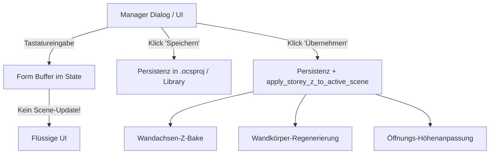

# Requirements

### Overview & Goals

Dieses Arbeitspaket nimmt die Arbeit nach der Unterbrechung durch den IDE-Heap-Space-Abbruch nahtlos wieder auf:
1. **Verifikation & Sicherung der Manager-Entkopplung:** Der unmittelbar vor dem Abbruch fertiggestellte Schritt zur Entkopplung der Zeichnungsaktualisierung in allen AEC-Managern (`StoreySettings`, `OpeningStyleManager`, `MaterialManager`, `PlanManager`) liegt vollständig und unversehrt im Arbeitsverzeichnis vor. Dieser Stand wird verifiziert und fest gesichert.
2. **Nahtlose Fortführung der Höhen- und Bezugsebenen-Überarbeitung:** Gemäß der ursprünglichen Arbeitsreihenfolge (*"Bevor wir weiter an den Höhen/Bezugsebenen überarbeiten..."*) wird nun die Überarbeitung der Höhen, Geschossebenen und Kontrollflächen systematisch fortgeführt.

---

### Scope

#### In Scope
- **Abschluss der Manager-Dialoge:**
  - Verifikation des Entkopplungsverhaltens in `StoreySettings`, `OpeningStyleManager`, `MaterialManager` und `PlanManager`.
  - Bestätigung, dass Tastatureingaben in Zahlenfeldern (Wandstärke, Höhen, Versätze) keine Live-Regenerierung mehr auslösen.
  - Bestätigung der Funktion von "Speichern" (reine Persistenz) und "Übernehmen" (gezieltes Aktualisieren der Zeichnung).
  - Git-Commit der 19 modifizierten Dateien.
- **Höhen- und Bezugsebenen-System (`storey_z.rs`, `wall_planes.rs`, `wall_regen.rs`):**
  - Vertiefte Konsistenzprüfung der Z-Höhenanbindung von Wandachsen und Öffnungen.
  - Prüfung der vertikalen Kopplung bei mehrschichtigen Wänden mit unterschiedlichen Schichthöhen bzw. Überständen.
  - Zuverlässige Nachführung von Öffnungen bei Änderung der Bezugsebenen über den Geschossdialog.

#### Out of Scope
- Fortführung der zurückgestellten Punkte der Öffnungs-Detailgeneratoren (diese bleiben wie vereinbart zurückgestellt).
- Modifikationen an Core-Shadern oder dem Geometriekern `cadkernel`.

---

### User Stories

- Als **Anwender** kann ich in den AEC-Managern (Geschosseinstellungen, Wandstile, Öffnungsstile, Materialien) flüssig Zahlenwerte über die Tastatur eingeben, ohne dass die Zeichnung bei jedem Tastendruck ruckelt oder einfriert.
- Als **Planer** entscheide ich bewusst über den Button **"Übernehmen"**, wann geänderte Geschosshöhen oder Stileigenschaften in die aktive Zeichnung eingerechnet werden.
- Als **Konstrukteur** kann ich die Geschosshöhe oder eine Kontrollfläche anpassen und sehe nach dem Klick auf "Übernehmen", dass alle gebundenen Wände und Fensterbrüstungen exakt auf die neue Höhe nachgeführt werden.

# Technical Design

### Current Implementation

- **Manager-Entkopplung (Bereits implementiert und uncommitted im Tree):**
  - `src/modules/aec/ui/aec_storey_settings.rs` & `update.rs`: `AecStoreySettingsSave` und `AecStoreySettingsSaveAndApply` implementiert; Live-Aufrufe von `apply_storey_z_to_active_scene` aus den Tasten-Handlern entfernt.
  - `src/modules/aec/ui/aec_opening_style_manager.rs` & `update.rs`: `AecOpeningStyleManagerSaveAndApply` und `AecOpeningStyleManagerSave` getrennt.
  - `src/modules/aec/ui/aec_material_manager.rs` & `update.rs`: `AecStyleManagerMaterialSaveAndApply` und `AecStyleManagerMaterialSave` getrennt.
  - `src/modules/aec/ui/aec_plan_manager.rs` & `update.rs`: `AecPlanManagerSave` und `AecPlanManagerApply` getrennt.
  - Testabdeckung: `test_manager_save_vs_save_and_apply_decoupling` in `wall_command_tests.rs` besteht (596 AEC-Tests bestanden).

---

### Key Decisions

1. **Zweistufige Interaktion in allen Managern ("Speichern" vs. "Übernehmen"):**
   - *Entscheidung:* "Speichern" persistiert Änderungen rein in die Datenstrukturen bzw. Projektdatei `.ocsproj`, ohne Geometrie-Regenerierungen auszulösen. "Übernehmen" (bzw. "Speichern & Zeichnung aktualisieren") führt zusätzlich die selektive Neuberechnung der abhängigen Wand- und Öffnungsgeometrien in der Zeichnung aus.
   - *Rationale:* Verhindert O(N)-Zeichnungsregenerierungen bei jedem Tastenanschlag und löst das primäre Performance-Problem nachhaltig.

2. **Höhenanbindung über explizite Kontrollflächen-IDs:**
   - *Entscheidung:* Wände und Öffnungen referenzieren die Ebenen-UUIDs (`floor_plane_id`, `ceiling_plane_id`). Bei Höhenänderungen einer Ebene stößt `apply_storey_z_to_scene` die gezielte Neuberechnung an.
   - *Rationale:* Stabile Identifikatoren verhindern Verwechslungen bei Umbenennungen von Geschossen oder Ebenen.

---

### Architecture Diagram



---

### Affected Files

```
src/modules/aec/
├── ui/
│   ├── aec_storey_settings.rs        # Übernehmen / Speichern Footer
│   ├── aec_opening_style_manager.rs   # Übernehmen / Speichern Footer
│   ├── aec_material_manager.rs        # Übernehmen / Speichern Footer
│   └── aec_plan_manager.rs            # Speichern Button
├── update.rs                          # Entkoppelte Message-Handler
├── message.rs                         # Neue AecMessages für Save vs. SaveAndApply
├── project/
│   ├── storey_z.rs                    # Anwendung der Geschosshöhen auf Szene
│   └── wall_planes.rs                 # Wand-Kontrollflächen-Bezüge
└── engine/
    ├── wall_regen.rs                  # Z-Elevation von Achse und Kontur
    └── wall_command_tests.rs          # Testfälle für Entkopplung und Höhennachführung
```

# Testing

### Validation Approach

Die Validierung stützt sich auf automatisierte Tests sowie interaktive Überprüfung der Reaktionszeiten und Zeichenaktualisierungen.

---

### Key Scenarios

1. **Manager-Entkopplung (Eingabefluss):**
   - In den Geschosseinstellungen Zahlenwerte für Geschosshöhe oder Ebenen-Z ändern.
   - Erwartung: Kein Ruckeln beim Tippen. Zeichnung bleibt während der Eingabe unverändert.
   - Klick auf "Speichern": Dialog speichert Werte, Zeichnung bleibt unverändert.
   - Klick auf "Übernehmen": Wandhöhen und Z-Ebenen der Zeichnung aktualisieren sich exakt auf die neuen Werte.

2. **Öffnungsstil- und Material-Manager:**
   - Ändern einer Rahmenstärke oder einer Materialschraffur.
   - Klick auf "Speichern": Nur Bibliothek aktualisiert.
   - Klick auf "Übernehmen": Alle Wände, die diesen Stil oder dieses Material verwenden, werden in der Szene sofort aktualisiert.

3. **Höhenanbindung bei Ebenenverschiebung:**
   - Anheben der Geschosshöhe von 2,80 m auf 3,20 m.
   - Erwartung: Wand-Oberkanten wachsen mit; Brüstungshöhen von Fenstern bleiben relativ zum Wandfuß stabil auf ihrer korrekten Z-Position.

# Delivery Steps

### ✓ Step 1: Verifikation und Sicherung der entkoppelten Manager-Dialoge
Die entkoppelten Manager-Dialoge sind in der interaktiven Anwendung verifiziert und als konsistenter Commit im Repository gesichert.

- Kompilierung der aktuellen Anwendungs-Binary `OpenCADStudio` mit den 19 uncommitteten Arbeitsdateien via `cargo build`.
- Manuelle/interaktive Funktionsprüfung aller überarbeiteten Manager:
  - `StoreySettings`: Schnelle Tastatureingaben in Höhenfeldern ohne Render-Verzögerung; 'Speichern' sichert in `.ocsproj`, 'Übernehmen' aktualisiert die Wand- und Öffnungshöhen in der Zeichnung.
  - `OpeningStyleManager`: 'Speichern' sichert die Stildatenbank; 'Übernehmen' regeneriert alle Wände mit den entsprechenden Öffnungen.
  - `MaterialManager`: 'Speichern' sichert die Materialdefinition; 'Übernehmen' aktualisiert Schraffuren und Schichtdarstellungen.
  - `PlanManager`: 'Speichern' sichert Display-Konfigurationen ohne sofortiges Umschalten der Szene.
- Erstellung eines sauberen Git-Commits für die Entkopplung der Manager-Dialoge (`Step 7`).

### ✓ Step 2: Fortführung der Höhen- und Bezugsebenen-Überarbeitung
Wand- und Öffnungshöhen sind vollständig konsistent an Geschosse und Kontrollflächen angebunden und aktualisieren sich bei Änderungen zuverlässig über die neuen Manager-Buttons.

- Analyse und Feinabstimmung der Bindungen in `src/modules/aec/project/storey_z.rs` und `src/modules/aec/project/wall_planes.rs` für Wände mit individuellen Versätzen (Offset zu Boden- und Deckenebene).
- Sicherstellen, dass bei Höhenanpassungen über `AecStoreySettingsSaveAndApply` auch abhängige Öffnungen (Fensterbrüstungen, Türstürze) und benachbarte Wandverschneidungen nahtlos mitgeführt werden.
- Ergänzung zielgerichteter Regressionstests in `src/modules/aec/engine/wall_command_tests.rs` zur Abdeckung komplexerer Geschosshöhenänderungen (z. B. negative Offsets, Geschossumbenennungen).
- Abschließender Gesamttestlauf der AEC-Suite zur Bestätigung von Stabilität und Regressionsfreiheit.