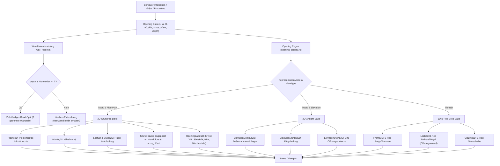

# Requirements

### Overview & Goals

Dieses Arbeitspaket überarbeitet die **Wandöffnungen (Fenster, Türen, Wandöffnungen/Durchbrüche/Nischen)** in OpenCADStudio grundlegend. Es behebt bestehende Mängel bei der 2D-Grundrissdarstellung und der interaktiven Bearbeitung (Grips) und erweitert das System um architektonische Kernfunktionen:
1. **Realistische 2D-Grundrisskomponenten:** Ersatz der bisherigen hohlen Rahmen-Rechtecke durch fachgerechte Pfosten-/Zargenprofile links und rechts der Leibung mit lichtem Maß dazwischen.
2. **Zuverlässige interaktive Bearbeitung (Grips):** Korrektur der Griffe zum Verschieben entlang der Wandachse und Ändern der lichten Öffnungsbreite ohne Verlust oder Zerstörung des aktiven Objekts während des Ziehens.
3. **Praxisgerechter Bezugspunkt (Anschlagkante statt Wandmitte) & Flip-Handle:** Bemaßungs- und Platzierungsbezug an einer Seite der Öffnung (z. B. linker Anschlag nach DIN 1356) inklusive Flip-Handle zum schnellen Spiegeln der Bezugsseite oder Aufschlagrichtung.
4. **Anpassung an reale Wandstärken und Schichten:** Dynamische Anpassung der Fensterbänke (Außensohlbank und Innenfensterbrett) sowie Zargen an die tatsächliche Wanddicke und Schichtenfolge.
5. **Freie Positionierung im Wandquerschnitt (Einbautiefe / Achsoffset):** Einstellbarer Versatz quer zur Wandachse (`cross_axis_offset`), damit Fenster und Türen nicht starr auf der Wandachse liegen, sondern an der realen Anschlagsebene (z. B. in der Dämmebene oder 10 cm hinter Außenkante).
6. **Wandnischen und Wandschlitze bei Durchbrüchen (optionale Tiefe):** Durchbrüche erhalten eine optionale Tiefenangabe (`depth`), sodass bei teilweiser Wandtiefe saubere Wandnischen und Wandschlitze entstehen, bei denen die verbleibende Restwand in 2D und 3D erhalten bleibt.
7. **Erweiterter Slot-Katalog & DIN 1356 Bemaßung:** Neue Slots für Verglasung (`Glazing2D`), Schwellen (`Threshold2D`), Durchbruchssymbole (`BreakthroughSymbol2D`) und normgerechte Beschriftung (`OpeningLabel2D`).
8. **Direkte 2D-Ansichtskomponenten (`Elevation2D`):** Saubere Vektordarstellung von Fassadenöffnungen mit Außenrahmen, Flügelteilung und DIN-Öffnungsdreiecken direkt in der Wandebene.
9. **Parametrische 3D-Körper & 2D/3D-Filterung:** Getrennte B-Rep Volumenkörper für Blendrahmen (`Frame3D`), drehbares Blatt (`Leaf3D`) und Glas (`Glazing3D`), mit strikter Ausblendung von 2D-Symbolen in 3D-Modellen.
10. **2-Ebenen Planart-Steuerung & Fachdisziplin-Vorlagen:** Freie Steuerung des Detaillierungsgrads pro Planart (z. B. vollständige Ausbaudetails im Plan *"Architektur 1:50"*, reine Rohbauöffnungen mit Rohbaumaßen im Plan *"Statik 1:50"*).
11. **Parametrische Komponenten-Blöcke statt isolierter Skizzen:** Ablösung der bisherigen starren, nicht wiederverwendbaren `OpeningSketch`-Strukturen durch echte, wiederverwendbare CAD-Blöcke (`acadrust::tables::BlockRecord`). Ein gezeichnetes Pfosten-, Zargen- oder Bankprofil kann zentral als Block definiert und von beliebig vielen Fenster- und Türstilen referenziert werden (inkl. intelligenter Anschlag- und Dehnungs-Parametrik).

---

### Scope

#### In Scope
- **2D-Grundriss-Engine & Geometrie (`opening_display.rs`, `openings.rs`):**
  - Korrektur von `bake_frame_rect`: Erzeugung von zwei separaten Pfostenprofilen (links und rechts) mit lichter Weite dazwischen statt eines geschlossenen Rings über die gesamte Öffnung.
  - Wandstärken-sensitive Bänke (`SillLines`): Außensohlbank läuft vom Fensterrahmen zur Wandaußenkante; Innenfensterbrett läuft vom Rahmen zur Wandinnenkante.
  - Türschwellen (`ThresholdLine`) und Zargen mit lichter Weite.
  - Neue Grundriss-Slots: `Glazing2D`, `Threshold2D`, `BreakthroughSymbol2D`, `OpeningLabel2D`.
  - DIN 1356 Beschriftungs-Generator (`MText` mit Bruchstrich `B / H`, `BRH` und `UK`).
  - Parametrische Komponenten-Blöcke (`SlotGeometry::Block`): Referenzierung beliebiger Zeichnungs-Blöcke (`BlockRecord`) mit parametrischen Platzierungsmodi (`JambPair` für Pfosten/Zargen 1:1 an den Leibungskanten, `StretchToFit` für dehnende Elemente, `CenterAnchor` für Beschläge/Symbole).
- **Bezugssystem & Querschnittsposition (`openings.rs`, `opening_xdata.rs`):**
  - Neues Enum `OpeningReferenceSide` (`Start` = linke Anschlagkante, `Center` = Mitte, `End` = rechte Anschlagkante).
  - Neues Feld `cross_axis_offset` (Einbautiefe / Versatz quer zur Wandachse).
  - Transformation aller 2D- und 3D-Komponenten gemäß Querschnitts-Offset.
  - Erweiterung des XDATA-Formats für Öffnungen (abwärtskompatibel zu bestehenden Zeichnungen).
- **Interaktive Bearbeitung & Grips (`properties.rs`, `viewport.rs`, `opening_display.rs`):**
  - Entkopplung des Grip-Lifecycles: Während des Ziehens werden Öffnungskinder nicht zerstört/re-allokiert, sondern als Live-Preview deformiert.
  - Grip 0: Verschieben entlang der Wandachse (unter Berücksichtigung der gewählten Bezugskante).
  - Grip 1 & 2: Größenänderung (lichte Weite / Breite) an den Anschlagkanten.
  - Flip-Handle (Grip / Klick-Affordance): Umschalten des Bezugspunkts und Spiegeln der Aufschlagseite (`HingeSide`).
  - Atomarer Commit bei Maustasten-Freigabe mit vollständiger Wand- und Schnitt-Regenerierung und Undo-Aufzeichnung.
- **Wandnischen und Wandschlitze (`openings.rs`, `elevation_cut.rs`, `wall_regen.rs`):**
  - Neues optionales Feld `depth: Option<f64>` und `niche_side: NicheSide` bei Durchbrüchen.
  - Bei $d < \text{Wanddicke}$: Wand wird in 2D nicht in getrennte Stücke zerschnitten, sondern erhält eine Einbuchtung auf der Nischenseite; Restwanddicke bleibt schraffiert erhalten.
  - In 3D: Nischenquader wird als Hohlraum ausgespart, die Rückwand bleibt als massiver B-Rep Solid stehen.
  - Spezifische Beschriftung für Nischen ($B / H / T$ und $UK$).
- **Direkte 2D-Ansichtskomponenten (`Elevation2D`):**
  - Slots: `ElevationContour2D`, `ElevationMuntins2D`, `ElevationSwing2D`, `ElevationSill2D`.
  - Vektorgenerierung direkt in der Fassadenebene $(s, z)$ inklusive genormter DIN-Öffnungsdreiecke.
- **Parametrische 3D-Körper & Darstellungsfilterung:**
  - Getrennte B-Rep Körper für `Frame3D`, `Leaf3D` (mit Öffnungswinkel) und `Glazing3D`.
  - Strikte Trennung: 2D-Symbole in 3D ausblenden, 3D-Körper in 2D-Grundrissen ausblenden.
- **2-Ebenen Planart-Steuerung & Fachdisziplin-Vorlagen:**
  - Globale Slot-Sichtbarkeit in `DisplayConfig`.
  - Vorkonfigurierte Vorlagen für *"Architektur 1:50"*, *"Statik 1:50"*, *"Entwurf 1:100"* und *"Ansicht Fassade"*.
- **UI-Integration:**
  - Eigenschaften-Palette: Eingabefelder für Bezugskante (`Start`, `Center`, `End`), Einbautiefe (`cross_axis_offset`), Nischentiefe (`depth`) und Nischenseite.
  - Öffnungsstil-Manager: Bearbeitung aller neuen Slots und Umschaltung der 2D-Vorschau zwischen Grundriss und Ansicht.

#### Out of Scope
- Wechsel des Geometriekerns `cadkernel` (bleibt Pure Rust, ACIS- und WASM-kompatibel).
- Freistehende Bauteile abseits des Wandhost-Modells (Fenster/Türen bleiben wandgehostet).
- GPU-Shader-Neuschreibungen (wgpu-Shader bleiben unverändert).

---

### User Stories

- Als **Architekt** sehe ich im Grundriss 1:50 realistische Pfostenprofile an den Wandseiten und eine freie Glas-/Flügelfläche dazwischen statt eines hohlen Rechtecks über die ganze Wandöffnung.
- Als **Konstrukteur** kann ich ein Fenster im Grundriss anklicken und über den mittleren Griff entlang der Wand verschieben oder über die seitlichen Griffe die lichte Weite anpassen, ohne dass die Öffnung flackert, einfriert oder Griffe verloren gehen.
- Als **Planer** möchte ich den Bezugspunkt der Fensterpositionierung auf die linke Anschlagkante legen, damit meine Eingaben exakt den Bemaßungsketten im Bauplan entsprechen, und bei Bedarf über ein Flip-Handle die Anschlagseite spiegeln.
- Als **Architekt** kann ich die Einbautiefe des Fensters im Wandquerschnitt definieren (z. B. 12 cm hinter der Außenkante), sodass Rahmen, Flügel und Bänke an der korrekten Stelle im Schichtenpaket sitzen.
- Als **TGA-Fachplaner / Architekt** kann ich für einen Mauerdurchbruch eine Tiefe angeben (z. B. Tiefe 15 cm bei einer 36,5 cm dicken Ziegelwand), um eine Heizkörpernische oder einen Installationsschlitz zu erzeugen, bei dem die Wand nicht komplett durchschnitten wird.
- Als **Statiker** wähle ich den Plan **"Statik 1:50"** und sehe bei gleichem Maßstab nur die Rohbauöffnung mit Rohbaumaßen, während Rahmen, Flügel, Glas und Bänke unsichtbar sind.
- Als **Architekt / Bauteilhersteller** kann ich ein detailliertes Pfosten- oder Zargenprofil einmal als CAD-Block zeichnen und in mehreren Fensterstilen wiederverwenden, ohne Skizzen redundant pflegen zu müssen.
- Als **Konstrukteur** wechsle ich in die **3D-Ansicht** und sehe saubere 3D-Körper für Zarge, Türblatt und Glas, ohne störende 2D-Aufschlaglinien auf dem Boden.

---

### Functional Requirements

- **FR1 (Realistische 2D-Pfostenprofile):**
  - Der Generator `FrameRect` für Fenster erzeugt zwei geschlossene Pfosten-Rechtecke an den Leibungskanten $x \in [-W/2, -W/2 + d_{frame}]$ und $x \in [W/2 - d_{frame}, W/2]$.
  - Für Türen wird ein Zargenprofil mit Zargenspiegel erzeugt.
  - Der Zwischenraum bleibt frei für die Aufnahme von `Leaf2D` und `Glazing2D`.
- **FR2 (Wandstärken- und Schichtanpassung für Bänke):**
  - Die Außensohlbank (`SillLines` außen) erstreckt sich von der Rahmenaußenkante bis zur Außenkante der Wand (inklusive einstellbarem Überstand/Tropfkante).
  - Das Innenfensterbrett (`SillLines` innen) erstreckt sich von der Rahmeninnenkante bis zur Innenkante der Wand.
  - Die Wanddicke wird dynamisch über `Wall::total_thickness()` und die Ausrichtung (`WallJustification`) bestimmt.
- **FR3 (Bezugspunkt-System & Flip):**
  - Öffnungen unterstützen `reference_side: OpeningReferenceSide` (`Start`, `Center`, `End`).
  - Der Parameter `distance_along_axis` misst den Abstand vom Wandanfang zur gewählten Bezugskante.
  - Ein Flip-Befehl oder Klick auf ein Flip-Handle spiegelt die Bezugskante bzw. die Aufschlagseite.
- **FR4 (Positionierung im Wandquerschnitt):**
  - Öffnungen besitzen das Feld `cross_axis_offset: f64`.
  - Der Offset verschiebt Rahmen, Flügel, Glas und Anschläge quer zur Wandachse.
- **FR5 (Wandnischen / Wandschlitze):**
  - Für `OpeningKind::Breakthrough` kann optional `depth: Option<f64>` und `niche_side: NicheSide` definiert werden.
  - Wenn `depth < total_thickness`, wird die Wand nicht in getrennte Polygone gespalten, sondern die Schichtkontur um die Nische vertieft. Die verbleibende Wand bleibt als tragende Schicht sichtbar und schraffiert.
  - In 3D wird ein Hohlraum der Tiefe $d$ erzeugt; die dahinterliegende Wand bleibt massiv.
  - Beschriftung erfolgt normgerecht als $B / H / T$ mit $UK$.
- **FR6 (Robuste Grip-Bearbeitung):**
  - Grip 0 (Position): Verschiebt die Öffnung entlang der Wandachse.
  - Grip 1 (Startkante): Staucht oder dehnt die lichte Weite an der Startseite.
  - Grip 2 (Endkante): Staucht oder dehnt die lichte Weite an der Endseite.
  - Flip-Handle (Grip): Klick spiegelt Bezugs- oder Aufschlagrichtung.
  - Während des Ziehens wird die Geometrie temporär deformiert, ohne die existierenden Entity-Handles in der Szene zu löschen. Der Commit erfolgt erst bei Maustasten-Freigabe.
- **FR7 (DIN 1356 Beschriftung):**
  - Erzeugt formatierte `MText`-Bemaßung:
    - Türen: `Breite / Höhe`.
    - Fenster: `Breite / Höhe` und `BRH ...` bezogen auf Roh- bzw. Fertigfußboden.
    - Durchbrüche/Nischen: `Breite / Höhe` bzw. `Breite / Höhe / Tiefe` und `UK ...`.
- **FR8 (Direkte 2D-Ansichts-Generatoren):**
  - `ElevationContour2D`: Außenkontur des Blendrahmens in der Fassadenebene.
  - `ElevationMuntins2D`: Sprossen- und Flügelteilung (1-flügelig, 2-flügelig mit Pfosten/Stulp, Oberlicht).
  - `ElevationSwing2D`: Genormte DIN-Öffnungsdreiecke mit Ausrichtung an `HingeSide`.
  - `ElevationSill2D`: Sichtbare Ansichtskanten für Sohlbank und Sturz.
- **FR9 (Parametrische 3D-Körper):**
  - Erzeugung robuster B-Rep Quader für Blendrahmen (`Frame3D`), drehbares Blatt (`Leaf3D` mit `opening_angle_deg`) und Glas (`Glazing3D`).
- **FR10 (2D/3D-Filterung & Fachdisziplin-Vorlagen):**
  - Im 3D-Modus werden alle 2D-Symbole ausgeblendet; 3D-Körper bleiben sichtbar.
  - Im 2D-Modus werden 3D-Körper ausgeblendet; 2D-Symbole bleiben sichtbar.
  - Standard-Profile für *"Architektur 1:50"*, *"Statik 1:50"*, *"Entwurf 1:100"* und *"Ansicht Fassade"* in der Seed-Bibliothek.
- **FR11 (Parametrische Komponenten-Blöcke):**
  - `SlotGeometry` unterstützt neben `Generator` die Variante `Block { block_name: String, placement: BlockPlacementMode }`.
  - `BlockPlacementMode::JambPair`: Platziert den Block an der linken Leibungskante 1:1 und an der rechten Leibungskante horizontal gespiegelt 1:1 (Lichtmaß dazwischen bleibt frei).
  - `BlockPlacementMode::StretchToFit`: Dehnt den Block zwischen den Leibungskanten entlang der Öffnungsbreite (unter Beibehaltung vertikaler Linienstärken).
  - `BlockPlacementMode::CenterAnchor`: Zentriert den Block unskaliert in der Öffnung.
  - Blöcke werden aus `document.block_records` aufgelöst; Abwärtskompatibilität zu existierenden `OpeningSketch`-Stilen bleibt erhalten.

---

### Non-Functional Requirements

- **Reine AEC-Kapselung:** Fachlogik verbleibt zu 100 % in `src/modules/aec/**`. Keine neuen AEC-Felder auf Core-Strukturen (`CadApp`, `OpenCADStudio`).
- **DWG/DXF-Abwärtskompatibilität:** Ältere XDATA-Datensätze ohne die neuen Felder (`reference_side`, `cross_axis_offset`, `depth`) werden mit sicheren Standardwerten (`Center`, `0.0`, `None`) initialisiert.
- **Performanz:** Keine teuren Booleschen 3D-Mesh-Operationen während des Ziehens von Griffen; die Vorschau erfolgt über Vektordrähte.
- **Zoom- und Maßstabsunabhängigkeit:** Analytische CAD-Vektoren für alle 2D-Elemente; kein Rasterverlust bei Vergrößerung.

---

# Technical Design

### Current Implementation & Root Causes

1. **Hohles Rahmenrechteck im Grundriss:**
   In `src/modules/aec/engine/opening_display.rs` berechnet `bake_frame_rect` ein äußeres Rechteck der Größe $W \times T$ und ein inneres Rechteck $(W - 2d) \times (T - 2d)$. Im Grundriss (Horizontalschnitt) führt das dazu, dass über die gesamte Wanddicke ein geschlossener Rahmen gezeichnet wird, anstatt zweier seitlicher Pfostenprofile.
2. **Fehlgeschlagene Grip-Bearbeitung:**
   In `src/app/update/viewport.rs` (`apply_aec_opening_grip`) wird bei jeder Mausbewegung `commit_opening_instance` aufgerufen. Diese Funktion ruft `erase_entities(&stale)` auf, wodurch die vom Benutzer gerade mit der Maus gezogene Kind-Entität mitten in der Geste aus dem Dokument gelöscht und mit neuem Handle re-generiert wird. Dadurch verliert das Grip-System sein Zielhandle, die Vorschau bricht ab und der Commit scheitert.
3. **Starrer Mitten-Bezugspunkt:**
   `Opening::distance_along_axis` ist fest als Abstand von Wandanfang zur Öffnungsmitte definiert. In der Architekturpraxis werden Öffnungen jedoch an ihren Anschlagkanten bemessen (z. B. Pfeilermaß 0,75 m bis Fensterlaibung).
4. **Fehlender Querschnittsversatz:**
   Alle 2D- und 3D-Generatoren setzen das Bauteil auf $y = 0$ der lokalen Wandachse. Weder die Einbautiefe noch die Lage im Schichtenpaket können versetzt werden.
5. **Keine Wandnischen:**
   `subtract_openings_from_band` spaltet die Wandband-Polygone stets vollständig durch. Eine Teiltiefe $d < T$ existiert nicht.

---

### Key Decisions

1. **Pfostenprofil-Generator für Grundriss (`Frame2D`):**
   Erzeugung von zwei separaten Rechtecken links und rechts der Leibung mit Tiefe = Rahmentiefe (z. B. 7 cm) und Breite = Rahmenstärke. Dazwischen liegt das lichte Maß für Flügel und Verglasung.
2. **Entkopplung der Grip-Geste:**
   Grip-Ziele werden auf den Host-Punkt bzw. stabile Handles gemappt. Während des Mausziehens werden nur die Vorschau-Drähte (`preview_wires`) berechnet und aktualisiert. Das Löschen alter und Erzeugen neuer Kind-Handles erfolgt erst atomar bei `commit_active_grip_edit`.
3. **Bezugsachsen-Erweiterung (`OpeningReferenceSide`):**
   Einführung von `ReferenceSide::Start` (Standard für Baupraxis), `ReferenceSide::Center` und `ReferenceSide::End`. Der gespeicherte Achsparameter bezieht sich auf diese Kante. Ein Flip-Handle spiegelt die Kante am Achspunkt.
4. **Querschnittsversatz (`cross_axis_offset`):**
   Einführung eines Querversatzes zur Wandachse. 2D-Profile und 3D-Körper werden um diesen Offset quer verschoben. Bänke passen ihre Längen automatisch von der Fensterkante zur Außen- bzw. Innenwandseite an.
5. **Nischen-Modus für Durchbrüche (`depth: Option<f64>`):**
   Bei $d < T$ spaltet `subtract_openings_from_band` das Wandpolygon nicht, sondern stanzt eine Nische in die Außen- bzw. Innenseite des Polygons. In 3D wird ein partieller B-Rep Quader abgezogen.
6. **Wiederverwendbare parametrische Blöcke statt isolierter Skizzen:**
   Ablösung lokaler `OpeningSketch`-Strukturen durch `SlotGeometry::Block`. Beliebige `BlockRecord`-Objekte aus der Zeichnung oder Standardbibliothek können für Slots zugewiesen werden. Der Modus `JambPair` platziert z. B. Pfosten- und Zargenprofile maßhaltig 1:1 an den Wandleibungen und hält die Geometrie zentral wiederverwendbar und konsistent editierbar.

---

### Data Models & Contracts

#### 1. Öffnungs-Definition (`openings.rs`, `opening_xdata.rs`)

```rust
#[derive(Debug, Clone, Copy, PartialEq, Eq, Hash, Serialize, Deserialize)]
pub enum OpeningReferenceSide {
    Start,  // Linke Anschlagkante (in Achsrichtung)
    Center, // Öffnungsmitte
    End,    // Rechte Anschlagkante (in Achsrichtung)
}

#[derive(Debug, Clone, Copy, PartialEq, Eq, Hash, Serialize, Deserialize)]
pub enum NicheSide {
    Exterior, // Öffnung/Nische an Wandaußenseite (+Normal)
    Interior, // Öffnung/Nische an Wandinnenseite (-Normal)
}

pub struct Opening {
    pub handle: Handle,
    pub host_wall: Handle,
    pub distance_along_axis: f64,
    pub width: f64,
    pub height: f64,
    pub sill_height: f64,
    pub kind: OpeningKind,
    pub style_id: Option<String>,
    pub hinge: HingeSide,
    pub shape: OpeningShape,
    pub spring_height: f64,
    
    // NEU: Bezugskante und Lage im Wandquerschnitt
    pub reference_side: OpeningReferenceSide,
    pub cross_axis_offset: f64, // Einbautiefe quer zur Wandachse
    
    // NEU: Optionale Nischentiefe bei Durchbrüchen
    pub depth: Option<f64>,
    pub niche_side: NicheSide,
    
    // Ebenen-Referenzen
    pub sill_plane_id: Option<uuid::Uuid>,
    pub head_plane_id: Option<uuid::Uuid>,
    pub sill_plane_name: Option<String>,
    pub head_plane_name: Option<String>,
    pub sill_offset: f64,
    pub head_offset: f64,
    pub sill_origin: [f64; 3],
    pub sill_normal: [f64; 3],
    pub head_origin: [f64; 3],
    pub head_normal: [f64; 3],
}
```

#### 2. Slot-Katalog (`display_component.rs`)

```rust
#[derive(Clone, Copy, Debug, PartialEq, Eq, Hash, Serialize, Deserialize)]
pub enum OpeningComponentSlot {
    // 2D Grundriss & Horizontalschnitt
    HostCut2D,
    Frame2D,
    Leaf2D,
    Swing2D,
    Glazing2D,
    Sill2D,
    Threshold2D,
    BreakthroughSymbol2D,
    OpeningLabel2D,

    // 2D Ansicht & Aufriss
    ElevationContour2D,
    ElevationMuntins2D,
    ElevationSwing2D,
    ElevationSill2D,

    // 3D Modell
    Frame3D,
    Leaf3D,
    Glazing3D,
}

impl OpeningComponentSlot {
    pub fn is_2d_plan(self) -> bool {
        matches!(
            self,
            OpeningComponentSlot::HostCut2D
                | OpeningComponentSlot::Frame2D
                | OpeningComponentSlot::Leaf2D
                | OpeningComponentSlot::Swing2D
                | OpeningComponentSlot::Glazing2D
                | OpeningComponentSlot::Sill2D
                | OpeningComponentSlot::Threshold2D
                | OpeningComponentSlot::BreakthroughSymbol2D
                | OpeningComponentSlot::OpeningLabel2D
        )
    }

    pub fn is_elevation(self) -> bool {
        matches!(
            self,
            OpeningComponentSlot::ElevationContour2D
                | OpeningComponentSlot::ElevationMuntins2D
                | OpeningComponentSlot::ElevationSwing2D
                | OpeningComponentSlot::ElevationSill2D
        )
    }

    pub fn is_3d(self) -> bool {
        matches!(
            self,
            OpeningComponentSlot::Frame3D
                | OpeningComponentSlot::Leaf3D
                | OpeningComponentSlot::Glazing3D
        )
    }
}
```

#### 3. Erweiterung der Generatoren (`src/modules/aec/engine/opening_style.rs`)

```rust
#[derive(Debug, Clone, Copy, PartialEq, Eq, Hash, Serialize, Deserialize, Default)]
pub enum OpeningGenerator {
    #[default]
    None,
    FrameRect,         // Fenster-Pfostenprofile links & rechts mit lichter Weite
    DoorFrame,         // Türzargenprofil mit Falz und Anschlag
    LeafLine,
    SwingArc,
    SillLines,         // Wandstärken-sensitive Sohlbank & Innenfensterbrett
    Cross,
    DiagonalFill,
    GlazingLine,       // Glaslinie im lichten Maß
    ThresholdLine,     // Türschwelle / Bodeneinstand
    OpeningLabel,      // DIN 1356 MText-Beschriftung (B/H, BRH, Nischentiefe, UK)
    
    // Ansichts-Generatoren
    ElevationFrameRect,
    ElevationFrameArch,
    ElevationMuntinsSingle,
    ElevationMuntinsDouble,
    ElevationSwingTriangle,
    ElevationSillLine,
    
    // 3D-Generatoren
    SolidFrame,
    SolidLeaf,
    SolidGlazing,
}
```

#### 4. Direkte 2D-Ansichtserzeugung (`src/modules/aec/engine/opening_display.rs`)

Mapping der lokalen Ansichtskoordinaten $(u, v) \in [0, W] \times [0, H]$ in die Welt-Fassade:
$$P(u, v) = \text{WallAxisPoint}(s_{\text{start}} + u) + (z_{\text{sill}} + v) \cdot \vec{e}_z$$

- `ElevationContour2D`: Äußerer Blendrahmen als Rechteck oder Rundbogen.
- `ElevationMuntins2D`: Mittelpfosten bei zweiflügeligen Fenstern bzw. Kämpfer bei Oberlichtern.
- `ElevationSwing2D`: DIN-Öffnungsdreiecke von den Flügelecken zur Scharnier- bzw. Griffseite (`HingeSide`).
- `ElevationSill2D`: Sichtbare Sohlbanklinie unterhalb von $z_{\text{sill}}$.

#### 5. Parametrische 3D-Körper-Generierung (`src/modules/aec/engine/opening_display.rs`)

- Erzeugung präziser B-Rep Körper mit `cadkernel::brep::make::cuboid` unter Berücksichtigung von `cross_axis_offset`:
  - `Frame3D`: Quader für Blendrahmenprofile um die Öffnung.
  - `Leaf3D`: Quader für Flügel/Türblatt, rotiert um die Scharnierachse um `opening_angle_deg`.
  - `Glazing3D`: Quader mit Dicke $0.02\,\text{m}$ zentriert im Flügel.
- Registrierung über `scene.register_prepared_solid_model` als `OPENING_REP`-Kind.

#### 6. Globale Planart-Steuerung & Fachdisziplin-Vorlagen (`src/modules/aec/engine/plan_view.rs`, `library.rs`)

Erweiterung von `DisplayConfig`:
```rust
pub struct DisplayConfig {
    // Bestehende Felder...
    #[serde(default)]
    pub opening_visibility: HashMap<OpeningComponentSlot, bool>,
}
```

Vordefinierte Vorlagen in `seed_default_library`:
- **"Architektur 1:50":** Alle Plan-Slots aktiv (`Frame2D`, `Leaf2D`, `Glazing2D`, `Threshold2D`, `Sill2D`, `Swing2D`, `OpeningLabel2D`).
- **"Statik 1:50":** Nur `HostCut2D` und `OpeningLabel2D` aktiv; alle Ausbausymbole inaktiv.
- **"Entwurf 1:100":** `Frame2D`, `Leaf2D`, `Swing2D`, `OpeningLabel2D` aktiv; `Glazing2D` und `Threshold2D` inaktiv.
- **"Ansicht Fassade":** Alle `Elevation*`-Slots aktiv; Plan- und 3D-Slots inaktiv.

#### 7. Parametrische Komponenten-Blöcke (`src/modules/aec/engine/opening_style.rs`, `opening_display.rs`)

```rust
#[derive(Debug, Clone, Copy, PartialEq, Eq, Hash, Serialize, Deserialize)]
pub enum BlockPlacementMode {
    /// Platziert den Block an der linken Leibungskante 1:1 und horizontal gespiegelt an der rechten Leibungskante (Lichtmaß bleibt frei).
    JambPair,
    /// Dehnt den Block zwischen den Leibungskanten entlang der Öffnungsbreite (Transversalmaße bleiben maßhaltig).
    StretchToFit,
    /// Zentriert den Block unskaliert in der Öffnungsbreite (z. B. für Beschläge, Griffe, Symbole).
    CenterAnchor,
}

#[derive(Debug, Clone, PartialEq, Serialize, Deserialize)]
#[serde(tag = "kind", content = "value")]
pub enum SlotGeometry {
    Generator(OpeningGenerator),
    Block {
        block_name: String,
        placement: BlockPlacementMode,
    },
    #[serde(skip_serializing_if = "OpeningSketch::is_empty")]
    Sketch(OpeningSketch), // Zur Abwärtskompatibilität
}
```

Die Geometrie wird bei `SlotGeometry::Block` zur Laufzeit direkt aus `scene.document.block_records` aufgelöst. Ändert der Anwender den Block, aktualisieren sich alle referenzierenden Öffnungen automatisch.

---

### Architecture Diagram



---

### File Structure

```
src/modules/aec/
├── engine/
│   ├── openings.rs                # Opening, OpeningReferenceSide, NicheSide, Nischen-Split
│   ├── opening_xdata.rs           # XDATA-Serialisierung für ref_side, cross_offset, depth
│   ├── opening_display.rs         # Realistische Pfostenprofile, Bänke nach Wanddicke, 2D-Ansicht, 3D-Solids
│   ├── display_component.rs       # Neuer Slot-Katalog (Plan2D, Elevation2D, Solid3D)
│   ├── opening_style.rs           # Generatoren-Katalog, Profile, Standard-Maße
│   ├── library.rs                 # Fachdisziplin-Vorlagen (Architektur vs. Statik), 2-Ebenen-Verschmelzung
│   ├── plan_view.rs               # DisplayConfig::opening_visibility
│   ├── elevation_cut.rs           # 3D-Nischenabzug bei teilweiser Tiefe
│   ├── wall_regen.rs              # Wandkontur-Regen mit Nischen und Gehrungsanbindung
│   └── wall_command_tests.rs      # Umfassende Regressionstests
├── styles/
│   └── opening_style_manager.rs   # Erweiterte Slot-Tabelle und Umschaltung Grundriss/Ansicht
└── ui/
    ├── aec_opening_style_manager.rs # UI für neue Slots
    └── aec_plan_manager.rs        # Checkboxen für Fachdisziplin-Sichtbarkeiten
```

---

### Risks & Mitigations

- **Risiko: Grip-Flackern und Handle-Entwertung während des Ziehens:**
  *Ursache:* Voreiliger Aufruf von `commit_opening_instance` im Maus-Move-Event löscht die gezogene Entität.
  *Mitigation:* Saubere Trennung zwischen Live-Drahtvorschau während des Draggings und atomarem Commit erst bei Maustasten-Freigabe (`on_viewport_left_release`).
- **Risiko: Kollision von Bänken bei versetzten Wänden:**
  *Mitigation:* Die Fensterbanklängen berechnen sich strikt aus dem Abstand der Rahmenkante zu den projizierten Wandbegrenzungspolylinien.
- **Risiko: Nischenverschneidung bei mehrschichtigen Wänden:**
  *Mitigation:* Für die 2D-Schichten wird geprüft, welche Schichten von der Nischentiefe $d$ durchdrungen werden; Schichten hinter der Nische bleiben unberührt.
- **Risiko: Rückwärtskompatibilität bestehender Zeichnungen:**
  *Mitigation:* Alle neuen XDATA-Felder sind optional und belegen bei Fehlen abwärtskompatible Defaults (`reference_side = Start`, `cross_axis_offset = 0.0`, `depth = None`).

---

# Testing

### Validation Approach

Die Validierung erfolgt durch automatisierte Headless-Tests in `wall_command_tests.rs` sowie UI- und Modell-Verifikation.

### Key Scenarios

1. **Pfostenprofil-Generierung:** Verifikation, dass `Frame2D` zwei getrennte Rechtecke mit lichtem Zwischenraum erzeugt.
2. **Wanddicken-Anpassung:** Verifikation, dass Bänke bei Wanddicken von 24 cm, 36,5 cm und 42 cm exakt an den Wandkanten abschließen.
3. **Querschnittsversatz:** Verifikation, dass ein `cross_axis_offset` von z. B. 0.10 m das Fenster exakt um 10 cm quer zur Wandachse versetzt.
4. **Bezugspunkt & Flip:** Verifikation, dass bei `reference_side = Start` der Abstand $s$ exakt die Startlaibung trifft und ein Flip die Bezugskante zur Endlaibung spiegelt.
5. **Grip-Verschieben & Strecken:** Simulation von Grip 0 (Positionsverschiebung) und Grip 1/2 (Breitenänderung) mit Prüfung, dass Handles stabil bleiben und Werte korrekt persistiert werden.
6. **Wandnischen:** Wand 30 cm dick mit Nische 15 cm: Verifikation, dass die Wand nicht in zwei Teile zerfällt und die Restwand 15 cm dick erhalten bleibt.
7. **Fachdisziplin-Planarten:** Plan *"Architektur 1:50"* zeigt Pfosten, Flügel, Glas, Bänke und Bemaßung. Plan *"Statik 1:50"* zeigt nur Rohbauloch und Rohbaumaß.
8. **2D-Ansicht & 3D-Körper:** Verifikation der DIN-Dreiecke in Ansichten und B-Rep Solids in 3D.

---

# Delivery Steps

### ✓ Step 1: Realistische Pfostenprofile, Wandstärken-sensitive Bänke & Parametrische Komponenten-Blöcke
Die 2D-Grundrissgeneratoren werden korrigiert, Bänke an reale Wanddicken gekoppelt, Verglasungs-, Schwellen- sowie DIN 1356 Beschriftungs-Slots integriert und wiederverwendbare Blöcke ermöglicht.

- In `src/modules/aec/engine/display_component.rs` das Enum `OpeningComponentSlot` um `Glazing2D`, `Threshold2D`, `BreakthroughSymbol2D`, `OpeningLabel2D` erweitern und Klassifizierungen (`is_2d_plan()`, `is_elevation()`, `is_3d()`) ergänzen.
- In `src/modules/aec/engine/opening_style.rs` `SlotGeometry::Block { block_name, placement }` mit `BlockPlacementMode` (`JambPair`, `StretchToFit`, `CenterAnchor`) einführen.
- In `src/modules/aec/engine/opening_display.rs` `bake_frame_rect` umstellen: Statt eines geschlossenen Rings zwei separate Pfostenprofile links und rechts der Leibung mit freiem Lichtmaß erzeugen.
- Auflösung von `SlotGeometry::Block` über `document.block_records` implementieren: Bei `JambPair` unskalierte Platzierung links und gespiegelt rechts an den Leibungskanten.
- `bake_sill_lines` so anpassen, dass Außensohlbank und Innenfensterbrett dynamisch von der Rahmenkante zur tatsächlichen Wandaußen- bzw. Wandinnenkante laufen.
- Pfad-Generatoren für `GlazingLine` (Doppelstrich/Glaslinie), `ThresholdLine` (Türschwelle) und `OpeningLabel` (`MText` nach DIN 1356 mit $B / H$, $BRH$ und $UK$) implementieren.
- Tests in `wall_command_tests.rs` für Pfostenprofile, Bänke, Komponenten-Blöcke und Textformatierung hinzufügen.

### ✓ Step 2: Bezugspunkt-System, Querschnitts-Positionierung (Einbautiefe) & Flip-Handle
Öffnungen erhalten konfigurierbare Bezugskanten (Anschlag statt Mitte), freie Einbautiefen im Wandquerschnitt und eine Flip-Funktion.

- In `src/modules/aec/engine/openings.rs` die Enums `OpeningReferenceSide` (`Start`, `Center`, `End`) und `NicheSide` definieren und in `Opening` die Felder `reference_side` und `cross_axis_offset` ergänzen.
- Die Berechnung des Achsparameters $s$ und der lokalen Koordinaten so erweitern, dass Abstände wahlweise auf Startanschlag, Mitte oder Endanschlag bezogen werden.
- In `opening_display.rs` alle Generatoren um `cross_axis_offset` quer zur Wandachse versetzen.
- Flip-Logik bereitstellen, um die Bezugskante zwischen `Start` und `End` umzuschalten und die Aufschlagseite (`HingeSide`) zu spiegeln.
- In `opening_xdata.rs` die XDATA-Codierung und das Parsing abwärtskompatibel um die neuen Felder erweitern.
- Tests für Bezugspunkt-Verschiebung und Querschnitts-Offset erstellen.

### ✓ Step 3: Stabile Grip-Interaktion (Verschieben, Dehnen, Flip) ohne Handle-Invalidierung
Die interaktive Manipulation von Öffnungen per Griffen wird robuster gestaltet, sodass beim Ziehen keine aktiven Handles zerstört werden.

- In `src/modules/aec/engine/opening_display.rs` Grip-Definitionen bereitstellen: Grip 0 (Position entlang Wandachse unter Berücksichtigung von `reference_side`), Grip 1 & 2 (Breite/lichte Weite an den Anschlagkanten) und Flip-Handle (Grip 3).
- In `src/app/update/viewport.rs` die Methode `apply_aec_opening_grip` überarbeiten: Während des Ziehens werden temporäre Vorschau-Drähte (`preview_wires`) berechnet, anstatt bei jedem Maus-Event das Dokument-Kind zu löschen und neu zu allokieren.
- Bei Maustasten-Freigabe (`commit_active_grip_edit`) den finalen Stand atomar committen, die Wandverschneidung regenerieren und einen konsistenten Undo-Schritt aufzeichnen.
- Interaktive Tests für Grip-Move und Grip-Resize simulieren.

### ✓ Step 4: Wandnischen und Wandschlitze bei Durchbrüchen (optionale Tiefe in 2D und 3D)
Mauerdurchbrüche erhalten eine optionale Tiefenangabe, um Wandnischen und Wandschlitze mit erhaltener Restwand zu erzeugen.

- In `src/modules/aec/engine/openings.rs` das Feld `depth: Option<f64>` in `Opening` integrieren.
- `subtract_openings_from_band` erweitern: Bei `depth < total_thickness` wird das Wandband nicht durchtrennt, sondern eine Nische auf der Nischenseite ausgestanzt; die restliche Wanddicke bleibt als tragendes Schichtpolygon erhalten.
- In `elevation_cut.rs` und `wall_regen.rs` den 3D-Körperabzug so anpassen, dass bei Nischen nur die Tiefe $d$ ausgespart wird und die Rückwand als B-Rep Solid stehen bleibt.
- Nischenbeschriftung im DIN 1356 Generator ($B / H / T$ und $UK$) aktivieren.
- Automatisierte Regressionstests für 2D- und 3D-Nischen mit Restwandvalidierung implementieren.

### ✓ Step 5: Direkte 2D-Ansichtskomponenten (Elevation 2D) für Fassadenpläne
Fenster und Türen erhalten direkte 2D-Ansichts-Slots und Generatoren, die saubere Fassadengrafiken direkt in der Wandansichtsebene rendern.

- In `src/modules/aec/engine/display_component.rs` die Slots `ElevationContour2D`, `ElevationMuntins2D`, `ElevationSwing2D`, `ElevationSill2D` hinzufügen.
- In `src/modules/aec/engine/opening_style.rs` und `opening_display.rs` Generatoren für Außenrahmen (`ElevationFrameRect`, `ElevationFrameArch`), Flügelteilung (`ElevationMuntinsSingle`, `ElevationMuntinsDouble`) und DIN-Öffnungsdreiecke (`ElevationSwingTriangle`) implementieren.
- Koordinaten-Mapping $(u, v) \to (s, z)$ in der Wandansichtsebene bei Plänen vom Typ `ViewType::Elevation` einbinden.
- Tests in `wall_command_tests.rs` für korrekte Ausrichtung der Öffnungsdreiecke nach Anschlagseite (`HingeSide`) und Z-Höhenlage erstellen.

### ✓ Step 6: Parametrische 3D-Körper, 2D/3D-Filterung & Fachdisziplin-Planarten
Fenster und Türen erhalten eigenständige 3D-Körper (Zarge, Flügel, Glas), 2D-Symbole werden in 3D ausgeblendet und Fachdisziplin-Vorlagen (Architektur vs. Statik) bereitgestellt.

- In `src/modules/aec/engine/display_component.rs` `OpeningComponentSlot` um `Frame3D`, `Leaf3D` und `Glazing3D` erweitern.
- In `src/modules/aec/engine/opening_display.rs` parametrische 3D B-Rep-Erzeugung für Zarge/Blendrahmen (`Frame3D`), drehbares Blatt/Flügel (`Leaf3D` mit `opening_angle_deg`) und Glasscheibe (`Glazing3D`) via `cadkernel` implementieren (unter Berücksichtigung von `cross_axis_offset`).
- In `display_apply.rs` und `wall_regen.rs` strikte Filterung nach `RepresentationMode` integrieren: Im Modus `ThreeD` alle 2D-Symbole ausblenden; im Modus `TwoD` alle 3D-Körper ausblenden.
- In `src/modules/aec/engine/plan_view.rs` `DisplayConfig` um `opening_visibility: HashMap<OpeningComponentSlot, bool>` erweitern und in `library.rs` die 2-Ebenen-Regelverschmelzung umsetzen.
- Betriebsbereite Fachdisziplin-Vorlagen in `seed_default_library` hinterlegen:
  - *"Architektur 1:50"*: Alle Grundriss-Slots aktiv mit detaillierten Profilen.
  - *"Statik 1:50"*: Nur `HostCut2D` und `OpeningLabel2D` aktiv; alle Ausbau-Symbole inaktiv.
  - *"Entwurf 1:100"*: Standard-Detaillierung ohne Verglasungsdoppellinie.
  - *"Ansicht Fassade"*: Alle `Elevation*`-Slots aktiv; Grundriss- und 3D-Slots inaktiv.
- In UI (`opening_style_manager.rs`, `aec_opening_style_manager.rs`, `aec_plan_manager.rs`) Slots, Querschnitts-Offset und Planart-Checkboxen einbinden.
- Abschließende Integrationstests für das Gesamtsystem ausführen.