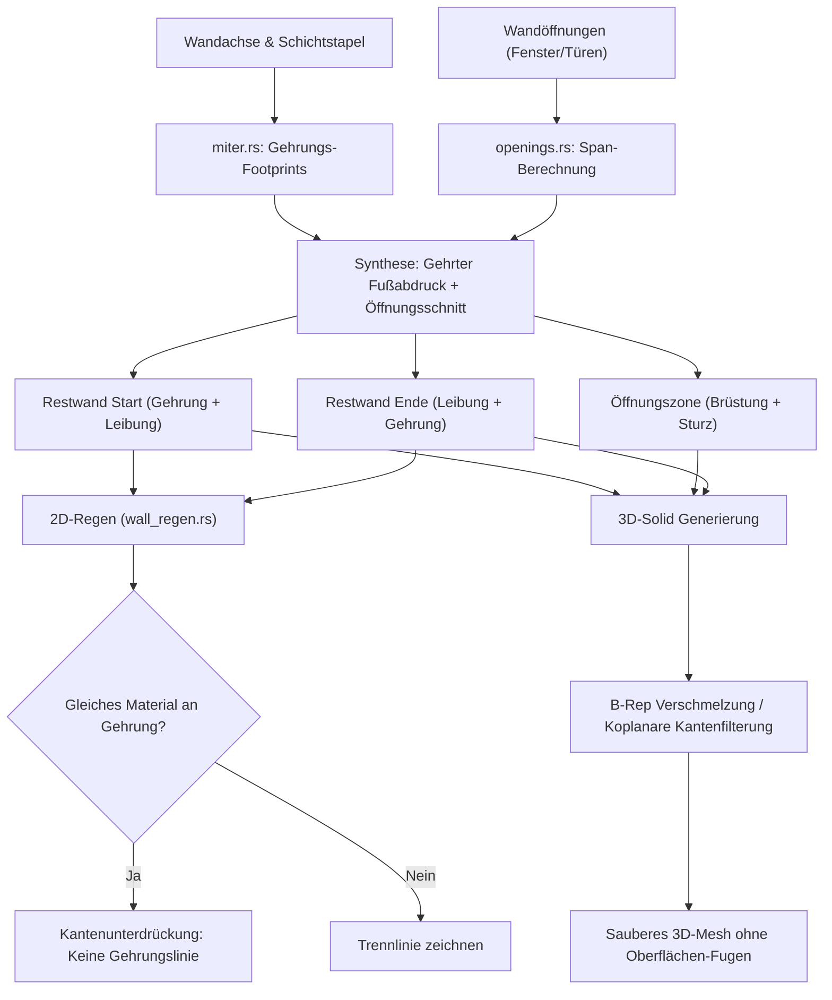

# Requirements

### Overview & Goals

Dieser Plan fokussiert sich auf die **konkrete Verbesserung der 2D- und 3D-Darstellung von Wänden und Wandöffnungen** in OpenCADStudio. Er behebt vier spezifische visuelle Mängel im aktuellen Render- und Regenerierungs-Workflow:
1. **2D-Schichtkonturen:** Keine störenden Gehrungs- oder Trennlinien an Wandverbindungen (L- und T-Joins) zwischen Schichten mit identischem Material (oder durch Junction-Override definierte Verbindungen).
2. **3D-Wandkomponenten:** Nahtloses Rendern von Wandschichten gleichen Materials an Gehrungen ohne sichtbare Trennfugen auf den Deck- und Außenflächen.
3. **3D-Wandöffnungen:** Beseitigung künstlicher Schnittlinien auf der flachen Wandoberfläche (Putz/Mauerwerk) oberhalb und unterhalb von Fenstern und Türen, die durch die Zerlegung in Teilkörper (Restwand, Brüstung, Sturz) entstehen.
4. **3D-Eckverbindungen mit Öffnungen:** Wände mit Fenstern oder Türen behalten ihre 3D-Gehrungen zu Nachbarwänden vollständig bei. Der bisherige gegenseitige Ausschluss zwischen Miter-Footprint und Öffnungsschnitt wird aufgehoben.

*Hinweis:* Vektor-HLR (Hidden-Line-Removal) und automatische Schnittableitungen (`FLATSHOT` / `SECTIONPLANETOBLOCK`) sind gemäß Anweisung vorerst zurückgestellt und nicht Gegenstand dieses Plans.

### Scope

#### In Scope
- **2D-Kantenunterdrückung an Schichtnähten (`wall_regen.rs`, `miter.rs`):** Emission von offenen Kontur-Polylinien bzw. Unterdrückung der Gehrungs-Abschlusskante (`EndCap`) bei Schichten mit identischem Material.
- **3D-Gehrungsnaht-Bereinigung (`wall_regen.rs`, `solid_model.rs`):** Eliminierung sichtbarer Gehrungskanten auf den Deck- und Bodenflächen aneinanderstoßender Solids gleichen Materials.
- **3D-Öffnungsschnitt-Bereinigung (`representation.rs`, `wall_regen.rs`):** Verschmelzen der Z- und Quer-Extrusionen einer Schicht zu einem zusammenhängenden B-Rep mit Öffnungsdurchbruch oder Kantenfilterung koplanarer Nahtkanten auf den Wandoberflächen.
- **Kombinierte Gehrungs- und Öffnungspipeline (`wall_regen.rs`, `representation.rs`):** Anwendung der Öffnungszerlegung auf den gegehrten Schicht-Footprints (`mitered_footprints`), sodass Wandecken an den Enden geschlossen bleiben und Öffnungen in der Wandspanne sauber ausgeschnitten werden.
- **Automatisierte Regressionstests (`wall_command_tests.rs`):** Validierung der 2D- und 3D-Geometrien für L-Joins, Öffnungen und L-Joins mit Öffnungen.

#### Out of Scope
- Vektor-HLR-Engine (`src/scene/hlr/`) und `SECTIONPLANETOBLOCK` (bewusst zurückgestellt).
- Modifikation des Geometriekerns `cadkernel` oder Wechsel auf OpenCASCADE.
- GPU-Shader-Neuschreibungen (`wire.wgsl`, `mesh.wgsl` bleiben in ihrer Architektur unverändert).

### User Stories

- Als Konstrukteur sehe ich im 2D-Grundriss saubere, ununterbrochene Wandecken, wenn zwei Wände mit demselben Material aufeinandertreffen, ohne störende diagonale Trennstriche im Mauerwerk.
- Als Konstrukteur sehe ich im 3D-Modell bei verbundenen Wänden gleichen Materials eine durchgehende Wandkrone und Außenfläche ohne künstliche Fugen.
- Als Konstrukteur sehe ich bei Wänden mit Fenstern oder Türen eine glatte Wandfläche über und unter der Öffnung ohne vertikale Schnittfugen auf der Putz-/Mauerwerksoberfläche.
- Als Konstrukteur platziere ich Fenster in Wänden, die an Ecken an andere Wände anschließen, und die 3D-Eckgehrung bleibt vollständig intakt und geschlossen.

### Functional Requirements

- **FR1 (2D-Materialnaht):** Treffen an einer Gehrung (L-Join) zwei Wandschichten mit identischem Material aufeinander, wird die gemeinsame Gehrungskante in der 2D-Kontur-Polyline unterdrückt. Die Außen- und Innenkanten laufen nahtlos zusammen.
- **FR2 (2D-Materialgrenze):** Treffen an einer Verbindung unterschiedliche Materialien aufeinander, bleibt die trennende Abschlusskante gezeichnet.
- **FR3 (2D-Schraffur):** Schraffuren (`Hatch`) bleiben in ihrer geschlossenen Flächenabdeckung erhalten, sodass das Schraffurmuster nahtlos an der Gehrung aneinanderstößt.
- **FR4 (3D-Oberflächenkanten bei Öffnungen):** Vertikale Begrenzungskanten zwischen Restwandstücken und Öffnungszonen-Solids (Brüstung/Sturz), die auf der koplanaren Außen- oder Innenseite der Wand liegen, werden in den 3D-Feature-Edges (`edge_verts`) unterdrückt.
- **FR5 (3D-Öffnungsleibung):** Die Kanten der eigentlichen Öffnung (Sturzunterkante, Brüstungsoberkante, seitliche Leibungsflächen) bleiben uneingeschränkt sichtbar und scharf.
- **FR6 (Koexistenz von Miter und Opening):** Eine Wand mit Wandöffnungen behält an gejointen Enden ihre gegehrten bzw. angepassten Schicht-Footprints bei. Die 3D-Wandkörper an den Ecken schließen lückenlos an die Nachbarwand an.

### Non-Functional Requirements

- **AEC-Kapselung (`AEC ≠ Core`):** Die Logik verbleibt in `src/modules/aec/**`. Keine neuen AEC-Felder im Core.
- **Performanz:** Keine rechenintensiven iterativen B-Rep-Booleans pro Render-Frame; Bereinigung erfolgt deterministisch während der Wand-Regenerierung (`regenerate_wall_representation`).

# Technical Design

### Current Implementation

1. **2D-Konturen (`wall_regen.rs:1580–1586`):**
   Jede Wandschicht erzeugt für ihren Footprint eine geschlossene Polyline (`pl.is_closed = true`). Bei Gehrungen erzeugt Wand A die Kante entlang der Gehrungsachse und Wand B dieselbe Kante. Dies führt zu zwei übereinanderliegenden 45°-Linien mitten im selben Material.
2. **3D-Solids bei Gehrungen (`wall_regen.rs:1740–1755`):**
   Jede Wand extrudiert ihre Schicht als separaten Quader. Die Berührungsfläche an der Gehrung erzeugt Kanten auf der oberen und unteren Deckfläche, die vom Edge-Shader als diagonale Fugen gerendert werden.
3. **3D-Solids bei Öffnungen (`representation.rs`, `elevation_cut.rs`, `wall_regen.rs:1740–1795`):**
   Wände mit Fenstern werden in 3 bis 4 separate `Solid3D`-Entitäten zerlegt (Restwand links, Restwand rechts, Brüstung, Sturz). Jeder Block ist ein eigenständiger Körper mit eigenen Begrenzungsflächen. An den Berührungsflächen liegen Kanten exakt auf der flachen Wandaußen- und Wandinnenseite und werden als vertikale schwarze Linien gerendert.
4. **Fehlende 3D-Eckverbindungen bei Öffnungen (`wall_regen.rs:1390–1398, 1676–1715`):**
   ```rust
   let use_opening_cuts_3d = !has_extended && has_opening_cuts;
   ```
   Wenn eine Öffnung existiert (`has_opening_cuts == true`), wählt die Engine zwingend `opening_cut_layers`. Diese werden jedoch in `representation.rs` ausschließlich auf Basis der ungejointen, rechteckigen Basisachse erzeugt. Die berechneten Gehrungsfußabdrücke (`mitered_footprints`) werden komplett verworfen. In 2D gilt der umgekehrte Ausschluss (`!has_miter && has_opening_cuts`), wodurch 2D-Öffnungen bei Gehrungen ignoriert wurden.

### Key Decisions

1. **Entkopplung und Synthese von Gehrung und Öffnung (Mitered Opening Cuts):**
   Die Öffnungszerlegung wird nicht auf der rohen Basisachse ausgeführt, sondern auf dem gegehrten Schicht-Footprint. Das Wandstück am Wandstart ($s \in [0, s_0]$) behält am Anfang die Gehrungskontur zur Nachbarwand und schließt am Fenster ($s = s_0$) gerade ab. Das Wandstück am Wandende ($s \in [s_1, L]$) beginnt am Fenster ($s = s_1$) gerade und behält am Ende die Gehrungskontur.
2. **2D-Kantenunterdrückung bei Materialgleichheit:**
   In `wall_regen.rs` wird geprüft, ob ein gegehrtes Wandende auf eine Schicht gleichen Materials trifft. Ist dies der Fall, wird die Abschlusskante der Polyline unterdrückt (Emission als offene Polyline oder zusammengesetzte Kanten ohne Gehrungs-Cap). Die Schraffur (`Hatch`) verwendet weiterhin das geschlossene Polygon.
3. **Koplanare Kantenbereinigung für 3D-Öffnungen:**
   Entweder werden die Teilkörper (Rest links, Rest rechts, Brüstung, Sturz) vor der Registrierung per `solid_model::boolean_result(Bool::Union, ...)` zu einem einzigen B-Rep mit echtem Durchbruchsloch vereinigt, ODER beim Erzeugen von `edge_wires` und `set.edge_verts` werden Kanten, die auf der koplanaren Außen-/Innenwandebene an den vertikalen Trennebenen liegen, herausgefiltert.
4. **Nahtlose 3D-Deckflächen an Gehrungen:**
   Für Wandschichten gleichen Materials werden die Kanten der Gehrungsfläche auf den oberen und unteren Deckflächen aus den gerenderten `edge_wires` ausgeblendet.

### Architecture Diagram



### Proposed Changes

#### 1. `src/modules/aec/engine/wall_regen.rs`
- **Behebung des gegenseitigen Ausschlusses:**
  - `use_opening_cuts_3d` und `use_opening_cuts_2d` so umbauen, dass bei Vorliegen von `has_miter` und `has_opening_cuts` die Öffnungsschnitte auf die gegehrten Footprints angewendet werden.
- **2D-Kantenunterdrückung:**
  - Beim Erzeugen der `WALL_REP_ROLE_CONTOUR`-Polylines für Schichten mit Gehrungen prüfen, ob die Partnerschicht dasselbe Material besitzt.
  - Wenn identisch: Keine Linie auf dem Gehrungssegment zeichnen (offene Polyline oder kantenbasierte Emission).
- **3D-Zusammenführung / Kantenfilterung:**
  - Bei Wänden mit Öffnungen die resultierenden Teilkörper einer Schicht entweder vereinigen (`cadkernel::brep::boolean::union`) oder Kanten auf der ebenen Hauptwandfläche filtern.
  - An Gehrungen gleichen Materials die Gehrungskante auf der Wandoberseite ausblenden.

#### 2. `src/modules/aec/engine/representation.rs` & `miter.rs`
- Funktion bereitstellen, die einen gegehrten Schicht-Footprint mit den Öffnungsintervallen verschneidet (`split_mitered_footprint_by_openings`).
- Beibehaltung der Gehrungspunkte an den Endsegmenten bei gleichzeitiger Erzeugung der geraden Leibungskanten an den Öffnungsrändern.

#### 3. `src/scene/model/solid_model.rs` (punktuelle Kantenfilterung)
- Hilfsfunktion zur Unterdrückung von Kanten zwischen koplanaren Facetten bei der Generierung von `edge_wires` / `edge_verts`, falls B-Rep-Booleans bei spezifischen Wandgeometrien snags erzeugen.

### Risks & Mitigations

- **Öffnung direkt an der Gehrungsecke:** Liegt ein Fenster extrem nah an der Ecke ($s_0 < \text{Gehrungsbreite}$), schneidet die Öffnung in die Gehrungsfläche.
  *Mitigation:* Robuste Begrenzung: Wenn die Gehrung in den Öffnungsbereich ragt, schneidet die Leibung die Gehrung sauber ab.
- **Schraffur-Integrität:** Werden 2D-Kontur-Polylinien offen emittiert, darf die Schraffur (`Hatch`) nicht beschädigt werden.
  *Mitigation:* `acadrust::entities::Hatch` nutzt weiterhin die geschlossenen Loops; nur die sichtbaren `LwPolyline`-Randkonturen unterdrücken die Gehrungsnaht.

# Testing

### Validation Approach

- Headless-Tests in `src/modules/aec/engine/wall_command_tests.rs` für alle 4 Problemstellungen.
- Überprüfung der resultierenden `LwPolyline`-Segmente (Anzahl der Vertizes, Abwesenheit der Gehrungskante).
- Überprüfung der generierten `Solid3D`-Körper und deren B-Rep-Kanten.

### Key Scenarios

1. **L-Join zweier Wände gleichen Materials (2D & 3D):**
   - 2D: Die Außen- und Innenkontur biegt 90° um die Ecke; kein 45°-Segment im gemeinsamen Material vorhanden.
   - 3D: Auf der Wandkrone läuft die Fläche durch; keine Diagonalfuge sichtbar.
2. **L-Join zweier Wände unterschiedlichen Materials (2D & 3D):**
   - 2D: Die Trennlinie zwischen den unterschiedlichen Baustoffen bleibt exakt erhalten.
3. **Wand mit Fensteröffnung (3D):**
   - Keine vertikalen Linien auf der Außen- und Innenfläche der Wand links und rechts des Fensters.
   - Leibungskanten (Sturzunterkante, Brüstungsoberkante, seitliche Leibung) sind scharf und vorhanden.
4. **Wand-Eckverbindung mit Fenster in einer Wand:**
   - 3D-Körper an der Wandecke ist gegehrt und schließt nahtlos an die Nachbarwand an.
   - Fensteröffnung sitzt maßgenau in der Wand.

# Delivery Steps

### ✓ Step 1: Koexistenz von Gehrungs-Footprints und Öffnungsschnitten
Die gegenseitige Aushebelung von Miter und Öffnungsschnitt wird behoben, sodass Wandecken mit Öffnungen in 2D und 3D verbunden bleiben.

- Entkopplung in `wall_regen.rs` überarbeiten: Gehrungsfußabdrücke (`mitered_footprints`) als Ausgangsbasis für die Öffnungszerlegung verwenden.
- In `representation.rs` / `miter.rs` die Zerlegung so anpassen, dass das Start-Reststück die Gehrung bei $s=0$ und das End-Reststück die Gehrung bei $s=L$ behält.
- Tests in `wall_command_tests.rs` hinzufügen: L-Ecke mit Fenster in einer Wand verifizieren.

### ✓ Step 2: 2D-Schichtkontur-Bereinigung an Verbindungen gleichen Materials
An Wandverbindungen wird bei identischem Material die trennende Gehrungskante in der 2D-Darstellung unterdrückt.

- In `wall_regen.rs` den Materialvergleich an Gehrungen auswerten.
- Bei Materialgleichheit die Abschlusskante (`EndCap`) in der 2D-Kontur-Polyline auslassen (offene Polyline oder Kanten-Splitting).
- Geschlossene Loops für Schraffuren (`Hatch`) beibehalten.
- Tests zur Verifizierung der Kantenanzahl und Abwesenheit der Trennlinie erstellen.

### ✓ Step 3: 3D-Bereinigung der Oberflächenlinien bei Wandöffnungen
Künstliche Schnittlinien auf den ebenen Wandaußen- und Wandinnenflächen durch die Öffnungszerlegung werden beseitigt.

- In `wall_regen.rs` die Teilkörper einer Schicht (Rest links, Rest rechts, Brüstung, Sturz) per B-Rep-Union verschmelzen oder koplanare Kanten auf den Hauptwandflächen bei `edge_wires` und `edge_verts` unterdrücken.
- Leibungskanten der Fensteröffnung uneingeschränkt sichtbar halten.
- Testfälle für 3D-Feature-Edges bei Wänden mit Fenster erstellen.

### ✓ Step 4: 3D-Gehrungsnaht-Bereinigung bei gleichem Material
Verbundene Wandschichten gleichen Materials werden in 3D ohne sichtbare Deckflächen-Fuge dargestellt.

- Ausblenden der Gehrungskanten auf den horizontalen Deck- und Bodenflächen bei aneinanderstoßenden Körpern gleichen Materials.
- Gesamte AEC-Testsuite ausführen (`cargo test --lib -- modules::aec::engine::wall_command_tests`).