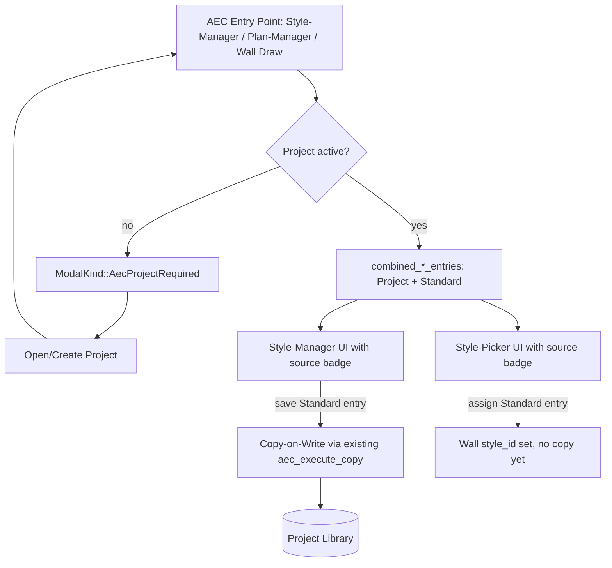

# Requirements

### Overview & Goals
Die Verwaltung von Wand-/Materialstilen zwischen **Standard-Bibliothek** (global) und **Projekt-Bibliothek** ist aktuell zu undurchsichtig: kein erzwungenes projektbezogenes Arbeiten im Architecture-Bereich, keine kombinierte Sicht auf beide Bibliotheken im Style-Manager, und der Style-Picker lädt hart-codiert nur die globale Bibliothek (`load_or_seed()`). Ziel: klar verständliches, erzwungenes Projekt-zentriertes Arbeiten mit transparenter, kombinierter Sicht auf beide Bibliotheken inkl. Herkunfts-Badge.

### Scope
**In Scope**
- Blockierender Startdialog (`ModalKind::AecProjectRequired`), der ein aktives Projekt erzwingt beim Betreten von Style-Manager, Plan-Manager, Wandwerkzeugen.
- Kombinierte Anzeige von Standard- und Projekt-Stilen (Material- & Wandstil-Manager) mit Herkunfts-Badge ("Standard"/"Projekt").
- Copy-on-Write beim Bearbeiten/Speichern eines Standard-Eintrags (automatische Kopie ins Projekt via bestehender Kopier-Logik).
- Fix der Style-Picker-Inkonsistenz: Picker nutzt künftig ebenfalls die kombinierte, projektbezogene Sicht statt `load_or_seed()`.
- Anpassung der bestehenden "→ Projekt"/"→ Standard"-Buttons an das neue kombinierte Listen-Layout.

**Out of Scope**
- Drag&Drop-Import von Stilen (nur als Notiz/Ausblick dokumentiert).
- Automatischer Import bei Zuweisung ohne Nutzerinteraktion.
- Auto-Sync zwischen Standard- und Projekt-Bibliothek.
- Mehrfach-Projekte gleichzeitig offen / Projekt-Wechsel-UX.

### User Stories
- Als Anwender möchte ich beim Öffnen des Architecture-Bereichs klar aufgefordert werden, ein Projekt zu öffnen oder anzulegen, damit ich nicht versehentlich ohne Projektkontext arbeite.
- Als Anwender möchte ich im Style-Manager auf einen Blick sehen, welche Stile aus der Standard-Bibliothek und welche aus meinem Projekt stammen.
- Als Anwender möchte ich einen Standard-Stil direkt einer Wand zuweisen können, ohne ihn vorher manuell ins Projekt kopieren zu müssen; bei Bearbeitung wird er automatisch ins Projekt übernommen.

### Functional Requirements
- Zugriff auf AEC-Funktionalität ist ohne aktives Projekt blockiert; Modal bietet "Projekt öffnen"/"Neues Projekt anlegen" an, kein anderweitiges Schließen.
- Material- und Wandstil-Manager zeigen eine gemeinsame Liste aus Projekt- und Standard-Bibliothek mit sichtbarem Badge je Eintrag.
- Bearbeiten/Speichern eines "Standard"-Eintrags erzeugt automatisch eine Kopie in der Projekt-Bibliothek (Copy-on-Write); die Standard-Bibliothek bleibt unverändert.
- Der Style-Picker zeigt dieselbe kombinierte Liste inkl. Badge und erlaubt direkte Zuweisung eines Standard-Stils ohne vorherigen Kopier-Schritt.

# Technical Design

### Current Implementation (Kontext)
- `resolve_style_library(project: Option<&ProjectFile>) -> StyleLibrary` (`src/modules/aec/engine/project.rs`) liefert exklusiv Projekt- ODER Standard-Bibliothek, kein Merge, kein Herkunfts-Tracking.
- `App.aec_style_library: Option<StyleLibrary>` (`src/app/mod.rs`); UI in `src/ui/window/aec_material_manager.rs` / `aec_wall_style_manager.rs`.
- Bereits umgesetzt (vorherige Session): `CopyConflict`, `material_copy_conflict`/`wall_style_copy_conflict` (`src/modules/aec/engine/library.rs`), `Message::AecStyleManagerCopy{MaterialToProject,MaterialToGlobal,WallStyleToProject,WallStyleToGlobal}` + `AecStyleManagerCopyConflictConfirm`, "→ Standard"/"→ Projekt"-Buttons, `ModalKind::AecStyleCopyConflict`.
- `unique_id(prefix, name)` (`src/modules/aec/commands.rs`) für global eindeutige IDs.
- **Inkonsistenz:** Style-Picker-Handler (`AecStylePickerOpen*` in `src/app/update/mod.rs`) laden immer `load_or_seed()`, unabhängig vom Projekt.
- Kein `ModalKind` blockiert aktuell das Betreten des AEC-Bereichs ohne Projekt (`aec_project_explorer_file: Option<ProjectFile>` in `src/app/mod.rs`).

### Key Decisions
- **Projekt-Zwang als blockierender Startdialog:** `ModalKind::AecProjectRequired`, ausgelöst beim Versuch, einen AEC-Einstiegspunkt ohne aktives Projekt zu öffnen; nur "Projekt öffnen"/"Neues Projekt", kein Abbrechen außer Schließen (Einstiegspunkt öffnet dann nicht).
- **Kombinierte Bibliothekssicht statt Merge-in-place:** keine dauerhaft gemergte `StyleLibrary`; UI berechnet bei jedem Öffnen eine `CombinedStyleEntry`-Liste aus beiden Bibliotheken (Projekt-Einträge haben Vorrang bei ID-Gleichheit). Persistenz bleibt unverändert bei den zwei bestehenden Strukturen.
- **Copy-on-Write beim Bearbeiten eines Standard-Eintrags:** Speichern eines `source == Standard`-Eintrags löst automatisch die bestehende Kopier-Logik (`material_copy_conflict`/`wall_style_copy_conflict`, Upsert) aus, statt neuer Implementierung.
- **Style-Picker-Fix Teil dieser Stufe:** Picker nutzt dieselbe kombinierte Liste; Zuweisung eines Standard-Stils ohne Vorab-Kopie, Copy-on-Write erst bei späterem Bearbeiten.

### Proposed Changes
1. **Startdialog / Projekt-Zwang:** `ModalKind::AecProjectRequired`; Guard `App::aec_require_project(&mut self) -> bool`, aufgerufen an `AecStyleManagerOpen`, `AecPlanManagerOpen`, Wand-Zeichenbefehlen (`src/app/commands/draw.rs`); öffnet Dialog und gibt `false` zurück falls `self.aec_project_explorer_file.is_none()`.
2. **Kombinierte Liste:** `combined_material_entries(project: Option<&ProjectFile>) -> Vec<CombinedMaterialEntry>` / `combined_wall_style_entries(...) -> Vec<CombinedWallStyleEntry>` in `src/modules/aec/engine/library.rs`; Manager-Views rendern Badge neben Name.
3. **Copy-on-Write:** Save-Handler (`AecStyleManagerMaterialSave`/`AecStyleManagerWallStyleSave*`) prüfen Quelle des bearbeiteten Eintrags; bei `Standard` wird vor dem Speichern der vorhandene Kopier-Pfad (`aec_execute_copy`) durchlaufen.
4. **Style-Picker-Fix:** `AecStylePickerOpen*`-Handler wechseln auf kombinierte Liste inkl. Badge; Auswahl eines Standard-Eintrags weist direkt zu, ohne Kopie.
5. **Bestehende Copy-Buttons:** bleiben erhalten, werden im kombinierten Layout nur dort angezeigt, wo sie einen Zustandswechsel bewirken.

### Data Models / Contracts
```rust
// src/modules/aec/engine/library.rs
pub enum LibrarySource { Standard, Project }

pub struct CombinedMaterialEntry {
    pub material: Material,
    pub source: LibrarySource,
}
pub struct CombinedWallStyleEntry {
    pub wall_style: WallStyle,
    pub source: LibrarySource,
}

pub fn combined_material_entries(project: Option<&ProjectFile>) -> Vec<CombinedMaterialEntry>;
pub fn combined_wall_style_entries(project: Option<&ProjectFile>) -> Vec<CombinedWallStyleEntry>;
```

### Components
- `src/app/view/modal.rs`: neues `aec_project_required_window()`, analog zu `layer_delete_warning_window`/`aec_style_copy_conflict_window`.
- `src/ui/window/aec_material_manager.rs` / `aec_wall_style_manager.rs`: Listenrendering erweitert um Badge; nutzt `combined_*_entries` statt exklusiver `library`-Referenz.
- Style-Picker-UI (`AecStylePickerOpen*`, `src/ui/window/` bzw. `src/app/view/modal.rs`): gleiche Badge-Darstellung.
- `src/app/update/mod.rs`: neuer Guard `aec_require_project`, angepasste Save-Handler (Copy-on-Write), angepasste `AecStylePickerOpen*`-Handler.

### Architecture Diagram


### Risks
- Copy-on-Write könnte bei mehrfachem Bearbeiten desselben Standard-Eintrags in verschiedenen Projekten zu abweichenden Projekt-Kopien führen (gewollt, sollte aber per Statusmeldung kommuniziert werden).
- Der blockierende Startdialog darf bestehende Automatisierungs-/Skript-Flows (`src/app/automation.rs`) nicht deadlocken — Guard muss dort ggf. übersprungen werden.

### File Structure
- Neu/geändert: `src/modules/aec/engine/library.rs` (kombinierte Entry-Typen/Funktionen).
- Geändert: `src/app/mod.rs` (`ModalKind::AecProjectRequired`), `src/app/update/mod.rs` (Guard, Save-Handler, Picker-Handler), `src/app/view/modal.rs` (neuer Dialog), `src/ui/window/aec_material_manager.rs`, `src/ui/window/aec_wall_style_manager.rs`, Style-Picker-UI-Datei.
- Dokumentation: Plan-Datei mit ✓-Markierungen nach Umsetzung ergänzt.

# Delivery Steps

### ✓ Step 1: Projekt-Zwang: blockierender Startdialog implementieren
Der AEC-Bereich (Style-Manager, Plan-Manager, Wandwerkzeuge) lässt sich ohne aktives Projekt nicht mehr öffnen, stattdessen erscheint ein Modal mit "Projekt öffnen"/"Neues Projekt anlegen".
- `ModalKind::AecProjectRequired` in `src/app/mod.rs` ergänzen.
- Guard-Funktion `App::aec_require_project(&mut self) -> bool` implementieren, die prüft ob `self.aec_project_explorer_file.is_none()` und ggf. das Modal öffnet.
- Guard an den Message-Handlern `AecStyleManagerOpen`, `AecPlanManagerOpen` in `src/app/update/mod.rs` einbauen.
- Guard an den Wand-Zeichenbefehlen in `src/app/commands/draw.rs` einbauen.
- Neues Dialog-Fenster `aec_project_required_window()` in `src/app/view/modal.rs` analog zu `layer_delete_warning_window` ergänzen, mit "Projekt öffnen"- und "Neues Projekt"-Aktionen.
- Guard so gestalten, dass er in `src/app/automation.rs`-Flows übersprungen/anders behandelt werden kann, um Deadlocks zu vermeiden.

### ✓ Step 2: Kombinierte Bibliotheks-Entry-Typen und Abfragefunktionen
Neue Funktionen liefern eine gemeinsame, herkunftsmarkierte Liste aus Standard- und Projekt-Stilen, ohne die bestehende Persistenz zu verändern.
- `LibrarySource`-Enum (`Standard`, `Project`) in `src/modules/aec/engine/library.rs` ergänzen.
- `CombinedMaterialEntry { material: Material, source: LibrarySource }` und `CombinedWallStyleEntry { wall_style: WallStyle, source: LibrarySource }` definieren.
- `combined_material_entries(project: Option<&ProjectFile>) -> Vec<CombinedMaterialEntry>` implementieren: liest Standard- und Projekt-Bibliothek, markiert Herkunft, Projekt-Einträge haben Vorrang bei ID-Gleichheit.
- `combined_wall_style_entries(project: Option<&ProjectFile>) -> Vec<CombinedWallStyleEntry>` analog implementieren.
- Bestehende `resolve_style_library`-Präzedenzlogik als Referenz für die Vorrangregel wiederverwenden.

### ✓ Step 3: Herkunfts-Badge in Material- und Wandstil-Manager integrieren
Material- und Wandstil-Manager zeigen Projekt- und Standard-Einträge gemeinsam mit sichtbarem "Standard"/"Projekt"-Badge an.
- `src/ui/window/aec_material_manager.rs`: Listenrendering von der exklusiven `library`-Referenz auf `combined_material_entries` umstellen, Badge-Spalte/-Tag pro Zeile ergänzen.
- `src/ui/window/aec_wall_style_manager.rs`: analoge Umstellung auf `combined_wall_style_entries` mit Badge.
- Bestehende "→ Projekt"/"→ Standard"-Buttons an das neue Layout anpassen: nur anzeigen, wo sie einen tatsächlichen Zustandswechsel bewirken (z. B. "→ Standard" nur für reine Projekt-Einträge ohne globales Gegenstück).

### ✓ Step 4: Copy-on-Write beim Bearbeiten von Standard-Einträgen
Wird ein als "Standard" markierter Material- oder Wandstil-Eintrag gespeichert, landet die Änderung automatisch als Kopie im Projekt, ohne die Standard-Bibliothek zu verändern.
- In `src/app/update/mod.rs`: Save-Handler `AecStyleManagerMaterialSave` erweitern — Quelle des bearbeiteten Eintrags prüfen; bei `LibrarySource::Standard` vor dem Speichern den bestehenden Kopier-Pfad (`aec_execute_copy`, `material_copy_conflict`) durchlaufen lassen.
- Analoge Erweiterung für `AecStyleManagerWallStyleSave*` mit `wall_style_copy_conflict`.
- Statusmeldung ergänzen, die dem Nutzer signalisiert, dass der Standard-Eintrag ins Projekt kopiert wurde.

### ✓ Step 5: Style-Picker auf kombinierte, projektbezogene Sicht umstellen
Der Style-Picker zeigt Standard- und Projekt-Stile mit Badge und erlaubt die direkte Zuweisung eines Standard-Stils an eine Wand ohne Vorab-Kopie.
- Handler `AecStylePickerOpen`, `AecStylePickerOpenForWallProperties`, `AecStylePickerOpenForActiveCommand` in `src/app/update/mod.rs` von `load_or_seed()` auf `combined_material_entries`/`combined_wall_style_entries` umstellen.
- Picker-UI (identifiziert in `src/ui/window/` bzw. `src/app/view/modal.rs`) um Badge-Darstellung analog zu den Managern erweitern.
- Zuweisung eines Standard-Eintrags an eine Wand setzt direkt die `style_id`, ohne Kopie auszulösen (Copy-on-Write greift erst beim späteren Bearbeiten aus Stufe 4).