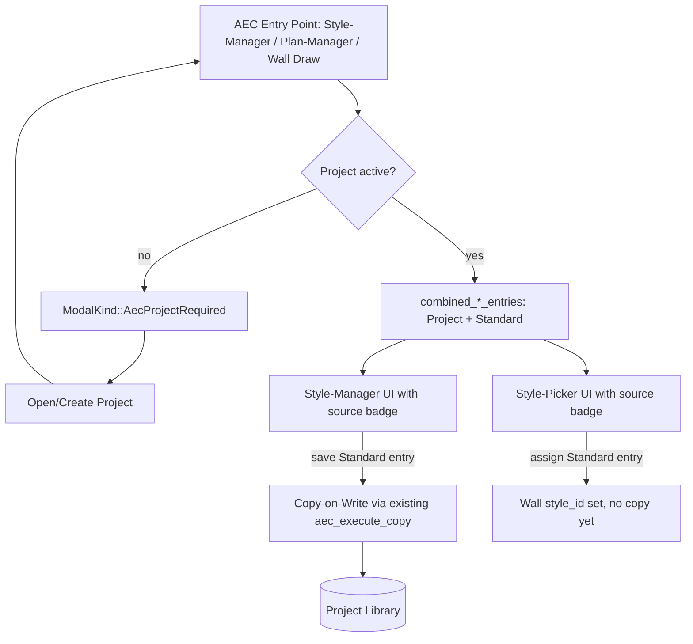

# Requirements

### Overview & Goals
Die Verwaltung von Wand-/Materialstilen zwischen **Standard-Bibliothek** (global) und **Projekt-Bibliothek** ist für Anwender aktuell zu undurchsichtig: Es ist nicht erkennbar/erzwingbar, dass im Architecture-Bereich immer projektbezogen gearbeitet wird, der Style-Manager zeigt exklusiv nur eine der beiden Bibliotheken (kein gemeinsamer Blick), und Standard-Stile sind im laufenden Projekt-Workflow schwer nutzbar (`AecStylePickerOpen*` lädt bislang sogar hart-codiert nur die globale Bibliothek, siehe unten). Ziel dieser Ausbaustufe: ein klar verständliches, erzwungenes Projekt-zentriertes Arbeiten mit transparenter, kombinierter Sicht auf beide Bibliotheken.

Abgestimmte Kern-Entscheidungen (siehe Antworten des Nutzers):
1. **Projekt-Zwang:** Beim Betreten des AEC/Architecture-Bereichs erscheint ein **blockierender Startdialog** "Projekt öffnen/anlegen", der erst schließt, wenn ein Projekt aktiv ist.
2. **Kombinierte Stilliste:** Der Style-Manager (Material- und Wandstil-Manager) zeigt künftig **Standard- und Projekt-Stile gemeinsam** in einer Liste, mit einem **Herkunfts-Badge** ("Standard"/"Projekt") pro Eintrag. Bearbeiten eines Standard-Eintrags kopiert ihn automatisch ins Projekt (Copy-on-Write), analog zum bereits bestehenden `unique_id`-Mechanismus.
3. **Import-Mechanismus:** Es werden **keine neuen** Import-Wege (kein Drag&Drop, kein Auto-Import bei Zuweisung) eingeführt — die bereits implementierten "→ Projekt"/"→ Standard"-Buttons (Step 9, `AecStyleManagerCopy*`) bleiben der einzige Mechanismus. Drag&Drop (wie bei Autodesk Architecture) wird nur als möglicher, nicht in dieser Stufe umgesetzter Ausblick dokumentiert.

Zusätzlich wird die dabei entdeckte Inkonsistenz behoben: Der **Style-Picker** (Wandstil-Zuweisung an eine Wand) lädt bislang immer `load_or_seed()` (nur global), unabhängig vom aktiven Projekt — das widerspricht dem neuen kombinierten/projektbezogenen Konzept und wird im Zuge dieser Änderung korrigiert.

### Scope
**In Scope**
- Blockierender Startdialog, der ein aktives Projekt erzwingt, sobald der AEC/Architecture-Bereich (Style-Manager, Plan-Manager, Wandwerkzeuge) betreten wird.
- Kombinierte Anzeige von Standard- und Projekt-Stilen im Material- und Wandstil-Manager mit Herkunfts-Badge, inkl. Copy-on-Write beim Bearbeiten eines Standard-Eintrags.
- Fix der Style-Picker-Inkonsistenz: Wandstil-Zuweisung nutzt künftig ebenfalls die kombinierte/projektbezogene Sicht statt hart `load_or_seed()`.
- Anpassung der bestehenden "→ Projekt"/"→ Standard"-Buttons an das neue kombinierte Listen-Layout (kein neuer Mechanismus, nur UI-Integration).

**Out of Scope**
- Drag&Drop-Import von Stilen auf die Zeichnung (Autodesk-Architecture-Vorbild) — nur als Ausblick/Notiz dokumentiert, nicht umgesetzt.
- Automatischer Import bei Zuweisung ohne Nutzerinteraktion — bewusst nicht gewählt.
- Auto-Sync/automatischer Abgleich zwischen Standard- und Projekt-Bibliothek — weiterhin nicht Teil dieser Stufe.
- Mehrfach-Projekte gleichzeitig offen / Projekt-Wechsel-UX — nicht Teil dieser Stufe.

### User Stories
- Als Anwender möchte ich beim Öffnen des Architecture-Bereichs klar aufgefordert werden, ein Projekt zu öffnen oder anzulegen, damit ich nicht versehentlich ohne Projektkontext arbeite.
- Als Anwender möchte ich im Style-Manager auf einen Blick sehen, welche Stile aus der Standard-Bibliothek und welche aus meinem Projekt stammen, ohne zwischen zwei getrennten Listen wechseln zu müssen.
- Als Anwender möchte ich einen Standard-Stil direkt einer Wand zuweisen können, ohne ihn vorher manuell in mein Projekt kopieren zu müssen, während er bei Bearbeitung automatisch ins Projekt übernommen wird.

### Functional Requirements
- Der Zugriff auf AEC-Funktionalität (Style-Manager, Plan-Manager, Wandwerkzeuge) ist ohne aktives Projekt blockiert; ein Modal-Dialog bietet "Projekt öffnen" und "Neues Projekt anlegen" an und lässt sich nicht anders schließen.
- Material- und Wandstil-Manager zeigen eine gemeinsame Liste aus Projekt- und Standard-Bibliothek; jeder Eintrag trägt sichtbar ein Badge ("Standard"/"Projekt").
- Wird ein als "Standard" markierter Eintrag bearbeitet und gespeichert, wird automatisch eine Kopie mit neuer/gleicher ID in der Projekt-Bibliothek angelegt (Copy-on-Write); die Standard-Bibliothek bleibt unverändert.
- Der Style-Picker (Wandstil-Zuweisung) zeigt dieselbe kombinierte Liste inkl. Badge und erlaubt die direkte Zuweisung eines Standard-Stils an eine Wand (ohne vorherigen Kopier-Schritt).

# Technical Design

### Current Implementation (Kontext)
- Bibliotheks-Auflösung: `resolve_style_library(project: Option<&ProjectFile>) -> StyleLibrary` (`src/modules/aec/engine/project.rs`) liefert **exklusiv** die Projekt-Bibliothek wenn nicht leer, sonst `load_or_seed()` (global). Kein Merge, kein Herkunfts-Tracking pro Eintrag.
- `App.aec_style_library: Option<StyleLibrary>` (`src/app/mod.rs`) ist die im Style-Manager angezeigte, per Referenz aufgelöste Bibliothek; UI in `src/ui/window/aec_material_manager.rs`/`aec_wall_style_manager.rs`.
- Step 9 (bereits umgesetzt, diese Session): `CopyConflict`, `material_copy_conflict`/`wall_style_copy_conflict` (`src/modules/aec/engine/library.rs`), `Message::AecStyleManagerCopy{MaterialToProject,MaterialToGlobal,WallStyleToProject,WallStyleToGlobal}` + `AecStyleManagerCopyConflictConfirm` (`src/app/mod.rs`, `src/app/update/mod.rs`), "→ Standard"/"→ Projekt"-Buttons in den beiden Manager-Views, `ModalKind::AecStyleCopyConflict`-Bestätigungsdialog (`src/app/view/modal.rs`).
- `unique_id(prefix, name)` (`src/modules/aec/commands.rs`) vergibt global eindeutige IDs für neu angelegte Stile/Materialien (löst frühere projektübergreifende ID-Kollisionen).
- **Gefundene Inkonsistenz:** Der Style-Picker (`AecStylePickerOpen`/`AecStylePickerOpenForWallProperties`/`AecStylePickerOpenForActiveCommand`, Handler in `src/app/update/mod.rs`) lädt bislang **immer** `load_or_seed()` direkt, unabhängig von `self.aec_project_explorer_file` — er nutzt nicht einmal die exklusive `resolve_style_library`-Logik, geschweige denn eine kombinierte Sicht.
- Es gibt aktuell **kein** `ModalKind`, das den AEC-Bereich vor Betreten blockiert; Style-/Plan-Manager öffnen sich unabhängig vom Projektstatus (`aec_project_explorer_file: Option<ProjectFile>` in `src/app/mod.rs`).

### Key Decisions
- **Projekt-Zwang als blockierender Startdialog:** neuer `ModalKind::AecProjectRequired`, ausgelöst beim Versuch, einen AEC-Einstiegspunkt (Style-Manager, Plan-Manager, Wand-Zeichenbefehle) ohne aktives Projekt zu öffnen; bietet nur "Projekt öffnen" / "Neues Projekt" an, kein "Abbrechen ohne Aktion" außer Schließen des gesamten Dialogs (der AEC-Einstiegspunkt selbst öffnet dann nicht). Begründung: Nutzer hat sich explizit für diese härteste Variante entschieden, um Fehlbedienung (Stile landen versehentlich nur global) auszuschließen.
- **Kombinierte Bibliothekssicht mit Herkunfts-Badge statt Merge-in-place:** Es wird **keine** neue, dauerhaft gemergte `StyleLibrary` gespeichert. Stattdessen berechnet die UI-Schicht bei jedem Öffnen des Managers eine `CombinedStyleEntry { source: LibrarySource::Standard | LibrarySource::Project, .. }`-Liste aus beiden Bibliotheken (Projekt-Einträge haben Vorrang bei ID-Gleichheit, analog zur bisherigen `resolve_style_library`-Präzedenz). Persistenz bleibt bei den bestehenden zwei Dateien/Strukturen unverändert — nur die Anzeige wird kombiniert.
- **Copy-on-Write beim Bearbeiten eines Standard-Eintrags:** Speichern eines Eintrags mit `source == Standard` löst automatisch `aec_execute_copy`-artige Logik aus (Eintrag zuerst nach Projekt kopieren, danach dort bearbeiten/speichern), wiederverwendet die in Step 9 bereits vorhandene Kopier-Logik (`material_copy_conflict`/`wall_style_copy_conflict`, Upsert) statt einer neuen Implementierung.
- **Style-Picker-Fix ist Teil dieser Stufe:** Der Picker wird auf dieselbe kombinierte Liste umgestellt wie die Manager, damit Standard-Stile ohne Vorab-Kopie zuweisbar sind (User Story 3) — bewusst kein Auto-Import bei Zuweisung (siehe abgelehnte Option); erst beim späteren Bearbeiten/Speichern greift Copy-on-Write.

### Proposed Changes
1. **Startdialog / Projekt-Zwang:** Neuer `ModalKind::AecProjectRequired`; zentrale Prüf-Helferfunktion `App::aec_require_project(&mut self) -> bool` (analog zu bestehenden Guard-Mustern), aufgerufen an den Einstiegspunkten `AecStyleManagerOpen`, `AecPlanManagerOpen` und den Wand-Zeichenbefehlen in `src/app/commands/draw.rs`; gibt `false` zurück und öffnet den Dialog, falls `self.aec_project_explorer_file.is_none()`.
2. **Kombinierte Liste:** Neue kleine Hilfsstruktur/Funktion (z. B. `combined_style_entries(project: Option<&ProjectFile>) -> Vec<CombinedMaterialEntry>` / `CombinedWallStyleEntry`) in `src/modules/aec/engine/library.rs`, die beide Bibliotheken liest und pro Eintrag die Quelle markiert; Material-/Wandstil-Manager-Views (`aec_material_manager.rs`/`aec_wall_style_manager.rs`) rendern das Badge neben Name/Filter-Ergebnis.
3. **Copy-on-Write:** Save-Handler (`AecStyleManagerMaterialSave`/`AecStyleManagerWallStyleSave*` in `src/app/update/mod.rs`) prüfen die Quelle des aktuell bearbeiteten Eintrags; ist sie `Standard`, wird vor dem eigentlichen Speichern automatisch der bereits vorhandene Kopier-Pfad (`aec_execute_copy`) durchlaufen, danach normal wie ein Projekt-Eintrag gespeichert.
4. **Style-Picker-Fix:** `AecStylePickerOpen*`-Handler wechseln von `load_or_seed()` auf die neue kombinierte Liste (Projekt- und Standard-Einträge, mit Badge in der Picker-UI); Auswahl eines Standard-Eintrags weist ihn direkt zu, ohne Kopie (Kopie erfolgt erst bei späterer Bearbeitung, siehe Punkt 3).
5. **Bestehende Copy-Buttons:** "→ Projekt"/"→ Standard" bleiben erhalten, werden aber im neuen kombinierten Layout nur noch dort sinnvoll angezeigt, wo sie einen Zustandswechsel bewirken (z. B. "→ Standard" für einen reinen Projekt-Eintrag, der noch nicht global existiert).

### Data Models / Contracts
```rust
// src/modules/aec/engine/library.rs
pub enum LibrarySource { Standard, Project }

pub struct CombinedMaterialEntry {
    pub material: Material,
    pub source: LibrarySource,
}
pub struct CombinedWallStyleEntry {
    pub wall_style: WallStyle,
    pub source: LibrarySource,
}

pub fn combined_material_entries(project: Option<&ProjectFile>) -> Vec<CombinedMaterialEntry>;
pub fn combined_wall_style_entries(project: Option<&ProjectFile>) -> Vec<CombinedWallStyleEntry>;
```

### Components
- `src/app/view/modal.rs`: neues `aec_project_required_window()`, analog zu bestehenden einfachen Bestätigungsdialogen (`layer_delete_warning_window`, `aec_style_copy_conflict_window`).
- `src/ui/window/aec_material_manager.rs` / `aec_wall_style_manager.rs`: Listenrendering erweitert um Badge-Spalte/-Tag; nutzt `combined_material_entries`/`combined_wall_style_entries` statt der bisherigen exklusiven `library`-Referenz.
- Style-Picker-UI (Fenster/Popup hinter `AecStylePickerOpen*`, zu identifizieren in `src/ui/window/` bzw. `src/app/view/modal.rs`): gleiche Badge-Darstellung wie Manager.
- `src/app/update/mod.rs`: neuer Guard `aec_require_project`, angepasste Save-Handler (Copy-on-Write), angepasste `AecStylePickerOpen*`-Handler.

### Architecture Diagram


### Risks
- Copy-on-Write könnte bei mehrfachem Bearbeiten desselben Standard-Eintrags in verschiedenen Projekten zu abweichenden Projekt-Kopien führen (gewollt, aber sollte in UI kommuniziert werden, z. B. Statusmeldung "in Projekt kopiert").
- Der blockierende Startdialog darf bestehende Automatisierungs-/Skript-Flows (`src/app/automation.rs`) nicht deadlocken — Guard muss dort ggf. übersprungen oder anders behandelt werden.

### File Structure
- Neu/geändert: `src/modules/aec/engine/library.rs` (kombinierte Entry-Typen/Funktionen).
- Geändert: `src/app/mod.rs` (`ModalKind::AecProjectRequired`), `src/app/update/mod.rs` (Guard, Save-Handler, Picker-Handler), `src/app/view/modal.rs` (neuer Dialog), `src/ui/window/aec_material_manager.rs`, `src/ui/window/aec_wall_style_manager.rs`, Style-Picker-UI-Datei.
- Dokumentation: `.junie/plans/aec-plan-view-display-variants.md` (neuer Bugfix-/Feature-Bullet unter "Geklärte Diskussionspunkte" nach Umsetzung; Drag&Drop-Ausblick als Notiz, nicht als Step).