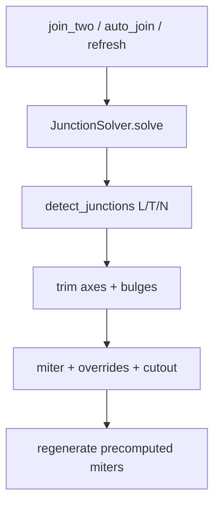

# Requirements

### Overview & Goals
Wand-Joins sollen geometrisch sauber und klassifikationsstabil werden: L vs. T vs. N-Wege, Schicht-Gehrung ohne Lücken, Bogenachsen und Junction-Overrides.

Ein **JunctionSolver** ist die einzige Quelle für Klassifikation, Achs-Trim und Layer-Footprints; `commands.rs` regeneriert nur noch aus diesen Ergebnissen.

### Scope
**In Scope**
- L/T: End vs. Mid (`END_MID_TOLERANCE`), T-Stamm trifft nicht fälschlich als L bzw. umgekehrt.
- Schicht-Miter: `match_layer_indices`, unmatched Fallback, Cutout der durchlaufenden Wand.
- N-Wege: ein Junction-Pass statt paarweiser Überschreibung.
- Bögen: `*_with_bulges` durch den Solver.
- Overrides: `JunctionOverride` / `JoinOverrideStyle` (Miter, Butt, NearFace, FarFace, NoExtend).

**Out of Scope**
- 3D-Boolean Öffnungen, IFC-Geometrie, Storey-Persistenz, Display-Profile.

### Functional Requirements
- `AEC_WALLJOIN` / `join_two_walls_in_document` und `try_auto_join_nearby_walls` nutzen denselben Solver.
- Nach Grip/Stretch: Junction neu auflösen, durchlaufende Achse nicht kürzen.
- Override an einem Ende ändert nur dieses Junction; andere Wände bleiben konsistent.
- Regeneration schreibt Achse getrimmt; sichtbare Kontur kommt aus Solver-Footprints.

# Technical Design

### Current Implementation
- Topologie: `src/modules/aec/engine/join.rs` — `join_wall_axes`, `join_wall_axes_with_bulges`, `join_wall_axes_as_l`, `detect_junctions`, `apply_junction_to_axes`, `junction_rays`.
- Geometrie: `src/modules/aec/engine/miter.rs` — `JoinMiterContext`, `mitered_layer_footprints*`, `mitered_junction_layer_footprints_with_overrides`, `through_wall_cutout_footprints*`, `merge_end_footprints`.
- Szene: `commands.rs` — `join_two_walls_in_document_inner`, `try_auto_join_nearby_walls`, `regenerate_wall_representation_with_precomputed_miters*`, `refresh_wall_after_axis_edit`.
- Problem: mehrere parallele Pfade (Paar-Join vs. N-Wege vs. Auto-Join) können Klassifikation und Footprints überschreiben.

### Key Decisions
- **Einheitlicher JunctionSolver** (Nutzerwahl): eine `solve(walls) -> Vec<SolvedJunction>` API; bestehende `join_*` / `miter_*` bleiben interne Bausteine.
- Solver kennt Rollen (`Endpoint` / `Through`), Kind (L/T/N), getrimmte Achsen, pro Wand `Vec<Option<Vec<(f64,f64)>>>` Footprints und Override-Anwendung.
- `commands` hört auf, `JoinMiterContext` ad hoc zu bauen, wenn der Solver Footprints liefert.

### Proposed Changes
Neue Datei `src/modules/aec/engine/junction_solver.rs` (Export in `engine/mod.rs`):

```text
struct WallJoinInput { axis, bulges, layers: Vec<MiterLayer>, override: Option<JunctionOverride> }
struct SolvedJunction {
  junction: Junction,
  kind: JoinKind or NWay,
  trimmed_axes: Vec<Vec<DVec3>>,
  footprints: Vec<Vec<Option<polygon>>>, // per participant, per layer
}
fn solve(walls: &[WallJoinInput], tol) -> Vec<SolvedJunction>
```

Ablauf:
1. `detect_junctions` + End/Mid mit `END_MID_TOLERANCE`.
2. L: `join_wall_axes_as_l(_with_bulges)`; T: Stem trimmen, Through ungekürzt; N: `apply_junction_to_axes`.
3. Footprints: 2 Wände → `mitered_layer_footprints_with_override_and_bulges`; ≥3 oder Through → `mitered_junction_layer_footprints_with_overrides` + Cutout.
4. `join_two_walls_in_document_inner` / `try_auto_join_nearby_walls`: Szene → Inputs → `solve` → Achsen schreiben → `regenerate_*_with_precomputed_miters`.

### Architecture Diagram


### File Structure
- **Add** `engine/junction_solver.rs`
- **Modify** `engine/mod.rs`, `commands.rs` (join/auto-join/refresh)
- **Reuse** `join.rs`, `miter.rs` (kein großer Rewrite der Geometrie)
- **Tests** in `junction_solver.rs` + bestehende Join-Tests in `commands.rs` anpassen

### Risks
- Regression der bestehenden `join_two_walls_extends_contours_*` / `try_auto_join_*` Tests — Solver muss deren Ergebnisse reproduzieren, dann Lücken schließen.
- Doppel-Miter an beiden Enden einer Wand: weiter `merge_end_footprints`.

# Testing

### Validation Approach
`cargo test --lib` für `aec::engine::join`, `miter`, `junction_solver` und die Join-Tests in `commands.rs`.

### Key Scenarios
- L-Ecke: beide Achsen am Schnitt, Miter-Schichten ohne Spalt.
- T: Through-Achse unverändert; Stamm bis Außenfläche; End-nahe Hits bleiben L (`END_MID_TOLERANCE`).
- N-Wege: ein `solve`, konsistente Footprints für alle Teilnehmer.
- Bogen: Bulge-Miter, nicht Sehne.
- Override Apply/Clear: NearFace/Butt vs. Default-Miter.

### Edge Cases
- Parallel / degeneriert → `JoinError`, keine Szene-Änderung.
- Unmatched Layer → Corner-Extension-Fallback.
- Auto-Join ohne Nachbar → No-op.

# Delivery Steps

### ✓ Step 1: JunctionSolver API and L/T/N classification
Solver klassifiziert Junctions (L/T/N, End vs. Mid) aus Wandachsen.

- Neue Datei `src/modules/aec/engine/junction_solver.rs` mit `WallJoinInput`, `SolvedJunction`, `solve`.
- Intern `detect_junctions`, `END_MID_TOLERANCE`, `junction_rays`; Through nicht als Endpoint fehlklassifizieren.
- Export in `engine/mod.rs`.
- Unit-Tests: L-Ecke, T-Stamm, End-nahe T→L, N-Wege-Cluster.

### ✓ Step 2: Wire solver into document join and auto-join
`join_two_walls_in_document_inner` und `try_auto_join_nearby_walls` trimmen Achsen nur noch über den Solver.

- Szene → `WallJoinInput` (Achse, Bulges, Layers, Override).
- Getrimmte Achsen zurückschreiben; bestehende Join-Fehler bleiben stumm bei Auto-Join.
- `refresh_wall_after_axis_edit` nutzt denselben Pfad.
- Bestehende Tests `try_auto_join_*` und `join_two_walls_as_l` grün halten.

### ✓ Step 3: Layer miters, N-way footprints, arcs and overrides
Solver liefert Layer-Footprints; Regen nutzt nur noch precomputed Miters.

- 2-Wand: `mitered_layer_footprints_with_override_and_bulges`.
- N-Wege/Through: `mitered_junction_layer_footprints_with_overrides` + `through_wall_cutout_footprints*`.
- Beide Enden: `merge_end_footprints`.
- `regenerate_wall_representation_with_precomputed_miters*` als Standard nach Join.
- Tests: Schicht-Match, Cutout, Bogen-Bulge, Override NearFace/Clear, N-Wege ohne paarweise Überschreibung.