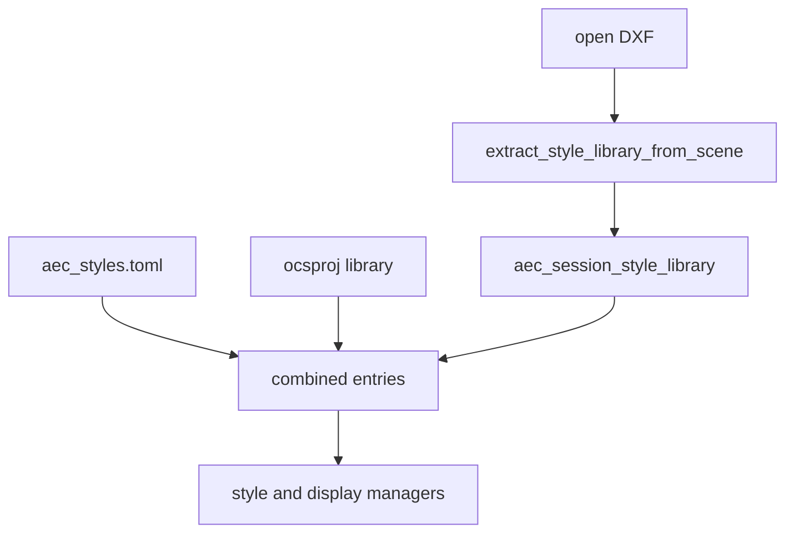

# Requirements

### Overview & Goals
Eine Zeichnung (z. B. `docs/examples/aec-wall-joins.dxf`) soll ohne aktives `.ocsproj` öffenbar bleiben, und die darin verwendeten Wandstile/Materialien sollen im Style- und Display-Manager sichtbar und bearbeitbar sein.

Gewählte Strategie: **Session-Library aus der Zeichnung**. Beim Öffnen fehlende Stile aus Wand-XDATA rekonstruieren; nicht automatisch ins Projekt oder in `aec_styles.toml` schreiben.

### Scope
**In Scope**
- Extraktion von Materialien und `WallStyle`s aus `OPENCAD_AEC` / `wall_from_entity` (`style_id` + `layers`).
- In-Memory-Session-Library auf `OpenCADStudio`, gemerged in `combined_*_entries`.
- Style-/Display-Manager ohne Pflichtprojekt, solange Session oder Standard-Library reicht.
- Edits bleiben in der Session, bis der Nutzer explizit ins Projekt oder in die Standard-Library speichert.

**Out of Scope**
- Automatisches Anlegen eines `.ocsproj`.
- IFC, Geschosse, Join-Geometrie.
- Volle DisplayConfig-Rekonstruktion aus der DXF (liegt nicht in XDATA); Display-Manager fällt auf `load_or_seed_display_config_library` zurück.

### Functional Requirements
- DXF öffnen ohne Projekt: Wände bleiben darstellbar; Manager listen rekonstruierte Stile (z. B. `style1` aus dem Join-Beispiel).
- IDs, die schon in Standard oder Projekt existieren, nicht überschreiben (`CopyConflict` / `IdenticalAlreadyPresent`).
- `aec_require_project` bleibt für Zeichenbefehle (`AEC_WALL` …); Manager und Properties dürfen Session+Standard nutzen.
- Session verwerfen beim Tab-Schließen / neuer Datei ohne Merge in globale Dateien.

# Technical Design

### Current Implementation
- Bibliotheken: `StyleLibrary` in `engine/library.rs`; `resolve_style_library` in `engine/project.rs` = Projekt wenn nicht leer, sonst `load_or_seed()` (`aec_styles.toml`).
- App: `aec_project_explorer_file` / `_path`; `aec_require_project` blockiert ohne Projekt (Modal `AecProjectRequired`).
- Wände speichern `style_id` plus vollständige `WallLayer`-Snapshots in XDATA (`wall_record` / `wall_from_entity` in `commands.rs`). Das Join-Beispiel nutzt `style1` und Schichten Putz/Mauerwerk/Dämmung — nicht die Seed-Library.
- `combined_material_entries` / `combined_wall_style_entries`: nur Project + Standard.

### Key Decisions
- **Session overlay, keine Auto-Persistenz** (Nutzerwahl): dritte Quelle `LibrarySource::Session` vor Standard, hinter einem geladenen Projekt.
- Rekonstruktion: ein `WallStyle` pro distinkter `style_id`; Schichten/Materialien aus dem ersten (oder konsistenten) Snapshot; fehlende Display-Profile bleiben Default des `WallStyle`.
- Manager ohne Projekt: `aec_require_project` nicht für Style/Material/Display-Manager; Speichern ohne Pfad bleibt Session-only (Hinweis in der Command Line).

### Proposed Changes
1. `extract_style_library_from_scene(scene) -> StyleLibrary` in `library.rs` oder `commands.rs`: alle Wände scannen, Materialien upserten, `WallStyle` aus Layern bauen.
2. Feld `aec_session_style_library: Option<StyleLibrary>` an `OpenCADStudio`; nach File-Open (`app/update/file.rs`) füllen, fehlende IDs mergen.
3. `combined_*_entries` um Session erweitern; Style-Manager liest Combined inkl. Session.
4. `aec_upsert_*` ohne Projekt: in Session schreiben, nicht `Err("no project loaded")`.

### Architecture Diagram

### File Structure
- **Modify** `engine/library.rs` (extract + `LibrarySource::Session` + combined lists)
- **Modify** `app/mod.rs` (session field), `app/update/file.rs` (on open), `app/update/mod.rs` (upsert/save/manager guards)
- **Tests** extract from example walls; combined list includes session without project; no write to default toml path

### Risks
- Mehrere Wände mit gleicher `style_id` aber unterschiedlichen Layern: erste gewinnt, weitere nur wenn identisch; sonst eigener synthetischer Style (`style1#2`).
- Display-Profile fehlen in XDATA: Darstellung editierbar nur soweit Seed-Configs + rekonstruierte Default-Slots reichen.

# Testing

### Validation Approach
Gezielte `--lib`-Tests für Extract, Combined-Listen und „kein Write nach default path“.

### Key Scenarios
- Szene wie Join-Beispiel (`style1`, 1/3/4 Schalen) → Session enthält Materialien Putz/Mauerwerk/Insulation und passende WallStyles.
- Standard-ID identisch → kein Duplikat.
- Manager-Listen ohne `ProjectFile` nicht leer, wenn Session gesetzt.

### Edge Cases
- Leere Zeichnung → Session `None`/leer, Standard bleibt.
- Tab-Wechsel: Session pro Dokument, nicht global über Tabs mischen.