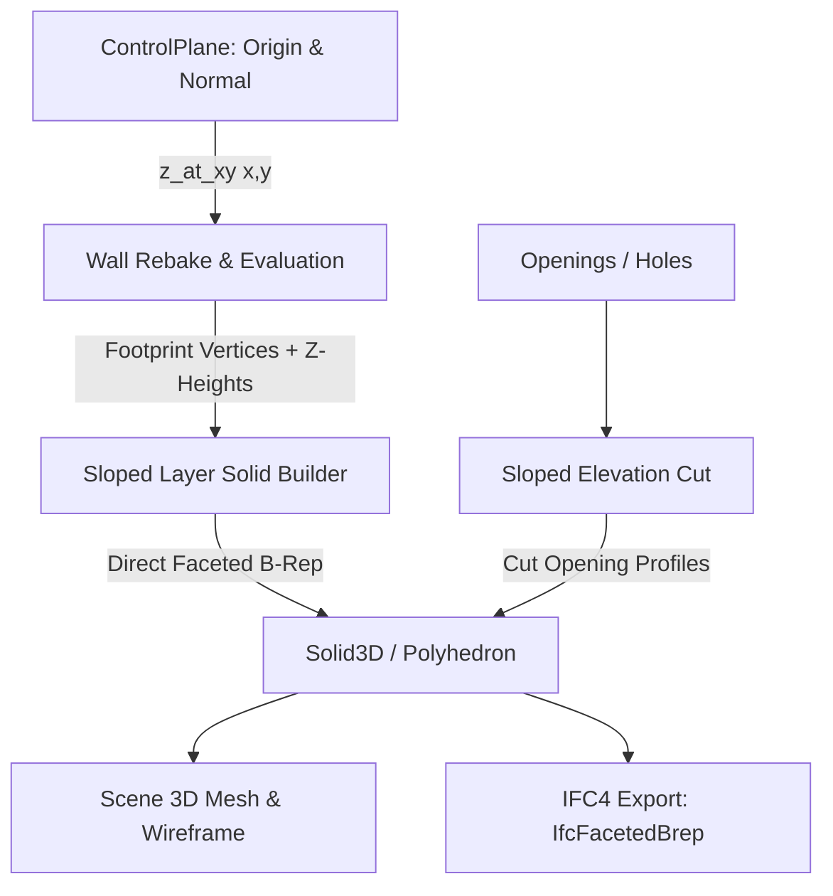

# Requirements

### Overview & Goals
Ziel dieses Vorhabens ist die Unterstützung **geneigter Wandoberkanten und Wandunterkanten** (z. B. für Giebelwände unter Satteldächern, Pultdachabschlüsse, Wände entlang von Treppenläufen/Rampen oder Attiken mit Gefälle) im AEC-Modul von OpenCADStudio. 

Wände sollen sich dynamisch an geneigte Bezugsebenen (`ControlPlane`) anbinden lassen, sodass sich ihre Höhe entlang der Wandachse kontinuierlich anpasst und bei Änderungen der Dachneigung oder Geschosshöhe automatisch mitregeneriert wird.

### Scope
- **In Scope:**
  - Mathematische Definition geneigter Bezugsebenen (`ControlPlane`) via Stützpunkt + Normale, Neigungswinkel/Gefälle oder 3 Raumpunkte.
  - Dynamische Höhenauswertung $Z(x, y)$ für Wandunter- und Wandoberkante inklusive schichtweiser Höhenversätze (`WallLayer.top_offset`, `WallLayer.bottom_offset`).
  - Schnelle, analytische 3D-B-Rep-Generierung (`Solid3D`) facettierter Wandprismen mit geneigten Deckel- und Bodenflächen ohne teure Boolesche Operationen.
  - Verschneidung von Wandöffnungen (Fenster, Türen, Durchbrüche) in geneigten Wandsegmenten.
  - UI-Integration im Geschoss-Manager (`StoreySettings`), im Eigenschaften-Panel sowie interaktiver Befehl `AEC_PLANE_3POINT` im Viewport.
  - 3D-Vorschau der geneigten Ebene auf `AEC_CONTROLPLANES`.
  - IFC-Export (`IfcFacetedBrep` / `IfcExtrudedAreaSolid` mit Clipping).

- **Out of Scope:**
  - Freiform-NURBS-Flächen oder unregelmäßige Geländemesh-Trimmungen (bleiben einem späteren Meilenstein für Dach-/Mesh-Körperverschneidungen vorbehalten).
  - Statische Lastabtragsberechnungen.

### User Stories
- **Als Architekt** möchte ich eine Bezugsebene für ein Pultdach oder Satteldach definieren, damit sich alle darunterliegenden Außen- und Innenwände automatisch an die Dachschräge anpassen.
- **Als Planer** möchte ich die Dachneigung im Geschoss-Dialog anpassen können und sehen, wie alle zugeordneten Giebelwände sofort in 2D und 3D aktualisiert werden.
- **Als Konstrukteur** möchte ich 3 Punkte an bestehenden Bauteilen im Viewport anklicken können, um daraus sekundenschnell eine geneigte Schnittebene zu erzeugen.

### Functional Requirements
1. **Ebenen-Definition:**
   - Jede `ControlPlane` speichert Stützpunkt `origin: [f64; 3]` und Einheitsnormale `normal: [f64; 3]`.
   - Berechnung der Z-Höhe an beliebiger $(x, y)$-Koordinate via $z(x, y) = z_0 - \frac{n_x (x - x_0) + n_y (y - y_0)}{n_z}$.
   - Schutz vor vertikalen Ebenen ($n_z \approx 0$).

2. **Wandanbindung & Regenerierung:**
   - Wände können `base_plane_id` und/oder `top_plane_id` auf eine geneigte Ebene setzen.
   - Die Wand-XDATA speichert den Bezug; bei Verschiebung oder Drehung der Wand wird die Geometrie stets exakt an den Koordinaten der Schichtpolygone ausgewertet.
   - Bei mehrschichtigen Wänden folgt jede Wandschicht der Neigung, unter Berücksichtigung individueller Schichtversätze.

3. **Öffnungen in geneigten Wänden:**
   - Öffnungen unterhalb der Schräge schneiden die Wand normal aus.
   - Bei Öffnungen, die nahe an die Schräge reichen, schneidet der Aufrissschnitt (`elevation_cut.rs`) die Restwandkörper passgenau trapezförmig zu.

4. **Interaktive Werkzeuge:**
   - Befehl `AEC_PLANE_3POINT`: Klick auf 3 Punkte im Raum erzeugt/aktualisiert eine Bezugsebene.
   - Eigenschaften-Panel: Anzeige der geneigten Ebenenbindung und des resultierenden Höhenintervalls.

# Technical Design

### Current Implementation
- `ControlPlane` in `src/modules/aec/engine/control_plane.rs` besitzt bereits Felder für `origin: [f64; 3]`, `normal: [f64; 3]` und die Funktion `z_at_xy(x, y)`.
- Wände (`Wall` in `src/modules/aec/engine/wall.rs`) besitzen `base_origin`, `base_normal`, `top_origin`, `top_normal` sowie `base_plane_id` und `top_plane_id`.
- Bisher wertet `Wall.rebake_lookup` die Höhe jedoch nur punktuell am Wandstart $(x_0, y_0)$ aus und erzeugt in `wall_regen.rs` vertikal extrudierte Prismen mit einheitlicher Höhe $h$.

### Key Decisions
1. **Analytischer B-Rep-Aufbau statt CSG-Booleans:**
   - Für jede Wandschicht wird das 2D-Grundrisspolygon $[(x_i, y_i)]$ genommen.
   - Für jeden Vertex $i$ wird $z_{\text{base}, i} = z_{\text{base}}(x_i, y_i)$ und $z_{\text{top}, i} = z_{\text{top}}(x_i, y_i)$ berechnet.
   - Bodenfläche, Deckfläche und seitliche Trapezflächen werden direkt als planar facettierter B-Rep-Volumenkörper (`cadkernel::brep::make::faceted_solid`) zusammengesetzt.
   - *Rationale:* Maximale Performance (keine teuren 3D-CSG-Schnittoperationen), exakte Kanten und perfekte Übereinstimmung mit dem neuen schnellen B-Rep-Generator.

2. **Handhabung von Wandöffnungen via trapezoidalem Aufriss:**
   - In `elevation_cut.rs` wird das 2D-Aufriss-Rechteck zu einem 2D-Trapezpolygon $[(0, z_{\text{base}, 0}), (W, z_{\text{base}, 1}), (W, z_{\text{top}, 1}), (0, z_{\text{top}, 0})]$ verallgemeinert.
   - Die Öffnungs-Ausschnitte werden aus diesem Trapez ausgestanzt und in 3D extrudiert.

3. **Ebenen-Verwaltung im Geschoss:**
   - Die UI in `aec_storey_settings.rs` unterstützt neben dem relativen Z-Offset auch Neigungswinkel/Azimut sowie die 3-Punkte-Definition.

### Architecture Diagram

### Components & Changes
- **`src/modules/aec/engine/control_plane.rs`:**
  - `ControlPlane::from_three_points(p1, p2, p3) -> Option<ControlPlane>`
  - `ControlPlane::from_slope(origin, pitch_deg, azimuth_rad) -> ControlPlane`
  - `ControlPlane::slope_degrees(&self) -> f64`
  - `ControlPlane::z_offset_at_xy(&self, x, y, offset) -> f64`
- **`src/modules/aec/engine/wall.rs`:**
  - `Wall::top_z_at_xy(&self, x, y) -> f64`
  - `Wall::base_z_at_xy(&self, x, y) -> f64`
  - `Wall::is_sloped(&self) -> bool`
  - Anpassung von `rebake_lookup` zur Übernahme der Ebenennormalen.
- **`src/modules/aec/engine/wall_regen.rs` & `representation.rs`:**
  - `build_sloped_layer_solid_3d(...)` für direkte facettierte B-Rep-Erzeugung.
  - Erweiterung der Kantenfilterung `filter_miter_deck_edges` für geneigte Normalen.
- **`src/modules/aec/engine/elevation_cut.rs`:**
  - Erweiterung auf linear veränderliche Deckel-/Bodenhöhen $z_{\text{top}}(s) = z_0 + k \cdot s$.
- **`src/modules/aec/ui/aec_storey_settings.rs` & `properties.rs`:**
  - Neigungsfelder im Geschoss-Dialog, Höhenintervallanzeige im Eigenschaften-Panel.
- **`src/modules/aec/project/control_planes.rs` & `spawn.rs`:**
  - Neuer Befehl `AEC_PLANE_3POINT`.

### File Structure
- `src/modules/aec/engine/control_plane.rs` (Erweitert)
- `src/modules/aec/engine/wall.rs` (Erweitert)
- `src/modules/aec/engine/wall_regen.rs` (Erweitert)
- `src/modules/aec/engine/elevation_cut.rs` (Erweitert)
- `src/modules/aec/project/control_planes.rs` (Erweitert um 3-Punkte-Tool)
- `src/modules/aec/ui/aec_storey_settings.rs` (Erweitert)
- `src/modules/aec/properties.rs` (Erweitert)
- `src/modules/aec/ifc/export.rs` (Erweitert)

### Risks & Mitigations
- *Fast vertikale Ebenen ($n_z \to 0$):* Division durch Null wird durch Epsilon-Check ($|n_z| < 10^{-6}$) abgefangen; Fallback auf Horizontalprojektion mit Warnmeldung.
- *Wand kreuzt Ebene (negative Höhe an einem Wandende):* Erkennung von $z_{\text{top}} \le z_{\text{base}}$; Kappen der Wand an der Schnittlinie oder Mindesthöhen-Schutz.
- *Performance bei Grundrissregenerierung:* 2D-Grundrisse projizieren nach wie vor direkt aus dem Wand-Footprint, wodurch keine teure 3D-Berechnung für 2D-Ansichten anfällt.

# Testing

### Validation Approach
Die Validierung erfolgt mehrstufig über mathematische Unit-Tests, geometrische B-Rep-Validierung (Topologie- und Volumentests) sowie Integrations- und UI-Tests.

### Key Scenarios
1. **Pultdach-Wand:**
   - Ebene mit 15° Neigung entlang der X-Achse.
   - 10 m lange Wand entlang der X-Achse; Start Z = 2.50 m, Ende Z = 5.18 m.
   - Verifikation: Wandkörper ist ein geschlossenes 3D-B-Rep-Prisma mit planaren Seitenflächen und stetiger Deckelkante.

2. **Giebelwand (Satteldach):**
   - Zwei gegenläufige Dachflächen, die sich am First schneiden.
   - Zwei Wandsegmente, die am First aufeinandertreffen (L-Join).
   - Verifikation: Wandstöße schließen im 3D-Modell bündig ohne Spalten oder Überstände ab.

3. **Mehrschichtige Wand mit Schichtversatz:**
   - Tragschicht und Dämmschicht mit unterschiedlichen `top_offset`-Werten unter geneigter Ebene.
   - Verifikation: Beide Schichten folgen der Dachschräge mit konstantem vertikalem/normalem Versatz.

4. **Wandöffnungen unter Dachschräge:**
   - Fenster und Türen in der geneigten Wand.
   - Verifikation: Ausschnitte sitzen auf der korrekten Z-Höhe; oberhalb des Sturzes schließt die Restwand exakt an die Schräge an.

5. **3-Punkte-Ebenen-Befehl (`AEC_PLANE_3POINT`):**
   - Auswahl von 3 Punkten im Raum.
   - Verifikation: Erzeugte `ControlPlane` besitzt den exakten Normalenvektor und die $Z$-Werte stimmen an allen 3 Punkten überein.

### Edge Cases
- **Wand orthogonal zur Neigungsrichtung:** Wand verläuft parallel zur Traufe (Höhe bleibt über die Länge konstant, aber Deckelfläche ist geneigt).
- **Steile Dachneigungen (> 60°):** Geometrische Stabilität der B-Rep-Trapeze und Schnittkanten.
- **Wandunterkante geneigt:** Rampe/Treppenlauf mit geneigter `base_plane`.
- **Ebenenänderung im laufenden Projekt:** Ändern der Neigung im Geschoss-Dialog stößt synchrone Regenerierung aller abhängigen Wände an.

# Delivery Steps

### ✓ Step 1: Ebenen-Mathematik und Wandhöhen-Auswertung
Erweiterung der mathematischen Hilfsfunktionen für geneigte `ControlPlane`-Ebenen und dynamische $Z$-Höhenauswertung entlang von Wandachsen.

- Hinzufügen von Konstruktionshilfen in `src/modules/aec/engine/control_plane.rs` (`from_three_points(p1, p2, p3)`, `from_slope(origin, pitch_degrees, azimuth_rad)`).
- Robuste Prüfung gegen entartete/vertikale Normalen ($n_z \approx 0$) mit aussagekräftigen Fallbacks.
- Erweiterung von `Wall` in `src/modules/aec/engine/wall.rs` um Methoden zur lokalen Höhenberechnung (`top_z_at_xy(x, y)`, `base_z_at_xy(x, y)`, `is_sloped()`).
- Anpassung von `rebake_planes` in `src/modules/aec/engine/wall.rs` und `src/modules/aec/project/wall_planes.rs`, um geneigte Normalen in die Wand-XDATA zu übertragen.
- Unit-Tests für Ebenenberechnung, 3-Punkte-Erzeugung und variable Wandhöhenauswertung.

### ✓ Step 2: 3D-B-Rep-Generierung geneigter Wandschichten
Direkte Konstruktion facettierter B-Rep-Volumenkörper für Wandschichten mit geneigter Deckel- oder Bodenfläche ohne CSG-Booleans.

- Implementierung von `build_sloped_layer_solid_3d` in `src/modules/aec/engine/wall_regen.rs` / `representation.rs`: Berechnung der 3D-Eckpunkte für Deck- und Bodenpolygon über `top_z_at_xy` und `base_z_at_xy`.
- Erzeugung planarer Boden-, Deckel- und Seiten-Trapezflächen als geschlossener 2-Manifold B-Rep via `cadkernel::brep::make::faceted_solid`.
- Berücksichtigung von Schichtversätzen (`layer.top_offset`, `layer.bottom_offset`) entlang der geneigten Normalen oder vertikal.
- Anpassung der 3D-Kantenfilterung (`filter_miter_deck_edges`), um Kantenartefakte auf geneigten Deckflächen zuverlässig zu unterdrücken.
- Geometrietests für Pultdach- und Giebelwände mit mehrschichtigem Aufbau.

### ✓ Step 3: Wandöffnungen & Brüstungen in geneigten Wänden
Anpassung der Wandöffnungsverschneidung und Höhenlagenberechnung für Fenster, Türen und Durchbrüche in geneigten Wänden.

- Anpassung von `cut_elevation` in `src/modules/aec/engine/elevation_cut.rs` zur Unterstützung trapezförmiger bzw. linear geneigter Wandansichtskonturen ($z_{\text{top}}(s) = z_0 + k \cdot s$).
- Zuverlässige Generierung der Restwandkörper über und unter Wandöffnungen in geneigten Wandabschnitten.
- Prüfung der Brüstungs- und Sturzhöhenbindung an geneigte Ebenen (`Opening.sill_plane_id`, `Opening.head_plane_id`).
- Integrationstests mit Wandöffnungen unter Dachschrägen und Giebelspitzen.

### ✓ Step 4: UI-Integration & interaktive Ebenendefinition
Erweiterung des Dialogs für Geschosseinstellungen und Bereitstellung interaktiver Befehle zum Festlegen geneigter Bezugsebenen.

- Erweiterung des Geschoss-Einstellungsdialogs `src/modules/aec/ui/aec_storey_settings.rs` um Neigungsparameter (Neigungswinkel in Grad/Prozent, Richtung oder Neigungsmodus).
- Implementierung des Befehls `AEC_PLANE_3POINT` zum interaktiven Picken von 3 Punkten im Viewport (z. B. First- und Traufpunkte).
- Erweiterung des Eigenschaften-Panels (`src/modules/aec/properties.rs`), um bei geneigten Wänden die verknüpfte Neigungsebene und den resultierenden Höhenbereich ($h_{\min} - h_{\max}$) anzuzeigen.
- Aktualisierung der 3D-Vorschaukörper auf dem Layer `AEC_CONTROLPLANES` für geneigte Orientierungen.

### ✓ Step 5: IFC-Export, Referenzbeispiele & Gesamttests
Sicherstellung des IFC-Exports für geneigte Wände und Aufbau einer DXF-Beispielszene mit Giebel- und Pultdachwänden.

- Anpassung von `src/modules/aec/ifc/export.rs` zur sauberen Übergabe facettierter B-Rep-Volumenkörper (`IfcFacetedBrep` / `IfcBooleanClippingResult`) an die IFC-Pipeline.
- Erstellung einer Referenzzeichnung `docs/examples/aec-sloped-walls.dxf` mit Pultdach, Satteldach-Giebelwand und Dachfenstern/Öffnungen.
- Durchführung von Regressions- und Performancetests für die gesamte AEC-Testsuite.