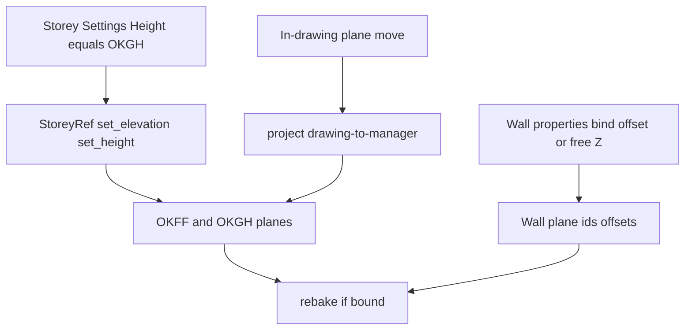

# Status (Stand)

**Umgesetzt** (Code + Unit-Tests grün). Keine offenen Delivery-Steps.

- Elevation = Translation aller Kontrollflächen um ΔZ; Height = Gesamt-Geschosshöhe OKFF→OKGH (Floor unverändert).
- Default-Top-Name `*_OKGH`; optionales `ProjectFile.ffl0_nn_m`.
- Preview: SW-Ecke (−5 m, −5 m), 50×50 m in +X/+Y (bis 45/45); Name-Attribut + Properties.
- Drawing-Z-Move → Projekt-/Kontrollflächenmanager.
- Wände: Plane-Bindung mit ±Offset oder ungebunden (Basis-Z + Höhe); Rebake nur bei voller Bindung.
- Explorer: vertikale Lage + Geschosshöhe (i18n, nicht zweimal „Höhe“).
- Hatch-Phase WCS (0,0) im AEC-Pfad; GPU-Ring-Packing unverändert.

**Follow-up erledigt:** Preview-Basisvektoren für horizontale Ebenen auf +X/+Y (nicht Kreuzprodukt nach −X/−Y).

**Nicht im Scope / bewusst offen:** Höhenkoten-Zeichnung, Pflicht-UKRD, AEC-Logik in Core.

**Tests zuletzt:** `cargo test --offline --lib` zu elevation/height/OKGH/NN, preview SW 50×50, drawing-sync, wall offset/unbind, hatch WCS-0 — bestanden. Unrelated Warnings (`properties.rs` unused `i`, unused `wall_layer`).

# Requirements

### Overview & Goals
Geschoss-Einstellungen steuern **vertikale Lage** und **Gesamt-Geschosshöhe** (Geschoss zu Geschoss, nicht UKRD). Wände können optional an Kontrollflächen (Basis/Kopf) mit vertikalem Offset gebunden werden oder frei Z + Höhe nutzen. Wandschraffuren an WCS `(0,0)`; Liste, Plane-Namen, Default-Größe und Drawing→Manager-Sync wie zuvor.

### Scope
#### In Scope
- Elevation = Translation aller Geschoss-Planes um ΔZ; Height bleibt.
- Height = **Gesamt-Geschosshöhe**: Abstand Floor-OKFF zur **Geschoss-Oberkante** (Default-Top-Plane, nicht Unterkante Rohdecke).
- Wände: Bindung `base_plane_id` / `top_plane_id` wählbar; `base_offset` / `top_offset` (±); Bindung abschaltbar → direkte Basis-Z und Höhe.
- Nach Storey-Z: Caches, Previews, gebundene Wände rebaken.
- Hatch-Phase WCS 0 (AEC-Workaround).
- Geschossliste: Lage + Gesamt-Höhe; i18n ohne doppeltes „Höhe“.
- Plane-Name in Zeichnung + Properties; Default (−5,−5), 50×50 m; Drawing-Move sync.
- Optional: Projekt-NN-Höhe FFB0/EG.

#### Out of Scope
- Automatische Plattendicke / extra UKRD-Plane als Pflicht.
- Geneigte Sweep-Höhe entlang der Achse.
- Manueller Schraffur-Ursprung pro Wand.
- AEC-Logik in Core (`src/app/**`); `commands.rs` / `update.rs` nicht aufblasen.
- Höhenkoten-Zeichnung / Plan-Ausgabe (nur Datenfeld jetzt).

### Functional Requirements
- Elevation: alle `control_planes` um ΔZ.
- Height `> 0`: nur die **Top-/Geschossoberkante**-Plane (heute `ceiling_plane_id`) auf Floor-Z + Height; Floor bleibt. Semantik: Gesamt-Geschosshöhe, nicht lichte Höhe bis UKRD.
- Default-Namen: Floor `*_OKFF`; Top `*_OKGH` (Oberkante Geschoss) statt `*_UKRD`.
- Wand gebunden: Höhe aus `resolve_wall_height` + Offsets; rebake bei Plane-/Storey-Änderung.
- Wand ungebunden (`None`/`None`): `base_origin[2]` und `height` editierbar; `rebake_planes` no-op.
- Offsets in Properties; Plane-Auswahl per Name/ID aus dem Geschoss.
- Liste, Labels, Preview-Name, Default-Größe, Drawing-Sync wie Scope.
- **Projekt:** optionale absolute Höhe der Fertigfußboden-Ebene 0 / EG über NN (Meter); später für Pläne/Höhenkoten.
- Kontrollflächen-**Bezeichnung** in der Zeichnung (Attribut/XData) **und** im Eigenschaften-Panel.

# Technical Design

### Current Implementation
- `StoreyRef.height` = Ceiling-Z − Floor-Z; Default-Ceiling heißt `*_UKRD` (`default_floor_ceiling` in `control_plane.rs`).
- `Wall` hat bereits `base_plane_id`, `top_plane_id`, `base_offset`, `top_offset`; `bind_storey_planes` setzt Floor/Ceiling; `rebake_planes` bricht ab wenn eine ID fehlt.
- Properties zeigen Plane-UUIDs, keine Offsets, kein Unbind, keine freie Z.
- Elevation-Handler setzt nur Floor-Z; Hatch phast am Ring-Start.

### Key Decisions
- Storey-Height = Floor-OKFF → Top-OKGH (floor-to-floor). UKRD ist keine Pflicht-Semantik von Height.
- Projekt-NN: optionales `Option<f64>` an `ProjectFile` (serde default `None`); WCS-Z=0 der EG-OKFF entspricht diesem NN-Wert. Keine automatische Umrechnung der Storey-Z (bleiben relativ).
- Wand: bestehende Felder nutzen; UI/Properties und Unbind-Pfad nachziehen.
- Hatch-Phase in AEC; Shader nur Fallback.
- Neue Dateien unter `project/` / `properties.rs`; `update.rs` nur Dispatch.
- Plane-Name: AEC-Attribut auf Preview-Entity; Properties-Merge in `aec::properties::extend` (kein Core-Feld).

### Proposed Changes
**Geschoss Z + Semantik**
- `set_elevation` / `set_height` an `StoreyRef`.
- `default_floor_ceiling`: Top-Name `*_OKGH`; Height verschiebt nur diese Plane.
- Labels: „Vertikale Lage“ / „Geschosshöhe“ (Gesamt).

**Wand-Bezug**
- Properties (`aec::properties::extend`): Basis-/Kopf-Plane (Namen aus Storey, „(none)“ = ungebunden), Offset-Felder, bei Unbind: Basis-Z + Höhe.
- Messages + Handler in AEC (eigene Datei z. B. `project/wall_planes.rs` oder Properties-Modul), nicht Core-App.
- `rebake_planes`: wenn beide IDs gesetzt → Höhe aus Planes+Offsets; sonst Snapshot/freie Werte behalten.
- Nach Storey-Z: nur Wände mit passenden Plane-IDs rebaken.

**Liste, Planes, Hatch, Sync, Projekt-NN**
- Explorer, Preview-Name, −5/−5 50×50, drawing→manager, Hatch-Phase WCS 0.
- `ProjectFile`: z. B. `ffl0_nn_m: Option<f64>` (`#[serde(default)]`); Eingabe im Projekt-Explorer/Header, i18n.
- Control-Plane-Preview: Name als Entity-Attribut; Eigenschaften-Panel zeigt denselben Namen (editierbar → Storey-Plane-Name sync).

### Architecture Diagram

### File Structure
- `engine/project.rs`, `engine/control_plane.rs` — Height-Semantik, Defaults, Helpers, `ffl0_nn_m`
- `engine/wall.rs` — Unbind / rebake-Verhalten
- `project/` — preview, rebake-hook, drawing-sync, ggf. wall-plane apply
- `properties.rs` + `message.rs` — Plane/Offset/freie Z
- `ui/aec_storey_settings.rs`, `aec_project_explorer.rs`, `locales/`
- Hatch-Phase im AEC-Regen-Pfad
- `update.rs` — nur Dispatch

### Risks
- Bestehende Projekte mit `*_UKRD` als Ceiling: Migration = gleiche ID, neuer Name optional; Height-Zahl bleibt Floor-to-Top.
- Extra-Planes mit Elevation mitverschieben: gewollt.

# Testing

### Validation Approach
Unit-Tests in AEC-Dateien (`#[cfg(test)]`).

### Key Scenarios
- Elevation 0→3 bei Height 3: Floor 3, Top 6, Height 3.
- Height 3→4: Floor unverändert, Top = Floor+4 (OKGH).
- Default-Top-Name nicht UKRD.
- Gebundene Wand: Offset ändert `resolve_wall_height`; Unbind: Height/Z bleiben bei Plane-Move.
- Liste Lage+Höhe; Default-Plane (−5,−5) 50×50; Drawing-Z sync; Hatch-Phase WCS 0.
- Plane-Name im Properties-Panel; optionales NN-Feld persistiert in `.ocsproj`.

### Edge Cases
- Height ≤ 0: Geometrie unverändert.
- Eine Plane gebunden, andere nicht: wie ungebunden (keine halbe Bindung).
- Geschoss ohne Floor/Top: no-op.

# Delivery Steps

### ✓ Step 1: Storey elevation translation and floor-to-floor height
Elevation verschiebt alle Planes um ΔZ; Height setzt nur OKGH; Semantik Gesamt-Geschosshöhe.

- `set_elevation` / `set_height` an `StoreyRef`.
- Default-Top-Name `*_OKGH` statt `*_UKRD`.
- Elevation-Handler auf Translation; Height Ceiling/Top-only.
- Tests: Lage ändert Height nicht; Default-Name nicht UKRD.

### ✓ Step 2: Rebake walls and previews after storey Z; drawing sync; plane names; project NN
Previews und gebundene Wände folgen Plane-Z; Drawing-Move aktualisiert den Manager; Plane-Name sichtbar; optionales NN.

- Preview-Regen und `rebake_planes` nur für gebundene Wände (`project/`).
- Default-Plane (−5,−5), 50×50 m.
- Plane-Name auf Preview-Entity (AEC-Attribut) **und** im Eigenschaften-Panel (`aec::properties::extend`).
- Drawing→Manager-Sync eigene Datei unter `project/`.
- `ProjectFile.ffl0_nn_m: Option<f64>` + Explorer-Eingabe (optional, Meter über NN).

### ✓ Step 3: Wall plane bind, offsets, or free Z/height
Wände optional an Planes mit ±Offset oder ungebunden mit Basis-Z und Höhe.

- Properties: Plane-Namen, Unbind, Offsets, freie Z/Höhe.
- AEC-Messages/Handler (nicht Core); `rebake` nur bei voller Bindung.
- Tests: Offset ändert Höhe; Unbind ignoriert Plane-Move.

### ✓ Step 4: Explorer labels, hatch phase WCS 0
Liste zeigt Lage und Geschosshöhe; Schraffur fluchtet global.

- Explorer-Zeilen + i18n (keine doppelte „Höhe“).
- Hatch-Phase WCS 0 in AEC; `pack_wall_ring` unverändert.