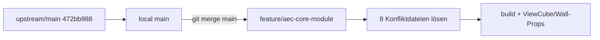

# Empfehlung

### Overview & Goals

`feature/aec-core-module` soll die aktuellen Änderungen von **upstream `main`** (`472bb988`, Plot/Constraint-PRs) bekommen, ohne die AEC-Historie neu zu schreiben.

**Empfehlung: Merge `main` in den Feature-Branch — kein Rebase.**

### Warum Merge, nicht Rebase

- Der Branch hat bereits mehrere `Merge remote-tracking branch 'upstream/main'`-Commits (`9cc18d22`, `52f523b8`, `1c157a46`). Ein Rebase müsste ~73 First-Parent-Commits plus Merge-Commits neu aufsetzen — das erzeugt oft doppelte Konflikte und zerstört die bereits gelösten Merge-Fixes (`595214b9`, `9b534260`).
- `main` und Feature sind **nicht linear verwandt**: 92 Commits nur auf `main`, 73 First-Parent nur auf Feature. Merge-Base: `10577904`.
- Nach dem letzten Main-Merge waren ViewCube und Wand-Eigenschaften kaputt — genau diese Fixes würden bei einem Rebase erneut anfallen, oft schlimmer.

### Aktueller Stand

| | |
|---|---|
| Checkout jetzt | `main` @ `472bb988` (upstream-aktuell) |
| Feature | `feature/aec-core-module` @ `9b534260` |
| `origin` | Fork `thkuhn/OpenCADStudio` — `origin/main` ist **alt** (`2d2ea976` / v0.9.6). Quelle der Wahrheit: **`upstream/main`**. |
| Stash | `stash@{0}: local-idea-and-plan` — `.idea` / Plan-Recap, nicht mergen |
| Untracked | Logs, AppImage, `AppDir/`, lokales `.idea/` — nicht committen |

### Vorhersehbare Konflikte (Dry-Run `git merge-tree`)

Inhaltliche Konflikte in **8 Dateien**:

- `src/app/commands/draw.rs`
- `src/app/mod.rs`
- `src/app/update/command.rs`
- `src/app/update/mod.rs`
- `src/app/update/viewport.rs`
- `src/app/view/mod.rs`
- `src/app/view/overlay.rs`
- `src/scene/pick/selection_state.rs`

Viele andere Dateien mergen automatisch (`command_driver.rs`, Locales, `Cargo.lock`, …) — trotzdem nach dem Merge bauen, weil Auto-Merge semantisch falsch sein kann (wie zuletzt beim Properties/ViewCube-Merge).

### Scope

**In Scope:** Feature-Branch auschecken, `upstream/main` (bzw. lokales aktuelles `main`) mergen, die 8 Konflikte lösen, bauen, die bekannten AEC-Regressions (ViewCube, Wandstil-Picker, verbundene Wände) prüfen.

**Out of Scope:** Rebase; Force-Push; `origin/main` des Forks als Quelle; AppImage/Logs/`.idea` committen.

# Vorgehen

### Ablauf

1. **Arbeitsbaum sauber halten** — Untracked Logs/AppImage ignorieren; Stash nicht poppen während des Merges.
2. `git checkout feature/aec-core-module`
3. `git fetch upstream` (zur Sicherheit) und **`git merge main`** (lokales `main` ist bereits `472bb988` = aktuelles upstream). Alternativ gleichwertig: `git merge upstream/main`.
4. Die 8 Konfliktdateien **manuell** lösen — nicht pauschal ours/theirs:
   - **AEC behalten:** Wall-Package-Picking, Selection-Cache, Style-Picker/EntityRef, ViewCube-Draw-Bedingung, Hatch `pattern_origin`, Command-Driver-AEC-Pfade.
   - **Main behalten:** Plot-Settings, Constraint-Bar, Dimension-Layout, neue Update-Hooks aus den 92 Main-Commits.
   - Bei Überlappung (typisch `app/mod.rs`, `update/mod.rs`, `view/mod.rs`): beide Seiten kombinieren.
5. `cargo build`, dann `cargo run`; gezielt: ViewCube, Wandstil im Eigenschaften-Panel, verbundene Wände.
6. Ein Merge-Commit auf dem Feature-Branch; **kein** Force-Push.

### Konflikte vermeiden / entschärfen

- Konflikte **vollständig vermeiden** geht nicht — dieselben Hotspots (`app`, `update`, `view`) ändern beide Seiten.
- **Nicht** rebase: würde dieselben 8 Dateien **pro Commit** erneut konflikten.
- Nach dem Merge dieselben Stellen prüfen, die zuletzt kaputtgingen (`extend_entity_sections`, Picker/EntityRef-UI, ViewCube `surface_dest`-Check).
- `Cargo.lock` nach erfolgreichem Compile mitcommitten, nicht von Hand zusammenflicken wenn `cargo build` ihn neu schreibt.

### Architektur (Datenfluss des Syncs)

# Delivery Steps

### ✓ Step 1: Feature-Branch auschecken und main mergen
feature/aec-core-module enthält einen Merge von aktuellem main; Konflikte sind uncommitted markiert.

- Stash und Untracked (Logs, AppImage, `.idea`) unangetastet lassen.
- `git checkout feature/aec-core-module`
- `git fetch upstream` und `git merge main` (kein Rebase).
- Merge nicht mit `-X ours/theirs` automatisieren.

### ✓ Step 2: Die acht Konfliktdateien inhaltlich lösen
Alle `<<<<<<<`-Marker sind weg; AEC-Verhalten und Main-Features sind kombiniert.

- Dateien: `draw.rs`, `app/mod.rs`, `update/command.rs`, `update/mod.rs`, `update/viewport.rs`, `view/mod.rs`, `view/overlay.rs`, `selection_state.rs`.
- AEC: Wall-Picking, Selection-Cache, Properties-Picker/Joins, ViewCube, Command-Driver-AEC.
- Main: Plot, Constraint-Bar, Dimension-Layout und neue Update-Pfade behalten.
- `cargo build` bis grün; `Cargo.lock` nur wenn Build ihn ändert.

### ✓ Step 3: Regressions prüfen und Merge committen
App läuft; ViewCube und Wand-Eigenschaften sind intakt; Merge-Commit ist auf dem Feature-Branch.

- `cargo run`.
- Prüfen: 3D-ViewCube, Wandstil-ändern im Panel, verbundene Wände.
- Merge-Commit erstellen, kein Force-Push; Logs/AppImage/`.idea` nicht committen.