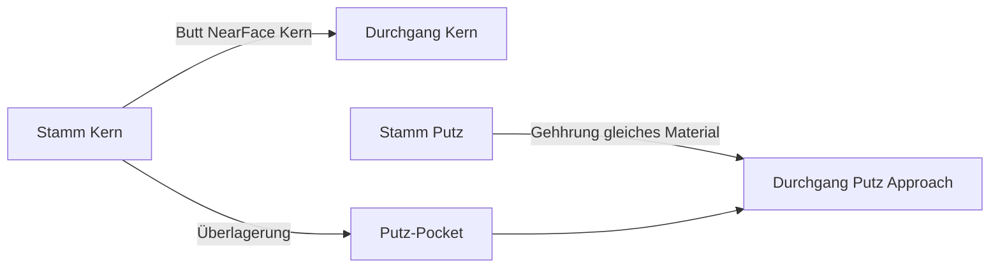

# Requirements

### Overview & Goals
Mehrschaliger **T-Stoß ohne Overrides** soll baulich korrekt wirken: Tragwerk berührt Tragwerk, Putz der Durchgangswand wird dort unterbrochen, gleichartige Putzschichten laufen auf **Gehhrung** zusammen — ohne Trennlinie bei gleichem Material.

Das widerspricht der letzten Änderung (alle Stamm-Schichten auf der **Außenkante** der Durchgangswand, kein Pocket).

### Scope
**In Scope**
- Automatischer T-Stoß (kein Junction-Override)
- Stamm-Schicht mit Funktion **Structural/Tragwerk** verlängert bis zur Structural-Schicht der Durchgangswand (Kern-Paarung primär über `function`)
- Gleicher Materialname an diesem Stoß: **keine Trennlinie** (Kanten zusammenfallen / nicht doppelt zeichnen)
- Überlagerung Stamm-Kern × Durchgangs-Putz: **Putz der Durchgangswand unterbrechen** (Ausschnitt)
- Putz links/rechts am Stamm + Putz der Durchgangswand (gleiches Material): **Gehhrung**, keine Trennlinie

**Out of Scope**
- Manuelle Overrides (NearFace/FarFace/Miter/Butt je Schicht) — bleiben wie bisher
- L-Ecken und N-Wege
- Persistente Geschosse, Öffnungen

### Functional Requirements
- **Kern-Paarung:** Schicht mit Funktion **Structural** / Tragwerk. Mehrere Structural: Material-Match unter diesen; sonst dickste Structural. Ohne Structural: dickste Schicht.
- Stamm-Kern endet an der **Nahkante des Durchgangs-Kerns**, nicht an der äußeren Putzkante.
- Durchgangs-Putz auf der Approach-Seite erhält ein C-/U-Pocket in Breite des Stamm-Kerns (nicht der vollen Stamm-Hülle, wenn Putz am Stamm selbst mitgehhrt).
- Stamm-Putz und Durchgangs-Putz gleicher Material-Id: diagonale Gehhrung an der Approach-Außenecke, gemeinsame Kante nicht als zweite Kontur.

# Technical Design

### Current Implementation
In `src/modules/aec/engine/miter.rs`:
- `t_junction_layer_footprints` stutzt **jede** Stamm-Schicht auf `through_outer_near_face_line` (eine Endkappe).
- `through_wall_cutout_footprints` gibt immer `None` (kein Pocket).
- `match_layer_indices` existiert weiter (Material + Offset) und wird für T nicht mehr genutzt.
- Overrides in `mitered_layer_footprints` / Junction-Solver bleiben.

`junction_solver.rs` erwartet aktuell rechteckige Durchgangswand-Footprints.

### Key Decisions
1. **Kern-Paarung über `function` Structural/Tragwerk** (nicht Offset). Mehrere Structural: Material-Match unter diesen; sonst dickste Structural. Kein Structural: dickste Schicht.
2. **Nicht** jede Schicht auf ihre eigene Near-Face durch die ganze Wand (Tunnel-Bug der Finish-Schicht).
3. **Zwei Regeln je Stamm-Schicht:**
   - Structural/Kern → Butt auf Near-Face der **gematchten Structural**-Schicht der Durchgangswand.
   - Finish/Putz (gleiches Material wie Durchgangs-Putz auf Approach-Seite) → **Gehhrung** mit dieser Putzschicht, endet an der äußeren Approach-Kante, **nicht** durch den Kern.
4. **Pocket nur in Durchgangs-Schichten, die der Stamm-Kern überdeckt** (typisch Approach-Putz), nicht in jeder Schale C-förmig.
5. Gleiches Material: gemeinsame Kante unterdrücken (bereits vorhandene Coincident-Edge-/Display-Logik nutzen, falls vorhanden; sonst Footprints so legen, dass Kanten deckungsgleich sind).

### Proposed Changes
- `t_junction_layer_footprints`: Structural-Schichten beider Wände finden; Butt auf `near_face_line` der Partner-Structural-Schicht. Finish → Miter-Clip gegen Approach-Putz. `match_layer_indices` nur Fallback unter mehreren Structural-Schichten.
- Unmatched Finish auf der Stamm-Rückseite: bis Approach-Außen **oder** bis Kern — Default: bis Gehhrung nur der Approach-Putz; rückseitiger Putz stutzt am Stamm-Ende vor der Durchgangswand (nicht durchtunneln).
- `through_wall_cutout_footprints`: Pocket **nur** für Durchgangs-Schichten, deren Band vom Stamm-Kern überdeckt wird (Approach-Putz). Kern der Durchgangswand bleibt Rechteck. Gegenseiten-Putz unangetastet.
- Tests in `miter.rs` / `junction_solver.rs` auf das neue Soll umstellen (Umkehr der letzten Test-Änderungen).

### File Structure
- `src/modules/aec/engine/miter.rs` — Kernlogik + Unit-Tests
- `src/modules/aec/engine/junction_solver.rs` — Erwartung Durchgangs-Pocket
- Fixture `docs/examples/aec-wall-joins.dxf` nur visuell prüfen, nicht umbauen

# Delivery Steps

### ✓ Step 1: Stamm-Kern bis Durchgangs-Kern
Automatischer T: Structural-Schichten stoßen aufeinander, Finish tunnelt nicht mehr zur Gegenseite.

- Structural-Schichten per `function` (Tragwerk/Structural) paaren; Fallback Material-Match bzw. dickste Schicht.
- Gematchte Structural-Schicht: Butt auf `near_face_line` der Partner-Schicht (nicht `through_outer_near_face_line`).
- Finish-Schichten nicht mehr alle auf die äußere Durchgangskante ziehen.
- Tests `t_corner_multi_layer_*` an Kern-Near-Face anpassen.

### ✓ Step 2: Putz-Pocket und Gehhrung
Durchgangs-Putz wird vom Stamm-Kern ausgeschnitten; gleichartiger Putz läuft auf Gehhrung ohne Trennlinie.

- `through_wall_cutout_footprints` nur für überdeckte Finish-Schichten der Durchgangswand (Approach), Kern bleibt Rechteck.
- Stamm-Putz + Durchgangs-Putz gleiches Material: diagonale Gehhrung an der Approach-Außenecke.
- `junction_solver`-Test: Approach-Putz hat Cutout, Durchgangs-Kern nicht.
- Bestehende Override-Tests (NearFace/OuterFace) unverändert lassen, wo sie nicht am Automatic-T hängen.