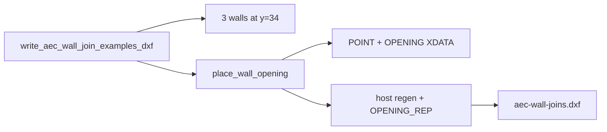

# Requirements

### Overview & Goals

Die bestehende Beispielzeichnung `docs/examples/aec-wall-joins.dxf` zeigt bisher nur Wandstöße (L, T, N-Wege, Schicht-Overrides). Sie soll um **Fenster, Tür und Durchbruch** ergänzt werden, damit man die fertigen Öffnungen ohne interaktives Platzieren öffnen und prüfen kann.

Quelle bleibt der Generator-Test `write_aec_wall_join_examples_dxf` in `src/modules/aec/engine/wall_command_tests.rs`. Die Join-Cluster bleiben unverändert; Öffnungen kommen als **neue Zeile** darunter.

### Scope

#### In Scope
- Dieselbe Datei `docs/examples/aec-wall-joins.dxf` (keine zweite Beispiel-DXF).
- Drei Seed-Kinds: `Window`, `Door`, `Breakthrough` über `place_wall_opening` und `seed_default_library`.
- Host-Cut, `OPENING_REP`-Symbole und 3D-Leibung entstehen über die bestehende Regen-Pipeline.
- Deutsche MText-Notizen im gleichen Stil wie die Join-Beispiele.
- Leichte Assertions im Writer-Test (drei Öffnungen, richtige Kinds, Host-Kinder).

#### Out of Scope
- Kreis-/Dreieck-/Rundbogen-Formen in der Beispielzeichnung.
- Skizzen-Slots, Kontrollebenen, Geschosse, Anschlag-Spiegel als Extra-Varianten.
- Neue Commands, UI oder Änderungen an der Öffnungs-Engine.
- Session-Library-Rekonstruktion von Opening-Stilen (Seed-Standard reicht beim Öffnen; Geometrie liegt schon in der DXF).

### User Stories

- Als Entwickler öffne ich `docs/examples/aec-wall-joins.dxf` und sehe neben den Stößen ein Fenster (Zarge/Flügel/Bank), eine Tür (Anschlagbogen) und einen Durchbruch (Kreuz).
- Als Reviewer lese ich an den Notizen Kind, Stil-Id und Defaultmaße ab, ohne selbst `AEC_WINDOW` auszuführen.

### Functional Requirements

- Neue Zeile unter den N-Wege-Beispielen (Achse bei `y = 34`), Join-Cluster bei `y = 0 / 10 / 22` bleiben.
- Drei separate 6 m-Wände analog zur L-Zeile (`x = 0 / 10 / 20`):
  - Fenster auf einschaliger Wand, Seed `style_window_standard` (1.2 × 1.2, Brüstung 0.9).
  - Tür auf einschaliger Wand, Seed `style_door_standard` (0.9 × 2.1, Brüstung 0.0, Anschlag links).
  - Durchbruch auf einschaliger Wand, Seed `style_breakthrough_standard` (1.0 × 2.0, Brüstung 0.1, `Mark2D` = Kreuz).
- Platzierung in Wandmitte über Weltpunkt → `place_wall_opening` (projiziert auf die Achse).
- Notizen wie bisher per `add_example_note` (`\P`-Zeilen: Kind, Stil, Maße).
- Writer schreibt die Datei wie heute; Test prüft Existenz plus die drei Kinds.

### Non-Functional Requirements

- Keine neuen AEC-Engine-Dateien. Nur der Generator-Test und die ausgecheckte DXF ändern sich.
- Fachlogik bleibt in `src/modules/aec/**`; der Writer bleibt ein `#[test]` neben den Join-Helfern.

# Technical Design

### Current Implementation

- Generator: `write_aec_wall_join_examples_dxf` in `src/modules/aec/engine/wall_command_tests.rs` (ab ~6063). Baut L/T/N-Wege plus Overrides, schreibt `docs/examples/aec-wall-joins.dxf` via `DxfWriter`, asserted nur `out.exists()`.
- Helfer: `add_single_layer_wall`, `add_layered_wall`, `add_example_note` (MText, Höhe 0.28).
- Layout heute: L bei `y = 0` (`x = 0/10/20`), T bei `y = 10`, N-Wege/Overrides bei `y = 22`.
- Platzierung: `place_wall_opening` in `engine/opening_xdata.rs` erzeugt `POINT` + `OPENING`-XDATA, hängt das Kind an die Wand, regeniert Host (Cut + 3D-Zone) und `OPENING_REP`.
- Seed-Stile: `seed_default_library()` → `opening_style_for_kind` (`style_window_standard` / `style_door_standard` / `style_breakthrough_standard`).

### Key Decisions

1. **Dieselbe DXF, neue Zeile** — der User meinte die bestehende Beispielzeichnung, keine zweite Datei.
2. **Drei einzelne 6 m-Wände** statt einer dichten Fassade, analog zur L-Zeile, damit Notizen und Symbole nicht überlappen.
3. **Nur Seed-Rechtecke, ungebunden** — `place_wall_opening` + Library-Defaults; keine Form-Overrides, keine Kontrollebenen.
4. **Keine Engine-Änderung** — Display, Cut und Solids kommen aus der vorhandenen Regen.

### Proposed Changes

- In `write_aec_wall_join_examples_dxf` nach den Join-Clustern drei einschalige Wände bei `y = 34`:
  - `(0,34)–(6,34)` Fenster, Klick `(3,34)`
  - `(10,34)–(16,34)` Tür, Klick `(13,34)`
  - `(20,34)–(26,34)` Durchbruch, Klick `(23,34)`
- Kleiner Helfer `place_example_opening(scene, wall, pt, kind, &lib)` um `place_wall_opening(..., Some(&lib), None, None)`.
- `add_example_note` unter jeder Wand (`y ≈ 32.6`), gleicher `\P`-Stil wie die Stöße.
- Writer-Assertions: Datei existiert; in der Scene gibt es je ein Opening der drei Kinds; jedes hat `owner_index` auf seine Wand; Display-Kinder (`OPENING_REP`) sind vorhanden.
- Test ausführen, damit `docs/examples/aec-wall-joins.dxf` neu geschrieben wird.

### Components

- **Bestehend, erweitert:** `wall_command_tests.rs` (`write_aec_wall_join_examples_dxf`).
- **Unverändert genutzt:** `opening_xdata::place_wall_opening`, `library::seed_default_library`, `add_single_layer_wall`, `add_example_note`.
- **Artefakt:** `docs/examples/aec-wall-joins.dxf`.

### File Structure

```
src/modules/aec/engine/wall_command_tests.rs   # Generator erweitern
docs/examples/aec-wall-joins.dxf               # neu schreiben
```

### Architecture Diagram



### Risks

- **Join-Cluster verrutschen nicht**, solange nur `y = 34` genutzt wird.
- **DXF-Diff groß**, weil Handles/Reihenfolge sich ändern — akzeptabel, eine Datei.
- **Ohne `.ocsproj`:** Symbole liegen als Entities in der DXF; fehlende Session-Opening-Styles fallen auf Seed/Kind-Defaults, Cut bleibt.

# Testing

### Validation Approach

Der Writer-Test selbst ist die Prüfung. Keine UI-Tests. Keine Engine-Regression über den bestehenden `opening_`-Filter hinaus nötig, außer der Writer läuft grün.

### Key Scenarios

- Nach `place_wall_opening` hat die Fenster-Wand einen 2D-Cut und Frame/Leaf/Sill-Kinder.
- Die Tür-Wand hat Frame/Leaf/Swing; der Durchbruch hat `Mark2D` (Kreuz), keine Swing/Frame-Kinder.
- DXF existiert; Reload der geschriebenen Entities (in-memory Document reicht) findet drei `OPENING`-Records.

### Edge Cases

- Öffnung sitzt auf der Achse (Mitte 3 m bei 6 m-Wand), nicht über dem Ende.
- Join-Notizen und Join-Geometrie bleiben bit-gleich in der Absicht (gleiche Koordinaten wie heute).

# Delivery Steps

### ✓ Step 1: Öffnungen in den Generator legen
Die Beispiel-Scene enthält drei Wände mit Fenster, Tür und Durchbruch plus Notizen.

- `add_single_layer_wall` bei `y = 34`, `x = 0 / 10 / 20` (je 6 m).
- `place_wall_opening` mit `seed_default_library` und `OpeningKind::{Window,Door,Breakthrough}`.
- `add_example_note` unter jeder Wand (Kind, Seed-Stil, Maße).
- Join-Cluster unverändert lassen.

### ✓ Step 2: Writer-Assertions und DXF schreiben
`docs/examples/aec-wall-joins.dxf` enthält die drei Öffnungen; der Test sichert Kinds und Host-Kinder.

- Assertions: drei Openings, Kinds eindeutig, `owner_index` gesetzt, Display-Kinder vorhanden.
- Test `write_aec_wall_join_examples_dxf` ausführen, Datei committen.