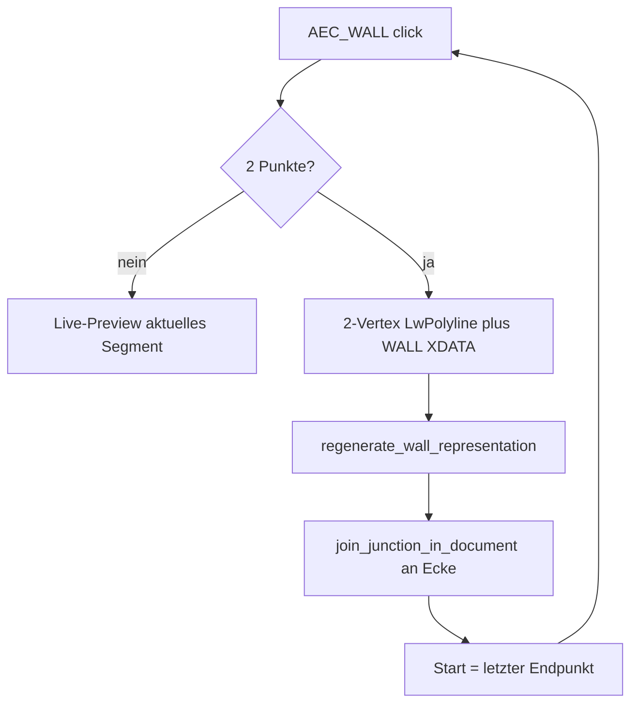

# Requirements

### Overview & Goals
`AEC_WALL` speichert und rendert Wände nicht mehr als Mehrpunkt-Polylinie, sondern als **eine Wand-Entity pro Segment** (zwei Achspunkte). Zeichnen bleibt kettenfähig: jeder zweite Klick legt eine fertige Wand an; der nächste Start ist das letzte Ende. Benachbarte neue Segmente werden **sofort auto-gejoint**.

### Scope
**In Scope**
- `WallCommand` commitet nach jedem abgeschlossenen Segment eine 2-Vertex-`LwPolyline` mit `WALL`-XDATA.
- Live-Preview nur für das **aktuelle** Segment (Achse + Kontur).
- Nach Commit: `join_junction_in_document` an der neuen Ecke (vorheriges + neues Segment, plus vorhandene Wände im Snap-Radius).
- Darstellung (`regenerate_wall_representation`) je 2-Punkt-Wand: Kontur/Hatch/Solid pro Schicht.
- Tests für Commit-pro-Klick, Ketten-Join, Regenerierung.

**Out of Scope**
- Migration bestehender Mehrpunkt-Wände (bleiben ladbar und werden weiterhin als eine Polyline regeneriert).
- Explizites Split-Kommando für Altbestand.
- Änderung der XDATA-Record-Form (`WALL` bleibt).

### User Stories
- Als Planer zeichne ich eine Wandkette; jedes Stück ist einzeln selektierbar, löschbar und hat eigene Properties.
- Als Planer sehe ich an jeder Ecke sofort eine Gehrung, ohne `AEC_WALLJOIN` manuell aufzurufen.
- Als Planer bleibt Stil/Höhe/Justification live im Properties-Panel während der ganzen Kette.

### Functional Requirements
- Erster Klick: Startpunkt; zweiter Klick: Wand AB schreiben + regen + Join am Start (falls andere Wände); Befehl bleibt aktiv mit Start = B.
- Enter/Escape beendet die Kette ohne extra Segment; ein einzelner Punkt ohne zweiten erzeugt nichts.
- Arc-Modus (`A`/`L`) gilt nur für das aktuelle Segment (2 Punkte + ein Bulge).
- Auto-Join nutzt bestehende `join_junction_in_document` / `WALL_JOIN_SNAP_RADIUS`.
- `collect_wall_segments` / `AEC_ROOM` arbeiten weiter über Achs-`LwPolyline` (jetzt kürzere Segmente).

# Technical Design

### Current Implementation
- `Wall` (`src/modules/aec/engine/wall.rs`): Metadaten; Achse ist Host-`LwPolyline`.
- `WallCommand` (`src/modules/aec/commands.rs` ~2779): sammelt `vertices`/`bulges` wie `PLINE`; `build_entity` schreibt **eine** Polyline; `build_contour_entity` previewt die ganze Kette; Finalize erst am Ende.
- Rendering: `wall_axis_points_and_bulges` + `engine::representation::build_wall_representation_with_bulges` + `regenerate_wall_representation_inner` — funktioniert bereits für 2+ Vertices (Miter nur bei ≥3 Punkten).
- Join: `join_junction_in_document` / `aec_walljoin_do`.

### Key Decisions
- **Persistenz:** eine Entity pro Segment (2 Vertices), nicht Split-am-Ende.
- **Auto-Join** an jeder neuen Ecke nach Commit.
- **Kein Altbestand-Split:** Mehrpunkt-Wände bleiben gültig.
- **Preview:** nur aktuelles Segment; bereits committete Wände sind normale Dokument-Entities.

### Proposed Changes
1. **`WallCommand` Zustand:** `vertices` hält höchstens `[start, cursor/end]`. Nach erfolgreichem Commit: `vertices = [end]`, `bulges` zurücksetzen, `last_committed: Option<Handle>` merken.
2. **Commit-Pfad** (bei Punkt 2+): `build_entity` → `scene.add_entity` → `regenerate_wall_representation` → Join-Cluster aus `last_committed` + neuem Handle (Endpunkte) → `join_junction_in_document`. Befehl **nicht** beenden.
3. **Live-Entities:** `live_handle`/`live_contour_handle` nur für das laufende Segment; nach Commit löschen oder in die persistente Entity überführen (kein doppeltes XDATA).
4. **Rendering:** keine neue Pipeline. 2-Punkt-Achsen erzeugen Rechteck-/Bogen-Streifen ohne interne Miter; Ecken kommen vom Join. `wall_layer_footprints*` bleibt der Einstieg.
5. **Properties:** `live_properties`/`apply_live_property` unverändert auf dem Command; committete Wände nutzen das bestehende Panel.

### Architecture Diagram

### File Structure
- Geändert: `src/modules/aec/commands.rs` (`WallCommand`, Finalize/Commit, Tests).
- Unverändert genutzt: `engine/representation.rs`, `engine/contour.rs`, `join_junction_in_document`, `src/modules/aec/engine/wall.rs`.

### Risks
- Undo: mehrere Segmente = mehrere Entities; Ketten-Undo sollte pro Segment greifen (bestehendes Scene-Undo).
- Join-Fehler an degenerierten Winkeln: Join-Fehler loggen, Segment trotzdem behalten (wie `aec_walljoin_do`).
- T-Stoß beim Einschnappen auf bestehende Wand: Cluster muss Snap-Nachbarn einschließen, nicht nur `last_committed`.

# Testing

### Validation Approach
Unit-Tests in `commands.rs` analog zu bestehenden Wall-/Join-Tests (`add_multi_layer_wall`, `join_junction_resolves_two_wall_l_and_t`).

### Key Scenarios
- Zwei Klicks erzeugen genau eine Wand mit 2 Vertices und `derived_handles`.
- Drei Klicks erzeugen zwei Wände; gemeinsame Ecke ist gejoint (Konturen treffen sich).
- Enter nach einem Punkt erzeugt keine Entity.
- Arc-Segment: genau ein nicht-null Bulge auf Vertex 0.

### Edge Cases
- Null-Länge (gleicher Punkt) wird verworfen.
- Join-Fail lässt beide Segmente im Dokument.

# Delivery Steps

### ✓ Step 1: WallCommand: Commit pro Segment
AEC_WALL legt nach jedem abgeschlossenen 2-Punkt-Segment eine persistente Wand an und bleibt in der Kette aktiv.

- `WallCommand` so umbauen, dass `vertices` nur Start + aktuelles Ende hält.
- Bei zweitem Punkt: Entity schreiben (`build_entity`), Representation regenerieren, Live-Preview zurücksetzen, Start = Endpunkt.
- Enter/Escape beendet ohne extra Segment; ein einzelner Punkt erzeugt nichts.
- Preview (`live_handle` / `live_contour_handle`) nur für das laufende Segment.
- Tests: 2 Klicks → 1 Wand; 3 Klicks → 2 Wände; jeweils 2 Vertices.

### ✓ Step 2: Auto-Join an Kettenecken
Aufeinanderfolgende Segmente und Snap-Nachbarn werden direkt nach dem Commit gejoint.

- Nach jedem Commit `join_junction_in_document` mit neuem Handle, `last_committed` und Wänden im `WALL_JOIN_SNAP_RADIUS` aufrufen.
- Join-Fehler nicht-fatal behandeln (Info-Zeile / bestehende Warning-Queue).
- Tests: L-Kette erzeugt Gehrung; Einschnappen auf bestehende Wand ergibt T-Stoß wo Join das schon kann.

### ✓ Step 3: Rendering auf 2-Punkt-Achse ausrichten
Darstellung läuft je Einzelsegment; interne Polyline-Miter der Zeichenkette entfallen für neue Wände.

- Sicherstellen, dass `regenerate_wall_representation` / `wall_layer_footprints_with_bulges` für 2-Punkt-Achsen (gerade + Bulge) stabile Streifen liefern.
- `build_contour_entity` nur noch das aktuelle Segment previewen.
- Bestehende Mehrpunkt-Wände unverändert lassen (kein Split).
- Tests: Kontur/Hatch/Solid-Anzahl pro Schicht für eine 2-Punkt-Wand; Regen nach Join bleibt konsistent.