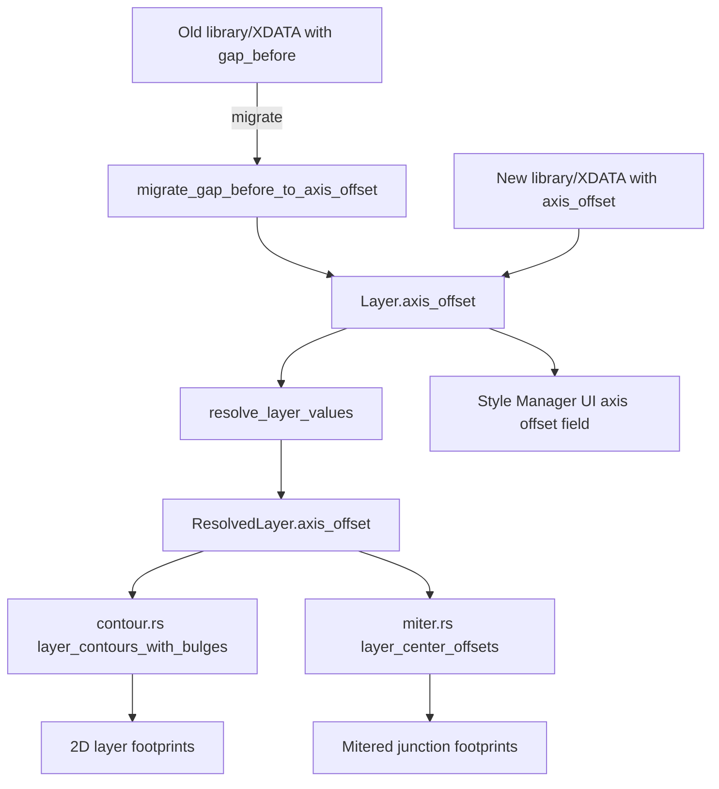

# Requirements

### Overview & Goals
Das Wandstil-Schichtmodell (`Layer` in `src/modules/aec/engine/wall_style.rs`) wird überarbeitet: statt der aktuellen impliziten Stapelung (Dicke + optionaler `gap_before`, automatisch symmetrisch um die Wandachse zentriert) bekommt jede Schicht einen **expliziten, auch negativen Versatz zur Wandachse** (`axis_offset`). Das Feld `gap_before` entfällt vollständig; bestehende Bibliotheken/Zeichnungen werden beim Laden auf das neue Modell migriert.

### Scope
**In Scope:**
- Neues Feld `axis_offset: LayerValue` (Fixed oder Formel, analog zu `thickness`) pro `Layer`, das den Start der Schicht relativ zur Wandachse angibt (0 = auf der Achse, negativ = eine Seite, positiv = andere Seite).
- Entfernen von `gap_before` aus `Layer`/`ResolvedLayer`.
- Migration: bestehende TOML-Bibliotheken und XDATA-`WALL_V2`-Records ohne `axis_offset` werden beim Laden aus der bisherigen sequenziellen Stapelung (Dicke + `gap_before`, zentriert) in einen äquivalenten `axis_offset`-Wert umgerechnet, damit vorhandene Wände optisch unverändert bleiben.
- Anpassung aller Geometrie-Konsumenten (`contour.rs`, `miter.rs`) auf das neue Offset-Feld statt Stapel-Berechnung.
- Style Manager UI (`aec_wall_style_manager.rs`) und Properties-Panel-Editor: Eingabefeld "Gap" wird durch "Achsversatz" ersetzt, negative Werte sind gültig.
- `library.rs`: Default-Bibliothek (`seed_default_library`) auf `axis_offset` umgestellt.
- XDATA-Schema-Anpassung (`WALL_V2`-Layer-Extras in `commands.rs`): `axis_offset` statt `gap_before` persistieren, mit Fallback-Lesepfad für alte Records.

**Out of Scope:**
- Keine Änderung an vertikalen Offsets (`bottom_offset`/`top_offset`) oder an `LayerFunction`/`role_tag`/`hatch_override`.
- Keine Änderung an der Vererbungskette selbst (`resolve_chain`, `effective_layers`) – nur an den Feldern innerhalb einer Schicht.
- Keine Änderung an Öffnungs-Splits (`openings.rs`) über das reine Durchreichen der neuen Offset-Werte hinaus.

### User Stories
- Als Planer möchte ich eine Schicht (z. B. eine Vormauerschale) frei relativ zur Wandachse positionieren können, auch außerhalb der bisherigen symmetrischen Stapelung, damit reale Wandaufbauten mit versetzten Schalen korrekt abgebildet werden.
- Als Planer möchte ich weiterhin bestehende Wandstile/Zeichnungen ohne manuelle Nacharbeit öffnen können; die Darstellung bleibt nach der Migration identisch zum bisherigen Stapelergebnis.
- Als Nutzer möchte ich im Style Manager pro Schicht direkt einen (auch negativen) Achsversatz eingeben, statt indirekt über eine Luftschicht vor der Schicht zu rechnen.

### Functional Requirements
- `Layer.axis_offset: LayerValue` ersetzt `gap_before: f64`; Formeln (z. B. `"BB * -0.5"`) sind erlaubt, analog zu `thickness`.
- `effective_layers_for_wall`/`resolve_layer_values` lösen `axis_offset` genauso wie `thickness` gegen `vars` auf; `ResolvedLayer.axis_offset: f64` ersetzt `ResolvedLayer.gap_before`.
- `contour.rs`/`miter.rs`: Kontur-/Miter-Berechnung verwendet direkt `axis_offset` als Start-Offset jeder Schicht statt kumulativer Stapelung; keine implizite Zentrierung mehr.
- Migration alter Daten: beim Laden einer Bibliothek/eines XDATA-Records ohne `axis_offset` (altes Format) wird der äquivalente Offset aus der bisherigen Stapel-Formel berechnet und übernommen (kein Datenverlust, keine optische Änderung).
- Style Manager: Eingabefeld für "Achsversatz" (statt "Gap") pro Layer-Zeile, akzeptiert negative Zahlen und Formeln.
- XDATA `WALL_V2`: Layer-Extra-Tripel `(gap_before, bottom_offset, top_offset)` wird zu `(axis_offset, bottom_offset, top_offset)`; alte Records bleiben lesbar (Fallback-Interpretation als Gap→Offset-Migration).

### Non-Functional Requirements
- Bestehende Unit-Tests für Vererbung/Formel-Resolution (`wall_style.rs`) bleiben grün oder werden auf das neue Feld angepasst; keine Panics bei fehlendem `axis_offset` in alten Daten.
- Rückwärtskompatibilität: Zeichnungen/Bibliotheken aus der Zeit vor dieser Änderung müssen weiterhin ladbar sein und dieselbe Geometrie ergeben.

# Technical Design

### Current Implementation
- `src/modules/aec/engine/wall_style.rs`: `Layer { material_id, thickness: LayerValue, function, gap_before: f64, bottom_offset, top_offset, layer_override, hatch_override, role_tag }`; `ResolvedLayer` mit denselben Feldern nach Formel-Auflösung; `resolve_layer_values`, `base_width_from_layers`.
- `src/modules/aec/engine/contour.rs`: `layer_contours_with_bulges(centerline, bulges, layers: &[(f64,f64)])` — `layers` ist `(thickness, gap_before)`; berechnet `total_thickness = Σ(t+g)`, startet bei `-total/2` und stapelt sequenziell (`start = cur + gap; end = start + thickness`).
- `src/modules/aec/engine/miter.rs`: `layer_center_offsets` – identische Stapel-Logik für Miter-Berechnung an Wandknoten (`MiterLayer { thickness, gap_before, ... }`).
- `src/modules/aec/commands.rs`: `wall_layer_footprints`/`wall_layer_footprints_with_bulges` bauen `layer_data: Vec<(f64,f64)>` aus `(l.thickness, l.gap_before)`; XDATA-Schreiben/Lesen (`wall_record`, `wall_from_entity`) persistiert pro Layer `gap_before, bottom_offset, top_offset` als `Distance`-Tripel nach den Kernfeldern.
- `src/ui/window/aec_wall_style_manager.rs` + `src/app/mod.rs` (`AecStyleManagerLayerRow.gap_before: String`) + `src/app/update/mod.rs` (`AecStyleManagerWallStyleLayerGapChanged`): UI-Eingabe für Gap pro Zeile.
- `src/modules/aec/engine/library.rs`: `seed_default_library` setzt `gap_before` für Default-Layer (meist `0.0`).

### Key Decisions
1. **Expliziter `axis_offset` pro Schicht ersetzt Stapel-Zentrierung vollständig** (vom Nutzer bestätigt): keine automatische Zentrierung mehr — der Nutzer/die Bibliothek gibt für jede Schicht direkt an, wo sie relativ zur Achse beginnt; negative Werte sind normal.
2. **`gap_before` wird entfernt, nicht nur deprecated** (vom Nutzer bestätigt): das Feld verschwindet aus `Layer`/`ResolvedLayer`/UI; alte Daten werden **beim Laden** einmalig migriert (Gap+Stapel → äquivalenter `axis_offset`), keine dauerhafte Parallel-Pflege zweier Felder.
3. **`axis_offset` ist wie `thickness` eine `LayerValue`** (Formel-fähig): konsistent mit dem bestehenden Formel-Mechanismus (`BB`-Variable), keine Einführung eines zweiten Werttyps.
4. **Migration ist rein additiv/lesend**: Migration erfolgt beim Deserialisieren (TOML `library.rs`, XDATA `commands.rs`), es gibt keinen separaten Migrations-Batch-Befehl; alte Dateien bleiben unverändert auf Platte, bis sie erneut gespeichert werden.

### Proposed Changes
1. **`wall_style.rs`**: `Layer.gap_before: f64` → `Layer.axis_offset: LayerValue`; `ResolvedLayer.gap_before` → `ResolvedLayer.axis_offset: f64`; `resolve_layer_values` löst `axis_offset` genauso wie `thickness` auf (Formel-Fehler → Fallback `0.0` + `formula_error`, wie bisher für `thickness`). `base_width_from_layers` bleibt auf `thickness` beschränkt (keine Gap-Summe mehr nötig).
2. **`contour.rs`**: `layer_contours_with_bulges` nimmt `layers: &[(f64 /* thickness */, f64 /* axis_offset */)]`; Start-/End-Offset einer Schicht wird direkt aus `axis_offset` und `thickness` berechnet (`start = axis_offset; end = axis_offset + thickness`), keine kumulative `current_offset`-Fortführung und keine `-total/2`-Zentrierung mehr.
3. **`miter.rs`**: `layer_center_offsets`/`MiterLayer.gap_before` → `axis_offset`; Center-Berechnung analog vereinfacht (`center = axis_offset + thickness/2`), Matching-Logik (`identity_class`, `match_layer_indices`) bleibt unverändert, da sie nur Material/Funktion vergleicht.
4. **`commands.rs`**: `wall_layer_footprints*` bauen `layer_data` aus `(thickness, axis_offset)`; XDATA-Layer-Extra-Tripel wird zu `(axis_offset, bottom_offset, top_offset)`; **Leselogik unterscheidet Record-Version** — bei fehlendem/altem Layout wird aus `gap_before` (alter Wert) + sequenzieller Position im alten Stapelmodell der äquivalente `axis_offset` berechnet (Migrationsfunktion `migrate_gap_before_to_axis_offset(layers_in_old_order)`).
5. **`library.rs`**: TOML-Deserialisierung von `Layer` erhält einen Serde-kompatiblen Migrationspfad (z. B. `#[serde(alias = "gap_before")]` funktioniert nicht 1:1 wegen Semantikwechsel → stattdessen Custom-Deserialize oder Zwei-Schritt-Parsing: rohes `LayerRaw` mit optionalem `gap_before` und optionalem `axis_offset`, danach Migration wenn nur `gap_before` vorhanden ist); `seed_default_library` auf `axis_offset` umgestellt (bei zentrierten Default-Stilen weiterhin sinnvolle Werte, z. B. erste Schicht bei negativem halben Gesamt, danach aufsteigend).
6. **UI**: `aec_wall_style_manager.rs` + `src/app/mod.rs` (`AecStyleManagerLayerRow.gap_before` → `axis_offset: String`) + `src/app/update/mod.rs` (`AecStyleManagerWallStyleLayerGapChanged` → `...AxisOffsetChanged`, Eingabefeld-Label "Achsversatz", akzeptiert `-` Präfix und Formeln); Properties-Panel-Editor entsprechend anpassen, falls dort ebenfalls ein Gap-Feld existiert.
7. **Tests**: bestehende `wall_style.rs`-Tests (`test_inheritance`, `test_override`, Formel-Tests) auf `axis_offset` umbenannt/angepasst; neue Tests für Migration (altes Gap-basiertes Layout → erwarteter `axis_offset`) und für negative/asymmetrische Offsets in `contour.rs`/`miter.rs`.

### Data Models / Contracts
```rust
// engine/wall_style.rs
pub struct Layer {
    pub material_id: MaterialId,
    pub thickness: LayerValue,
    pub function: LayerFunction,
    /// Signed offset of this layer's start from the wall axis.
    /// Replaces the former `gap_before` + implicit centering.
    pub axis_offset: LayerValue,
    pub bottom_offset: f64,
    pub top_offset: f64,
    pub layer_override: Option<String>,
    pub hatch_override: Option<String>,
    pub role_tag: Option<String>,
}

pub struct ResolvedLayer {
    pub material_id: MaterialId,
    pub thickness: f64,
    pub function: LayerFunction,
    pub axis_offset: f64,
    pub bottom_offset: f64,
    pub top_offset: f64,
    // ...unchanged fields, formula_error
}
```

### Components
- `engine/wall_style.rs` (geändert): Feldumbenennung/-typwechsel, Resolution-Logik.
- `engine/contour.rs` (geändert): direkte Offset-Nutzung statt Stapelung.
- `engine/miter.rs` (geändert): `layer_center_offsets`/`MiterLayer`.
- `commands.rs` (geändert): `wall_layer_footprints*`, XDATA-Lese-/Schreiblogik inkl. Migration alter Records.
- `engine/library.rs` (geändert): TOML-(De-)Serialisierung mit Migrationspfad, Default-Bibliothek.
- `ui/window/aec_wall_style_manager.rs`, `app/mod.rs`, `app/update/mod.rs` (geändert): UI-Feld/Message-Umbenennung.

### Architecture Diagram


### Risks
- **Migrationsfehler**: falsche Umrechnung von altem Gap-Stapel-Modell in `axis_offset` würde bestehende Wände optisch verschieben — Mitigation: gezielter Regressionstest, der eine alte Mehrschicht-Wand vor/nach Migration auf identische Geometrie prüft.
- **Formel-Interaktion**: `axis_offset` als Formel kombiniert mit formelbasiertem `thickness` kann zu unerwarteten Überlappungen führen, wenn Nutzer widersprüchliche Werte eingeben — bewusst keine automatische Kollisionsprüfung in dieser Iteration (Dokumentation als bekannte Grenze).
- **Breiter Blast-Radius**: `gap_before` wird an vielen Stellen referenziert (Commands, Miter, UI, Library, Tests) — Mitigation: Umbenennung schrittweise pro Stage mit Compiler-Fehlern als Leitfaden, am Ende vollständige Suche nach verbleibenden `gap_before`-Referenzen.

# Delivery Steps

### ✓ Step 1: Datenmodell: axis_offset in Layer/ResolvedLayer einführen und gap_before entfernen
`Layer` und `ResolvedLayer` in `engine/wall_style.rs` verwenden ein formelfähiges `axis_offset` statt `gap_before`.
- `Layer.gap_before: f64` durch `Layer.axis_offset: LayerValue` ersetzen; `ResolvedLayer.gap_before` durch `axis_offset: f64` ersetzen.
- `resolve_layer_values` löst `axis_offset` analog zu `thickness` gegen `vars` auf (Formel-Fehler → Fallback `0.0` + `formula_error`).
- `base_width_from_layers` von der bisherigen Gap-Summe befreien (nur noch `thickness`-Summe, da Offsets nicht mehr sequenziell akkumuliert werden).
- Bestehende Unit-Tests (`test_inheritance`, `test_override`, Formel-Tests, Roundtrip-Tests) auf das neue Feld umstellen; neue Tests für negative `axis_offset`-Werte ergänzen.

### ✓ Step 2: Geometrie: Kontur- und Miter-Berechnung auf expliziten Achsversatz umstellen
2D-Schichtkontur und Wandknoten-Miterung positionieren Schichten direkt über `axis_offset` statt über kumulative Stapelung.
- `engine/contour.rs`: `layer_contours_with_bulges` berechnet Start/Ende jeder Schicht direkt aus `(axis_offset, thickness)` statt `-total/2` plus laufendem Cursor.
- `engine/miter.rs`: `layer_center_offsets`/`MiterLayer` auf `axis_offset` umstellen (`center = axis_offset + thickness/2`), Matching-Logik (`identity_class`, `match_layer_indices`) bleibt unverändert.
- `commands.rs`: `wall_layer_footprints`/`wall_layer_footprints_with_bulges` bauen `layer_data` aus `(thickness, axis_offset)` statt `(thickness, gap_before)`.
- Tests: asymmetrische/negative Offset-Konfigurationen liefern erwartete Kontur-/Miter-Ergebnisse; bestehende symmetrische Testfälle werden mit äquivalenten expliziten Offsets nachgebildet und bleiben geometrisch identisch.

### ✓ Step 3: Persistenz: XDATA-Schema und Bibliotheksdatei mit Migration von gap_before
Wände und Bibliotheksdateien speichern `axis_offset`; alte Daten mit `gap_before` werden beim Laden automatisch migriert.
- `commands.rs`: XDATA-Layer-Extra-Tripel `(gap_before, bottom_offset, top_offset)` wird zu `(axis_offset, bottom_offset, top_offset)`; Leselogik erkennt altes Record-Layout und berechnet daraus den äquivalenten `axis_offset` (`migrate_gap_before_to_axis_offset`).
- `engine/library.rs`: TOML-Deserialisierung von `Layer` unterstützt beide Formate (Zwei-Schritt-Parsing über eine Roh-Struktur), migriert alte `gap_before`-Einträge beim Laden auf `axis_offset`; `seed_default_library` auf `axis_offset` umgestellt.
- Tests: Schreiben/Lesen eines neuen `axis_offset`-Records; Lesen eines alten `gap_before`-Records liefert nach Migration identische Geometrie wie vorher (Regressionstest mit fester Mehrschicht-Wand).

### ✓ Step 4: UI: Style Manager und Properties-Panel auf Achsversatz-Eingabe umstellen
Nutzer geben pro Schicht direkt einen (auch negativen) Achsversatz ein, statt eine Luftschicht (Gap) zu definieren.
- `src/app/mod.rs`: `AecStyleManagerLayerRow.gap_before: String` → `axis_offset: String`.
- `src/app/update/mod.rs`: `Message::AecStyleManagerWallStyleLayerGapChanged` → `...AxisOffsetChanged`; Parsing erlaubt negative Zahlen und Formelstrings (`LayerValue::parse_str`).
- `src/ui/window/aec_wall_style_manager.rs`: Eingabefeld-Label "Gap" → "Achsversatz"; Platzhalter/Hinweistext verdeutlicht, dass negative Werte gültig sind.
- Properties-Panel-Editor (falls dort ein Gap-Feld existiert) entsprechend anpassen, damit Live-Bearbeitung einer Wand denselben Feldnamen/Semantik nutzt.