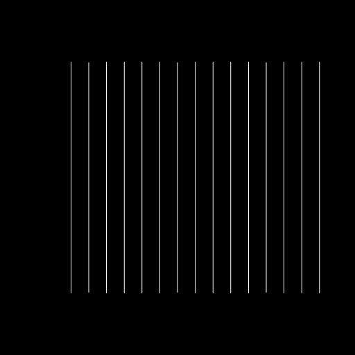
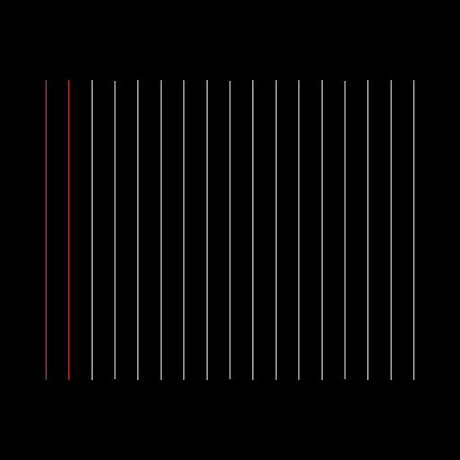

# Perspective draw-order clipping regression

Switching a flat model view from orthographic to perspective could hide otherwise
visible lines. The camera applied an OpenGL-to-WebGPU depth conversion to a
projection that already used WebGPU's depth range. The shaders then applied a
fixed draw-order offset that could push geometry past the far clipping boundary.

The camera now uses the DirectX/WebGPU projection directly. The shared
`draw_order.wgsl` function keeps the existing offset away from clipping planes
and reduces it near either plane. Its adjustment is monotonic in draw order,
leaves neutral geometric depth unchanged, and does not move clipped vertices
back into range. It is shared by the native and compatibility shader paths.

## GPU reproduction

These are offscreen renders from the application's wire pipelines. All 17 lines
are on the same plane; only their draw-order values differ. The first two lines
(red when visible) were clipped in perspective. Both projections now show all
17 lines. This synthetic drawing contains no user CAD geometry.

| Before | After |
| --- | --- |
|  |  |

## Validation

```sh
cargo test --locked --lib
cargo test --locked --lib scene::pipeline::depth_tests -- --ignored --nocapture
```

The GPU tests exercise storage and packed wire pipelines, near/far clipping,
coplanar draw order in both submission orders, and wire occlusion by a triangle
mesh. Normal tests check camera depth endpoints, picking, and validation of all
14 composed draw-order shaders.

Set `OCS_DEPTH_TEST_IMAGES` to an output directory to save the orthographic and
perspective reproduction images while running the GPU tests.
