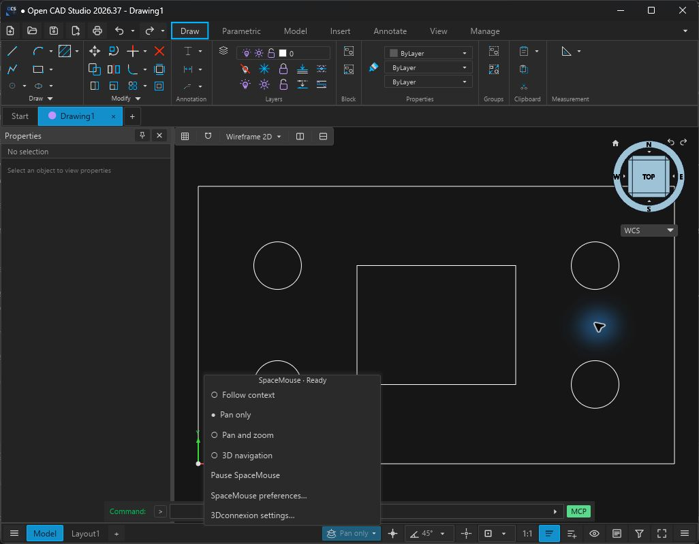
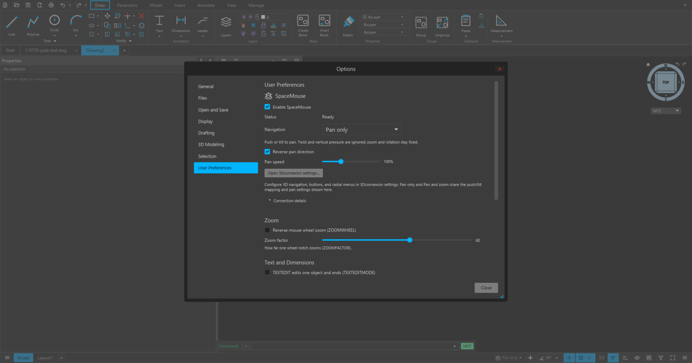

# SpaceMouse

The Windows desktop app supports 3Dconnexion SpaceMouse devices through the
installed [3DxWare driver](https://3dconnexion.com/drivers/). Open CAD Studio
loads NavLib from the Windows system directory at runtime. An SDK installation
is not needed to build or run the app. macOS, Linux, and the web build currently
show an unavailable state; their device adapters are not implemented.

## Navigation

Open **Options → User Preferences → SpaceMouse**, or enter `SPACEMOUSE`.

| Mode | Behavior |
| --- | --- |
| Follow context | Pan and zoom on a paper sheet; pan, zoom, and orbit in model views. |
| Pan only | Push or tilt the puck to pan in the current screen plane. Twist and vertical pressure are ignored. Scale, depth, and orientation stay fixed, including in perspective. |
| Pan and zoom | Uses the same push/tilt panning as Pan only. Lift or press the puck to zoom about the view center. Twist is ignored and orientation stays fixed. |
| 3D navigation | Pan, zoom, and orbit in model views. Paper sheets keep orientation fixed. |

For a flat drawing, choose **Pan only** to use the puck as a panning joystick.
Push or tilt right/left to move the drawing right/left; push or tilt away/toward
you to move it up/down. Pushing and tilting together does not double the speed.
Enable **Reverse pan direction** if you prefer moving the viewpoint in the same
direction as the puck. **Reverse pan direction** and **Pan speed** apply to both
flat-navigation modes, including paper sheets in Follow context. A small dead zone
filters incidental forces, and releasing the puck stops movement.
The app does not infer that a model-space file is 2D from its extension or from
the current camera angle. These preferences belong to the user and persist
across drawings and sessions.

The status bar shows the effective mode after a device connects, and keeps the
control available after disconnection. An explicitly selected navigation mode
also makes it visible. Its menu provides mode selection, Pause/Resume, preferences,
and a shortcut to 3Dconnexion settings. Status-bar customization can hide it.

Only the focused drawing receives input. Dialogs suspend navigation. The
view metadata remains available to the driver while its settings UI has focus.
Native 3DxWare chooses the foreground application; the adapter marks its view
active without forcing the NLServer-specific keyboard-focus property. Entered
paper-space viewports use their own cameras; their display locks are respected.
The active model tile receives navigation in a split view. Moving the puck
preserves an unfinished drawing command, refreshes its preview at a stationary
pointer, and keeps an active selection-box anchor attached to the drawing.





## Buttons and radial menus

Use **Open 3Dconnexion settings…** to assign buttons and radial-menu entries.
The app exports registered CAD command IDs and reuses ribbon labels and icons
where available. Speed, axis inversion, dominant-axis filtering, and radial-menu
layout for SDK navigation remain in the driver settings. Pan only and Pan and zoom
share the app's push/tilt mapping and Pan speed control; driver axis remappings do
not apply to these flat-navigation modes. Button assignments continue to work in
all modes.

For orbiting with a fixed up direction, enable **Lock Horizon** in the driver's
Advanced Settings for Open CAD Studio. The adapter reads `settings.LockHorizon`
through NavLib at connection/focus and after `settings.changed` notifications.
When enabled, accepted orbit matrices remove roll relative to world Z. Pitch
stops just short of the top/bottom pole, retaining heading instead of flipping
the view. In the driver's Object mode the eye receives the same pitch correction
around the SDK's orbit pivot, so the object stays in place; Camera/Helicopter
modes retain their proposed eye position. Disabling Lock Horizon restores
unrestricted driver rotation.
The app does not duplicate this control, the driver's rotation lock, or
its object/camera navigation modes.

Useful actions include Undo, Redo, Cancel, Fit view, Top view, and these commands:

| Command | Action |
| --- | --- |
| `SPACEMOUSE` | Open SpaceMouse preferences |
| `SPACEMOUSEPAUSE` | Pause/resume puck navigation for this session |
| `SPACEMOUSEAUTO` | Follow context |
| `SPACEMOUSEPAN` | Pan only |
| `SPACEMOUSEPANZOOM` | Pan and zoom |
| `SPACEMOUSE3D` | 3D navigation |

Fit view (`SPACEMOUSEFIT`) and Top view (`SPACEMOUSETOP`) are also available as
button/keyboard actions. Button actions share the keyboard dispatcher: for
example, Undo removes the last entered point of an unfinished polyline. A
Pause/Resume button remains usable while puck navigation is paused.

## Implementation

- `src/input/spacemouse/`: portable preferences, camera snapshots, and a bounded
  thread-safe bridge. `navlib.rs` contains the Windows ABI and runtime loading.
  `raw_input.rs` receives SpaceMouse multi-axis HID reports for planar navigation;
  `pan.rs` maps pushes and tilts to screen velocity and vertical pressure to zoom.
  The planar path suppresses SDK camera updates so one gesture cannot be applied
  twice. Only 3Dconnexion/legacy Logitech multi-axis
  controllers are accepted. Other HID devices and report types are ignored.
  `worker.rs` waits for app work and dispatches Windows messages on the SDK's
  owning thread, including settings changes while the drawing is unfocused.
- `src/app/navigation.rs`: focus/context policy, cached selection bounds, camera
  application, pivot feedback, and the action catalog.
- `src/scene/mspace.rs`: routing to the active model or floating-viewport camera.
- `src/ui/window/options/spacemouse.rs` and `src/ui/statusbar/spacemouse.rs`:
  controls within the existing Options and status-menu systems.
- `src/app/settings.rs`: preferences; `src/app/shortcuts.rs`: shared actions.

Driver callbacks operate on snapshots and never access the scene or GUI. A
navigation transaction is coalesced into one pending camera update. Target
stamps discard late motion after a tab, layout, viewport, tile, or camera change.
Acknowledging an applied frame retains newer callbacks from the same gesture;
an external camera change resets the SDK navigation model. Raw pan state is
cleared on context/focus changes, pause, disconnection, and stale reports.
Button requests retain their context across camera revisions. Losing focus or
changing drawing context discards queued input. Connection shutdown closes
NavLib before releasing callback, command, image, or library storage.
The subscription joins its worker at shutdown so NavLib can finish persisting
the driver's per-application preferences before the process exits.

For driver-setting diagnostics, set
`RUST_LOG=OpenCADStudio::input::spacemouse=debug` before launching. The trace
records settings-change notifications and the Lock Horizon value read from
NavLib; it does not change the user's driver settings.

Iced supplies monotonic frame timestamps while navigation is active. Idle
drawings do not request continuous rendering. Driver-originated camera updates
are not echoed back as external-camera notifications, which would reset the
driver's navigation model during a held input.
The optional SDK `view.target` property returns no-data: the app's camera center
does not represent the SDK's separate target-camera navigation model.

The adapter uses the NavLib C ABI described in the 3DxWare SDK headers
(`navlib.h`, `navlib_types.h`, and `siappcmd_types.h`). No vendor headers or
runtime binaries are included. SpaceMouse and 3Dconnexion are trademarks of
3Dconnexion.

## Validation

```sh
cargo test --locked --lib spacemouse
```

An opt-in smoke test checks the installed driver, command/icon export, device
presence, and reading its Lock Horizon setting:

```sh
cargo test --locked --lib installed_driver_connects_and_reports_device_presence -- --ignored --nocapture
```
